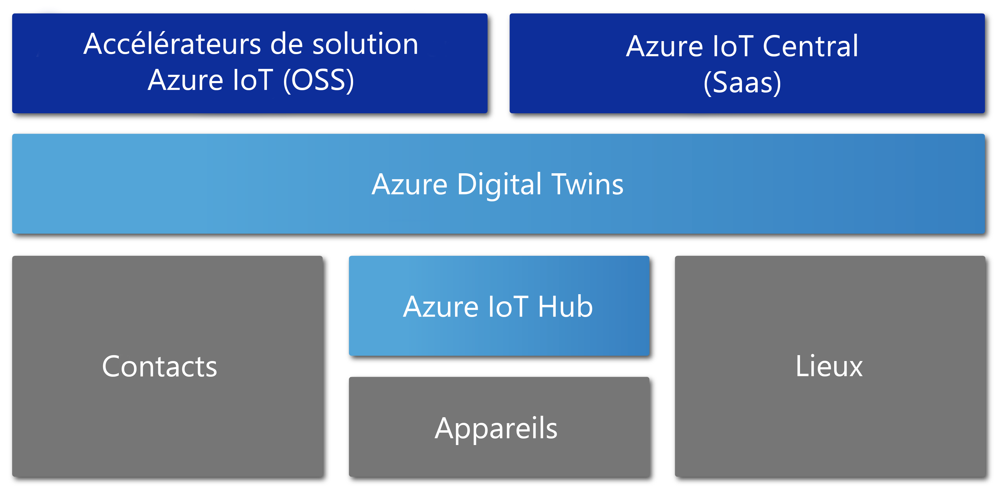

# Vue d’ensemble d’Azure Digital Twins (préversion)

[!INCLUDE [digital-twins-preview-limit-alert](../../includes/digital-twins-preview-limit-alert.md)]

La préversion d’Azure Digital Twins est un service Azure IoT qui permet de créer des modèles complets de l’environnement physique. Il peut créer des graphes d’intelligence spatiale afin de modéliser les relations et les interactions entre les personnes, les espaces et les appareils.

Avec Azure Digital Twins, vous pouvez interroger les données depuis un espace physique plutôt que depuis de nombreux capteurs disparates. Ce service permet de créer des expériences à intelligence spatiale réutilisables et extrêmement scalables qui relient les données de streaming entre le monde numérique et le monde physique. Vos applications sont améliorées par ces fonctionnalités contextuelles particulièrement pertinentes. 

Azure Digital Twins s’applique à tous les types d’environnements, par exemple les entrepôts, les bureaux, les écoles, les hôpitaux et les banques. Il peut même être utilisé pour des stades, des usines, des parkings, des parcs, des réseaux électriques intelligents (smart grids) et des villes. Voici quelques scénarios où Azure Digital Twins peut être utile :

- Prévoir les besoins de maintenance d’une usine.
- Analyser les besoins énergétiques en temps réel d’un réseau électrique.
- Optimiser l’utilisation de l’espace disponible d’un bureau.
- Suivre tous les jours la température de plusieurs régions.
- Surveiller les trajets des drones.
- Identifier les véhicules autonomes.
- Analyser les niveaux d’occupation d’un bâtiment.
- Repérer la caisse la plus occupée de votre magasin.

Quel que soit votre scénario métier réel, Azure Digital Twins devrait pouvoir provisionner une instance numérique correspondante.

La vidéo suivante présente plus en détail Azure Digital Twins.

> [!VIDEO https://www.youtube.com/embed/TvN_NxpgyzQ]

## Fonctionnalités clés

Azure Digital Twins propose les fonctionnalités clés suivantes.

### Graphique d’intelligence spatiale

Le [*graphe d’intelligence spatiale*](./concepts-objectmodel-spatialgraph.md#spatial-intelligence-graph), ou *graphe spatial*, est une représentation virtuelle de l’environnement physique. Vous pouvez l’utiliser pour modéliser les relations entre les personnes, les lieux et les appareils.

Prenons l’exemple d’une application utilitaire intelligente qui s’occupe de plusieurs compteurs d’électricité connectés dans un quartier. L’entreprise de l’utilitaire intelligent doit superviser et prévoir l’utilisation de l’électricité et la facturation avec précision. Chaque appareil et chaque capteur doivent être modélisés avec un contexte sur l’emplacement et le client à facturer. Vous pouvez utiliser le graphe d’intelligence spatiale pour modéliser ces types de relations complexes.

### Modèles d’objets jumeaux numériques

Les [modèles objet de jumeau numérique](./concepts-objectmodel-spatialgraph.md#digital-twins-object-models) sont des protocoles d’appareil et des schémas de données prédéfinis. Ils cadrent les besoins spécifiques d’un domaine de votre solution pour en accélérer et simplifier le développement.

Par exemple, une application d’occupation de salles est susceptible d’utiliser des types d’espace prédéfinis comme campus, bâtiment, étage et salle.

### Locataires multiples et imbriqués

Vous pouvez créer des solutions qui se mettent à l’échelle sans aucun problème et les réutiliser pour plusieurs locataires. Vous pouvez également créer plusieurs sous-locataires pour pouvoir y accéder et les utiliser de façon isolée et sécurisée.

Par exemple, une application d’utilisation d’espace qui est configurée pour isoler les données d’un locataire des données des autres locataires d’un même bâtiment. L’application peut aussi être utilisée pour combiner les données d’un seul locataire avec plusieurs bâtiments.

### Fonctionnalités de calcul avancées

Avec les [fonctions définies par l’utilisateur](./concepts-user-defined-functions.md), vous pouvez définir et exécuter des fonctions personnalisées sur des [données d’appareil](./concepts-device-ingress.md) entrantes afin d’envoyer des signaux à des points de terminaison prédéfinis. Cette fonctionnalité avancée améliore la personnalisation et l’automatisation des tâches des appareils.

Par exemple, une application d’agriculture intelligente qui propose une fonction définie par l’utilisateur pour évaluer les prévisions météo et les lectures de capteur d’humidité du sol. L’application envoie ensuite des signaux sur les besoins d’irrigation.

### Contrôle d’accès intégré

En utilisant les fonctionnalités de gestion des accès et des identités telles que le [contrôle d’accès basé sur les rôles](./security-role-based-access-control.md) et [Azure Active Directory](./security-authenticating-apis.md), vous pouvez contrôler l’accès des personnes et des appareils de façon sécurisée.

Par exemple, une application de gestion de locaux qui est configurée pour autoriser les occupants d’une salle à régler la température dans une plage spécifiée. Les responsables des locaux sont autorisés à régler la température de toutes les salles avec n’importe quelle valeur.

### Écosystème

Vous pouvez connecter une instance Azure Digital Twins à de nombreux services Azure performants. Ces services sont notamment Azure Stream Analytics, Azure AI et Stockage Azure. Citons également Azure Maps, Microsoft Mixed Reality, Dynamics 365 ou Office 365.

Par exemple, une application d’immeuble de bureaux intelligent qui utilise Azure Digital Twins pour représenter des équipes et des appareils situés sur plusieurs étages. À mesure que les appareils transmettent les données en direct à l’instance Digital Twin provisionnée, Stream Analytics les traite pour fournir des insights clés actionnables. Les données sont stockées dans Stockage Azure et converties dans un format de fichier pouvant être partagé. Le fichier est distribué dans toute l’organisation à l’aide d’Office 365.

## Les solutions qui profitent des avantages d’Azure Digital Twins

Azure Digital Twins est utile pour représenter le monde physique et ses nombreuses relations. Il simplifie la modélisation d’IoT, le traitement des données, la gestion des événements et le suivi des appareils. Examinons quelques-uns des scénarios suivants qui relèvent de différents secteurs d’activité. Ils tirent parti de son utilisation pour :

* Montrer à une société de gestion immobilière le taux d’occupation d’un espace afin de glaner des informations permettant de savoir comment configurer au mieux son immeuble de bureaux.
* Déclencher les ordres d’exécution d’une application mobile. Utilisez-le pour répartir des agents de sécurité et planifier l’entretien et autres services dans un espace commercial ou un stade.
* Afficher en temps réel à l’occupant d’un bâtiment les salles qui sont occupées. Permettre ensuite à l’occupant de réserver des espaces de travail qui correspondent à ses besoins.
* Suivre la localisation des ressources au sein d’un espace.
* Optimiser la recharge des véhicules électriques en modélisant les préférences des utilisateurs et les contraintes du réseau électrique.

## Azure Digital Twins dans le cadre d’autres services IoT

Azure Digital Twins utilise Azure IoT Hub pour connecter les dispositifs et capteurs IoT qui actualisent l’ensemble avec le monde physique. Le diagramme suivant montre comment Azure Digital Twins est lié aux autres services Azure IoT.

Pour plus d’informations sur IoT, consultez [Technologies et solutions Azure IoT](../iot-fundamentals/iot-services-and-technologies.md).

## Étapes suivantes

Accédez à une petite démonstration sur Azure Digital Twins :

>[!div class="nextstepaction"]
>[Démarrage rapide : Rechercher des salles disponibles avec Azure Digital Twins](./quickstart-view-occupancy-dotnet.md)

Regardez en détail une application de gestion de locaux avec Azure Digital Twins :

>[!div class="nextstepaction"]
>[Tutoriel : Déployer Azure Digital Twins et configurer un graphique spatial](./tutorial-facilities-setup.md)

En savoir plus sur les concepts de base d’Azure Digital Twins :

>[!div class="nextstepaction"]
>[Comprendre le modèle objet Digital Twins et le graphe d’intelligence spatiale](./concepts-objectmodel-spatialgraph.md)