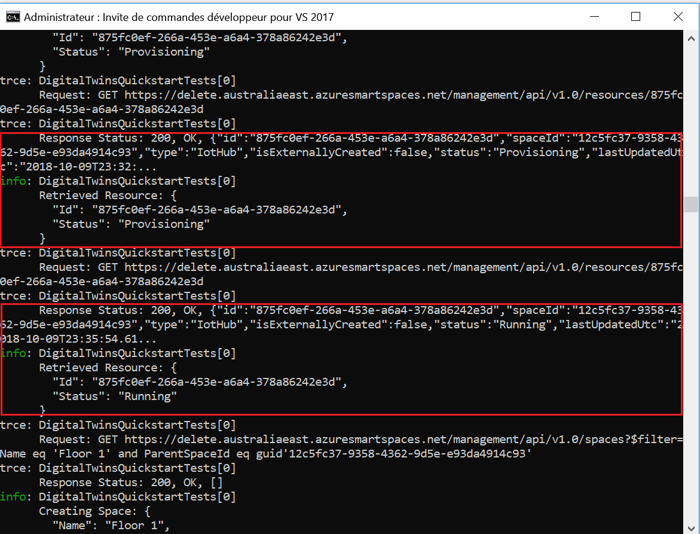
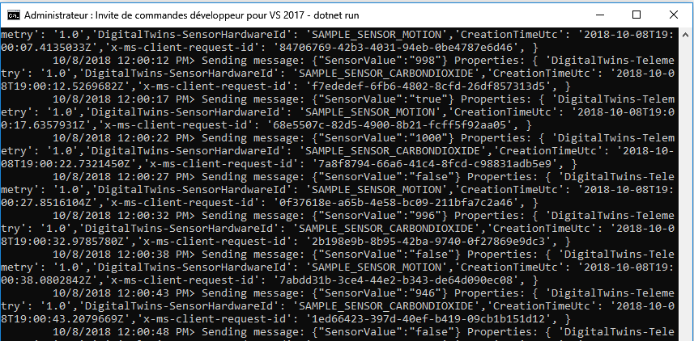
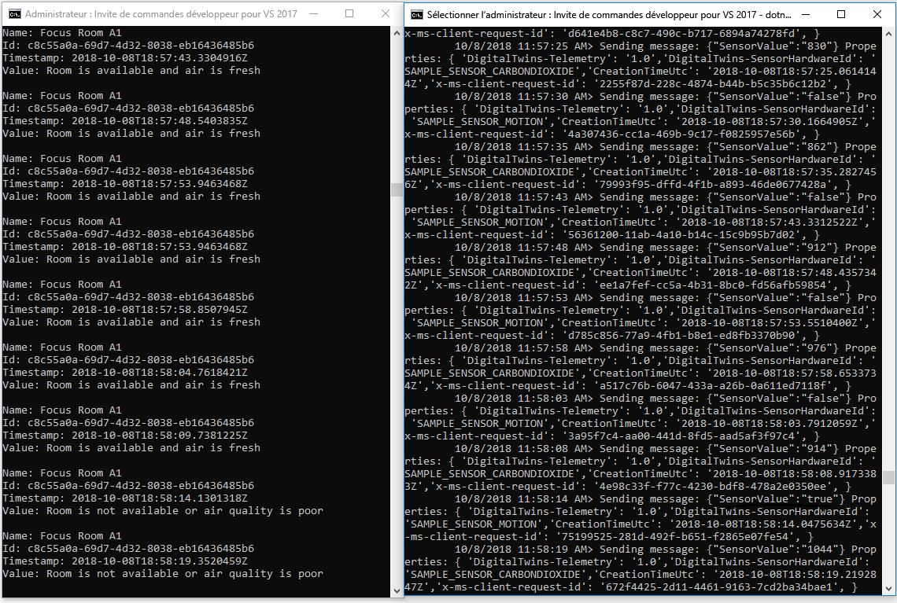

# <a name="quickstart-find-available-rooms-by-using-azure-digital-twins"></a>Démarrage rapide : Rechercher des salles disponibles avec Azure Digital Twins

Le service Azure Digital Twins vous permet de recréer une image numérique de votre environnement physique. Vous pouvez ensuite recevoir des notifications sur les événements dans votre environnement et personnaliser les réponses que vous y apportez.

Ce guide de démarrage rapide utilise [deux exemples .NET](https://github.com/Azure-Samples/digital-twins-samples-csharp) pour numériser un immeuble de bureaux imaginaire. Il vous montre comment rechercher des salles disponibles dans ce bâtiment. Digital Twins vous permet d’associer de nombreux capteurs à votre environnement. Vous pouvez également vérifier si la qualité de l’air y est optimale à l’aide d’une simulation de détection du dioxyde de carbone. L’un des exemples d’applications génère des données de capteurs aléatoires pour vous aider à visualiser ce scénario.

La vidéo suivante résume la configuration à l’aide du guide de démarrage rapide :

>[!VIDEO https://www.youtube.com/embed/1izK266tbMI]

## <a name="prerequisites"></a>Prérequis

1. Si vous ne disposez pas d’un compte Azure, [créez-en un gratuitement](https://azure.microsoft.com/free/?WT.mc_id=A261C142F) avant de commencer.

1. Les deux applications de console que vous exécutez dans ce guide de démarrage rapide sont écrites en C#. Installez le [kit SDK .NET Core version 2.1.403 ou supérieure](https://www.microsoft.com/net/download) sur votre machine de développement. Si vous avez installé le kit SDK .NET Core, vérifiez la version actuelle de C# sur la machine de développement. Exécutez `dotnet --version` à une invite de commandes.

1. Téléchargez l’[exemple de projet C#](https://github.com/Azure-Samples/digital-twins-samples-csharp/archive/master.zip). Extrayez l’archive digital-twins-samples-csharp-master.zip.

## <a name="create-a-digital-twins-instance"></a>Créer une instance Digital Twins

Créez une instance Digital Twins dans le [portail](https://portal.azure.com) en suivant les étapes de cette section.

[!INCLUDE [create-digital-twins-portal](../../includes/digital-twins-create-portal.md)]

## <a name="set-permissions-for-your-app"></a>Définir les autorisations pour votre application

Cette section enregistre votre exemple d’application dans Azure Active Directory (Azure AD) afin que celui-ci puisse accéder à votre instance Digital Twins. Si vous avez déjà une inscription d’application Azure AD, réutilisez-la pour votre exemple. Vérifiez qu’elle est configurée comme décrit dans cette section.

[!INCLUDE [digital-twins-permissions](../../includes/digital-twins-permissions.md)]

## <a name="build-application"></a>Créer une application

Créez l’application d’occupation en suivant ces étapes.

1. Ouvrez une invite de commandes. Accédez au dossier où vos fichiers `digital-twins-samples-csharp-master.zip` ont été extraits.
1. Exécutez `cd occupancy-quickstart/src`.
1. Exécutez `dotnet restore`.
1. Modifiez [appSettings.json](https://github.com/Azure-Samples/digital-twins-samples-csharp/blob/master/occupancy-quickstart/src/appSettings.json) afin d’actualiser les variables suivantes :
    - **ClientId** : Entrez l’ID d’application de l’inscription de votre application Azure AD, tel qu’indiqué dans la section précédente.
    - **Tenant** : Entrez l’ID d’annuaire de votre locataire Azure AD, également indiqué dans la section précédente.
    - **BaseUrl** : L’URL de l’API de gestion de votre instance Digital Twins est au format `https://yourDigitalTwinsName.yourLocation.azuresmartspaces.net/management/api/v1.0/`. Remplacez les espaces réservés de cette URL par les valeurs de votre instance de la section précédente.

## <a name="provision-graph"></a>Approvisionner le graphique

Cette étape provisionne votre graphe spatial Digital Twins avec :

- Plusieurs espaces.
- Un appareil.
- Deux capteurs.
- Une fonction personnalisée.
- Une attribution de rôle.

Le graphe spatial est provisionné à l’aide du fichier [provisionSample.yaml](https://github.com/Azure-Samples/digital-twins-samples-csharp/blob/master/occupancy-quickstart/src/actions/provisionSample.yaml).

1. Exécutez `dotnet run ProvisionSample`.

    >[!NOTE]
    >Pour authentifier l’utilisateur auprès d’Azure AD, nous utilisons l’outil Device Login Azure CLI. L’utilisateur doit entrer un code spécifique pour s’authentifier via la page de [connexion Microsoft](https://microsoft.com/devicelogin). Après avoir entré le code, suivez les étapes pour vous authentifier. L’utilisateur doit s’authentifier quand l’outil s’exécute.

    >[!TIP]
    > Lorsque vous procédez à cette étape, vérifiez que vos variables ont été correctement copiées si le message d’erreur suivant apparaît : `EXIT: Unexpected error: The input is not a valid Base-64 string ...`

1. L’étape de provisionnement peut prendre quelques minutes. Elle provisionne aussi un hub IoT dans votre instance Digital Twins. Elle s’exécute en boucle jusqu'à ce que le hub IoT indique Status=`Running`.

    [](media/quickstart-view-occupancy-dotnet/digital-twins-provision-sample1.png#lightbox)

1. À la fin de l’exécution, copiez la `ConnectionString` de l’appareil pour l’utiliser dans l’exemple de simulateur d’appareil. Copiez uniquement la chaîne surlignée dans cette image.

    [](media/quickstart-view-occupancy-dotnet/digital-twins-provision-sample.png#lightbox)

    >[!TIP]
    > Vous pouvez afficher et modifier votre graphe spatial à l’aide de la [Visionneuse de graphe Azure Digital Twins](https://github.com/Azure/azure-digital-twins-graph-viewer).

## <a name="send-sensor-data"></a>Envoyer les données du capteur

Créez et exécutez l’application du simulateur de capteur en suivant ces étapes.

1. Ouvrez une nouvelle invite de commandes. Accédez au projet que vous avez téléchargé dans le dossier digital-twins-samples-csharp-master.
1. Exécutez `cd device-connectivity`.
1. Exécutez `dotnet restore`.
1. Modifiez [appsettings.json](https://github.com/Azure-Samples/digital-twins-samples-csharp/blob/master/device-connectivity/appsettings.json) pour actualiser **DeviceConnectionString** avec la `ConnectionString` précédente.
1. Exécutez `dotnet run` pour commencer à envoyer les données de capteur. Comme vous le voyez dans l’image suivante, il les envoie à Digital Twins.

     [](media/quickstart-view-occupancy-dotnet/digital-twins-device-connectivity.png#lightbox)

1. Laissez ce simulateur fonctionner pour voir les résultats côte à côte avec ceux de la prochaine action de l’étape. Cette fenêtre vous montre les données de capteur simulé envoyées à Digital Twins. La prochaine étape interroge en temps réel pour trouver les salles disponibles avec de l’air frais.

    >[!TIP]
    > Lorsque vous procédez à cette étape, vérifiez que `DeviceConnectionString` a été correctement copié si le message d’erreur suivant apparaît : `EXIT: Unexpected error: The input is not a valid Base-64 string ...`

## <a name="find-available-spaces-with-fresh-air"></a>Rechercher des espaces disponibles avec de l’air frais

L’exemple de capteur simule des valeurs de données aléatoires pour les deux capteurs. Ils captent les mouvements et le dioxyde de carbone. Dans l’exemple, les espaces disponibles avec de l’air frais sont définis par aucune présence dans la pièce. Il sont aussi définis par un niveau de dioxyde de carbone inférieur à 1 000 ppm. Si la condition n’est pas remplie, l’espace n’est pas disponible ou la qualité de l’air est mauvaise.

1. Ouvrez l’invite de commande que vous avez utilisée pour effectuer l’étape de provisionnement précédente.
1. Exécutez `dotnet run GetAvailableAndFreshSpaces`.
1. Examinez côte à côte cette invite de commande et l’invite de commande des données de capteur.

    Une invite de commande envoie toutes les cinq secondes à Digital Twins les données de la simulation des mouvements et du dioxyde de carbone. L’autre commande lit le graphe en temps réel pour trouver les salles disponibles avec de l’air frais à partir de données simulées aléatoires. Une de ces conditions s’affiche presque en temps réel en fonction des dernières données de capteur qui ont été envoyées :
   - Salles disponibles avec de l’air frais.
   - Salle occupée ou de mauvaise qualité de l’air.

     [](media/quickstart-view-occupancy-dotnet/digital-twins-get-available.png#lightbox)

Pour comprendre ce qui s’est passé dans ce guide de démarrage rapide et comment les API ont été appelées, ouvrez [Visual Studio Code](https://code.visualstudio.com/Download) avec le projet du code de l’espace de travail qui se trouve dans digital-twins-samples-charp. Utilisez la commande suivante :

```plaintext
<path>\occupancy-quickstart\src>code ..\..\digital-twins-samples.code-workspace
```

Les tutoriels vont très loin dans le code. Ils vous apprennent à modifier les données de configuration et vous indiquent quelles API sont appelées. Pour plus d’informations sur les API de gestion, accédez à votre page Digital Twins Swagger :

```plaintext
https://YOUR_INSTANCE_NAME.YOUR_LOCATION.azuresmartspaces.net/management/swagger
```

| Nom | Remplacer par |
| --- | --- |
| YOUR_INSTANCE_NAME | Nom de votre instance Digital Twins |
| YOUR_LOCATION | Région de serveur dans laquelle votre instance est hébergée |

Ou, pour des raisons pratiques, accédez à [Digital Twins Swagger](https://docs.westcentralus.azuresmartspaces.net/management/swagger).

## <a name="clean-up-resources"></a>Supprimer des ressources

Les tutoriels expliquent en détail comment :

- Créer une application destinée aux responsables des locaux pour augmenter la productivité des occupants.
- Gérer le bâtiment plus efficacement.

Pour continuer à suivre des tutoriels, ne nettoyez pas les ressources créées dans ce guide de démarrage rapide. Si vous ne prévoyez pas de continuer, supprimez toutes les ressources créées par ce guide de démarrage rapide.

1. Supprimez le dossier créé quand vous avez téléchargé l’exemple de référentiel.
1. Dans le menu de gauche du [portail Azure](https://portal.azure.com), sélectionnez **Toutes les ressources**. Sélectionnez ensuite votre ressource Digital Twins. En haut du volet **Toutes les ressources**, sélectionnez **Supprimer**.

    > [!TIP]
    > Si vous avez rencontré des difficultés pour supprimer votre instance de Digital Twins, une mise à jour du service a été déployée avec le correctif. Réessayez de supprimer votre instance.

## <a name="next-steps"></a>Étapes suivantes

Ce guide de démarrage rapide a utilisé un scénario simple pour montrer comment trouver des salles avec des bonnes conditions de travail. Pour une analyse approfondie de ce scénario, consultez ce tutoriel :

>[!div class="nextstepaction"]
>[Tutoriel : Déployer Azure Digital Twins et configurer un graphique spatial](tutorial-facilities-setup.md)
