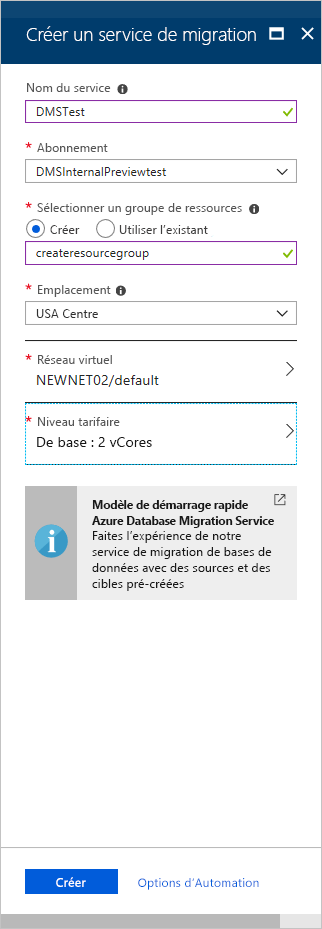

# Démarrage rapide : Créer une instance d’Azure Database Migration Service à l’aide du portail Azure

Dans ce Démarrage rapide, vous allez utiliser le portail Azure pour créer une instance d’Azure Database Migration Service.  Une fois le service créé, vous pouvez l’utiliser pour migrer des données entre une instance locale de SQL Server et Azure SQL Database.

Si vous n’avez pas d’abonnement Azure, créez un compte [gratuit](https://azure.microsoft.com/free/) avant de commencer.

## Connectez-vous au portail Azure.

Ouvrez votre navigateur web, accédez au [portail Microsoft Azure](https://portal.azure.com/), puis saisissez vos informations de connexion au portail.

Il s’ouvre par défaut sur le tableau de bord des services.

## Inscrire le fournisseur de ressources

Avant de créer votre première instance Database Migration Service, vous devez inscrire le fournisseur de ressources Microsoft.DataMigration.

1. Dans le portail Azure, sélectionnez **Tous les services**, puis **Abonnements**.

2. Sélectionnez l’abonnement dans lequel vous voulez créer l’instance Azure Database Migration Service, puis sélectionnez **Fournisseurs de ressources**.

3. Recherchez migration, puis à droite de **Microsoft.DataMigration**, sélectionnez **Inscrire**.

    

## Créer une instance du service

1. Sélectionnez +**Créer une ressource** pour créer une instance d’Azure Database Migration Service.

2. Recherchez « migration » sur la marketplace, sélectionnez **Azure Database Migration Service**, puis, dans l’écran **Azure Database Migration Service**, sélectionnez **Créer**.

3. Sur l’écran **Créer un service de migration** :

    - Choisissez un **Nom de service** unique et facile à mémoriser pour identifier votre instance d’Azure Database Migration Service.
    - Sélectionnez l’**abonnement** Azure dans lequel vous souhaitez créer l’instance.
    - Sélectionnez un **Groupe de ressources** existant ou créez-en un.
    - Choisissez **l’emplacement** le plus proche de votre serveur source ou cible.
    - Sélectionnez un **réseau virtuel** existant ou créez-en un.

        Le réseau virtuel fournit à Azure Database Migration Service un accès à la base de données source et à l’environnement cible.

        Pour plus d’informations sur la création d’un réseau virtuel dans le portail Azure, consultez l’article [Créer un réseau virtuel au moyen du portail Azure](https://aka.ms/vnet).

    - Sélectionnez De base : 1 vCore pour le **Niveau tarifaire**.

        

4. Sélectionnez **Create** (Créer).

    Votre instance d’Azure Database Migration Service est créée et prête à l’emploi au bout de quelques instants. Database Migration Service s’affiche alors comme indiqué dans l’image suivante :

    

## Nettoyer les ressources

Vous pouvez nettoyer toutes les ressources créées au cours de ce démarrage rapide en supprimant le [Groupe de ressources Azure](../azure-resource-manager/management/overview.md). Pour supprimer le groupe de ressources, accédez à l’instance d’Azure Database Migration Service que vous avez créée. Sélectionnez le nom de **groupe de ressources**, puis sélectionnez **Supprimer le groupe de ressources**. Cette action supprime toutes les ressources du groupe, ainsi que le groupe lui-même.

## Étapes suivantes

> [!div class="nextstepaction"]
> [Migrer une instance locale de SQL Server vers Azure SQL Database](tutorial-sql-server-to-azure-sql.md)