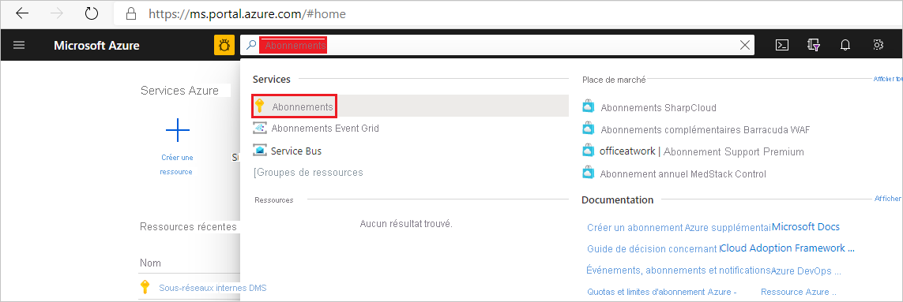
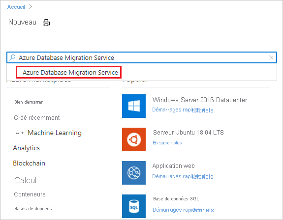
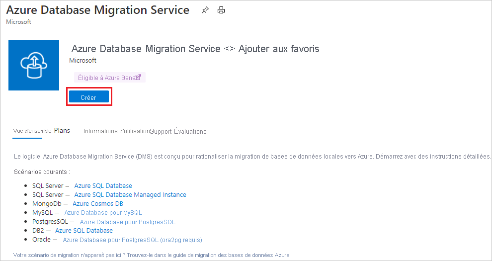
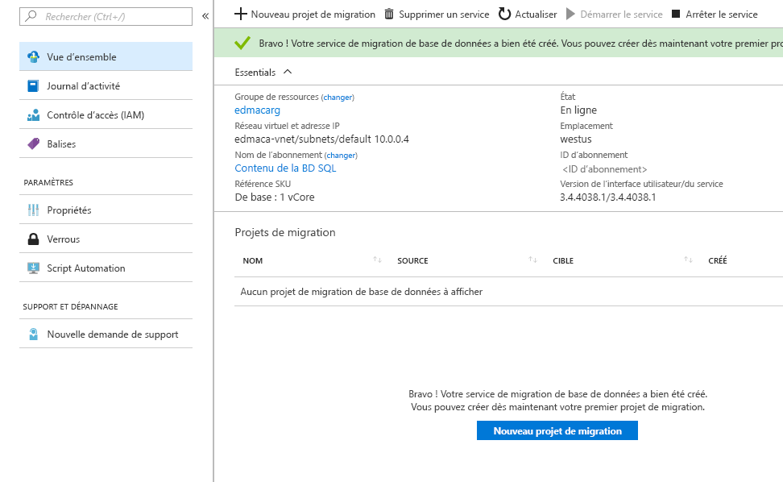

# Démarrage rapide : Créer une instance d’Azure Database Migration Service à l’aide du portail Azure

Dans ce guide de démarrage rapide, vous allez utiliser le portail Azure pour créer une instance d’Azure Database Migration Service. Une fois l’instance créée, vous pouvez l’utiliser pour migrer des données de plusieurs sources de base de données vers des plateformes de données Azure, par exemple de SQL Server vers Azure SQL Database ou de SQL Server vers une instance Azure SQL Managed Instance.

Si vous n’avez pas d’abonnement Azure, créez un compte [gratuit](https://azure.microsoft.com/free/) avant de commencer.

## Connectez-vous au portail Azure.

Ouvrez votre navigateur web, accédez au [portail Microsoft Azure](https://portal.azure.com/), puis saisissez vos informations de connexion au portail. Il s’ouvre par défaut sur le tableau de bord des services.

> [!NOTE]
> Vous pouvez créer jusqu’à 10 instances de DMS par abonnement par région. Si vous avez besoin d’un plus grand nombre d’instances, veuillez créer un ticket de support.

## Inscrire le fournisseur de ressources

Avant de créer votre première instance Database Migration Service, vous devez inscrire le fournisseur de ressources Microsoft.DataMigration.

1. Dans le portail Azure, recherchez et sélectionnez **Abonnements**.

   

2. Sélectionnez l’abonnement dans lequel vous voulez créer l’instance Azure Database Migration Service, puis sélectionnez **Fournisseurs de ressources**.

    

3. Recherchez « migration », puis sélectionnez **Inscrire** pour **Microsoft.DataMigration**.

    

## Créer une instance du service

1. Dans le menu du Portail Azure ou dans la page **Accueil**, sélectionnez **Créer une ressource**. Recherchez et sélectionnez **Azure Database Migration Service**.

    

2. Dans l’écran **Azure Database Migration Service**, sélectionnez **Créer**.

    

3. Sous l’onglet Informations de base de la page **Créer un service de migration** :

     - Sélectionnez l’abonnement.
     - Créez un groupe de ressources ou sélectionnez-en un déjà existant.
     - Spécifiez un nom pour l’instance d’Azure Database Migration Service.
     - Sélectionnez l’emplacement dans lequel vous souhaitez créer l’instance Azure Database Migration Service.
     - Choisissez **Azure** comme mode de service.
     - Sélectionnez un niveau tarifaire. Pour plus d’informations sur les coûts et les niveaux de tarification, consultez la [page de tarification](https://aka.ms/dms-pricing).
     
    

     - Sélectionnez Suivant : Réseau.

4. Sous l’onglet Réseau de la page **Créer un service de migration** :

    - Sélectionnez un réseau virtuel existant ou créez-en un. Le réseau virtuel fournit à Azure Database Migration Service un accès à la base de données source et à l’environnement cible. Pour plus d’informations sur la création d’un réseau virtuel dans le portail Azure, consultez l’article [Créer un réseau virtuel au moyen du portail Azure](../virtual-network/quick-create-portal.md).

    

    - Sélectionnez **Vérifier + créer** pour créer le service. 
    
    - Après quelques instants, votre instance d’Azure Database Migration Service est créée et prête à être utilisée :

    

## Nettoyer les ressources

Vous pouvez nettoyer toutes les ressources créées au cours de ce démarrage rapide en supprimant le [groupe de ressources Azure](../azure-resource-manager/management/overview.md). Pour supprimer le groupe de ressources, accédez à l’instance d’Azure Database Migration Service que vous avez créée. Sélectionnez le nom de **groupe de ressources**, puis sélectionnez **Supprimer le groupe de ressources**. Cette action supprime toutes les ressources du groupe, ainsi que le groupe lui-même.

## Étapes suivantes

* [Migrer SQL Server vers Azure SQL Database hors connexion](tutorial-sql-server-to-azure-sql.md)
* [Migrer SQL Server vers Azure SQL Database en ligne](tutorial-sql-server-azure-sql-online.md)
* [Migrer SQL Server vers une instance Azure SQL Managed Instance hors connexion](tutorial-sql-server-to-managed-instance.md)
* [Migrer SQL Server vers une instance Azure SQL Managed Instance en ligne](tutorial-sql-server-managed-instance-online.md)