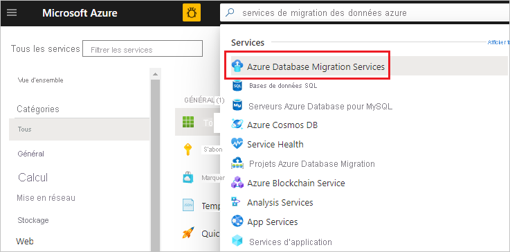

# Didacticiel : Effectuer la migration en ligne de SQL Server vers une instance managée d’Azure SQL Database à l’aide de DMS

Vous pouvez utiliser le service Azure Database Migration Service pour effectuer la migration des bases de données d’une instance locale de SQL Server vers une [instance managée d’Azure SQL Database](../sql-database/sql-database-managed-instance.md), pour un temps d’arrêt minimal. Pour connaître des méthodes supplémentaires pouvant nécessiter un effort manuel, consultez l’article [Migration d’une instance SQL Server vers une instance managée d’Azure SQL Database](../sql-database/sql-database-managed-instance-migrate.md).

Dans ce tutoriel, vous migrez la base de données **Adventureworks2012** entre une instance locale de SQL Server et une instance managée SQL Database, avec un temps d’arrêt minimal en utilisant Azure Database Migration Service.

Ce tutoriel vous montre comment effectuer les opérations suivantes :
> [!div class="checklist"]
>
> * Créer une instance Azure Database Migration Service.
> * Créer un projet de migration et lancer une migration en ligne en utilisant Azure Database Migration Service.
> * Surveiller la migration.
> * Effectuer le basculement de la migration lorsque vous êtes prêt.

> [!IMPORTANT]
> Pour effectuer une migration en ligne de SQL Server vers une instance gérée de SQL Database à l'aide d'Azure Database Migration Service, vous devez fournir la sauvegarde de base de données complète et les sauvegardes des journaux associés dans le partage réseau SMB que le service peut utiliser pour la migration de vos bases de données. Azure Database Migration Service ne lance pas les sauvegardes. Il utilise les sauvegardes existantes (qui peuvent déjà faire partie de votre plan de récupération d'urgence) pour la migration.
> N’oubliez pas d’effectuer des [sauvegardes à l’aide de l’option WITH CHECKSUM](https://docs.microsoft.com/sql/relational-databases/backup-restore/enable-or-disable-backup-checksums-during-backup-or-restore-sql-server?view=sql-server-2017). Par ailleurs, vous ne devez pas ajouter plusieurs sauvegardes (c'est-à-dire la sauvegarde complète et les journaux de transactions) sur un même support de sauvegarde. Vous devez placer chaque sauvegarde sur un fichier de sauvegarde distinct. Enfin, vous pouvez utiliser des sauvegardes compressées pour réduire le risque de problèmes liés à la migration de sauvegardes volumineuses.

> [!NOTE]
> L’utilisation d’Azure Database Migration Service pour effectuer une migration en ligne nécessite la création d’une instance basée sur le niveau tarifaire Premium.

> [!IMPORTANT]
> Pour une expérience de migration optimale, Microsoft recommande de créer une instance d’Azure Database Migration Service dans la même région Azure que la base de données cible. Le déplacement des données entre les régions ou les zones géographiques peut ralentir le processus de migration et introduire des erreurs.

[!INCLUDE [online-offline](../../includes/database-migration-service-offline-online.md)]

Cet article décrit une migration en ligne de SQL Server vers une instance managée SQL Database. Pour une migration hors connexion, consultez [Migrer une instance de SQL Server vers une instance gérée de SQL Database hors connexion à l'aide de DMS](tutorial-sql-server-to-managed-instance.md).

## Prérequis

Pour suivre ce didacticiel, vous devez effectuer les opérations suivantes :

* Créez un réseau virtuel Azure (VNet) pour le service Azure Database Migration Service à l’aide du modèle de déploiement Azure Resource Manager, qui fournit une connectivité de site à site à vos serveurs sources locaux via [ExpressRoute](https://docs.microsoft.com/azure/expressroute/expressroute-introduction) ou un [VPN](https://docs.microsoft.com/azure/vpn-gateway/vpn-gateway-about-vpngateways). [Découvrez les topologies réseau relatives à la migration d'instances gérées d'Azure SQL Database à l'aide d'Azure Database Migration Service](https://aka.ms/dmsnetworkformi). Pour plus d’informations sur la création d’un réseau virtuel, consultez la [documentation sur le réseau virtuel](https://docs.microsoft.com/azure/virtual-network/), en particulier les articles sur le démarrage rapide, qui fournissent des informations pas à pas.

    > [!NOTE]
    > Pendant la configuration du réseau virtuel, si vous utilisez ExpressRoute avec le peering réseau à Microsoft, ajoutez ces [points de terminaison](https://docs.microsoft.com/azure/virtual-network/virtual-network-service-endpoints-overview) de service au sous-réseau où doit être provisionné le service :
    >
    > * Point de terminaison de base de données cible (un point de terminaison SQL ou Cosmos DB, par exemple)
    > * Point de terminaison de stockage
    > * Point de terminaison Service Bus
    >
    > Cette configuration est nécessaire car Azure Database Migration Service ne dispose pas d’une connectivité Internet.
    >
    >En l'absence de connectivité de site à site entre le réseau local et Azure, ou si la bande passante de la connectivité de site à site est limitée, vous pouvez utiliser Azure Database Migration Service en mode hybride (préversion). Le mode hybride utilise un Worker de migration local et une instance d'Azure Database Migration Service exécutée dans le cloud. Pour créer une instance d'Azure Database Migration Service en mode hybride, consultez l'article [Créer une instance d'Azure Database Migration Service en mode hybride à l'aide du portail Azure](https://aka.ms/dms-hybrid-create).

    > [!IMPORTANT]
    > En ce qui concerne le compte de stockage utilisé dans le cadre de la migration, vous devez :
    > * Choisir d’autoriser tout le réseau à accéder au compte de stockage.
    > * Configurer des listes de contrôle d’accès pour le réseau virtuel. Pour plus d’informations, consultez l’article [Configurer des pare-feu et des réseaux virtuels dans Stockage Azure](https://docs.microsoft.com/azure/storage/common/storage-network-security).

* Vérifiez que les règles du groupe de sécurité réseau de votre réseau virtuel ne bloquent pas les ports de communication entrants suivants d’Azure Database Migration Service : 443, 53, 9354, 445, 12000. Pour plus d’informations sur le filtrage du trafic de groupe de sécurité réseau de réseau virtuel Azure, consultez l’article [Filtrer le trafic réseau avec les groupes de sécurité réseau](https://docs.microsoft.com/azure/virtual-network/virtual-networks-nsg).
* Configurez [l’accès au moteur de base de données source dans votre Pare-feu Windows](https://docs.microsoft.com/sql/database-engine/configure-windows/configure-a-windows-firewall-for-database-engine-access).
* Ouvrez votre pare-feu Windows pour permettre à Azure Database Migration Service d’accéder au serveur SQL Server source via le port TCP 1433 (par défaut).
* Si vous exécutez plusieurs instances nommées de SQL Server avec des ports dynamiques, vous pouvez activer le service SQL Browser et autoriser l’accès au port UDP 1434 à travers vos pare-feu, de sorte qu’Azure Database Migration Service puisse se connecter à une instance nommée sur votre serveur source.
* Si vous utilisez une appliance de pare-feu devant vos bases de données sources, vous devrez peut-être ajouter des règles de pare-feu pour permettre à Azure Database Migration Service d’accéder aux bases de données sources pour la migration ainsi qu’aux fichiers, via le port SMB 445.
* Créez une instance managée SQL Database en suivant les indications de l’article [Créer une instance managée Azure SQL Database dans le portail Azure](https://aka.ms/sqldbmi).
* Vérifiez que les comptes de connexion utilisés pour connecter l’instance SQL Server source et l’instance managée cible sont membres du rôle serveur sysadmin.
* Spécifiez un partage réseau SMB qui contient tous les fichiers de sauvegarde complète de votre base de données et les fichiers de sauvegarde des journaux des transactions associés qu'Azure Database Migration Service peut utiliser pour la migration de base de données.
* Assurez-vous que le compte de service exécutant l’instance SQL Server source dispose de privilèges en écriture sur le partage réseau que vous avez créé, et que le compte d’ordinateur pour le serveur source a accès en lecture/écriture au même partage.
* Repérez un utilisateur Windows (et son mot de passe) disposant d’un contrôle total sur le partage réseau que vous avez créé précédemment. Azure Database Migration Service emprunte les informations d’identification de l’utilisateur pour charger les fichiers de sauvegarde sur le conteneur de Stockage Azure pour l’opération de restauration.
* Créez un ID d’application Azure Active Directory qui génère la clé de l’ID d’application permettant à Azure Database Migration Service de se connecter à l’instance managée Azure SQL Database et au conteneur Stockage Azure cibles. Pour plus d’informations, consultez l’article [Utiliser le portail pour créer une application et un principal du service Azure Active Directory pouvant accéder aux ressources](https://docs.microsoft.com/azure/azure-resource-manager/resource-group-create-service-principal-portal).

  > [!NOTE]
  > Azure Database Migration Service nécessite les autorisations de contributeur sur l’abonnement pour l’ID d’application spécifié. Vous pouvez également créer des rôles personnalisés qui accordent les autorisations spécifiques requises par Azure Database Migration Service. Pour obtenir des instructions pas à pas sur l'utilisation des rôles personnalisés, consultez l'article [Rôles personnalisés pour la migration en ligne de SQL Server vers une instance gérée de SQL Database](https://docs.microsoft.com/azure/dms/resource-custom-roles-sql-db-managed-instance).

* Créez ou prenez note du **niveau de performance Standard**, compte Stockage Azure, qui permet à Azure Database Migration Service de charger les fichiers de sauvegarde de base de données sur les bases de données en cours de migration et de les utiliser pour celles-ci.  Veillez à créer le compte de stockage Azure dans la même région que celle où l’instance d’Azure Database Migration Service est créée.

## Inscrire le fournisseur de ressources Microsoft.DataMigration

1. Connectez-vous au portail Azure, sélectionnez **Tous les services**, puis **Abonnements**.

    

2. Sélectionnez l’abonnement dans lequel vous voulez créer l’instance Azure Database Migration Service, puis sélectionnez **Fournisseurs de ressources**.

    

3. Recherchez migration, puis à droite de **Microsoft.DataMigration**, sélectionnez **Inscrire**.

    

## Créer une instance Azure Database Migration Service

1. Dans le portail Azure, sélectionnez **+ Créer une ressource**, recherchez **Azure Database Migration Service**, puis sélectionnez **Azure Database Migration Service** dans la liste déroulante.

     

2. Dans l’écran **Azure Database Migration Service**, sélectionnez **Créer**.

    

3. Dans l’écran **Créer un service de migration**, spécifiez un nom pour le service, l’abonnement, et un réseau virtuel nouveau ou existant.

4. Sélectionnez l’emplacement au niveau duquel vous souhaitez créer l’instance DMS.

5. Sélectionnez un réseau virtuel existant ou créez-en un.

    Le réseau virtuel fournit à Azure Database Migration Service un accès au serveur SQL Server source et à l’instance managée SQL Database cible.

    Pour plus d’informations sur la création d’un réseau virtuel dans le portail Azure, consultez l’article [Créer un réseau virtuel à l’aide du portail Azure](https://aka.ms/DMSVnet).

    Pour plus d'informations, consultez l'article [Topologies réseau pour la migration d'instances gérées d'Azure SQL Database à l'aide d'Azure Database Migration Service](https://aka.ms/dmsnetworkformi).

6. Sélectionnez une référence (SKU) dans le niveau tarifaire Premium.

    > [!NOTE]
    > Les migrations en ligne sont uniquement prises en charge lorsque vous utilisez le niveau Premium.

    Pour plus d’informations sur les coûts et les niveaux de tarification, consultez la [page de tarification](https://aka.ms/dms-pricing).

    

7. Sélectionnez **Créer** pour créer le service.

## Créer un projet de migration

Une fois qu’une instance du service a été créée, recherchez-la dans le Portail Azure, ouvrez-la, puis créez un projet de migration.

1. Dans le portail Azure, sélectionnez **Tous les services**, recherchez Azure Database Migration Service, puis sélectionnez **Azure Database Migration Services**.

    

2. Sur l’écran **Azure Database Migration Service**, recherchez le nom de l’instance que vous avez créée, puis sélectionnez-la.

3. Sélectionnez **+ Nouveau projet de migration**.

4. Dans l’écran **Nouveau projet de migration**, spécifiez un nom pour le projet. Dans la zone de texte **Type de serveur source**, sélectionnez **SQL Server**. Dans la zone de texte **Type de serveur cible**, sélectionnez **Azure SQL Database Managed Instance**. Enfin, dans la zone de texte **Choisir un type d’activité**, sélectionnez **Migration de données hors connexion**.

   

5. Sélectionnez **Créer et exécuter une activité** pour créer le projet.

## Spécifier les détails de la source

1. Dans l’écran **Détails de la source de migration**, spécifiez les détails de connexion du serveur SQL Server source.

2. Si vous n’avez pas installé de certificat approuvé sur votre serveur, cochez la case **Faire confiance au certificat de serveur**.

    Quand aucun certificat approuvé n’est installé, SQL Server génère un certificat auto-signé au démarrage de l’instance. Ce certificat permet de chiffrer les informations d’identification des connexions clientes.

    > [!CAUTION]
    > Les connexions SSL chiffrées à l’aide d’un certificat auto-signé n’offrent pas de sécurité renforcée. Elles sont vulnérables aux attaques de l’intercepteur. Vous ne devez pas compter sur SSL utilisant des certificats auto-signés dans un environnement de production ou sur des serveurs connectés à Internet.

   

3. Sélectionnez **Enregistrer**.

4. Sur l’écran **Sélectionner la base de données source**, sélectionnez la base de données **Adventureworks2012** pour la migration.

   

    > [!IMPORTANT]
    > Si vous utilisez SSIS (SQL Server Integration Services), DMS ne prend pas en charge la migration de la base de données de catalogue de vos projets/packages SSIS (SSISDB) entre SQL Server et une instance managée d’Azure SQL Database. Toutefois, vous pouvez provisionner SSIS dans ADF (Azure Data Factory) et redéployer vos projets/packages SSIS sur la base de données SSISDB de destination hébergée par l’instance managée d’Azure SQL Database. Pour plus d’informations sur la migration des packages SSIS, consultez l’article [Migrer des packages SQL Server Integration Services vers Azure](https://docs.microsoft.com/azure/dms/how-to-migrate-ssis-packages).

5. Sélectionnez **Enregistrer**.

## Spécifier les détails de la cible

1. Dans l’écran **Détails de la cible de migration**, spécifiez l’**ID d’application** et la **clé** que l’instance de DMS peut utiliser pour se connecter à l’instance managée d’Azure SQL Database et au compte Stockage Azure cibles.

    Pour plus d’informations, consultez l’article [Utiliser le portail pour créer une application et un principal du service Azure Active Directory pouvant accéder aux ressources](https://docs.microsoft.com/azure/azure-resource-manager/resource-group-create-service-principal-portal).

2. Sélectionnez l’**abonnement** contenant l’instance managée cible d’Azure SQL Database, puis sélectionnez l’instance cible.

    Si vous n’avez pas encore provisionné l’instance managée d’Azure SQL Database, sélectionnez le [lien](https://aka.ms/SQLDBMI) permettant de provisionner l’instance. Une fois l’instance managée d’Azure SQL Database prête, retournez à ce projet spécifique pour exécuter la migration.

3. Indiquez l’**utilisateur SQL** et le **mot de passe** permettant de se connecter à l’instance managée cible d’Azure SQL Database.

    

4. Sélectionnez **Enregistrer**.

## Sélectionner les bases de données sources

1. Dans l’écran **Sélectionner la base de données source**, sélectionnez la base de données source que vous souhaitez migrer.

    

2. Sélectionnez **Enregistrer**.

## Configurer les paramètres de migration

1. Dans l’écran **Configurer les paramètres de migration**, fournissez les informations suivantes :

    | | |
    |--------|---------|
    |**SMB Network location share** (Partage d’emplacement réseau SMB) | Partage réseau SMB local ou partage de fichiers Azure contenant les fichiers de sauvegarde complète de base de données et les fichiers de sauvegarde du journal des transactions qu’Azure Database Migration Service peut utiliser pour la migration. Le compte de service qui exécute l’instance source de SQL Server doit avoir des privilèges de lecture et d’écriture pour ce partage réseau. Fournissez un nom de domaine complet ou les adresses IP du serveur dans le partage réseau, par exemple, « \\\nomserveur.nomdomaine.com\dossiersauvegarde » ou « \\\adresse IP\dossiersauvegarde ».|
    |**Nom d'utilisateur** | Assurez-vous que l’utilisateur Windows dispose d’un contrôle total sur le partage réseau que vous avez fourni précédemment. Azure Database Migration Service emprunte l'identité de l'utilisateur afin de charger les fichiers de sauvegarde sur le conteneur de stockage Azure pour l'opération de restauration. Si vous choisissez le partage de fichiers Azure, utilisez le nom de compte de stockage commençant par AZURE\ en tant que nom d’utilisateur. |
    |**Mot de passe** | Mot de passe pour l’utilisateur. Si vous choisissez le partage de fichiers Azure, utilisez une clé de compte de stockage en tant que mot de passe. |
    |**Subscription of the Azure Storage Account** (Abonnement du compte Stockage Azure) | Sélectionnez l’abonnement qui contient le compte Stockage Azure. |
    |**Compte Stockage Azure** | Sélectionnez le compte Stockage Azure sur lequel Azure Database Migration Service peut charger les fichiers de sauvegarde à partir du partage réseau SMB et qu’il peut utiliser pour la migration de base de données.  Nous vous recommandons de sélectionner le compte de stockage se trouvant dans la même région qu’Azure Database Migration Service pour bénéficier de performances de chargement de fichiers optimales. |

    

> [!NOTE]
  > Si Azure Database Migration Service indique l’erreur « Erreur système 53 » ou « Erreur système 57 », cela peut signifier qu’Azure Database Migration Service ne peut pas accéder au partage de fichiers Azure. Si vous êtes confronté à l’une de ces erreurs, octroyez au compte l’accès au stockage depuis le réseau virtuel à l’aide des instructions situées [ici](https://docs.microsoft.com/azure/storage/common/storage-network-security?toc=%2fazure%2fvirtual-network%2ftoc.json#grant-access-from-a-virtual-network).

2. Sélectionnez **Enregistrer**.

## Examiner le récapitulatif de la migration

1. Dans l’écran **Récapitulatif de la migration**, spécifiez un nom pour l’activité de migration dans la zone de texte **Nom de l’activité**.

2. Examinez et vérifiez les détails associés au projet de migration.

    

## Exécuter et surveiller la migration

1. Sélectionnez **Exécuter la migration**.

2. Dans l’écran de l’activité de migration, sélectionnez **Actualiser** pour mettre à jour l’affichage.

   

    Vous pouvez développer davantage les catégories de bases de données et de connexions pour surveiller l’état de la migration des objets serveur respectifs.

   

## Exécution du basculement de migration

Une fois la sauvegarde de base de données complète restaurée sur l’instance managée SQL Database cible, la base de données est disponible pour une migration à basculement.

1. Lorsque vous êtes prêt à effectuer la migration de base de données en ligne, sélectionnez **Démarrer le basculement**.

2. Arrêtez tout le trafic entrant dans les bases de données sources.

3. Effectuez la [sauvegarde de la fin du journal], mettez le fichier de sauvegarde à disposition dans le partage réseau SMB, puis attendez que cette sauvegarde de fichier journal finale soit restaurée.

    À ce stade, vous devez voir le paramètre **Modifications en attente** défini sur 0.

4. Sélectionnez **Confirmer**, puis **Appliquer**.

    

5. Quand l’état de la migration de base de données indique **Terminé**, connectez vos applications à la nouvelle instance managée cible d’Azure SQL Database.

    

## Étapes suivantes

* Pour accéder à un tutoriel vous expliquant comment migrer une base de données vers une instance managée à l’aide de la commande T-SQL RESTORE, consultez [Restaurer une sauvegarde vers une instance managée à l’aide de la commande restore](../sql-database/sql-database-managed-instance-restore-from-backup-tutorial.md).
* Pour plus d’informations sur la notion d’instance managée, consultez [Qu’est-ce qu’une instance managée](../sql-database/sql-database-managed-instance.md).
* Pour plus d’informations sur la connexion d’applications à une instance managée, consultez [Connecter des applications](../sql-database/sql-database-managed-instance-connect-app.md).
