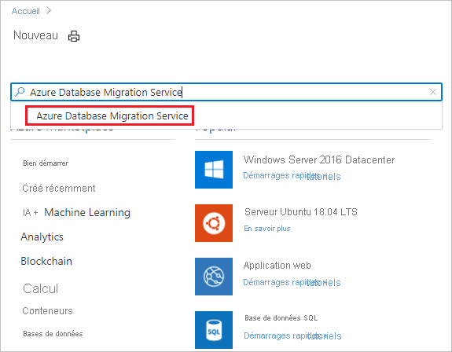
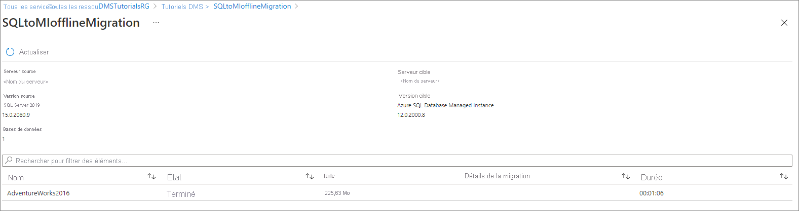

# Tutoriel : Migrer SQL Server vers une instance managée SQL Azure hors connexion à l’aide de DMS

Vous pouvez utiliser Azure Database Migration Service pour procéder à la migration des bases de données d’une instance de SQL Server vers une [instance managée SQL Azure](../azure-sql/managed-instance/sql-managed-instance-paas-overview.md). Pour connaître des méthodes supplémentaires pouvant nécessiter un effort manuel, consultez l’article [Migration d’une instance de SQL Server vers une instance managée SQL](../azure-sql/managed-instance/migrate-to-instance-from-sql-server.md).

Dans ce tutoriel, vous allez migrer la base de données **Adventureworks2012** à partir d’une instance de SQL Server locale vers une instance managée SQL en utilisant Azure Database Migration Service.

Dans ce tutoriel, vous allez apprendre à :
> [!div class="checklist"]
>
> - Créer une instance Azure Database Migration Service.
> - Créer un projet de migration en utilisant Azure Database Migration Service.
> - Exécuter la migration.
> - Surveiller la migration.
> - Télécharger un rapport de migration.

> [!IMPORTANT]
> Pour les migrations hors connexion à partir de SQL Server vers une instance managée SQL, Azure Database Migration Service peut créer les fichiers de sauvegarde pour vous. Vous pouvez également fournir la dernière sauvegarde complète de la base de données dans le partage réseau SMB que le service utilisera pour migrer vos bases de données. N’ajoutez pas plusieurs sauvegardes à un même support de sauvegarde. Placez chaque sauvegarde sur un fichier de sauvegarde distinct. Notez que vous pouvez également utiliser des sauvegardes compressées pour réduire le risque de problèmes liés à la migration de sauvegardes volumineuses.

[!INCLUDE [online-offline](../../includes/database-migration-service-offline-online.md)]

Cet article décrit une migration hors connexion de SQL Server vers une instance managée SQL. Pour une migration en ligne, consultez [Migrer SQL Server vers une instance managée SQL en ligne à l’aide de DMS](tutorial-sql-server-managed-instance-online.md).

## Prérequis

Pour suivre ce didacticiel, vous devez effectuer les opérations suivantes :

- Créez un Réseau virtuel Microsoft Azure pour Azure Database Migration Service à l’aide du modèle de déploiement Azure Resource Manager, qui fournit une connectivité site à site à vos serveurs sources locaux via [ExpressRoute](https://docs.microsoft.com/azure/expressroute/expressroute-introduction) ou un [VPN](https://docs.microsoft.com/azure/vpn-gateway/vpn-gateway-about-vpngateways). [Découvrez les topologies de réseau pour les migrations d’instance managée SQL à l’aide d’Azure Database Migration Service](https://aka.ms/dmsnetworkformi). Pour plus d’informations sur la création d’un réseau virtuel, consultez la [documentation sur le réseau virtuel](https://docs.microsoft.com/azure/virtual-network/), en particulier les articles sur le démarrage rapide, qui fournissent des informations pas à pas.

    > [!NOTE]
    > Pendant la configuration du réseau virtuel, si vous utilisez ExpressRoute avec le peering réseau à Microsoft, ajoutez ces [points de terminaison](https://docs.microsoft.com/azure/virtual-network/virtual-network-service-endpoints-overview) au sous-réseau où doit être provisionné le service :
    > - Point de terminaison de base de données cible (un point de terminaison SQL ou Cosmos DB, par exemple)
    > - Point de terminaison de stockage
    > - Point de terminaison Service Bus
    >
    > Cette configuration est nécessaire car Azure Database Migration Service ne dispose pas d’une connectivité Internet.

- Vérifiez que les règles du groupe de sécurité réseau de votre réseau virtuel ne bloquent pas les ports suivants pour les communications entrantes vers Azure Database Migration Service : 443, 53, 9354, 445, 12000. Pour plus d’informations sur le filtrage du trafic de groupe de sécurité réseau de réseau virtuel, consultez l’article [Filtrer le trafic avec les groupes de sécurité réseau](https://docs.microsoft.com/azure/virtual-network/virtual-networks-nsg).
- Configurez [l’accès au moteur de base de données source dans votre Pare-feu Windows](https://docs.microsoft.com/sql/database-engine/configure-windows/configure-a-windows-firewall-for-database-engine-access).
- Ouvrez votre pare-feu Windows pour permettre à Azure Database Migration Service d’accéder au serveur SQL Server source via le port TCP 1433 (par défaut).
- Si vous exécutez plusieurs instances nommées de SQL Server avec des ports dynamiques, vous pouvez activer le service SQL Browser et autoriser l’accès au port UDP 1434 à travers vos pare-feu, de sorte qu’Azure Database Migration Service puisse se connecter à une instance nommée sur votre serveur source.
- Si vous utilisez une appliance de pare-feu devant vos bases de données sources, vous devrez peut-être ajouter des règles de pare-feu pour permettre à Azure Database Migration Service d’accéder aux bases de données sources pour la migration ainsi qu’aux fichiers, via le port SMB 445.
- Créez une instance managée SQL en suivant les indications de l’article [Créer une instance managée SQL dans le portail Azure](https://aka.ms/sqldbmi).
- Vérifiez que les comptes de connexion utilisés pour connecter le serveur SQL Server source et l’instance SQL Managed Instance cible sont membres du rôle serveur sysadmin.

    >[!NOTE]
    >Par défaut, Azure Database Migration Service prend uniquement en charge la migration des connexions SQL. Toutefois, vous pouvez rendre possible la migration des connexions Windows en procédant comme suit :
    >
    >- Assurez-vous que l’instance managée SQL cible dispose de l’accès en lecture AAD, qui peut être configuré dans le portail Azure par un utilisateur doté du rôle **Administrateur d’entreprise** ou d’un rôle **Administrateur général**.
    >- Configurez votre instance Azure Database Migration Service pour activer la migration des connexions d’utilisateur ou de groupe Windows, qui est configurée via le Portail Azure, dans la page Configuration. Après avoir activé ce paramètre, redémarrez le service pour que les modifications prennent effet.
    >
    > Après le redémarrage du service, les connexions d’utilisateur ou de groupe Windows apparaissent dans la liste des connexions disponibles pour la migration. Pour toutes les connexions d’utilisateur ou de groupe Windows que vous migrez, vous êtes invité à fournir le nom de domaine associé. Les comptes d’utilisateur de service (comptes avec le nom de domaine NT AUTHORITY) et les comptes d’utilisateur virtuels (nom de compte avec le nom de domaine NT SERVICE) ne sont pas pris en charge.

- Créez un partage réseau que le service Azure Database Migration Service pourra utiliser pour sauvegarder la base de données source.
- Assurez-vous que le compte de service exécutant l’instance SQL Server source dispose de privilèges en écriture sur le partage réseau que vous avez créé, et que le compte d’ordinateur pour le serveur source a accès en lecture/écriture au même partage.
- Repérez un utilisateur Windows (et son mot de passe) disposant d’un contrôle total sur le partage réseau que vous avez créé précédemment. Azure Database Migration Service emprunte les informations d’identification de l’utilisateur pour charger les fichiers de sauvegarde sur le conteneur de Stockage Azure pour l’opération de restauration.
- Créez un conteneur d’objets blob et récupérez son URI SAS en suivant les étapes de l’article [Gérer les ressources Azure Blob Storage avec l’Explorateur de stockage (version préliminaire)](https://docs.microsoft.com/azure/vs-azure-tools-storage-explorer-blobs#get-the-sas-for-a-blob-container). Veillez à sélectionner toutes les autorisations (lecture, écriture, suppression, liste) dans la fenêtre de la stratégie lors de la création de l’URI SAS. Ces détails permettent au service Azure Database Migration Service d’accéder au conteneur de votre compte de stockage afin de charger les fichiers de sauvegarde utilisés pour migrer les bases de données vers une instance managée SQL.

    > [!NOTE]
    > Quand vous configurez les paramètres du compte de stockage à l’étape [Configurer les paramètres de migration](https://docs.microsoft.com/azure/dms/tutorial-sql-server-to-managed-instance#configure-migration-settings), notez qu’Azure Database Migration Service ne prend pas en charge l’utilisation de jeton SAS.
    
## Inscrire le fournisseur de ressources Microsoft.DataMigration

1. Connectez-vous au portail Azure, sélectionnez **Tous les services**, puis **Abonnements**.

    

2. Sélectionnez l’abonnement dans lequel vous voulez créer l’instance Azure Database Migration Service, puis sélectionnez **Fournisseurs de ressources**.

    

3. Recherchez migration, puis à droite de **Microsoft.DataMigration**, sélectionnez **Inscrire**.

    

## Créer une instance Azure Database Migration Service

1. Dans le portail Azure, sélectionnez **+ Créer une ressource**, recherchez **Azure Database Migration Service**, puis sélectionnez **Azure Database Migration Service** dans la liste déroulante.

    

2. Dans l’écran **Azure Database Migration Service**, sélectionnez **Créer**.

    

3. Dans l’écran **Créer un service de migration**, spécifiez un nom pour le service, l’abonnement, et un réseau virtuel nouveau ou existant.

4. Sélectionnez l’emplacement au niveau duquel vous souhaitez créer l’instance DMS.

5. Sélectionnez un réseau virtuel existant ou créez-en un.

    Le réseau virtuel fournit à Azure Database Migration Service un accès au serveur SQL Server source et à l’instance managée SQL cible.

    Pour plus d’informations sur la création d’un réseau virtuel dans le Portail Azure, consultez l’article [Créer un réseau virtuel à l’aide du Portail Azure](https://aka.ms/DMSVnet).

    Pour plus d’informations, consultez l’article [Topologies de réseau pour des migrations Azure SQL Managed Instance à l’aide du service Azure Database Migration Service](https://aka.ms/dmsnetworkformi).

6. Sélectionnez un niveau tarifaire.

    Pour plus d’informations sur les coûts et les niveaux de tarification, consultez la [page de tarification](https://aka.ms/dms-pricing).

    

7. Sélectionnez **Créer** pour créer le service.

## Créer un projet de migration

Une fois qu’une instance du service a été créée, recherchez-la dans le Portail Azure, ouvrez-la, puis créez un projet de migration.

1. Dans le portail Azure, sélectionnez **Tous les services**, recherchez Azure Database Migration Service, puis sélectionnez **Azure Database Migration Services**.

    

2. Sur l’écran **Azure Database Migration Service**, recherchez le nom de l’instance que vous avez créée, puis sélectionnez-la.

3. Sélectionnez **+ Nouveau projet de migration**.

4. Sur l’écran **Nouveau projet de migration**, attribuez un nom au projet. Dans la zone de texte **Type de serveur source**, sélectionnez **SQL Server**. Dans la zone de texte **Type de serveur cible**, sélectionnez **Azure SQL Managed Instance**. Enfin, dans la zone de texte **Choisir un type d’activité**, sélectionnez **Migration de données hors connexion**.

   

5. Sélectionnez **Créer** pour créer le projet.

## Spécifier les détails de la source

1. Dans l’écran **Détails de la source de migration**, spécifiez les détails de connexion du serveur SQL Server source.

2. Si vous n’avez pas installé de certificat approuvé sur votre serveur, cochez la case **Faire confiance au certificat de serveur**.

    Quand aucun certificat approuvé n’est installé, SQL Server génère un certificat auto-signé au démarrage de l’instance. Ce certificat permet de chiffrer les informations d’identification des connexions clientes.

    > [!CAUTION]
    > Les connexions TLS chiffrées à l’aide d’un certificat auto-signé n’offrent pas de sécurité renforcée. Elles sont vulnérables aux attaques de l’intercepteur. Ne faites jamais confiance à une connexion TLS utilisant des certificats autosignés dans un environnement de production ou sur des serveurs connectés à Internet.

   

3. Sélectionnez **Enregistrer**.

4. Sur l’écran **Sélectionner la base de données source**, sélectionnez la base de données **Adventureworks2012** pour la migration.

   

    > [!IMPORTANT]
    > Si vous utilisez SSIS (SQL Server Integration Services), DMS ne prend pas en charge la migration de la base de données de catalogue de vos projets/packages SSIS (SSISDB) entre SQL Server et SQL Managed Instance. Toutefois, vous pouvez provisionner SSIS dans ADF (Azure Data Factory) et redéployer vos projets/packages SSIS sur la base de données SSISDB de destination hébergée par SQL Managed Instance. Pour plus d’informations sur la migration des packages SSIS, consultez l’article [Migrer des packages SQL Server Integration Services vers Azure](https://docs.microsoft.com/azure/dms/how-to-migrate-ssis-packages).

5. Sélectionnez **Enregistrer**.

## Spécifier les détails de la cible

1. Dans l’écran **Détails de la cible de migration**, spécifiez les informations de connexion de la cible, notamment l’instance managée SQL préprovisionnée vers laquelle vous migrez la base de données **AdventureWorks2012**.

    Si vous n’avez pas encore provisionné l’instance managée SQL, sélectionnez le [lien](https://docs.microsoft.com/azure/sql-database/sql-database-managed-instance-get-started) vous permettant de la provisionner. Vous pouvez néanmoins procéder à la création du projet. Quand l’instance managée SQL prête, revenez à ce projet pour exécuter la migration.

    

2. Sélectionnez **Enregistrer**.

## Sélectionner les bases de données sources

1. Dans l’écran **Sélectionner la base de données source**, sélectionnez la base de données source que vous souhaitez migrer.

    

2. Sélectionnez **Enregistrer**.

## Sélectionner des connexions

1. Dans l’écran **Sélectionner des connexions**, sélectionnez les connexions que vous souhaitez migrer.

    >[!NOTE]
    >Par défaut, Azure Database Migration Service prend uniquement en charge la migration des connexions SQL. Pour activer la prise en charge de la migration des connexions Windows, consultez la section **Conditions préalables requises** de ce tutoriel.

    

2. Sélectionnez **Enregistrer**.

## Configurer les paramètres de migration

1. Dans l’écran **Configurer les paramètres de migration**, fournissez les informations suivantes :

    | | |
    |--------|---------|
    |**Choisir une option de sauvegarde source** | Lorsque vous disposez déjà des fichiers de sauvegarde complète qu’Azure Database Migration Service doit utiliser pour la migration de base de données, choisissez l’option **Je fournirai les derniers fichiers de sauvegarde**. Si vous souhaitez que DMS crée la sauvegarde complète des bases de données sources et l’utilise pour la migration, choisissez l’option **J’autorise Azure Database Migration Service à créer des fichiers de sauvegarde**. |
    |**Partage d’emplacement réseau** | Partage réseau SMB local qu’Azure Database Migration Service peut utiliser pour les sauvegardes de base de données source. Le compte de service qui exécute l’instance source de SQL Server doit avoir des privilèges d’écriture pour ce partage réseau. Fournissez un nom de domaine complet ou les adresses IP du serveur dans le partage réseau, par exemple, « \\\nomserveur.nomdomaine.com\dossiersauvegarde » ou « \\\adresse IP\dossiersauvegarde ».|
    |**Nom d'utilisateur** | Assurez-vous que l’utilisateur Windows dispose d’un contrôle total sur le partage réseau que vous avez fourni précédemment. Azure Database Migration Service utilise les informations d’identification de l’utilisateur afin de charger les fichiers de sauvegarde dans le conteneur de stockage Azure pour l'opération de restauration. Si vous avez sélectionné pour la migration des bases de données compatibles avec Transparent Data Encryption (TDE), l’utilisateur Windows ci-dessus doit correspondre au compte Administrateur intégré, et [Contrôle de compte d’utilisateur](https://docs.microsoft.com/windows/security/identity-protection/user-account-control/user-account-control-overview) doit être désactivé pour qu’Azure Database Migration Service puisse charger et supprimer les fichiers de certificat. |
    |**Mot de passe** | Mot de passe pour l’utilisateur. |
    |**Paramètres du compte de stockage** | URI SAS qui permet au service Azure Database Migration Service d’accéder au conteneur de votre compte de stockage dans lequel le service charge les fichiers de sauvegarde et qui est utilisé pour effectuer la migration des bases de données vers l’instance managée SQL. [Découvrez comment obtenir l’URI SAS du conteneur d’objets blob](https://docs.microsoft.com/azure/vs-azure-tools-storage-explorer-blobs#get-the-sas-for-a-blob-container). Cet URI SAS doit être destiné au conteneur d’objets blob et non au compte de stockage.|
    |**Paramètres TDE** | Si vous migrez les bases de données sources compatibles avec TDE (Transparent Data Encryption), vous devez disposer de privilèges d’accès en écriture sur l’instance managée SQL cible.  Dans le menu déroulant, sélectionnez l’abonnement dans lequel l’instance managée SQL a été provisionnée.  Dans le second menu déroulant, sélectionnez **l’instance Azure SQL Database Managed Instance** cible. |

    

2. Sélectionnez **Enregistrer**.

## Examiner le récapitulatif de la migration

1. Dans l’écran **Récapitulatif de la migration**, spécifiez un nom pour l’activité de migration dans la zone de texte **Nom de l’activité**.

2. Développez la section **Option de validation** pour afficher l’écran **Choisir l’option de validation**, spécifiez s’il faut valider la base de données migrée pour l’exactitude des requêtes, puis sélectionnez **Enregistrer**.

3. Examinez et vérifiez les détails associés au projet de migration.

    

4. Sélectionnez **Enregistrer**.

## Exécuter la migration

- Sélectionnez **Exécuter la migration**.

  La fenêtre d’activité de migration s’affiche, dans laquelle l’état de l’activité est **En attente**.

## Surveiller la migration

1. Dans l’écran de l’activité de migration, sélectionnez **Actualiser** pour mettre à jour l’affichage.

   

    Vous pouvez développer davantage les catégories de bases de données et de connexions pour surveiller l’état de la migration des objets serveur respectifs.

   

2. Une fois la migration terminée, sélectionnez **Télécharger le rapport** pour obtenir un rapport mentionnant les détails associés au processus de migration.

3. Vérifiez la base de données cible dans l’environnement de l’instance managée SQL cible.

## Étapes suivantes

- Pour accéder à un tutoriel vous expliquant comment migrer une base de données vers SQL Managed Instance à l’aide de la commande T-SQL RESTORE, consultez [Restaurer une sauvegarde vers SQL Managed Instance à l’aide de la commande restore](../sql-database/sql-database-managed-instance-restore-from-backup-tutorial.md).
- Pour obtenir des informations sur SQL Managed Instance, consultez [Présentation de SQL Managed Instance](../azure-sql/managed-instance/sql-managed-instance-paas-overview.md).
- Pour plus d’informations sur la connexion d’applications à SQL Managed Instance , consultez [Connecter des applications](../azure-sql/managed-instance/connect-application-instance.md).
