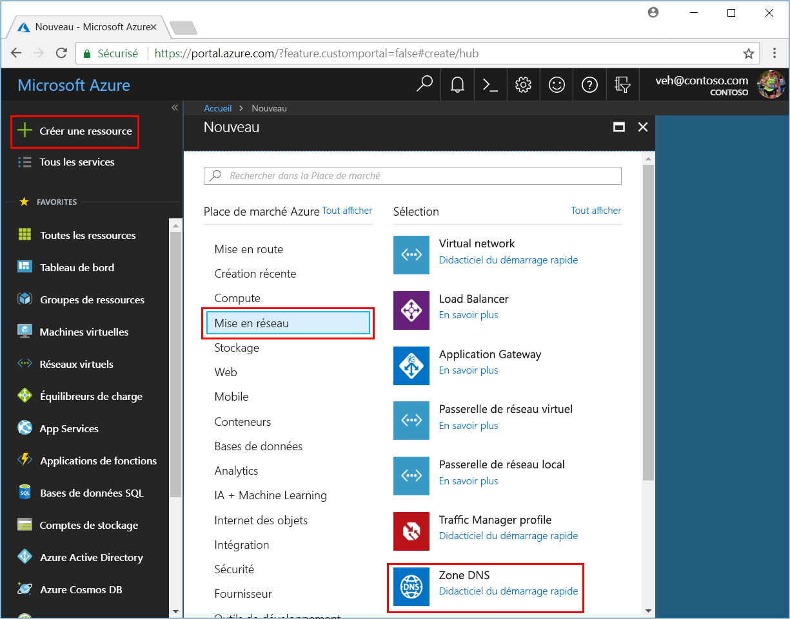
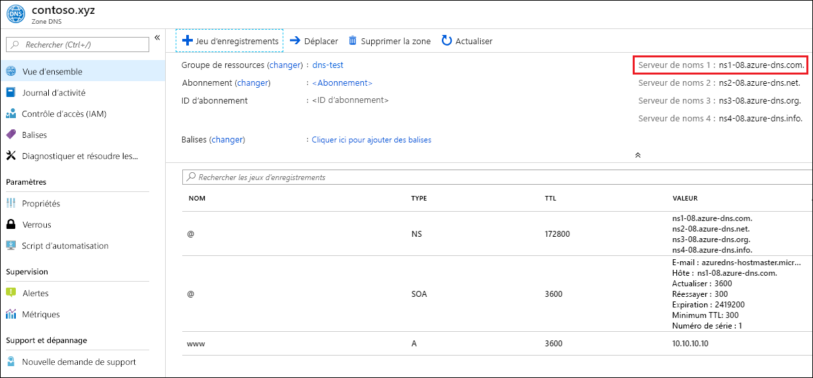

# <a name="quickstart-create-an-azure-dns-zone-and-record-using-the-azure-portal"></a>Démarrage rapide : Créer une zone et un enregistrement Azure DNS à partir du portail Azure

Vous pouvez configurer Azure DNS pour résoudre les noms d’hôtes dans votre domaine public. Par exemple, si vous avez acheté le nom de domaine *contoso.xyz* auprès d’un bureau d’enregistrement de noms de domaine, vous pouvez configurer Azure DNS pour héberger le domaine *contoso.xyz* et résoudre *`www.contoso.xyz`* dans l’adresse IP de votre serveur web ou application web.

Dans ce guide de démarrage rapide, vous allez créer un domaine test, puis un enregistrement d’adresse pour résoudre *www* en l’adresse *IP 10.10.10.10*.

>[!IMPORTANT]
>Tous les noms et adresses IP cités dans ce guide de démarrage rapide sont des exemples qui ne représentent pas des scénarios réels.

<!---
You can also perform these steps using [Azure PowerShell](dns-getstarted-powershell.md) or the cross-platform [Azure CLI](dns-getstarted-cli.md).
--->

Si vous n’avez pas d’abonnement Azure, créez un [compte gratuit](https://azure.microsoft.com/free/?WT.mc_id=A261C142F) avant de commencer.

Pour toutes les étapes du portail, connectez-vous au [portail Azure](https://portal.azure.com).

## <a name="prerequisites"></a>Prérequis

- Compte Azure avec un abonnement actif. [Créez un compte gratuitement](https://azure.microsoft.com/free/?WT.mc_id=A261C142F).

## <a name="sign-in-to-the-azure-portal"></a>Connectez-vous au portail Azure.

Connectez-vous au [portail Azure](https://portal.azure.com) avec votre compte Azure.

## <a name="create-a-dns-zone"></a>Création d’une zone DNS

Une zone DNS contient les entrées DNS d’un domaine. Pour commencer à héberger votre domaine dans Azure DNS, vous devez créer une zone DNS pour ce nom de domaine. 

**Pour créer la zone DNS**

1. En haut à gauche, sélectionnez **Créer une ressource**, **Mise en réseau**, puis **Zone DNS**.

1. Dans la page **Créer une zone DNS**, tapez ou sélectionnez les valeurs suivantes :

   - **Name** : Pour l’exemple de ce guide de démarrage rapide, tapez *contoso.xyz*. Vous pouvez affecter comme nom de zone DNS toute valeur qui n’est pas encore configurée sur les serveurs Azure DNS. Une valeur réelle est un domaine que vous avez acheté auprès d’un bureau d’enregistrement de nom de domaine.
   - **Groupe de ressources** : Sélectionnez **Créer**, entrez *MyResourceGroup*, puis sélectionnez **OK**. Le nom du groupe de ressources doit être unique au sein de l’abonnement Azure. 

1. Sélectionnez **Create** (Créer).

   

La création de la zone peut prendre plusieurs minutes.

## <a name="create-a-dns-record"></a>Créer un enregistrement DNS

Vous créez des entrées ou enregistrements DNS pour votre domaine à l’intérieur de la zone DNS. Créer un nouvel enregistrement d’adresse ou enregistrement « A » pour résoudre un nom d’hôte en adresse IPv4.

**Pour créer un enregistrement « A »**

1. Sur le portail Azure, sous **Toutes les ressources**, ouvrez la zone DNS **contoso.xyz** dans le groupe de ressources **MyResourceGroup**. Vous pouvez entrer *contoso.xyz* dans la zone **Filtrer par nom** pour la trouver plus facilement.

1. En haut de la page **Zone DNS**, sélectionnez **+ Jeu d’enregistrements**.

1. Dans la page **Ajouter un jeu d’enregistrements**, tapez ou sélectionnez les valeurs suivantes :

   - **Name** : Tapez *www*. Le nom d’enregistrement est le nom d’hôte que vous souhaitez résoudre en l’adresse IP spécifiée.
   - **Type** : Sélectionnez **A**. Les enregistrements « A » sont les plus courants, mais il existe d’autres types d’enregistrements pour les serveurs de messagerie (« MX »), les adresses IPv6 (« AAAA »), et ainsi de suite. 
   - **DURÉE DE VIE** : Tapez *1*. La *durée de vie* (TTL) de la requête DNS spécifie la durée pendant laquelle les clients et serveurs DNS peuvent mettre en cache une réponse.
   - **Unité de durée de vie** : Sélectionnez **Heures**. Il s’agit de l’unité de temps pour la valeur **TTL**. 
   - **Adresse IP** : Pour l’exemple de ce guide de démarrage rapide, tapez *10.10.10.10*. Cette valeur est l’adresse IP en laquelle est résolu le nom d’enregistrement. Dans votre scénario réel, vous devez entrer l’adresse IP publique de votre serveur web.

Ce démarrage rapide étant uniquement prévu pour des tests rapides, il n’est pas nécessaire de configurer les serveurs de noms Azure DNS auprès d’un bureau d’enregistrement de noms de domaine. Avec un véritable domaine de production, vous devrez faire en sorte que tout internaute puisse résoudre le nom d’hôte de façon à pouvoir se connecter à votre serveur ou application web. Vous consulterez votre bureau d’enregistrement de noms de domaine afin de remplacer les enregistrements de serveur par les serveurs de noms Azure DNS. Pour plus d’informations, consultez [Didacticiel : Héberger votre domaine dans Azure DNS](dns-delegate-domain-azure-dns.md#delegate-the-domain).

## <a name="test-the-name-resolution"></a>Tester la résolution de nom

Maintenant que vous disposez d’une zone DNS test avec un enregistrement « A » test, vous pouvez tester la résolution de noms avec un outil appelé *nslookup*. 

**Pour tester la résolution de noms DNS**

1. Sur le portail Azure, sous **Toutes les ressources**, ouvrez la zone DNS **contoso.xyz** dans le groupe de ressources **MyResourceGroup**. Vous pouvez entrer *contoso.xyz* dans la zone **Filtrer par nom** pour la trouver plus facilement.

1. Copiez l’un des noms de serveurs de noms à partir de la liste de serveurs de noms dans la page **Vue d’ensemble**. 

   

1. Ouvrez une invite de commandes et exécutez la commande suivante :

   ```
   nslookup www.contoso.xyz <name server name>
   ```

   Par exemple :

   ```
   nslookup www.contoso.xyz ns1-08.azure-dns.com.
   ```

   Un écran similaire à celui-ci doit s’afficher :

   

Le nom d’hôte **www\.contoso.xyz** se résout en **10.10.10.10**, tel que vous l’avez configuré. Ce résultat confirme que la résolution de noms fonctionne correctement. 

## <a name="clean-up-resources"></a>Nettoyer les ressources

Dès lors que les ressources que vous avez créées dans ce démarrage rapide ne vous sont plus utiles, supprimez-les en supprimant le groupe de ressources **MyResourceGroup** . Ouvrez le groupe de ressources **MyResourceGroup**, puis sélectionnez **Supprimer le groupe de ressources**.

## <a name="next-steps"></a>Étapes suivantes

> [!div class="nextstepaction"]
> [Créer des enregistrements DNS pour une application web dans un domaine personnalisé](./dns-web-sites-custom-domain.md)
