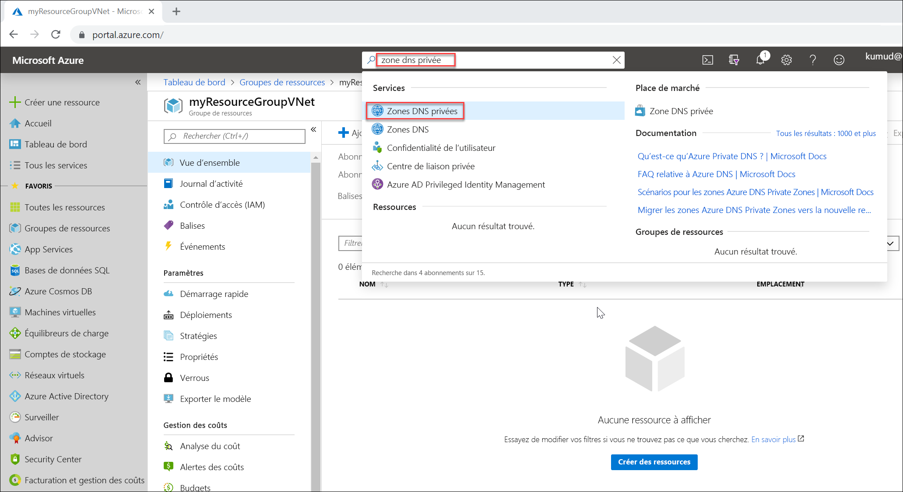

# <a name="quickstart-create-an-azure-private-dns-zone-using-the-azure-portal"></a>Démarrage rapide : Créer une zone Azure DNS privée avec le portail Azure

Ce guide de démarrage rapide vous guide tout au long des étapes de création de votre première zone DNS privée et de votre premier enregistrement DNS privé à l’aide du portail Azure.

Une zone DNS permet d’héberger les enregistrements DNS d’un domaine particulier. Pour commencer à héberger votre domaine dans le DNS Azure, vous devez créer une zone DNS pour ce nom de domaine. Chaque enregistrement DNS pour votre domaine est ensuite créé à l’intérieur de cette zone DNS. Pour publier une zone DNS privée sur votre réseau virtuel, vous spécifiez la liste des réseaux virtuels qui sont autorisés à résoudre les enregistrements dans la zone.  On les appelle réseaux virtuels *liés*. Quand l’inscription automatique est activée, Azure DNS met également à jour les enregistrements de zone chaque fois qu’une machine virtuelle est créée, change d’adresse IP ou est supprimée.

Dans ce guide de démarrage rapide, vous apprenez à :

> [!div class="checklist"]
> * Créer une zone DNS privée
> * Créez un réseau virtuel
> * Lier le réseau virtuel
> * Créer des machines virtuelles de test
> * Créer un enregistrement DNS supplémentaire
> * Tester la zone privée

Si vous n’avez pas d’abonnement Azure, créez un [compte gratuit](https://azure.microsoft.com/free/?WT.mc_id=A261C142F) avant de commencer.

Si vous préférez, vous pouvez suivre ce guide de démarrage rapide en utilisant [Azure PowerShell](private-dns-getstarted-powershell.md) ou [Azure CLI](private-dns-getstarted-cli.md).

## <a name="create-a-private-dns-zone"></a>Créer une zone DNS privée

L’exemple ci-dessous crée une zone DNS nommée **privat.contoso.com** dans un groupe de ressources nommé **MyAzureResourceGroup**.

Une zone DNS contient les entrées DNS d’un domaine. Pour commencer à héberger votre domaine dans Azure DNS, vous devez créer une zone DNS pour ce nom de domaine.



1. Dans la barre de recherche du portail, tapez **zones dns privées**, puis appuyez sur **Entrée**.
1. Sélectionnez **Zone DNS privée**.
2. Sélectionnez **Créer une zone DNS privée**.

1. Dans la page **Créer une zone DNS privée**, tapez ou sélectionnez les valeurs suivantes :

   - **Groupe de ressources** : Sélectionnez **Créer**, entrez *MyAzureResourceGroup*, puis sélectionnez **OK**. Le nom du groupe de ressources doit être unique au sein de l’abonnement Azure.
   -  **Name** : Tapez *private.contoso.com* pour cet exemple.
1. Pour **Emplacement du groupe de ressources**, sélectionnez un **USA Centre-Ouest**.

1. Sélectionnez **Vérifier + créer**.

1. Sélectionnez **Create** (Créer).

La création de la zone peut prendre plusieurs minutes.

## <a name="virtual-network-and-parameters"></a>Réseau virtuel et paramètres

Dans les étapes de cette section, vous devrez remplacer les paramètres du tableau ci-dessous par la valeur indiquée correspondante :

| Paramètre                   | Valeur                |
|-----------------------------|----------------------|
| **\<resource-group-name>**  | MyAzureResourceGroup (sélectionnez un groupe de ressources existant) |
| **\<virtual-network-name>** | MyAzureVNet          |
| **\<region-name>**          | Centre-USA Ouest      |
| **\<IPv4-address-space>**   | 10.2.0.0\16          |
| **\<subnet-name>**          | MyAzureSubnet        |
| **\<subnet-address-range>** | 10.2.0.0\24          |


[!INCLUDE [virtual-networks-create-new](../../includes/virtual-networks-create-new.md)]

## <a name="link-the-virtual-network"></a>Lier le réseau virtuel

Pour lier la zone DNS privée à un réseau virtuel, vous créez une liaison de réseau virtuel.


1. Ouvrez le groupe de ressources **MyAzureResourceGroup** et sélectionnez la zone privée **private.contoso.com**.
2. Dans le volet gauche, sélectionnez **Liens de réseau virtuel**.
3. Sélectionnez **Ajouter**.
4. Pour **nom du lien**, entrez **myLink**.
5. Pour **Réseau virtuel**, sélectionnez **myAzureVNet**.
6. Activez la case à cocher **Activer l’inscription automatique**.
7. Sélectionnez **OK**.

## <a name="create-the-test-virtual-machines"></a>Créer les machines virtuelles de test

Maintenant, créez deux machines virtuelles afin de pouvoir tester votre zone DNS privée :

1. Dans l’angle supérieur gauche de la page du portail, sélectionnez **Créer une ressource**, puis **Windows Server 2016 Datacenter**.
1. Sélectionnez **MyAzureResourceGroup** comme groupe de ressources.
1. Entrez **myVM01** en tant que nom de machine virtuelle.
1. Pour **Région**, sélectionnez **USA Centre-Ouest**.
1. Entrez un nom d’utilisateur administrateur.
2. Entrez un mot de passe et confirmez-le.
5. Pour **Ports d’entrée publics**, sélectionnez **Autoriser les ports sélectionnés**, puis, pour **Sélectionner des ports d’entrée**, choisissez **RDP (3389)**.
10. Acceptez les autres valeurs par défaut pour la page, puis cliquez sur **Suivant : Disques >** .
11. Accepter les valeurs par défaut sur la page **Disques**, puis cliquez sur **Suivant : Mise en réseau >** .
1. Assurez-vous que l’option **myAzureVNet** est sélectionnée pour le réseau virtuel.
1. Acceptez les autres valeurs par défaut pour la page, puis cliquez sur **Suivant : Gestion >** .
2. Pour **Diagnostics de démarrage**, sélectionnez **Désactivé**, acceptez les autres options par défaut, puis sélectionnez **Réviser + Créer**.
1. Révisez les paramètres, puis cliquez sur **Créer**.

Répétez cette procédure pour créer une autre machine virtuelle nommée **myVM02**.

La création des deux machines virtuelles prend quelques minutes.

## <a name="create-an-additional-dns-record"></a>Créer un enregistrement DNS supplémentaire

 L’exemple suivant crée un enregistrement avec le nom relatif **db** dans la zone DNS **private.contoso.com**, dans le groupe de ressources **MyAzureResourceGroup**. Le nom complet du jeu d’enregistrements est **db.private.contoso.com**. Le type d’enregistrement est « A », avec l’adresse IP **myVM01**.

1. Ouvrez le groupe de ressources **MyAzureResourceGroup** et sélectionnez la zone privée **private.contoso.com**.
2. Sélectionnez **+ Jeu d’enregistrements**.
3. Pour **Nom**, entrez **db**.
4. Pour **Adresse IP**, tapez l’adresse IP que vous voyez pour **myVM01**. Celle-ci doit être inscrite automatiquement au démarrage de la machine virtuelle.
5. Sélectionnez **OK**.

## <a name="test-the-private-zone"></a>Tester la zone privée

Maintenant vous pouvez désormais tester la résolution de noms pour votre zone privée **private.contoso.com**.

### <a name="configure-vms-to-allow-inbound-icmp"></a>Configurer des machines virtuelles pour autoriser l’ICMP entrant

Vous pouvez utiliser la commande test ping pour tester la résolution de nom. Par conséquent, configurez le pare-feu sur les deux machines virtuelles pour autoriser les paquets ICMP entrants.

1. Connectez-vous à myVM01 et ouvrez une fenêtre Windows PowerShell avec les privilèges d’administrateur.
2. Exécutez la commande suivante :

   ```powershell
   New-NetFirewallRule –DisplayName "Allow ICMPv4-In" –Protocol ICMPv4
   ```

Répétez l’opération pour myVM02.

### <a name="ping-the-vms-by-name"></a>Faites un test ping sur les machines virtuelles par leur nom

1. À partir de l’invite de commandes Windows PowerShell myVM02, faites un test ping de myVM01 en utilisant le nom d’hôte enregistré automatiquement :
   ```
   ping myVM01.private.contoso.com
   ```
   La sortie doit ressembler à ceci :
   ```
   PS C:\> ping myvm01.private.contoso.com

   Pinging myvm01.private.contoso.com [10.2.0.4] with 32 bytes of data:
   Reply from 10.2.0.4: bytes=32 time<1ms TTL=128
   Reply from 10.2.0.4: bytes=32 time=1ms TTL=128
   Reply from 10.2.0.4: bytes=32 time<1ms TTL=128
   Reply from 10.2.0.4: bytes=32 time<1ms TTL=128

   Ping statistics for 10.2.0.4:
       Packets: Sent = 4, Received = 4, Lost = 0 (0% loss),
   Approximate round trip times in milli-seconds:
       Minimum = 0ms, Maximum = 1ms, Average = 0ms
   PS C:\>
   ```
2. Maintenant faites un test ping sur le nom **db** que vous avez créé précédemment :
   ```
   ping db.private.contoso.com
   ```
   La sortie doit ressembler à ceci :
   ```
   PS C:\> ping db.private.contoso.com

   Pinging db.private.contoso.com [10.2.0.4] with 32 bytes of data:
   Reply from 10.2.0.4: bytes=32 time<1ms TTL=128
   Reply from 10.2.0.4: bytes=32 time<1ms TTL=128
   Reply from 10.2.0.4: bytes=32 time<1ms TTL=128
   Reply from 10.2.0.4: bytes=32 time<1ms TTL=128

   Ping statistics for 10.2.0.4:
       Packets: Sent = 4, Received = 4, Lost = 0 (0% loss),
   Approximate round trip times in milli-seconds:
       Minimum = 0ms, Maximum = 0ms, Average = 0ms
   PS C:\>
   ```

## <a name="delete-all-resources"></a>Supprimer toutes les ressources

Quand vous n’en avez plus besoin, supprimez le groupe de ressources **MyAzureResourceGroup** afin de supprimer les ressources créées dans cette guide de démarrage rapide.


## <a name="next-steps"></a>Étapes suivantes

> [!div class="nextstepaction"]
> [Scénarios Azure DNS Private Zones](private-dns-scenarios.md)

