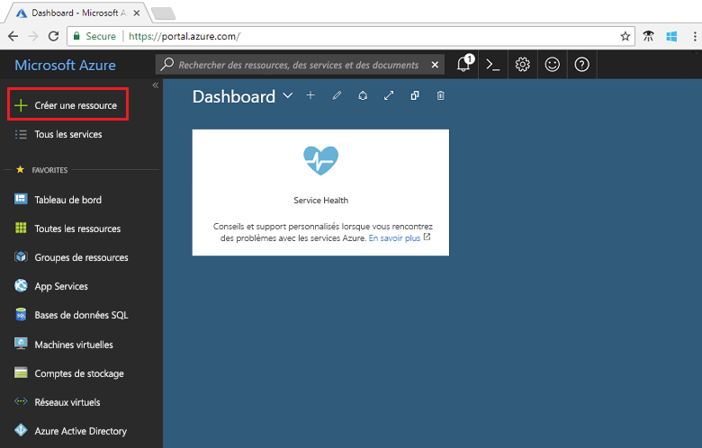
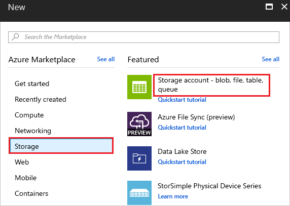
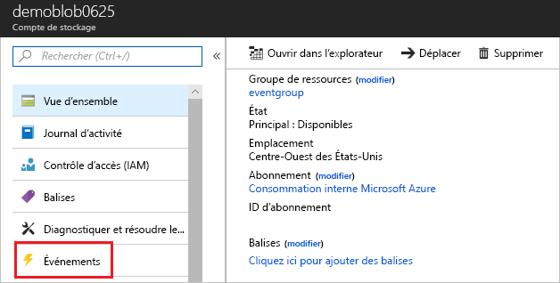
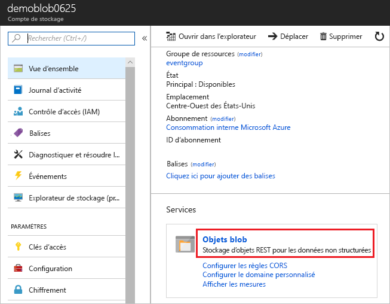

# <a name="quickstart-route-blob-storage-events-to-web-endpoint-with-the-azure-portal"></a>Démarrage rapide : Acheminer des événements de stockage Blob vers un point de terminaison web avec le portail Azure

Azure Event Grid est un service de gestion d’événements pour le cloud. Dans cet article, vous utilisez le portail Azure pour créer un compte de stockage d’objets blob, vous abonner aux événements de ce stockage d’objets blob et déclencher un événement pour afficher le résultat. En règle générale, vous envoyez des événements à un point de terminaison qui traite les données d’événement et entreprend des actions. Toutefois, pour simplifier cet article, vous envoyez les événements à une application web qui collecte et affiche les messages.

[!INCLUDE [quickstarts-free-trial-note.md](../../includes/quickstarts-free-trial-note.md)]

Une fois que vous avez fini, vous voyez que les données d’événement ont été envoyées à l’application web.


## <a name="create-a-storage-account"></a>Créez un compte de stockage.

1. Connectez-vous au [portail Azure](https://portal.azure.com/).

1. Pour créer un stockage d’objets blob, sélectionnez **Créer une ressource**. 

   

1. Sélectionnez **Stockage** pour filtrer les options disponibles, puis **Compte de stockage - blob, fichier, table, file d’attente**.

   

1. Pour s’abonner à des événements, créez un compte de stockage v2 à usage général ou un compte de stockage d’objets blob. Pour plus d’informations, consultez la rubrique [Création d’un compte de stockage](../storage/common/storage-account-create.md) .

   

## <a name="create-a-message-endpoint"></a>Créer un point de terminaison de message

Avant de nous abonner aux événements du stockage d’objets blob, nous allons créer le point de terminaison pour le message de l’événement. En règle générale, le point de terminaison entreprend des actions en fonction des données d’événement. Pour simplifier ce guide de démarrage rapide, déployez une [application web prédéfinie](https://github.com/Azure-Samples/azure-event-grid-viewer) qui affiche les messages d’événement. La solution déployée comprend un plan App Service, une offre App Service Web Apps et du code source en provenance de GitHub.

1. Sélectionnez **Déployer sur Azure** pour déployer la solution sur votre abonnement. Dans le portail Azure, indiquez des valeurs pour les paramètres.

   <a href="https://portal.azure.com/#create/Microsoft.Template/uri/https%3A%2F%2Fraw.githubusercontent.com%2FAzure-Samples%2Fazure-event-grid-viewer%2Fmaster%2Fazuredeploy.json" target="_blank"></a>

1. Le déploiement peut prendre quelques minutes. Une fois le déploiement réussi, affichez votre application web pour vérifier qu’elle s’exécute. Dans un navigateur web, accédez à : `https://<your-site-name>.azurewebsites.net`

1. Vous voyez le site, mais aucun événement n’est encore posté sur celui-ci.

   

[!INCLUDE [event-grid-register-provider-portal.md](../../includes/event-grid-register-provider-portal.md)]

## <a name="subscribe-to-the-blob-storage"></a>S’abonner à un stockage d’objets blob

Vous vous abonnez à une rubrique pour communiquer à Event Grid les événements qui vous intéressent, et où les envoyer.

1. Dans le portail, sélectionnez votre stockage d’objets blob, puis **Événements**.

   

1. Pour envoyer des événements à votre application de visionneuse, utilisez un webhook pour le point de terminaison. Sélectionnez **Autres options**, puis **Webhook**.

   

1. L’abonnement aux événements est prérempli avec les valeurs de votre stockage d’objets blob. Pour le point de terminaison du webhook, indiquez l’URL de votre application web et ajoutez `api/updates` à l’URL de la page d’accueil. Donnez un nom à votre abonnement. Quand vous avez terminé, sélectionnez **Créer**.

   

1. Affichez à nouveau votre application web, et notez qu’un événement de validation d’abonnement lui a été envoyé. Sélectionnez l’icône en forme d’œil pour développer les données d’événements. Event Grid envoie l’événement de validation pour que le point de terminaison puisse vérifier qu’il souhaite recevoir des données d’événement. L’application web inclut du code pour valider l’abonnement.

   

Nous allons maintenant déclencher un événement pour voir comment Event Grid distribue le message à votre point de terminaison.

## <a name="send-an-event-to-your-endpoint"></a>Envoyer un événement à votre point de terminaison

Pour déclencher un événement pour le stockage d’objets blob, chargez un fichier. Celui-ci n’a pas besoin d’un contenu spécifique. L’article part du principe que vous disposez d’un fichier nommé testfile.txt, mais vous pouvez utiliser n’importe quel fichier.

1. Pour le stockage d’objets blob, sélectionnez **Objets blob**.

   

1. Sélectionnez **+ Conteneur**. Donnez un nom à votre conteneur et utilisez n’importe quel niveau d’accès.

   

1. Sélectionnez votre nouveau conteneur.

   

1. Pour charger un fichier, sélectionnez **Charger**.

   

1. Accédez à votre fichier de test et chargez-le.

1. Vous avez déclenché l’événement, et Event Grid a envoyé le message au point de terminaison configuré lors de l’abonnement. Le message au format JSON contient un tableau répertoriant un ou plusieurs événements. Dans l’exemple suivant, le message JSON contient un tableau avec un événement. Quand vous examinez votre application web, vous pouvez remarquer qu’un événement créé par un objet blob a été reçu. 

   ```json
   [{
    "topic": "/subscriptions/{subscription-id}/resourceGroups/eventgroup/providers/Microsoft.Storage/storageAccounts/demoblob0625",
    "subject": "/blobServices/default/containers/eventcontainer/blobs/testfile.txt",
    "eventType": "Microsoft.Storage.BlobCreated",
    "eventTime": "2018-06-25T22:50:41.1823131Z",
    "id": "89a2f9da-c01e-00bb-13d6-0c599506e4e3",
    "data": {
      "api": "PutBlockList",
      "clientRequestId": "41341a9b-e977-4a91-9000-c64125039047",
      "requestId": "89a2f9da-c01e-00bb-13d6-0c5995000000",
      "eTag": "0x8D5DAEE13C8F9ED",
      "contentType": "text/plain",
      "contentLength": 4,
      "blobType": "BlockBlob",
      "url": "https://demoblob0625.blob.core.windows.net/eventcontainer/testfile.txt",
      "sequencer": "00000000000000000000000000001C24000000000004712b",
      "storageDiagnostics": {
        "batchId": "ef633252-32fd-464b-8f5a-0d10d68885e6"
      }
    },
    "dataVersion": "",
    "metadataVersion": "1"
   }]
   ```

## <a name="clean-up-resources"></a>Nettoyer les ressources

Si vous envisagez de continuer à utiliser cet événement, ne supprimez pas les ressources créées dans cet article. Dans le cas contraire, supprimez les ressources créées avec cet article.

Sélectionnez le groupe de ressources, puis **Supprimer le groupe de ressources**.

## <a name="next-steps"></a>Étapes suivantes

Maintenant que vous savez créer des rubriques et des abonnements d’événements personnalisés, vous pouvez en apprendre davantage sur Event Grid et ce qu’il peut vous offrir :

- [À propos d’Event Grid](overview.md)
- [Acheminer des événements de stockage Blob Azure vers un point de terminaison Web personnalisé ](../storage/blobs/storage-blob-event-quickstart.md?toc=%2fazure%2fevent-grid%2ftoc.json)
- [Surveiller les modifications d’une machine virtuelle avec Azure Event Grid et Azure Logic Apps](monitor-virtual-machine-changes-event-grid-logic-app.md)
- [Diffuser en continu des Big Data dans un entrepôt de données](event-grid-event-hubs-integration.md)
