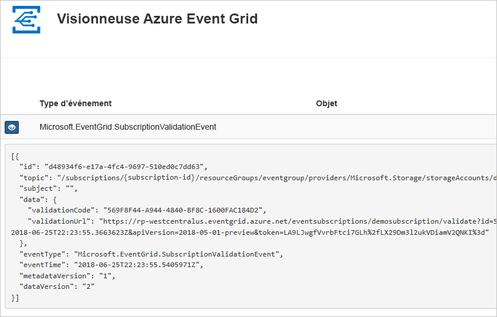
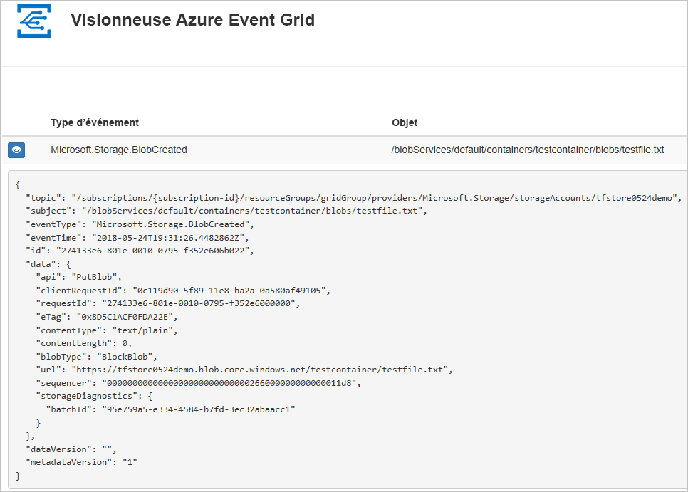

# Router des événements de Stockage Blob vers un point de terminaison web en utilisant un modèle Azure Resource Manager

Azure Event Grid est un service de gestion d’événements pour le cloud. Dans cet article, vous utilisez un **modèle Azure Resource Manager** pour créer un compte de stockage Blob, pour vous abonner aux événements de ce stockage blob et pour déclencher un événement visant à afficher le résultat. En règle générale, vous envoyez des événements à un point de terminaison qui traite les données d’événement et entreprend des actions. Toutefois, pour simplifier cet article, vous envoyez les événements à une application web qui collecte et affiche les messages.

[!INCLUDE [About Azure Resource Manager](../../includes/resource-manager-quickstart-introduction.md)]

Si vous n’avez pas d’abonnement Azure, créez un [compte gratuit](https://azure.microsoft.com/free/) avant de commencer.

## Prérequis

### Créer un point de terminaison de message

Avant de nous abonner aux événements du stockage d’objets blob, nous allons créer le point de terminaison pour le message de l’événement. En règle générale, le point de terminaison entreprend des actions en fonction des données d’événement. Pour simplifier ce guide de démarrage rapide, déployez une [application web prédéfinie](https://github.com/Azure-Samples/azure-event-grid-viewer) qui affiche les messages d’événement. La solution déployée comprend un plan App Service, une offre App Service Web Apps et du code source en provenance de GitHub.

1. Sélectionnez **Déployer sur Azure** pour déployer la solution sur votre abonnement. Dans le portail Azure, indiquez des valeurs pour les paramètres.

    [Déployer dans Azure](https://portal.azure.com/#create/Microsoft.Template/uri/https%3A%2F%2Fraw.githubusercontent.com%2FAzure-Samples%2Fazure-event-grid-viewer%2Fmaster%2Fazuredeploy.json)
1. Le déploiement peut prendre quelques minutes. Une fois le déploiement réussi, affichez votre application web pour vérifier qu’elle s’exécute. Dans un navigateur web, accédez à : `https://<your-site-name>.azurewebsites.net`

1. Vous voyez le site, mais aucun événement n’est encore posté sur celui-ci.

   

## Créer un compte de stockage avec un abonnement Event Grid

### Vérifier le modèle

Le modèle utilisé dans ce guide de démarrage rapide est tiré des [modèles de démarrage rapide Azure](https://github.com/Azure/azure-quickstart-templates/tree/master/101-event-grid-subscription-and-storage).

[!code-json[<Azure Resource Manager template create Blob storage Event Grid subscription>](~/quickstart-templates/101-event-grid-subscription-and-storage/azuredeploy.json)]

Deux ressources Azure sont définies dans le modèle :

* [**Microsoft.Storage/storageAccounts**](/azure/templates/microsoft.storage/storageaccounts) : crée un compte Stockage Azure.
* [ **"Microsoft. Storage/storageAccounts/Providers/eventSubscriptions**](/azure/templates/microsoft.eventgrid/eventsubscriptions) : crée un abonnement Azure Event Grid pour le compte de stockage.

### Déployer le modèle

1. Sélectionnez le lien suivant pour vous connecter à Azure et ouvrir un modèle. Le modèle crée un coffre de clés et un secret.

    

2. Spécifiez le **point de terminaison** : indiquez l’URL de votre application web et ajoutez `api/updates` à l’URL de la page d’accueil.
3. Sélectionnez **Acheter** pour déployer le modèle.

  Le portail Azure est utilisé ici pour déployer le modèle. Vous pouvez également utiliser Azure PowerShell, Azure CLI ou l’API REST. Pour découvrir d’autres méthodes de déploiement, consultez [Déployer des modèles](../azure-resource-manager/templates/deploy-powershell.md).

> [!NOTE]
> Vous trouverez d’autres exemples de modèles Azure Event Grid [ici](https://azure.microsoft.com/resources/templates/?resourceType=Microsoft.Eventgrid).

## Valider le déploiement

Affichez à nouveau votre application web, et notez qu’un événement de validation d’abonnement lui a été envoyé. Sélectionnez l’icône en forme d’œil pour développer les données d’événements. Event Grid envoie l’événement de validation pour que le point de terminaison puisse vérifier qu’il souhaite recevoir des données d’événement. L’application web inclut du code pour valider l’abonnement.

Nous allons maintenant déclencher un événement pour voir comment Event Grid distribue le message à votre point de terminaison.

Pour déclencher un événement pour le stockage d’objets blob, chargez un fichier. Celui-ci n’a pas besoin d’un contenu spécifique. L’article part du principe que vous disposez d’un fichier nommé testfile.txt, mais vous pouvez utiliser n’importe quel fichier.

Quand vous chargez le fichier dans le stockage Blob Azure, Event Grid envoie un message au point de terminaison que vous avez configuré lors de la souscription de l’abonnement. Le message au format JSON contient un tableau répertoriant un ou plusieurs événements. Dans l’exemple suivant, le message JSON contient un tableau avec un événement. Quand vous examinez votre application web, vous pouvez remarquer qu’un événement créé par un objet blob a été reçu.

## Nettoyer les ressources

Quand il n’est plus nécessaire, [supprimez le groupe de ressources](../azure-resource-manager/management/delete-resource-group.md?tabs=azure-portal#delete-resource-group
).

## Étapes suivantes

Pour plus d’informations sur les modèles Azure Resource Manager, consultez les articles suivants :

* [Documentation Azure Resource Manager](/azure/azure-resource-manager)
* [Définir des ressources dans les modèles Azure Resource Manager](/azure/templates/)
* [Modèles de démarrage rapide Azure](https://azure.microsoft.com/resources/templates/)
* [Modèles Azure Event Grid](https://azure.microsoft.com/resources/templates/?resourceType=Microsoft.Eventgrid)
