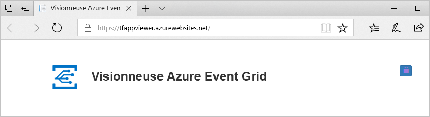

# <a name="build-your-own-disaster-recovery-for-custom-topics-in-event-grid"></a>Créer votre propre système de reprise d’activité pour les rubriques personnalisées dans Event Grid
La récupération d’urgence se concentre sur la récupération des fonctionnalités des applications en cas de perte grave. Ce tutoriel vous aide à configurer votre architecture de gestion des événements en vue d’une reprise d’activité, si le service Event Grid devient non sain dans une région.

Dans ce tutoriel, vous allez apprendre à créer une architecture de basculement actif/passif pour les rubriques personnalisées dans Event Grid. Vous allez réaliser un basculement en mettant en miroir vos rubriques et vos abonnements de deux régions, puis en effectuant le basculement lorsqu’une rubrique devient non saine. Dans ce tutoriel, l’architecture bascule tout le nouveau trafic. Avec cette configuration, il est important de savoir que les événements déjà en cours ne peuvent pas être récupérés tant que la région compromise n’est pas redevenue saine.

> [!NOTE]
> Désormais, Event Grid prend en charge la géoreprise d’activité après sinistre (GeoDR) automatique côté serveur. Vous pouvez toujours implémenter une logique de récupération d’urgence côté client si vous souhaitez plus de contrôle sur le processus de basculement. Pour plus d’informations sur le processus GeoDR automatique, consultez [Géoreprise d’activité après sinistre côté serveur dans Azure Event Grid](geo-disaster-recovery.md).

## <a name="create-a-message-endpoint"></a>Créer un point de terminaison de message

Pour tester votre configuration de basculement, vous devez recevoir vos événements sur un point de terminaison. Le point de terminaison ne fait pas partie de votre infrastructure de basculement, mais il servira de gestionnaire d’événements pour faciliter les tests.

Pour simplifier les tests, déployez une [application web prédéfinie](https://github.com/Azure-Samples/azure-event-grid-viewer) qui affiche les messages d’événement. La solution déployée comprend un plan App Service, une offre App Service Web Apps et du code source en provenance de GitHub.

1. Sélectionnez **Déployer sur Azure** pour déployer la solution sur votre abonnement. Dans le portail Azure, indiquez des valeurs pour les paramètres.

   <a href="https://portal.azure.com/#create/Microsoft.Template/uri/https%3A%2F%2Fraw.githubusercontent.com%2FAzure-Samples%2Fazure-event-grid-viewer%2Fmaster%2Fazuredeploy.json" target="_blank"></a>

1. Le déploiement peut prendre quelques minutes. Une fois le déploiement réussi, affichez votre application web pour vérifier qu’elle s’exécute. Dans un navigateur web, accédez à : `https://<your-site-name>.azurewebsites.net`
Prenez note de cette URL, car vous en aurez besoin ultérieurement.

1. Vous voyez le site, mais aucun événement n’est encore posté sur celui-ci.

   

[!INCLUDE [event-grid-register-provider-portal.md](../../includes/event-grid-register-provider-portal.md)]


## <a name="create-your-primary-and-secondary-topics"></a>Créer vos rubriques principales et secondaires

Tout d’abord, créez deux rubriques Event Grid. Il s’agira de la rubrique principale et de la rubrique secondaire. Par défaut, vos événements sont acheminés vers votre rubrique principale. En cas d’interruption du service dans la région primaire, la secondaire prend le relais.

1. Connectez-vous au [portail Azure](https://portal.azure.com). 

1. En haut à gauche du menu Azure principal, choisissez **Tous les services**, recherchez **Event Grid**, puis sélectionnez **Rubriques Event Grid**.

   

    Sélectionnez l’étoile à côté de Rubriques Event Grid en vue de l’ajouter au menu des ressources pour un accès facile.

1. Dans le menu Rubriques Event Grid, sélectionnez **+ Ajouter** pour créer votre rubrique principale.

   * Donnez un nom logique à la rubrique, puis ajoutez «-principale » comme suffixe pour faciliter son suivi.
   * La région de cette rubrique sera votre région primaire.

     

1. Une fois la rubrique créée, accédez à celle-ci, puis copiez le **Point de terminaison de la rubrique**. Vous aurez besoin de l’URI plus tard.

    

1. Récupérez la clé d’accès de la rubrique, dont vous aurez également besoin plus tard. Dans le menu des ressources, cliquez sur **Clés d’accès**, puis copiez la clé 1.

    

1. Dans le panneau Rubrique, cliquez sur **+Abonnement aux événements** pour créer un abonnement à connecter au site web récepteur d’événements que vous avez créé dans les prérequis de ce tutoriel.

   * Donnez un nom logique à l’abonnement d’événements, puis ajoutez « -principal » comme suffixe pour faciliter son suivi.
   * Sélectionnez un webhook de type de point de terminaison.
   * Définissez le point de terminaison sur l’URL d’événement de votre récepteur d’événements, qui doit ressembler à ceci : `https://<your-event-reciever>.azurewebsites.net/api/updates`

     

1. Répétez la même procédure pour créer votre rubrique et votre abonnement secondaire. Cette fois-ci, remplacez le suffixe « -principal(e) » par le suffixe « -secondaire » pour faciliter le suivi. Enfin, placez-le dans une autre région Azure. Même si vous pouvez le placer n’importe où, il est recommandé d’utiliser les [régions associées Azure](../best-practices-availability-paired-regions.md). Le fait de placer la rubrique et l’abonnement secondaires dans une autre région garantit la transmission des nouveaux événements, même lorsque la région primaire est indisponible.

Vous devez disposer à présent des éléments suivants :

   * Un site web récepteur d’événements pour les tests
   * Une rubrique principale dans votre région primaire
   * Un abonnement d’événements principal qui connecte votre rubrique principale au site web récepteur d’événements
   * Une rubrique secondaire dans votre région secondaire
   * Un abonnement d’événements secondaire qui connecte votre rubrique principale au site web récepteur d’événements

## <a name="implement-client-side-failover&quot;></a>Implémenter un basculement côté client

Maintenant que vous avez défini une paire de rubriques et une paire d’abonnements redondantes au niveau régional, vous êtes prêt à implémenter le basculement côté client. Il existe plusieurs façons de procéder qui ont toutes un point commun : si l’une des rubriques n’est plus saine, le trafic est redirigé vers l’autre rubrique.

### <a name=&quot;basic-client-side-implementation&quot;></a>Implémentation de base côté client

L’exemple de code suivant est un serveur de publication .NET simple qui tente toujours de publier en premier dans votre rubrique principale. S’il n’y parvient pas, il basculera vers la rubrique secondaire. Dans les deux cas, il vérifie également l’API d’intégrité de l’autre rubrique en exécutant une opération GET sur `https://<topic-name>.<topic-region>.eventgrid.azure.net/api/health`. Une rubrique saine doit toujours envoyer la réponse **200 OK** quand une opération GET est exécutée sur le point de terminaison **/api/health**.

> [!NOTE]
> L’exemple de code suivant est uniquement fourni à des fins de démonstration et n’est pas destiné à une utilisation en production. 

```csharp
using System;
using System.Net.Http;
using System.Collections.Generic;
using Microsoft.Azure.EventGrid;
using Microsoft.Azure.EventGrid.Models;
using Newtonsoft.Json;

namespace EventGridFailoverPublisher
{
    // This captures the &quot;Data&quot; portion of an EventGridEvent on a custom topic
    class FailoverEventData
    {
        [JsonProperty(PropertyName = &quot;teststatus")]
        public string TestStatus { get; set; }
    }

    class Program
    {
        static void Main(string[] args)
        {
            // TODO: Enter the endpoint each topic. You can find this topic endpoint value
            // in the "Overview" section in the "Event Grid Topics" blade in Azure Portal..
            string primaryTopic = "https://<primary-topic-name>.<primary-topic-region>.eventgrid.azure.net/api/events";
            string secondaryTopic = "https://<secondary-topic-name>.<secondary-topic-region>.eventgrid.azure.net/api/events";

            // TODO: Enter topic key for each topic. You can find this in the "Access Keys" section in the
            // "Event Grid Topics" blade in Azure Portal.
            string primaryTopicKey = "<your-primary-topic-key>";
            string secondaryTopicKey = "<your-secondary-topic-key>";

            string primaryTopicHostname = new Uri( primaryTopic).Host;
            string secondaryTopicHostname = new Uri(secondaryTopic).Host;

            Uri primaryTopicHealthProbe = new Uri("https://" + primaryTopicHostname + "/api/health");
            Uri secondaryTopicHealthProbe = new Uri("https://" + secondaryTopicHostname + "/api/health");

            var httpClient = new HttpClient();

            try
            {
                TopicCredentials topicCredentials = new TopicCredentials(primaryTopicKey);
                EventGridClient client = new EventGridClient(topicCredentials);

                client.PublishEventsAsync(primaryTopicHostname, GetEventsList()).GetAwaiter().GetResult();
                Console.Write("Published events to primary Event Grid topic.");

                HttpResponseMessage health = httpClient.GetAsync(secondaryTopicHealthProbe).Result;
                Console.Write("\n\nSecondary Topic health " + health);
            }
            catch (Microsoft.Rest.Azure.CloudException e)
            {
                TopicCredentials topicCredentials = new TopicCredentials(secondaryTopicKey);
                EventGridClient client = new EventGridClient(topicCredentials);

                client.PublishEventsAsync(secondaryTopicHostname, GetEventsList()).GetAwaiter().GetResult();
                Console.Write("Published events to secondary Event Grid topic. Reason for primary topic failure:\n\n" + e);

                HttpResponseMessage health = httpClient.GetAsync(primaryTopicHealthProbe).Result;
                Console.Write("\n\nPrimary Topic health " + health);
            }

            Console.ReadLine();
        }

        static IList<EventGridEvent> GetEventsList()
        {
            List<EventGridEvent> eventsList = new List<EventGridEvent>();

            for (int i = 0; i < 5; i++)
            {
                eventsList.Add(new EventGridEvent()
                {
                    Id = Guid.NewGuid().ToString(),
                    EventType = "Contoso.Failover.Test",
                    Data = new FailoverEventData()
                    {
                        TestStatus = "success"
                    },
                    EventTime = DateTime.Now,
                    Subject = "test" + i,
                    DataVersion = "2.0"
                });
            }

            return eventsList;
        }
    }
}
```

### <a name="try-it-out"></a>Faites un essai

Maintenant que tous vos composants sont en place, vous pouvez tester votre implémentation de basculement. Exécutez l’exemple ci-dessus dans Visual Studio Code ou votre environnement préféré. Remplacez les quatre valeurs suivantes par les points de terminaison et les clés de vos rubriques :

   * primaryTopic : point de terminaison de votre rubrique principale
   * secondaryTopic : point de terminaison de votre rubrique secondaire
   * primaryTopicKey : clé de votre rubrique principale
   * secondaryTopicKey : clé de votre rubrique secondaire

Essayez d’exécuter l’éditeur d’événements. Vos événements de test doivent se trouver dans votre visionneuse Event Grid, comme ci-dessous.


Pour vérifier que votre basculement fonctionne, vous pouvez modifier quelques caractères de votre clé de rubrique principale pour la rendre non valide. Réessayez d’exécuter l’éditeur d’événements. Vous devez encore voir les nouveaux événements s’afficher dans la visionneuse Event Grid. Toutefois, lorsque vous regardez votre console, vous devez voir qu’ils sont maintenant publiés dans la rubrique secondaire.

### <a name="possible-extensions"></a>Extensions possibles

Il existe de nombreuses façons d’étendre cet exemple selon vos besoins. Pour les scénarios à volumes élevés, il est souhaitable de vérifier régulièrement l’API d’intégrité de la rubrique. De cette façon, si une rubrique devient indisponible, vous n’avez pas besoin de la vérifier à chaque publication. Une fois que vous savez qu’une rubrique n’est pas saine, vous pouvez choisir de publier par défaut dans la rubrique secondaire.

De même, vous pouvez implémenter la logique de restauration automatique en fonction de vos besoins. Si le fait de publier dans le centre de données le plus proche est indispensable pour réduire la latence, vous pouvez vérifier régulièrement l’API d’intégrité d’une rubrique ayant subi un basculement. Une fois qu’elle est saine, vous savez que vous pouvez effectuer sans risque une restauration automatique vers le centre de données le plus proche.

## <a name="next-steps"></a>Étapes suivantes

- En savoir plus sur la [réception des événements sur un point de terminaison HTTP](./receive-events.md)
- En savoir plus sur le [routage des événements vers des connexions hybrides](./custom-event-to-hybrid-connection.md)
- En savoir plus sur la [reprise d’activité à l’aide d’Azure DNS et de Traffic Manager](../networking/disaster-recovery-dns-traffic-manager.md)
