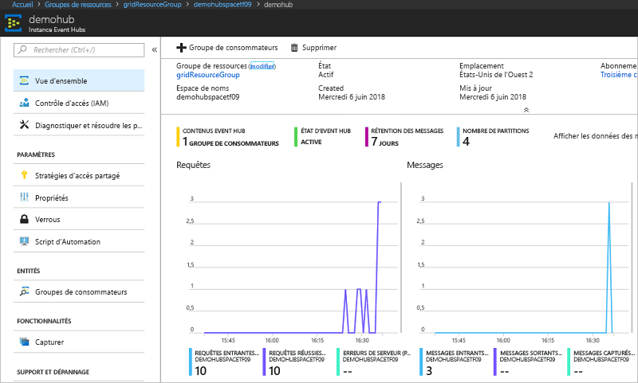

# <a name="quickstart-route-custom-events-to-azure-event-hubs-with-azure-cli-and-event-grid"></a>Démarrage rapide : Acheminer des événements personnalisés vers Azure Event Hubs avec Azure CLI et Event Grid

Azure Event Grid est un service de gestion d’événements pour le cloud. Azure Event Hubs est l’un des gestionnaires d’événements pris en charge. Dans cet article, vous utilisez l’interface de ligne de commande Azure pour créer une rubrique personnalisée, vous abonner à cette rubrique personnalisée et déclencher l’événement pour afficher le résultat. Vous envoyez les événements à un concentrateur d’événements.

[!INCLUDE [quickstarts-free-trial-note.md](../../includes/quickstarts-free-trial-note.md)]

## <a name="create-a-resource-group"></a>Créer un groupe de ressources

Les rubriques Event Grid sont des ressources Azure et doivent être placées dans un groupe de ressources Azure. Un groupe de ressources est une collection logique dans laquelle des ressources Azure sont déployées et gérées.

Créez un groupe de ressources avec la commande [az group create](/cli/azure/group#az-group-create). 

L’exemple suivant crée un groupe de ressources nommé *gridResourceGroup* à l’emplacement *westus2*.

```azurecli-interactive
az group create --name gridResourceGroup --location westus2
```

[!INCLUDE [event-grid-register-provider-cli.md](../../includes/event-grid-register-provider-cli.md)]

## <a name="create-a-custom-topic"></a>Créer une rubrique personnalisée

Une rubrique de grille d’événement fournit un point de terminaison défini par l’utilisateur vers lequel vous envoyez vos événements. L’exemple suivant permet de créer la rubrique personnalisée dans votre groupe de ressources. Remplacez `<your-topic-name>` par un nom unique pour votre rubrique personnalisée. Le nom de la rubrique personnalisée doit être unique, car elle est représentée par une entrée DNS.

```azurecli-interactive
topicname=<your-topic-name>
az eventgrid topic create --name $topicname -l westus2 -g gridResourceGroup
```

## <a name="create-event-hub"></a>Créer un event hub

Avant de nous abonner à la rubrique personnalisée, nous allons créer le point de terminaison pour le message de l’événement. Vous créez un concentrateur d’événements afin de collecter les événements.

```azurecli-interactive
namespace=<unique-namespace-name>
hubname=demohub

az eventhubs namespace create --name $namespace --resource-group gridResourceGroup
az eventhubs eventhub create --name $hubname --namespace-name $namespace --resource-group gridResourceGroup
```

## <a name="subscribe-to-a-custom-topic"></a>S’abonner à une rubrique personnalisée

Vous vous abonnez à une rubrique de la grille d’événements pour communiquer à Event Grid les événements qui vous intéressent. L’exemple suivant s’abonne à la rubrique personnalisée que vous avez créée et transmet l’ID de ressource du concentrateur d’événements vers le point de terminaison. Le point de terminaison a le format suivant :

`/subscriptions/<subscription-id>/resourceGroups/<resource-group-name>/providers/Microsoft.EventHub/namespaces/<namespace-name>/eventhubs/<hub-name>`

Le script suivant obtient l’ID de ressource du concentrateur d’événements, et s’abonne à une rubrique Event Grid. Il définit le type de point de terminaison sur `eventhub` et utilise l’ID du concentrateur d’événements comme point de terminaison.

```azurecli-interactive
hubid=$(az eventhubs eventhub show --name $hubname --namespace-name $namespace --resource-group gridResourceGroup --query id --output tsv)

az eventgrid event-subscription create \
  --topic-name $topicname \
  -g gridResourceGroup \
  --name subtoeventhub \
  --endpoint-type eventhub \
  --endpoint $hubid
```

Le compte qui crée l’abonnement à l’événement doit pouvoir accéder en écriture à l’Event Hub.

## <a name="send-an-event-to-your-custom-topic"></a>Envoyer un événement à votre rubrique personnalisée

Nous allons maintenant déclencher un événement pour voir comment Event Grid distribue le message à votre point de terminaison. Tout d’abord, il nous faut l’URL et la clé de la rubrique personnalisée.

```azurecli-interactive
endpoint=$(az eventgrid topic show --name $topicname -g gridResourceGroup --query "endpoint" --output tsv)
key=$(az eventgrid topic key list --name $topicname -g gridResourceGroup --query "key1" --output tsv)
```

Pour simplifier cet article, vous allez utiliser des exemples de données d’événements à envoyer à la rubrique personnalisée. En règle générale, une application ou un service Azure envoie les données d’événements. CURL est un utilitaire qui envoie des requêtes HTTP. Dans cet article, utilisez CURL pour envoyer l’événement à la rubrique personnalisée.  L’exemple suivant envoie trois événements à la rubrique Event Grid :

```azurecli-interactive
for i in 1 2 3
do
   event='[ {"id": "'"$RANDOM"'", "eventType": "recordInserted", "subject": "myapp/vehicles/motorcycles", "eventTime": "'`date +%Y-%m-%dT%H:%M:%S%z`'", "data":{ "make": "Ducati", "model": "Monster"},"dataVersion": "1.0"} ]'
   curl -X POST -H "aeg-sas-key: $key" -d "$event" $endpoint
done
```

Accédez au concentrateur d’événements dans le portail et notez que Event Grid a envoyé ces trois événements vers le concentrateur d’événements.



En général, vous créez une application qui récupère les événements dans un concentrateur d’événements. Pour créer une application qui obtient les messages dans un concentrateur d’événements, consultez :

* [Bien démarrer avec la réception de messages à l’aide de l’hôte du processeur d’événements dans .NET Standard](../event-hubs/event-hubs-dotnet-standard-getstarted-send.md)
* [Recevoir des événements d’Azure Event Hubs avec Java](../event-hubs/event-hubs-java-get-started-send.md)
* [Recevoir des événements d’Event Hubs avec Apache Storm](../event-hubs/event-hubs-storm-getstarted-receive.md)

## <a name="clean-up-resources"></a>Nettoyer les ressources
Si vous envisagez de continuer à utiliser cet événement, ne supprimez pas les ressources créées dans cet article. Sinon, utilisez la commande suivante pour supprimer les ressources créées dans cet article.

```azurecli-interactive
az group delete --name gridResourceGroup
```

## <a name="next-steps"></a>Étapes suivantes

Maintenant que vous savez créer des rubriques et des abonnements d’événements, vous pouvez en apprendre davantage sur Event Grid et ce qu’il peut vous offrir :

- [À propos d’Event Grid](overview.md)
- [Acheminer des événements de stockage Blob Azure vers un point de terminaison Web personnalisé ](../storage/blobs/storage-blob-event-quickstart.md?toc=%2fazure%2fevent-grid%2ftoc.json)
- [Surveiller les modifications d’une machine virtuelle avec Azure Event Grid et Azure Logic Apps](monitor-virtual-machine-changes-event-grid-logic-app.md)
- [Diffuser en continu des Big Data dans un entrepôt de données](event-grid-event-hubs-integration.md)
