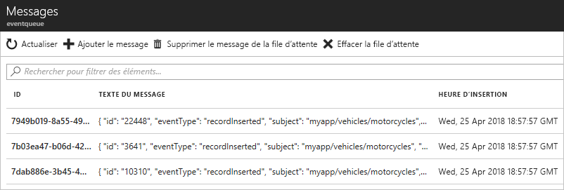

# <a name="quickstart-route-custom-events-to-azure-queue-storage-with-azure-cli-and-event-grid"></a>Démarrage rapide : Acheminer des événements personnalisés vers le Stockage File d’attente Azure avec Azure CLI et Event Grid

Azure Event Grid est un service de gestion d’événements pour le cloud. Le Stockage File d’attente Azure est l’un des gestionnaires d’événements pris en charge. Dans cet article, vous utilisez l’interface de ligne de commande Azure pour créer une rubrique personnalisée, vous abonner à cette rubrique personnalisée et déclencher l’événement pour afficher le résultat. Vous envoyez les événements vers le Stockage File d’attente.

[!INCLUDE [quickstarts-free-trial-note.md](../../includes/quickstarts-free-trial-note.md)]

[!INCLUDE [azure-cli-prepare-your-environment.md](../../includes/azure-cli-prepare-your-environment.md)]

- Cet article nécessite la version 2.0.56 ou ultérieure de l’interface Azure CLI. Si vous utilisez Azure Cloud Shell, la version la plus récente est déjà installée.

- Si vous utilisez Azure PowerShell sur votre machine locale au lieu d’utiliser Cloud Shell dans le portail Azure, assurez-vous d’avoir Azure PowerShell version 1.1.0 ou ultérieure. Téléchargez la dernière version d’Azure PowerShell sur votre machine Windows à partir de [Téléchargements Azure - Outils de ligne de commande](https://azure.microsoft.com/downloads/). 

Cet article vous donne les commandes permettant d’utiliser Azure CLI. 

## <a name="create-a-resource-group"></a>Créer un groupe de ressources

Les rubriques Event Grid sont des ressources Azure et doivent être placées dans un groupe de ressources Azure. Un groupe de ressources est une collection logique dans laquelle des ressources Azure sont déployées et gérées.

Créez un groupe de ressources avec la commande [az group create](/cli/azure/group#az-group-create). 

L’exemple suivant crée un groupe de ressources nommé *gridResourceGroup* à l’emplacement *westus2*.

```azurecli-interactive
az group create --name gridResourceGroup --location westus2
```

[!INCLUDE [event-grid-register-provider-cli.md](../../includes/event-grid-register-provider-cli.md)]

## <a name="create-a-custom-topic"></a>Créer une rubrique personnalisée

Une rubrique de grille d’événement fournit un point de terminaison défini par l’utilisateur vers lequel vous envoyez vos événements. L’exemple suivant permet de créer la rubrique personnalisée dans votre groupe de ressources. Remplacez `<topic_name>` par un nom unique pour votre rubrique personnalisée. Le nom de la rubrique de la grille d’événements doit être unique, car elle est représentée par une entrée DNS.

```azurecli-interactive
az eventgrid topic create --name <topic_name> -l westus2 -g gridResourceGroup
```

## <a name="create-queue-storage"></a>Créer un Stockage File d'attente

Avant de nous abonner à la rubrique personnalisée, nous allons créer le point de terminaison pour le message de l’événement. Vous créez un Stockage File d’attente afin de collecter les événements.

```azurecli-interactive
storagename="<unique-storage-name>"
queuename="eventqueue"

az storage account create -n $storagename -g gridResourceGroup -l westus2 --sku Standard_LRS
az storage queue create --name $queuename --account-name $storagename
```

## <a name="subscribe-to-a-custom-topic"></a>S’abonner à une rubrique personnalisée

Vous vous abonnez à une rubrique personnalisée pour communiquer à Event Grid les événements qui vous intéressent. L’exemple suivant s’abonne à la rubrique personnalisée que vous avez créée et transmet l’ID de ressource du Stockage File d’attente vers le point de terminaison. Avec Azure CLI, vous mettez l’ID de stockage de file d’attente en tant que point de terminaison. Le point de terminaison a le format suivant :

`/subscriptions/<subscription-id>/resourcegroups/<resource-group-name>/providers/Microsoft.Storage/storageAccounts/<storage-name>/queueservices/default/queues/<queue-name>`

Le script suivant obtient l’ID de ressource du compte de stockage pour la file d’attente. Il construit le code pour le Stockage File d’attente et s’abonne à une rubrique Event Grid. Il définit le type de point de terminaison sur `storagequeue` et utilise l’ID de file d’attente pour le point de terminaison.

```azurecli-interactive
storageid=$(az storage account show --name $storagename --resource-group gridResourceGroup --query id --output tsv)
queueid="$storageid/queueservices/default/queues/$queuename"
topicid=$(az eventgrid topic show --name <topic_name> -g gridResourceGroup --query id --output tsv)

az eventgrid event-subscription create \
  --source-resource-id $topicid \
  --name <event_subscription_name> \
  --endpoint-type storagequeue \
  --endpoint $queueid \
  --expiration-date "<yyyy-mm-dd>"
```

Le compte qui crée l’abonnement à l’événement doit pouvoir accéder en écriture au stockage de la file d’attente. Notez qu’une [date d’expiration](concepts.md#event-subscription-expiration) est définie pour l’abonnement.

Si vous utilisez l’API REST pour créer l’abonnement, vous mettez l’ID du compte de stockage et le nom de la file d’attente en tant que paramètre distinct.

```json
"destination": {
  "endpointType": "storagequeue",
  "properties": {
    "queueName":"eventqueue",
    "resourceId": "/subscriptions/<subscription-id>/resourcegroups/<resource-group-name>/providers/Microsoft.Storage/storageAccounts/<storage-name>"
  }
  ...
```

## <a name="send-an-event-to-your-custom-topic"></a>Envoyer un événement à votre rubrique personnalisée

Nous allons maintenant déclencher un événement pour voir comment Event Grid distribue le message à votre point de terminaison. Tout d’abord, il nous faut l’URL et la clé de la rubrique personnalisée. Utilisez de nouveau le nom de votre rubrique personnalisée pour `<topic_name>`.

```azurecli-interactive
endpoint=$(az eventgrid topic show --name <topic_name> -g gridResourceGroup --query "endpoint" --output tsv)
key=$(az eventgrid topic key list --name <topic_name> -g gridResourceGroup --query "key1" --output tsv)
```

Pour simplifier cet article, vous allez utiliser des exemples de données d’événements à envoyer à la rubrique personnalisée. En règle générale, une application ou un service Azure envoie les données d’événements. CURL est un utilitaire qui envoie des requêtes HTTP. Dans cet article, utilisez CURL pour envoyer l’événement à la rubrique personnalisée.  L’exemple suivant envoie trois événements à la rubrique Event Grid :

```azurecli-interactive
for i in 1 2 3
do
   event='[ {"id": "'"$RANDOM"'", "eventType": "recordInserted", "subject": "myapp/vehicles/motorcycles", "eventTime": "'`date +%Y-%m-%dT%H:%M:%S%z`'", "data":{ "make": "Ducati", "model": "Monster"},"dataVersion": "1.0"} ]'
   curl -X POST -H "aeg-sas-key: $key" -d "$event" $endpoint
done
```

Accédez au Stockage File d’attente dans le portail et notez que Event Grid a envoyé ces trois événements vers file d’attente.



> [!NOTE]
> Si vous utilisez un [déclencheur Stockage File d’attente Azure pour Azure Functions](../azure-functions/functions-bindings-storage-queue-trigger.md) pour une file d’attente qui reçoit des messages d’Event Grid, vous pouvez voir le message d’erreur suivant s’afficher à l’exécution de la fonction : `The input is not a valid Base-64 string as it contains a non-base 64 character, more than two padding characters, or an illegal character among the padding characters.`
> 
> En effet, quand vous utilisez un [déclencheur Stockage File d’attente Azure pour Azure Functions](../azure-functions/functions-bindings-storage-queue-trigger.md), Azure Functions attend une **chaîne encodée en base64**, mais Event Grid envoie les messages à une file d’attente de stockage dans un format de texte brut. Actuellement, il n’est pas possible de configurer le déclencheur de file d’attente de sorte qu’Azure Functions accepte le texte brut. 


## <a name="clean-up-resources"></a>Nettoyer les ressources
Si vous envisagez de continuer à utiliser cet événement, ne supprimez pas les ressources créées dans cet article. Sinon, utilisez la commande suivante pour supprimer les ressources créées dans cet article.

```azurecli-interactive
az group delete --name gridResourceGroup
```

## <a name="next-steps"></a>Étapes suivantes

Maintenant que vous savez créer des rubriques et des abonnements d’événements, vous pouvez en apprendre davantage sur Event Grid et ce qu’il peut vous offrir :

- [À propos d’Event Grid](overview.md)
- [Acheminer des événements de stockage Blob Azure vers un point de terminaison Web personnalisé ](../storage/blobs/storage-blob-event-quickstart.md?toc=%2fazure%2fevent-grid%2ftoc.json)
- [Surveiller les modifications d’une machine virtuelle avec Azure Event Grid et Azure Logic Apps](monitor-virtual-machine-changes-event-grid-logic-app.md)
- [Diffuser en continu des Big Data dans un entrepôt de données](event-grid-event-hubs-integration.md)
