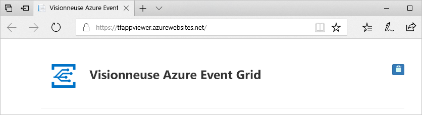

# <a name="route-cloud-events-to-webhooks-with-azure-event-grid-on-kubernetes"></a>Router des événements cloud vers des Webhooks avec Azure Event Grid sur Kubernetes
Dans ce guide de démarrage rapide, vous allez créer une rubrique dans Event Grid sur Kubernetes, créer un abonnement pour la rubrique, puis envoyer un exemple d’événement à la rubrique pour tester le scénario. 

[!INCLUDE [event-grid-preview-feature-note.md](../../../includes/event-grid-preview-feature-note.md)]


## <a name="prerequisites"></a>Prérequis

1. [Connecter votre cluster Kubernetes à Azure Arc](../../azure-arc/kubernetes/quickstart-connect-cluster.md).
1. [Installer l’extension Event Grid sur le cluster Kubernetes](install-k8s-extension.md). Cette extension déploie Event Grid sur un cluster Kubernetes. 
1. [Créer un emplacement personnalisé](../../azure-arc/kubernetes/custom-locations.md). Un emplacement personnalisé représente un espace de noms dans le cluster et est l’endroit où les rubriques et les abonnements à des événements sont déployés.

## <a name="create-a-topic"></a>Création d'une rubrique

### <a name="azure-cli"></a>Azure CLI
Exécutez la commande Azure CLI suivante pour créer une rubrique :

```azurecli-interactive
az eventgrid topic create --name <EVENT GRID TOPIC NAME> \
                        --resource-group <RESOURCE GROUP NAME> \
                        --location <REGION> \
                        --kind azurearc \
                        --extended-location-name /subscriptions/<AZURE SUBSCRIPTION ID>/resourceGroups/<RESOURCE GROUP NAME>/providers/Microsoft.ExtendedLocation/customLocations/<CUSTOM LOCATION NAME> \
                        --extended-location-type customlocation \
                        --input-schema CloudEventSchemaV1_0
```
Spécifiez des valeurs pour les espaces réservés suivants avant d’exécuter la commande :
- Nom du groupe de ressources Azure où vous voulez créer la rubrique Event Grid. 
- Nom pour la rubrique. 
- Région pour la rubrique.
- Dans l’ID de ressource de l’emplacement personnalisé, spécifiez les valeurs suivantes :
    - ID de l’abonnement Azure où se trouve votre emplacement personnalisé.
    - Nom du groupe de ressources qui contient l’emplacement personnalisé.
    - Nom de l’emplacement personnalisé.

Pour plus d’informations sur cette commande CLI, consultez [`az eventgrid topic create`](/cli/azure/eventgrid/topic#az_eventgrid_topic_create).

## <a name="create-a-message-endpoint"></a>Créer un point de terminaison de message
Avant de créer un abonnement pour la rubrique personnalisée, créez un point de terminaison pour le message d’événement. En règle générale, le point de terminaison entreprend des actions en fonction des données d’événement. Pour simplifier ce guide de démarrage rapide, déployez une [application web prédéfinie](https://github.com/Azure-Samples/azure-event-grid-viewer) qui affiche les messages d’événement. La solution déployée comprend un plan App Service, une offre App Service Web Apps et du code source en provenance de GitHub.

1. Dans la page de l’article, sélectionnez **Déployer sur Azure** pour déployer la solution sur votre abonnement. Dans le portail Azure, indiquez des valeurs pour les paramètres.

   <a href="https://portal.azure.com/#create/Microsoft.Template/uri/https%3A%2F%2Fraw.githubusercontent.com%2FAzure-Samples%2Fazure-event-grid-viewer%2Fmaster%2Fazuredeploy.json" target="_blank"></a>
1. Le déploiement peut prendre quelques minutes. Une fois le déploiement réussi, affichez votre application web pour vérifier qu’elle s’exécute. Dans un navigateur web, accédez à : `https://<your-site-name>.azurewebsites.net`

    Si le déploiement échoue, consultez le message d’erreur. L’échec peut être dû au fait que le nom du site web est déjà pris. Redéployez le modèle et choisissez un autre nom pour le site. 
1. Vous voyez le site, mais aucun événement n’est encore posté sur celui-ci.

   

## <a name="create-a-subscription"></a>Création d’un abonnement
Les abonnés peuvent s’inscrire aux événements publiés dans une rubrique. Pour recevoir des événements, vous devez créer un abonnement Event Grid pour un sujet qui vous intéresse. Un abonnement aux événements définit la destination à laquelle ces événements sont envoyés. Pour plus d’informations sur toutes les destinations ou les gestionnaires pris en charge, consultez [Gestionnaires d’événements](event-handlers.md).


### <a name="azure-cli"></a>Azure CLI
Pour créer un abonnement aux événements avec une destination de Webhook (point de terminaison HTTPS), exécutez la commande Azure CLI suivante :

```azurecli-interactive
az eventgrid event-subscription create --name <EVENT SUBSCRIPTION NAME> \
                                    --source-resource-id /subscriptions/<AZURE SUBSCRIPTION ID>/resourceGroups/<TOPIC'S RESOURCE GROUP NAME>/providers/Microsoft.EventGrid/topics/<TOPIC NAme> \
                                    --endpoint https://<SITE NAME>.azurewebsites.net/api/updates
```

Spécifiez des valeurs pour les espaces réservés suivants avant d’exécuter la commande :
- Nom de l’abonnement aux événements à créer. 

- Dans l’**ID de ressource de la rubrique**, spécifiez les valeurs suivantes :
    - ID de l’abonnement Azure où vous voulez que l’abonnement soit créé. 
    - Nom du groupe de ressources qui contient la rubrique.
    - Nom de la rubrique. 
- Pour le point de terminaison, spécifiez le nom du site web de la visionneuse Event Grid.
    
Pour plus d’informations sur cette commande CLI, consultez [`az eventgrid event-subscription create`](/cli/azure/eventgrid/event-subscription#az_eventgrid_event_subscription_create).


## <a name="send-events-to-the-topic"></a>Envoyer des événements à la rubrique
1. Exécutez la commande suivante afin d’obtenir le **point de terminaison** pour la rubrique : Après avoir copié et collé la commande, et avant de l’exécuter, mettez à jour le **nom de la rubrique** et le **nom du groupe de ressources**. Vous allez publier des exemples d’événements sur ce point de terminaison de rubrique. 

    ```azurecli
    az eventgrid topic show --name <topic name> -g <resource group name> --query "endpoint" --output tsv
    ```
2. Exécutez la commande suivante afin d’obtenir la **clé** pour la rubrique personnalisée  : Après avoir copié et collé la commande, et avant de l’exécuter, mettez à jour le **nom de la rubrique** et le nom du **groupe de ressources**. C’est la clé principale de la rubrique. Pour récupérer cette clé à partir du portail Azure, basculez vers l’onglet **Clés d’accès** de la page **Rubrique Event Grid**. Pour être en mesure de poster un événement dans une rubrique personnalisée, vous avez besoin de la clé d’accès. 

    ```azurecli
    az eventgrid topic key list --name <topic name> -g <resource group name> --query "key1" --output tsv
    ```
1. Exécutez la commande **Curl** suivante pour publier l’événement : Spécifiez l’URL et la clé du point de terminaison de l’étape 1 et 2 avant d’exécuter la commande. 

    ```bash
    curl  -k -X POST -H "Content-Type: application/cloudevents-batch+json" -H "aeg-sas-key: <KEY_FROM_STEP_2>" -g <ENDPOINT_URL_FROM_STEP_1> \
    -d  '[{ 
          "specversion": "1.0",
          "type" : "orderCreated",
          "source": "myCompanyName/us/webCommerceChannel/myOnlineCommerceSiteBrandName",
          "id" : "eventId-n",
          "time" : "2020-12-25T20:54:07+00:00",
          "subject" : "account/acct-123224/order/o-123456",
          "dataSchema" : "1.0",
          "data" : {
             "orderId" : "123",
             "orderType" : "PO",
             "reference" : "https://www.myCompanyName.com/orders/123"
          }
    }]'
    ```
    
    Si l’URL du point de terminaison de la rubrique de l’étape 1 est une adresse IP privée, comme dans le cas où le type de service du répartiteur Event Grid est ClusterIP, vous pouvez exécuter **Curl** à partir d’un autre pod du cluster pour avoir accès à cette adresse IP. Par exemple, vous pouvez effectuer les opérations suivantes :

    1. Créez un fichier manifeste avec la configuration suivante. Vous pouvez ajuster le ``dnsPolicy`` en fonction de vos besoins. Pour plus d’informations, consultez [DNS pour services et pods](https://kubernetes.io/docs/concepts/services-networking/dns-pod-service/).
    
        ```yml
        apiVersion: v1
        dnsPolicy: ClusterFirstWithHostNet
        hostNetwork: true
        kind: Pod
        metadata: 
          name: test-pod
        spec: 
          containers: 
            - 
              name: nginx
          emptyDir: {}
          image: nginx
          volumeMounts: 
            - 
              mountPath: /usr/share/nginx/html
              name: shared-data
          volumes: 
            - 
              name: shared-data  
        ```
    1. Créez le pod.
        ```bash
            kubectl apply -f <name_of_your_yaml_manifest_file>
        ```
    1. Vérifiez que le pod est en cours d’exécution.
        ```bash
            kubectl get pod test-pod
        ```
    1. Démarrer une session shell à partir du conteneur
        ```bash
            kubectl exec --stdin --tty test-pod -- /bin/bash
        ```

    À ce stade, vous disposez d’une session shell à partir d’un conteneur en cours d’exécution dans le cluster à partir duquel vous pouvez exécuter la commande **Curl** décrite ci-dessus.

    > [!NOTE]
    > Pour savoir comment envoyer des événements cloud en utilisant des langages de programmation, consultez les exemples suivants : 
    > - [C#](/samples/azure/azure-sdk-for-net/azure-event-grid-sdk-samples/).
    > - [Java](/samples/azure/azure-sdk-for-java/eventgrid-samples/)
    > - [JavaScript](/samples/azure/azure-sdk-for-js/eventgrid-javascript/) et [TypeScript](/samples/azure/azure-sdk-for-js/eventgrid-typescript/)
    > - [Python](/samples/azure/azure-sdk-for-python/eventgrid-samples/)

### <a name="verify-in-the-event-grid-viewer"></a>Vérifier dans la visionneuse Event Grid
Vous avez déclenché l’événement, et Event Grid a envoyé le message au point de terminaison configuré lors de l’abonnement. Affichez votre application web pour voir l’événement que vous venez d’envoyer.

:::image type="content" source="./media/create-topic-subscription/viewer-received-event.png" alt-text="Voir un événement reçu dans la visionneuse Event Grid":::

## <a name="next-steps"></a>Étapes suivantes
Voir les articles suivants : 
- [Gestionnaires d’événements et destinations](event-handlers.md) : fournit des informations sur tous les gestionnaires d’événements et les destinations qu’Event Grid sur Kubernetes prend en charge. 
- [Filtrage des événements](filter-events.md) : fournit des informations sur le filtrage des événements sur les abonnements aux événements. 