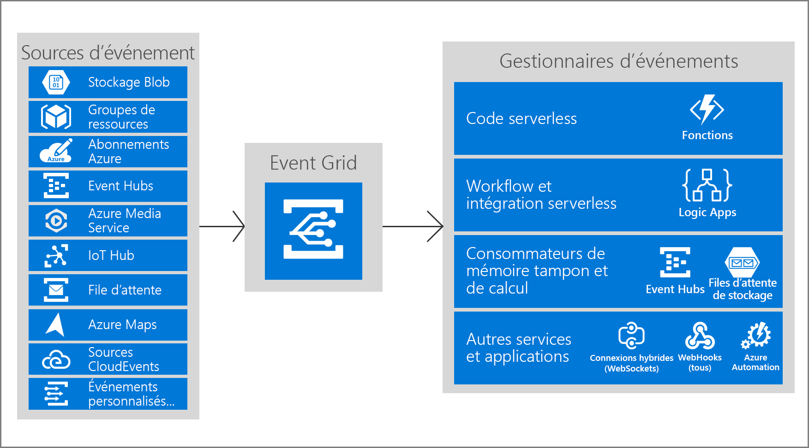

# Qu'est-ce qu'Azure Event Grid ?

Azure Event Grid vous permet de créer facilement des applications avec les architectures basées sur des événements. Tout d'abord, sélectionnez la ressource Azure à laquelle vous souhaitez vous abonner, puis fournissez le gestionnaire d'événements ou le point de terminaison WebHook auquel l'événement doit être envoyé. Event Grid dispose d’une prise en charge intégrée pour les événements provenant des services Azure, tels que les objets BLOB de stockage et les groupes de ressources. Event Grid dispose également d’une prise en charge pour vos propres événements, à l’aide de rubriques personnalisées. 

Vous pouvez utiliser des filtres pour acheminer des événements spécifiques à différents points de terminaison, multidiffuser vers des points de terminaison multiples et vous assurez que vos événements sont correctement livré.

Azure Event Grid est déployé pour optimiser la disponibilité via une répartition en mode natif sur plusieurs domaines d’erreur dans chaque région et sur les zones de disponibilité (dans les régions qui les prennent en charge). Pour obtenir la liste des régions prises en charge par Event Grid, consultez [Disponibilité des produits par région](https://azure.microsoft.com/global-infrastructure/services/?products=event-grid&regions=all).

Cet article fournit une vue d’ensemble d’Azure Event Grid. Pour bien démarrer avec Event Grid, consultez [Créer et acheminer des événements personnalisés avec Azure Event Grid](custom-event-quickstart.md). 

Cette image montre comment Event Grid connecte les sources et les gestionnaires, mais il ne s'agit pas d'une liste exhaustive des intégrations prises en charge.

## Sources d’événement

Pour plus d’informations sur les fonctionnalités de chaque source ainsi que les articles connexes, consultez [Sources d’événement](event-sources.md). Actuellement, les services Azure suivants prennent en charge l’envoi d’événements vers Event Grid :

* [Abonnements Azure (opérations de gestion)](event-sources.md#azure-subscriptions)
* [Container Registry](event-sources.md#container-registry)
* [Rubriques personnalisées](event-sources.md#custom-topics)
* [Hubs d'événements](event-sources.md#event-hubs)
* [IoT Hub](event-sources.md#iot-hub)
* [Key Vault (préversion)](event-sources.md#key-vault-preview)
* [Media Services](event-sources.md#media-services)
* [Groupes de ressources (opérations de gestion)](event-sources.md#resource-groups)
* [Service Bus](event-sources.md#service-bus)
* [Storage Blob](event-sources.md#storage)
* [Azure Maps](event-sources.md#maps)
* [Configuration de l’application](event-sources.md#app-configuration)
* [Signal R](event-sources.md#azure-signalr)
* [Machine Learning](event-sources.md#azure-machine-learning)

## Gestionnaires d’événements

Pour plus d’informations sur les fonctionnalités de chaque gestionnaire, ainsi que les articles connexes, consultez [Gestionnaire d'événements](event-handlers.md). Actuellement, les services Azure suivants prennent en charge la gestion d’événements depuis Event Grid : 

* [Azure Automation](event-handlers.md#azure-automation)
* [Azure Functions](event-handlers.md#azure-functions)
* [Hubs d'événements](event-handlers.md#event-hubs)
* [connexions hybrides](event-handlers.md#hybrid-connections)
* [Logic Apps](event-handlers.md#logic-apps)
* [Power Automate (anciennement Microsoft Flow)](https://preview.flow.microsoft.com/connectors/shared_azureeventgrid/azure-event-grid/)
* [Service Bus](event-handlers.md#service-bus)
* [Stockage de files d’attente](event-handlers.md#queue-storage)
* [WebHooks](event-handlers.md#webhooks)

## Concepts

Il existe cinq concepts dans Azure Event Grid qui vous permettent de démarrer :

* **Événements** : ce qu’il s’est passé.
* **Sources d’événements** : où l’événement a eu lieu.
* **Rubriques** : le point de terminaison où les éditeurs envoient des événements.
* **Abonnements aux événements** : point de terminaison ou mécanisme intégré permettant de router les événements, parfois vers plusieurs gestionnaires. Les abonnements sont également utilisés par des gestionnaires pour filtrer intelligemment les événements entrants.
* **Gestionnaires d’événements** : l’application ou le service réagissant à l’événement.

Pour plus d’informations sur ces concepts, consultez [Concepts dans Azure Event Grid](concepts.md).

## Fonctionnalités

Voici les principales fonctionnalités d’Azure Event Grid :

* **Simplicité** : pointez et cliquez pour chercher des événements depuis votre ressource Azure vers tout gestionnaire ou point de terminaison d’événement.
* **Filtrage avancé** : filtrez le type d'événement ou le chemin de publication de l'événement pour veiller à ce que les gestionnaires d'événements ne reçoivent que des événements pertinents.
* **Distribution ramifiée** : abonnez-vous à plusieurs points de terminaison pour le même événement pour envoyer des copies de l'événement à autant d'emplacements que nécessaire.
* **Fiabilité** : nouvelle tentative de 24 heures avec backoff exponentiel pour garantir la livraison des événements.
* **Payer par événement** : payez uniquement pour le temps d’utilisation d’Event Grid.
* **Débit élevé** : générez des charges de travail élevées sur Event Grid avec prise en charge de millions d’événements par seconde.
* **Événements intégrés** : préparez et soyez rapidement opérationnel avec des événements intégrés définis par la ressource.
* **Événements personnalisés** : utilisez Event Grid pour router, filtrer et livrer de manière fiable les événements personnalisés dans votre application.

Pour comparer les services Event Grid, Event Hubs et Service Bus, consultez [Choisir entre des services Azure qui remettent des messages](compare-messaging-services.md).

## Que puis-je faire avec Event Grid ?

Azure Event Grid fournit plusieurs fonctionnalités qui améliorent considérablement les fonctions serverless, l'automatisation des opérations et le travail d'[intégration](https://azure.com/integration) : 

### Architectures d’application sans serveur

La grille d’événement connecte des sources de données et des gestionnaires d’événements. Par exemple, utilisez Event Grid pour déclencher une fonction serverless qui analyse les images lorsqu'elles sont ajoutées à un conteneur de stockage d'objets blob. 

### Automatisation des opérations

Event Grid vous permet d’accélérer l’automatisation et de simplifier l’application de la stratégie. Par exemple, utilisez Event Grid pour notifier Azure Automation lorsqu'une machine virtuelle ou une base de données SQL est créée. Utilisez les événements pour automatiser la vérification de la conformité des configurations de service, l'intégration des métadonnées dans les outils d'exploitation, l'étiquetage des machines virtuelles ou l'archivage des éléments de travail.

### Intégration d’applications

Event Grid connecte votre application à d’autres services. Par exemple, créez une rubrique d’application pour envoyer les données d’événement de votre application à Event Grid et profitez de sa livraison fiable, de son routage avancé et de son intégration directe à Azure. Ou vous pouvez utiliser Event Grid avec Logic Apps pour traiter des données en tout lieu sans rédiger de code. 

## Combien coûte Event Grid ?

Azure Event Grid utilise un modèle de tarification de paie par événement, afin que vous ne payez que ce que vous utilisez. Les 100 000 premières opérations par mois sont gratuites. Les opérations sont définies en tant qu’entrées d’événement, tentatives de remise d’abonnement, appels de gestion et filtrage par suffixe d’objet. Pour plus d’informations, visitez la [page de tarification](https://azure.microsoft.com/pricing/details/event-grid/).

## Étapes suivantes

* [Router les événements d’objet blob de stockage](../storage/blobs/storage-blob-event-quickstart.md?toc=%2fazure%2fevent-grid%2ftoc.json)  
  Répondez aux événements d’objet blob de stockage à l’aide d’Event Grid.
* [Créer des événements personnalisés et s’y abonner](custom-event-quickstart.md)  
  Démarrez et commencez à envoyer vos propres événements personnalisés vers tout point de terminaison à l’aide du guide de démarrage rapide Azure Event Grid.
* [Utilisation de Logic Apps en tant que gestionnaire d’événements](monitor-virtual-machine-changes-event-grid-logic-app.md)  
  Didacticiel sur la génération d’une application à l’aide de Logic Apps pour réagir aux événements envoyés par Event Grid.
* [Diffuser en continu des Big Data dans un entrepôt de données](event-grid-event-hubs-integration.md)  
  Didacticiel qui utilise Azure Functions pour diffuser en continu des données à partir d’Event Hubs vers SQL Data Warehouse.
* [Référence de l'API REST Event Grid](/rest/api/eventgrid)  
  Fournit du contenu de référence pour la gestion des abonnements aux événements, du routage et du filtrage.
