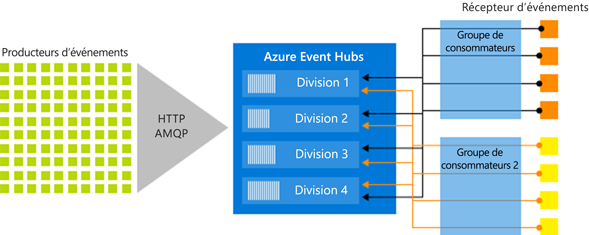

# Azure Event Hubs - plateforme de streaming de Big Data et service d’ingestion d’événements
Azure Event Hubs est une plateforme de streaming de Big Data et un service d’ingestion d’événements. Il peut recevoir et traiter des millions d’événements par seconde. Les données envoyées à un concentrateur d’événements peuvent être transformées et stockées à l’aide d’adaptateurs de traitement par lot/stockage ou d’un fournisseur d’analyse en temps réel.

Les scénarios suivants sont quelques-uns des scénarios dans lesquels vous pouvez utiliser Event Hubs :

- Détection d’anomalies (fraude/valeurs hors norme)
- Journalisation des applications
- Pipelines d’analyse, comme les parcours de visite
- Tableaux de bord en temps réel
- Archivage des données
- Traitement des transactions
- Traitement des données de télémétrie utilisateur
- Diffusion en continu de télémétrie d’appareil

<iframe width="560" height="315" src="https://www.youtube.com/embed/45wgY-VSk9I" frameborder="0" allow="accelerometer; autoplay; encrypted-media; gyroscope; picture-in-picture" allowfullscreen></iframe>

## Pourquoi utiliser Azure Event Hubs ?

Les données ne sont importantes que lorsqu’il y a une manière facile de les traiter et d’obtenir des insights en temps voulu de sources de données. Event Hubs fournit une plateforme de traitement de flux distribués avec une latence faible et une intégration sans interruption, avec des services de données et d’analyse dans et hors Azure pour générer votre pipeline de Big Data complet.

Event Hubs représente la « porte d’entrée » pour un pipeline d’événements, parfois qualifié de service de *réception d’événements* dans des architectures de solution. Un service de réception d'événements est un composant ou service qui se trouve entre les éditeurs d'événements et les consommateurs d'événements pour dissocier la production d'un flux d'événements de leur consommation. Event Hubs fournit une plateforme de streaming unifiée avec une mémoire tampon de conservation temporelle, en séparant les producteurs d’événements des consommateurs d’événements.

Les sections suivantes décrivent les fonctionnalités clés du service Azure Event Hubs :

## PaaS intégralement gérée

Event Hubs est un service PaaS (Platform-as-a-Service) entièrement géré avec peu de configuration ou de gestion, ce qui vous permet de vous concentrer sur vos solutions métier. [Event Hubs pour les écosystèmes d’Apache Kafka](event-hubs-for-kafka-ecosystem-overview.md) vous offre l’expérience de PaaS Kafka sans avoir à gérer, configurer ou exécuter vos clusters.

## Prise en charge d’un traitement par lots et en temps réel

Ingérez, mettez en mémoire tampon, stockez et traitez votre flux en temps réel pour obtenir des insights actionnables. Event Hubs utilise un [modèle de consommateur partitionné](event-hubs-scalability.md#partitions), ce qui permet à plusieurs applications de traiter le flux de données en même temps et vous laisse le contrôle sur la rapidité du traitement.

[Capturez](event-hubs-capture-overview.md) vos données en quasi temps réel dans un [Stockage Blob Azure](https://azure.microsoft.com/services/storage/blobs/) ou dans [Azure Data Lake Store](https://azure.microsoft.com/services/data-lake-store/)  pour une conservation à long terme ou un traitement par micro-lots. Vous pouvez obtenir ce comportement sur le même flux que celui que vous utilisez pour la dérivation de l’analytique en temps réel. La configuration de l’outil Capture est rapide. Son exécution n’engendre aucun coût d’administration et il s’adapte automatiquement à vos  [unités de débit](event-hubs-scalability.md#throughput-units) Event Hubs. Event Hubs vous permet de vous concentrer sur le traitement des données plutôt que sur leur capture.

Azure Event Hubs s’intègre aussi avec [Azure Functions](/azure/azure-functions/) pour une architecture sans serveur.

## Évolutif

Avec Event Hubs, vous pouvez commencer avec des flux de données en mégaoctets et passer à des gigaoctets ou téraoctets. La fonctionnalité de [majoration automatique](event-hubs-auto-inflate.md) est une des nombreuses options disponibles pour mettre à l'échelle le nombre d’unités de débit et ainsi répondre à vos besoins d’utilisation.

## Écosystème riche

[Event Hubs pour les écosystèmes Apache Kafka](event-hubs-for-kafka-ecosystem-overview.md) permet aux clients et aux applications [Apache Kafka (1.0 et ultérieur)](https://kafka.apache.org/) de communiquer avec Event Hub. Vous n’avez pas besoin d’installer, de configurer et de gérer vos propres clusters Kafka.

Avec un vaste écosystème disponible dans différents [langages (.NET, Java, Python, Go, JavaScript)](https://github.com/Azure/azure-event-hubs), vous pouvez facilement lancer le traitement de vos flux en provenance d’Event Hubs. Tous les langages client pris en charge fournissent une intégration de faible niveau. L’écosystème vous fournit également une intégration fluide aux services Azure tels qu’Azure Stream Analytics et Azure Functions, et vous permet donc de générer des architectures serverless.

## Composants clés de l’architecture
Les concentrateurs d’événements incluent les [éléments clés suivants](event-hubs-features.md) :

- **Producteurs d’événements** : entité qui envoie des données à un concentrateur d’événements. Les éditeurs d’événements peuvent publier des événements à l’aide du protocole HTTPS ou AMQP 1.0 ou Apache Kafka (1.0 et plus récent).
- **Partition** : chaque consommateur lit uniquement un sous-ensemble spécifique (partition) du flux de messages.
- **Groupes de consommateurs** : une vue (état, position ou décalage) d’un concentrateur d’événements dans sa totalité. Les groupes de consommateurs permettent que les applications de consommation aient chacune une vue distincte du flux d’événements. Ils lisent le flux de manière indépendante à leur propre rythme et avec leurs propres décalages.
- **Unités de débit** : unités de capacité qui contrôlent la capacité de débit d’Event Hubs, achetées préalablement.
- **Récepteurs d’événements** : entité qui lit des données d’événement à partir d’un concentrateur d’événements. Tous les consommateurs Event Hubs se connectent à l’aide de la session AMQP 1.0. Le service Event Hubs remet les événements au cours d’une session dès qu’ils sont disponibles. Tous les consommateurs de Kafka se connectent via le protocole Kafka 1.0 et versions ultérieures.

La figure suivante montre l’architecture de traitement de flux Event Hubs :

## Étapes suivantes

Pour commencer à utiliser Event Hubs, consultez les tutoriels **Envoyer et recevoir des événements** :

- [.NET Core](get-started-dotnet-standard-send-v2.md)
- [Java](get-started-java-send-v2.md)
- [Python](get-started-python-send-v2.md)
- [JavaScript](get-started-java-send-v2.md)
- [Go](event-hubs-go-get-started-send.md)
- [C (envoi uniquement)](event-hubs-c-getstarted-send.md)
- [Apache Storm (réception uniquement)](event-hubs-storm-getstarted-receive.md)

Pour plus d’informations sur les hubs d’événements, consultez les articles suivants :

- [Vue d’ensemble des fonctionnalités des concentrateurs d’événements](event-hubs-features.md)
- [Forum aux questions](event-hubs-faq.md).

