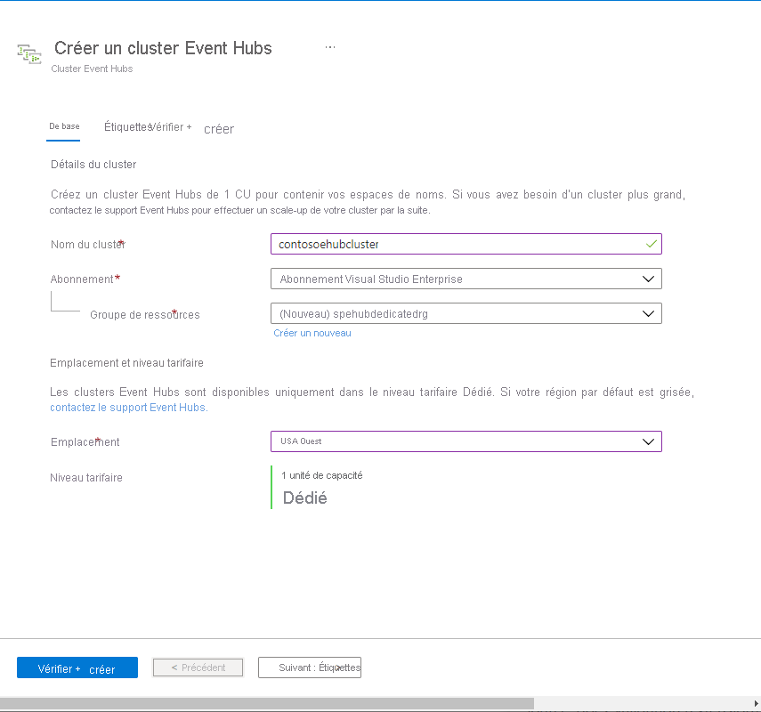
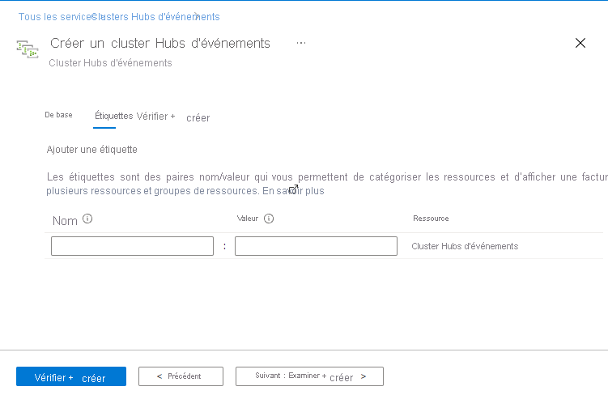
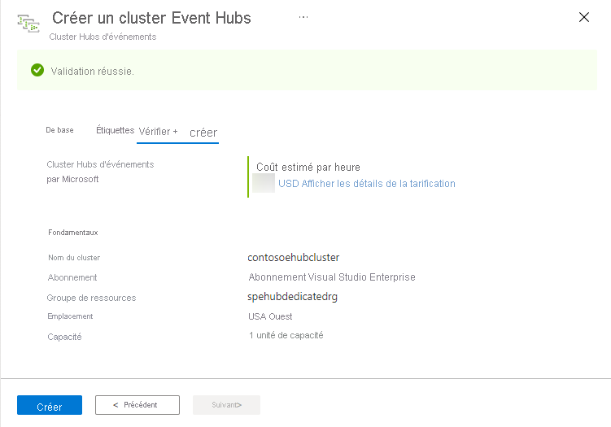
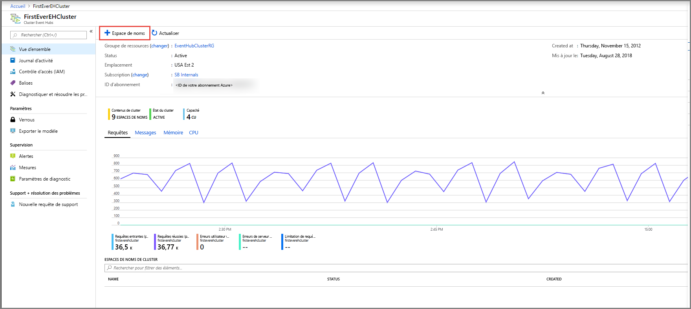
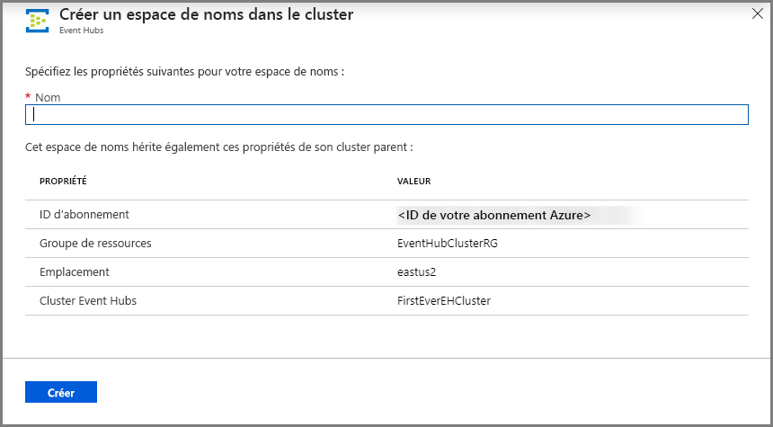
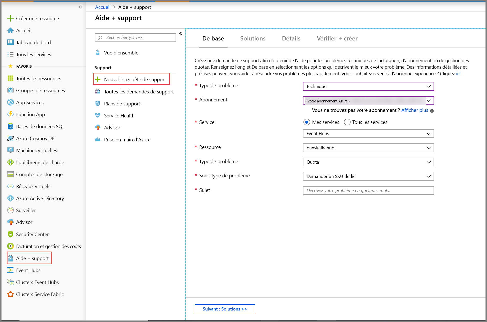
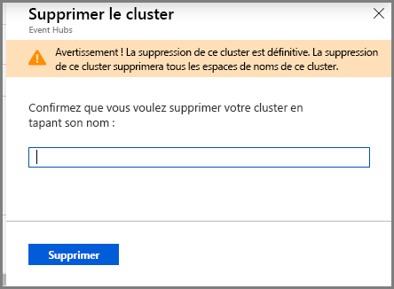

# Démarrage rapide : Créer un cluster dédié Event Hubs à l’aide du portail Azure 
Les clusters Event Hubs offrent des déploiements à locataire unique pour les clients aux besoins de streaming les plus pointus. Cette offre a un SLA de 99,99 % garanti et n'est disponible sur que notre niveau de tarification dédié. Un [cluster Event Hubs](event-hubs-dedicated-overview.md) peut recevoir des millions d’événements par seconde avec une garantie de capacité et de latence inférieure à la seconde. Les espaces de noms et les Event Hubs créées au sein d’un cluster comprennent toutes les fonctionnalités de l’offre standard et bien davantage, mais sans aucune limite d’entrée. L’offre dédiée comprend également la fameuse fonctionnalité [Event Hubs Capture](event-hubs-capture-overview.md) sans supplément, ce qui permet de charger automatiquement par lots des flux de dans le [Stockage Blob Azure](../storage/blobs/storage-blobs-introduction.md) ou [Azure Data Lake Storage Gen 1](../data-lake-store/data-lake-store-overview.md).

Les clusters dédiés sont mis en service et facturés par **unités de capacité (CU)** , une quantité pré-allouée d'UC et de ressources mémoire. Vous pouvez acheter 1, 2, 4, 8, 12, 16 ou 20 unités de capacité pour chaque cluster. Dans ce démarrage rapide, nous vous guiderons dans la création d’un cluster Event Hubs 1 CU via le portail Azure.

> [!NOTE]
> Cette expérience libre-service est actuellement disponible en préversion dans le [portail Azure](https://aka.ms/eventhubsclusterquickstart). Si vous avez des questions sur l’offre dédiée, veuillez contacter [l’équipe Event Hubs](mailto:askeventhubs@microsoft.com).

## Conditions préalables requises
Pour suivre ce guide de démarrage rapide, veillez à avoir :

- Un compte Azure. Si vous n’en avez pas, [achetez un compte](https://azure.microsoft.com/pricing/purchase-options/pay-as-you-go/) avant de commencer. Cette fonctionnalité n’est pas pris en charge avec un compte Azure gratuit. 
- [Visual Studio](https://visualstudio.microsoft.com/vs/) 2017 Update 3 (version 15.3, 26730.01) ou ultérieur.
- [Kit SDK .NET Standard](https://dotnet.microsoft.com/download), version 2.0 ou ultérieure.
- [Groupe de ressources créé](../event-hubs/event-hubs-create.md#create-a-resource-group).

## Créer un cluster Event Hubs Dedicated
Un cluster Event Hubs fournit un conteneur d’étendue unique dans laquelle vous pouvez créer un ou plusieurs espaces de noms. Dans la phase de préversion de l'expérience en libre-service du portail, vous pouvez créer des clusters à 1 unité de capacité dans les régions sélectionnées. Si vous avez besoin d’un cluster supérieur à 1 unité de capacité, vous pouvez soumettre une demande de support Azure pour faire évoluer votre cluster après sa création.

Pour créer un cluster dans votre groupe de ressources à l’aide du portail, procédez comme suit :

1. Suivez [ce lien](https://aka.ms/eventhubsclusterquickstart) pour créer un cluster sur le portail Azure. À l’inverse, sélectionnez **Tous les services** dans le volet de navigation gauche, puis tapez « Clusters Event Hubs » dans la barre de recherche et sélectionnez « Clusters Event Hubs » dans la liste des résultats.
2. Sur la page **Créer un cluster**, configurez ce qui suit :
    1. Entrez un **nom pour le cluster**. Le système vérifie immédiatement si le nom est disponible.
    2. Sélectionnez l’**abonnement** dans lequel vous souhaitez créer le cluster.
    3. Sélectionnez le **groupe de ressources** dans lequel vous souhaitez créer le cluster.
    4. Sélectionner un **emplacement** pour le cluster. Si votre région par défaut est grisée, elle est temporairement hors capacité et vous pouvez soumettre une [demande de support](#submit-a-support-request) à l’équipe Event Hubs.
    5. Sélectionnez le bouton **Suivant : Étiquettes** au bas de la page. Vous devrez peut-être attendre quelques minutes pour que le système approvisionne entièrement les ressources.

        
3. Sur la page **Étiquettes**, configurez ce qui suit :
    1. Entrez un **nom** et une **valeur** pour l'étiquette que vous souhaitez ajouter. Cette étape est **facultative**.  
    2. Sélectionnez le bouton **Vérifier + Créer**.

        
4. Sur la page **Vérifier + Créer**, vérifiez les détails, puis sélectionnez **Créer**. 

    

## Créer un espace de noms et Event Hub dans un cluster

1. Pour créer un espace de noms dans un cluster, sur la page **Cluster Event Hubs** de votre cluster, sélectionnez **+Espace de noms** dans le menu supérieur.

    
2. Sur la page de création d'un espace de noms, effectuez les opérations suivantes :
    1. Entrez un **nom pour l’espace de noms**.  Le système vérifie si le nom est disponible.
    2. L’espace de noms hérite des propriétés suivantes :
        1. Identifiant d’abonnement
        2. Groupe de ressources
        3. Location
        4. Nom du cluster
    3. Sélectionnez **Créer** pour créer l’espace de noms. Vous pouvez maintenant gérer votre cluster.  

        
3. Une fois votre espace de noms est créé, vous pouvez [créer un Event Hub](event-hubs-create.md#create-an-event-hub) comme vous le feriez normalement dans un espace de noms. 

## envoyer une demande de support ;

Si vous souhaitez modifier la taille de votre cluster après la création ou si votre région par défaut n’est pas disponible, envoyez une demande de support en procédant comme suit :

1. Dans le [portail Azure](https://portal.azure.com), sélectionnez **Aide et support** dans le menu de gauche.
2. Sélectionnez **+ Nouvelle demande de support** dans le menu Support.
3. Sur la page de support, procédez comme suit :
    1. Pour **Type de problème**, sélectionnez **Technique** dans la liste déroulante.
    2. Pour **Abonnement**, sélectionnez votre abonnement.
    3. Pour **Service**, sélectionnez **Mes services**, puis **Event Hubs**.
    4. Pour **Ressource**, sélectionnez votre cluster s'il existe déjà. Sinon, sélectionnez **Question/ressource non disponible**.
    5. Pour **Type de problème**, sélectionnez **Quota**.
    6. Pour **Sous-type de problème**, sélectionnez une des valeurs suivantes dans la liste déroulante :
        1. Sélectionnez **Request for Dedicated SKU** pour demander la prise en charge de la fonctionnalité dans votre région.
        2. Sélectionnez **Request to Scale Up or Scale Down Dedicated Cluster** si vous souhaitez monter ou descendre en puissance votre cluster dédié. 
    7. Pour **Titre**, décrivez le problème.

        

 ## Supprimer un cluster dédié
 
1. Pour supprimer le cluster, sélectionnez **Supprimer** dans le menu supérieur. Veuillez noter que votre cluster est facturé pour un minimum de 4 heures d’utilisation après sa création. 
2. Une demande de confirmation de suppression s'affiche.
3. Tapez le **nom du cluster**, puis sélectionnez **Supprimer** pour supprimer le cluster.

    

## Étapes suivantes
Dans cet article, vous avez créé un cluster Event Hubs. Pour obtenir des instructions pas à pas sur l'envoi et la réception d'événements à partir d’un Event Hub et pour capturer des événements dans un stockage Azure ou un Azure Data Lake Store, consultez les didacticiels suivants :

- [Envoyer et recevoir des événements sur .NET Core](event-hubs-dotnet-standard-getstarted-send.md)
- [Utiliser le portail Azure pour activer Event Hubs Capture](event-hubs-capture-enable-through-portal.md)
- [Utiliser Azure Event Hubs pour Apache Kafka](event-hubs-for-kafka-ecosystem-overview.md)
