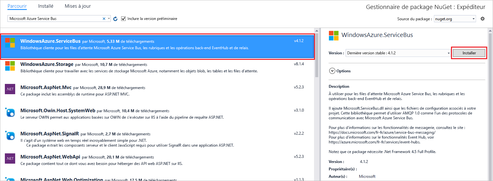
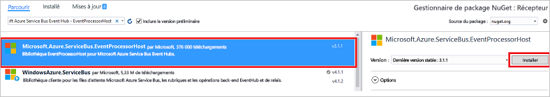

# <a name="quickstart-send-events-to-or-receive-events-from-azure-event-hubs-using-net-framework"></a>Démarrage rapide : Envoyer vers ou recevoir des événements d’Azure Event Hubs avec .NET Framework
Azure Event Hubs est une plateforme de diffusion de données volumineuses et un service d’ingestion d’événements, capable de recevoir et de traiter des millions d’événements par seconde. Les concentrateurs d’événements peuvent traiter et stocker des événements, des données ou la télémétrie produits par des logiciels et appareils distribués. Les données envoyées à un concentrateur d’événements peuvent être transformées et stockées à l’aide d’adaptateurs de traitement par lot/stockage ou d’un fournisseur d’analyse en temps réel. Pour une présentation détaillée d’Event Hubs, consultez [Vue d’ensemble d’Event Hubs](event-hubs-about.md) et [Fonctionnalités d’Event Hubs](event-hubs-features.md).

Ce tutoriel montre comment créer des applications de la console .NET Framework dans C# pour envoyer des événements à partir d’un Event Hub ou lui en envoyer. 

## <a name="prerequisites"></a>Prérequis
Pour effectuer ce didacticiel, vous avez besoin de ce qui suit :

- [Microsoft Visual Studio 2019](https://visualstudio.com).
- **Créez un espace de noms Event Hubs et un Event Hub**. La première étape consiste à utiliser le [portail Azure](https://portal.azure.com) pour créer un espace de noms de type Event Hubs et obtenir les informations de gestion nécessaires à votre application pour communiquer avec le concentrateur d’événements. Pour créer un espace de noms et un hub d’événements, suivez la procédure décrite dans [cet article](event-hubs-create.md). Ensuite, obtenez la **chaîne de connexion de l’espace de noms Event Hub** en suivant les instructions à partir de l’article : [Obtenir la chaîne de connexion](event-hubs-get-connection-string.md#get-connection-string-from-the-portal). Vous utiliserez la chaîne de connexion plus loin dans ce tutoriel.

## <a name="send-events"></a>Envoyer des événements 
Cette section vous montre comment créer une application console .NET Framework pour envoyer des événements à un Event Hub. 

### <a name="create-a-console-application"></a>Création d’une application console

Dans Visual Studio, créez un projet d'application de bureau Visual C# à l'aide du modèle de projet d' **application de console** . Nommez le projet **Sender**.
   


### <a name="add-the-event-hubs-nuget-package"></a>Ajout du package NuGet Event Hubs

1. Dans l’Explorateur de solutions, cliquez avec le bouton droit sur le projet **Expéditeur**, puis cliquez sur **Gérer les packages NuGet pour la solution...** . 
2. Cliquez sur l’onglet **Parcourir**, puis recherchez `WindowsAzure.ServiceBus`. Cliquez sur **Installer** et acceptez les conditions d’utilisation. 
   
    
   
    Visual Studio lance le téléchargement, l’installation et ajoute une référence au [Package NuGet Azure Service Bus](https://www.nuget.org/packages/WindowsAzure.ServiceBus).

### <a name="write-code-to-send-messages-to-the-event-hub"></a>Écriture de code pour envoyer des messages à un hub d’événements

1. Ajoutez les instructions `using` suivantes en haut du fichier **Program.cs** :
   
    ```csharp
    using System.Threading;
    using Microsoft.ServiceBus.Messaging;
    ```
2. Ajoutez les champs suivants à la classe **Program** , en remplaçant les valeurs par le nom du concentrateur d’événements que vous avez créé dans la section précédente et par la chaîne de connexion au niveau de l’espace de noms, enregistrée précédemment. Vous pouvez copier la chaîne de connexion de votre Event Hub de la **clé primaire de chaîne de connexion** sous **RootManageSharedAccessKey** sur la page Event Hub dans le portail Azure. Pour des instructions détaillées, consultez [Obtenir la chaîne de connexion](event-hubs-get-connection-string.md#get-connection-string-from-the-portal).
   
    ```csharp
    static string eventHubName = "Your Event Hub name";
    static string connectionString = "namespace connection string";
    ```
3. Ajoutez la méthode suivante à la classe **Program** :
   
      ```csharp
      static void SendingRandomMessages()
      {
          var eventHubClient = EventHubClient.CreateFromConnectionString(connectionString, eventHubName);
          while (true)
          {
              try
              {
                  var message = Guid.NewGuid().ToString();
                  Console.WriteLine("{0} > Sending message: {1}", DateTime.Now, message);
                  eventHubClient.Send(new EventData(Encoding.UTF8.GetBytes(message)));
              }
              catch (Exception exception)
              {
                  Console.ForegroundColor = ConsoleColor.Red;
                  Console.WriteLine("{0} > Exception: {1}", DateTime.Now, exception.Message);
                  Console.ResetColor();
              }
       
              Thread.Sleep(200);
          }
      }
      ```
   
      Cette méthode envoie en continu les événements à votre concentrateur d’événements avec un délai de 200 ms.
4. Enfin, ajoutez les lignes suivantes à la méthode **Main** :
   
      ```csharp
      Console.WriteLine("Press Ctrl-C to stop the sender process");
      Console.WriteLine("Press Enter to start now");
      Console.ReadLine();
      SendingRandomMessages();
      ```
5. Exécutez le programme et assurez-vous qu’il n’y a aucune erreur.
  
## <a name="receive-events"></a>Recevoir des événements
Dans cette section, vous codez une application console .NET Framework qui reçoit des messages d’un Event Hub à l’aide de [l’hôte du processeur d’événements](event-hubs-event-processor-host.md). [L’hôte du processeur d’événements](event-hubs-event-processor-host.md) est une classe .NET qui simplifie la réception d’événements provenant de concentrateurs d’événements grâce à la gestion des points de contrôle permanents et des réceptions en parallèle de ces concentrateurs d’événements. L’hôte du processeur d’événements vous permet de répartir des événements sur plusieurs récepteurs, même quand ils sont hébergés dans des nœuds différents. 

[!INCLUDE [event-hubs-create-storage](./includes/event-hubs-create-storage.md)]

### <a name="create-a-console-application"></a>Création d’une application console

Dans Visual Studio, créez un projet d'application de bureau Visual C# à l'aide du modèle de projet **d’application de console** . Nommez le projet **Récepteur**.
   


### <a name="add-the-event-hubs-nuget-package"></a>Ajout du package NuGet Event Hubs

1. Dans l’Explorateur de solutions, cliquez avec le bouton droit sur le projet **Récepteur**, puis cliquez sur **Gérer les packages NuGet pour la solution...** .
2. Cliquez sur l’onglet **Parcourir**, puis recherchez `Microsoft Azure Service Bus Event Hub - EventProcessorHost`. Cliquez sur **Installer** et acceptez les conditions d’utilisation.
   
    
   
    Visual Studio lance le téléchargement, l’installation et ajoute une référence au [Package NuGet Azure Service Bus Event Hub - EventProcessorHost](https://www.nuget.org/packages/Microsoft.Azure.ServiceBus.EventProcessorHost), avec toutes les dépendances associées.

### <a name="implement-the-ieventprocessor-interface"></a>Implémentation de l’interface IEventProcessor

1. Cliquez avec le bouton droit sur le projet **Récepteur**, cliquez sur **Ajouter**, puis cliquez sur **Classe**. Nommez la nouvelle classe **SimpleEventProcessor**, puis cliquez sur **Ajouter** pour créer la classe.
   
    
2. Ajoutez les instructions ci-après au début du fichier SimpleEventProcessor.cs :
    
      ```csharp
      using Microsoft.ServiceBus.Messaging;
      using System.Diagnostics;
      ```
    
3. Insérez le code suivant dans le corps de la classe :
    
      ```csharp
      class SimpleEventProcessor : IEventProcessor
      {
        Stopwatch checkpointStopWatch;
        
        async Task IEventProcessor.CloseAsync(PartitionContext context, CloseReason reason)
        {
            Console.WriteLine("Processor Shutting Down. Partition '{0}', Reason: '{1}'.", context.Lease.PartitionId, reason);
            if (reason == CloseReason.Shutdown)
            {
                await context.CheckpointAsync();
            }
        }
        
        Task IEventProcessor.OpenAsync(PartitionContext context)
        {
            Console.WriteLine("SimpleEventProcessor initialized.  Partition: '{0}', Offset: '{1}'", context.Lease.PartitionId, context.Lease.Offset);
            this.checkpointStopWatch = new Stopwatch();
            this.checkpointStopWatch.Start();
            return Task.FromResult<object>(null);
        }
        
        async Task IEventProcessor.ProcessEventsAsync(PartitionContext context, IEnumerable<EventData> messages)
        {
            foreach (EventData eventData in messages)
            {
                string data = Encoding.UTF8.GetString(eventData.GetBytes());
        
                Console.WriteLine(string.Format("Message received.  Partition: '{0}', Data: '{1}'",
                    context.Lease.PartitionId, data));
            }
        
            //Call checkpoint every 5 minutes, so that worker can resume processing from 5 minutes back if it restarts.
            if (this.checkpointStopWatch.Elapsed > TimeSpan.FromMinutes(5))
            {
                await context.CheckpointAsync();
                this.checkpointStopWatch.Restart();
            }
        }
      }
      ```
    
      Cette classe est appelée par **EventProcessorHost** pour traiter les événements envoyés par le concentrateur d’événements. La classe `SimpleEventProcessor` utilise un chronomètre pour appeler régulièrement la méthode de point de contrôle sur le contexte **EventProcessorHost** . Ce traitement garantit que, en cas de redémarrage du récepteur, la perte de traitement de travail ne soit pas supérieure à cinq minutes.

### <a name="update-the-main-method-to-use-simpleeventprocessor"></a>Mettre à jour la méthode Main pour utiliser SimpleEventProcessor

1. Dans la classe **Program**, ajoutez l’instruction `using` suivante en haut du fichier :
    
      ```csharp
      using Microsoft.ServiceBus.Messaging;
      ```
    
2. Remplacez la méthode `Main` dans la classe `Program` par le code suivant, en remplaçant le nom de concentrateur d’événements et la chaîne de connexion au niveau de l’espace de noms, enregistrée précédemment, ainsi que la clé et le compte de stockage que vous avez copiés dans les sections précédentes. 
    
      ```csharp
      static void Main(string[] args)
      {
        string eventHubConnectionString = "{Event Hubs namespace connection string}";
        string eventHubName = "{Event Hub name}";
        string storageAccountName = "{storage account name}";
        string storageAccountKey = "{storage account key}";
        string storageConnectionString = string.Format("DefaultEndpointsProtocol=https;AccountName={0};AccountKey={1}", storageAccountName, storageAccountKey);
        
        string eventProcessorHostName = Guid.NewGuid().ToString();
        EventProcessorHost eventProcessorHost = new EventProcessorHost(eventProcessorHostName, eventHubName, EventHubConsumerGroup.DefaultGroupName, eventHubConnectionString, storageConnectionString);
        Console.WriteLine("Registering EventProcessor...");
        var options = new EventProcessorOptions();
        options.ExceptionReceived += (sender, e) => { Console.WriteLine(e.Exception); };
        eventProcessorHost.RegisterEventProcessorAsync<SimpleEventProcessor>(options).Wait();
        
        Console.WriteLine("Receiving. Press enter key to stop worker.");
        Console.ReadLine();
        eventProcessorHost.UnregisterEventProcessorAsync().Wait();
      }
      ```
    
3. Exécutez le programme et assurez-vous qu’il n’y a aucune erreur.
  
## <a name="next-steps"></a>Étapes suivantes
Consultez les articles suivants : 

- [EventProcessorHost](event-hubs-event-processor-host.md)
- [Fonctionnalités et terminologie dans Azure Event Hubs](event-hubs-features.md).
- [FAQ sur les hubs d’événements](event-hubs-faq.yml)


<!-- Links -->
[EventProcessorHost]: /dotnet/api/microsoft.servicebus.messaging.eventprocessorhost
[Event Hubs overview]: event-hubs-about.md
[Event Hubs Programming Guide]: event-hubs-programming-guide.md
[Azure Storage account]:../storage/common/storage-create-storage-account.md
[Event Processor Host]: event-hubs-event-processor-host.md
[Azure portal]: https://portal.azure.com
