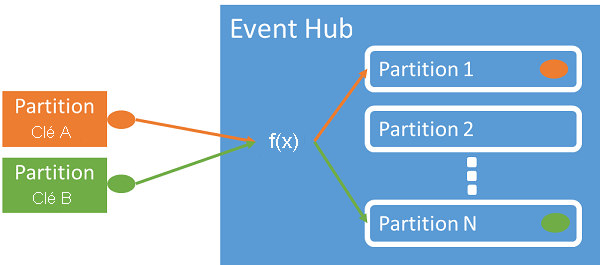
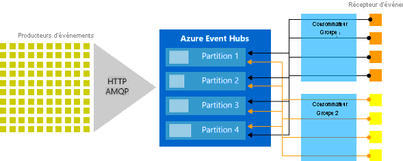
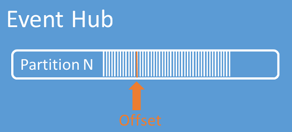

# <a name="features-and-terminology-in-azure-event-hubs"></a>Fonctionnalités et terminologie dans Azure Event Hubs

Azure Event Hubs est un service évolutif de traitement d’événements qui ingère et traite de gros volumes de données et d’événements avec une faible latence et une haute fiabilité. Consultez la page [Qu’est-ce qu’Event Hubs ?](./event-hubs-about.md) pour une vue d’ensemble de haut niveau.

Cet article s’appuie sur les informations de l’[article de présentation](./event-hubs-about.md) et fournit des détails techniques et de mise en œuvre sur les fonctionnalités et composants d’Event Hubs.

> [!TIP]
> [La prise en charge du protocole pour les clients **Apache Kafka**](event-hubs-for-kafka-ecosystem-overview.md) (versions 1.0 et ultérieures) fournit des points de terminaison de réseau qui permettent aux applications créées pour utiliser Apache Kafka avec n’importe quel client d’utiliser Event Hubs. La plupart des applications Kafka existantes peuvent simplement être reconfigurées pour pointer vers un espace de noms Event Hub au lieu d’un serveur de démarrage de cluster Kafka. 
>
>Du point de vue du coût, de l’effort opérationnel et de la fiabilité, Azure Event Hubs constitue une excellente alternative au déploiement et à l’exploitation de vos propres clusters Kafka et Zookeeper, ainsi qu’aux offres de Kafka en tant que service non natives d’Azure. 
>
> En plus d’obtenir les mêmes fonctionnalités de base que celles du répartiteur Apache Kafka, vous pouvez également accéder aux fonctionnalités d’Azure Event Hubs, telles que le traitement par lots et l’archivage automatiques via [Event Hubs Capture](event-hubs-capture-overview.md), la mise à l’échelle et l’équilibrage automatiques, la récupération d’urgence, la prise en charge des zones de disponibilité à coût neutre, l’intégration réseau flexible et sécurisée et la prise en charge multiprotocole, notamment le protocole AMQP sur WebSockets compatible avec les pare-feu.


## <a name="namespace"></a>Espace de noms
Un espace de noms Event Hubs fournit des points de terminaison de réseau intégrés au DNS et une gamme de fonctionnalités de contrôle d’accès et de gestion de l’intégration réseau, telles que le [filtrage IP](event-hubs-ip-filtering.md), les [points de terminaison de service de réseau virtuel](event-hubs-service-endpoints.md) et [Private Link](private-link-service.md), et constitue le conteneur de gestion pour l’une des instances Event Hubs (ou rubriques, dans le jargon Kafka).

## <a name="event-publishers"></a>Éditeurs d'événements

Toute entité qui envoie des données à un Event Hub est un *éditeur d’événements* (synonyme de *producteur d’événements*). Les éditeurs d’événements peuvent publier des événements à l’aide du protocole HTTPS, AMQP 1.0 ou Kafka. Les éditeurs d’événements utilisent l’autorisation Azure Active Directory avec des jetons JWT émis par OAuth2 ou un jeton de signature d’accès partagé (SAP) spécifique à l’Event Hub pour obtenir un accès à la publication.

### <a name="publishing-an-event"></a>Publication d'un événement

Vous pouvez publier un événement via le protocole AMQP 1.0, Kafka ou HTTPS. Le service Event Hubs fournit l'[API REST](/rest/api/eventhub/) ainsi que les bibliothèques de clients [.NET](event-hubs-dotnet-standard-getstarted-send.md), [Java](event-hubs-java-get-started-send.md), [Python](event-hubs-python-get-started-send.md), [JavaScript](event-hubs-node-get-started-send.md) et [Go](event-hubs-go-get-started-send.md) pour la publication d'événements dans un Event Hub. Pour les autres runtimes et plateformes, vous pouvez utiliser n'importe quel client AMQP 1.0, comme [Apache Qpid](https://qpid.apache.org/). 

Le choix d'utiliser AMQP ou HTTPS est spécifique au scénario d'utilisation. AMQP requiert l'établissement d'un socket bidirectionnel persistant en plus de la sécurité au niveau du transport (TLS) ou SSL/TLS. Le protocole AMQP présente des coûts de gestion réseau plus élevés lors de l’initialisation de la session, mais le protocole HTTPS nécessite un temps de traitement TLS supplémentaire pour chaque requête. AMQP offre des performances nettement supérieures pour les éditeurs fréquents et peut atteindre des latences beaucoup plus faibles lorsqu’il est utilisé avec du code de publication asynchrone.

Vous pouvez publier les événements individuellement ou par lots. Une publication unique est limitée à 1 Mo, qu’il s’agisse d’un événement unique ou d’un lot. La publication d’événements plus volumineux que ce seuil seront rejetés. 

Le débit Event Hubs est mis à l’échelle à l’aide de partitions et d’allocations d’unités de débit (voir ci-dessous). Il est recommandé aux éditeurs de ne pas connaître le modèle de partitionnement spécifique choisi pour un Event Hub et de spécifier uniquement une *clé de partition* qui est utilisée pour attribuer systématiquement des événements connexes à la même partition.



Azure Event Hubs garantit que tous les événements qui partagent une clé de partition sont stockés ensemble et livrés dans l’ordre d’arrivée. Si des clés de partition sont utilisées avec des stratégies d’éditeur, l’identité de l’éditeur et la valeur de la clé de partition doivent correspondre. Sinon, une erreur se produit.

### <a name="event-retention"></a>Rétention des événements

Les événements publiés sont supprimés d’un Event Hub selon une stratégie de rétention configurable basée sur un délai. La valeur par défaut et la période de rétention la plus brève possible est de 1 jour (24 heures). Pour Event Hubs Standard, la période de rétention maximale est de 7 jours. Pour Event Hubs Dedicated, la période de rétention maximale est de 90 jours.

> [!NOTE]
> Event Hubs est un moteur de flux d’événements en temps réel et n’est pas conçu pour être utilisé à la place d’une base de données et/ou d’un magasin permanent pour les flux d’événements se déroulant de manière illimitée. 
> 
> Plus l’historique d’un flux d’événements est approfondie, plus vous aurez besoin d’index auxiliaires pour rechercher une tranche d’historique particulière d’un flux donné. L’inspection des charges utiles d’événements et l’indexation ne font pas partie des fonctionnalités d’Event Hubs (ni d’Apache Kafka). Les bases de données et les magasins et moteurs d’analytiques spécialisés tels qu’[Azure Data Lake Storage](../data-lake-store/data-lake-store-overview.md), [Azure Data Lake Analytics](../data-lake-analytics/data-lake-analytics-overview.md) et [Azure Synapse](../synapse-analytics/overview-what-is.md) sont donc bien mieux adaptés au stockage d’événements historiques.
>
> [Event Hubs Capture](event-hubs-capture-overview.md) s’intègre directement à Stockage Blob Azure et Azure Data Lake Storage et, grâce à cette intégration, permet également le [flux des événements directement dans Azure Synapse](store-captured-data-data-warehouse.md).
>
> Si vous souhaitez utiliser le modèle [Approvisionnement en événements](https://docs.microsoft.com/azure/architecture/patterns/event-sourcing) pour votre application, vous devez aligner votre stratégie d’instantané sur les limites de rétention d’Event Hubs. N’essayez pas de reconstruire des vues matérialisées à partir d’événements bruts depuis le tout début. Vous en viendriez sûrement à regretter une telle stratégie une fois que votre application sera en production pendant un certain temps et bien utilisée et que votre générateur de projection devra passer par des années d’événements de modification tout en tentant de rattraper les modifications les plus récentes et celles en cours. 


### <a name="publisher-policy"></a>Stratégie de l'éditeur

Event Hubs permet un contrôle granulaire sur les éditeurs d'événements par le biais des *stratégies d'éditeur*. Les stratégies d’éditeur regroupent des fonctionnalités runtime conçues pour fournir un grand nombre d’éditeurs d’événements indépendants. Avec les stratégies d’éditeur, chaque éditeur utilise son propre identificateur unique lors de la publication d’événements sur un concentrateur d’événements, à l’aide du mécanisme suivant :

```http
//<my namespace>.servicebus.windows.net/<event hub name>/publishers/<my publisher name>
```

Vous n'êtes pas obligé de créer des noms d'éditeurs à l'avance, mais ils doivent correspondre au jeton SAS utilisé lors de la publication d'un événement, afin de garantir les identités de l'éditeur indépendant. Lors de l'utilisation de stratégies d'éditeur, la valeur **PartitionKey** est définie sur le nom de l'éditeur. Pour fonctionner correctement, ces valeurs doivent correspondre.

## <a name="capture"></a>Capture

[Event Hubs Capture](event-hubs-capture-overview.md) vous permet de capturer automatiquement les données de streaming dans Event Hubs et de les enregistrer dans le compte Stockage Blob ou le compte Azure Data Lake Service de votre choix. Vous pouvez activer la fonctionnalité Capture à partir du portail Azure et spécifier une taille minimale, ainsi que la période pour l’exécution de la capture. Avec Event Hubs Capture, vous pouvez spécifier vos propres compte Stockage Blob Azure et conteneur, ou votre propre compte Azure Data Lake Store, celui qui est utilisé pour stocker les données capturées. Les données capturées sont écrites dans le format Apache Avro.

## <a name="partitions"></a>Partitions
[!INCLUDE [event-hubs-partitions](../../includes/event-hubs-partitions.md)]


## <a name="sas-tokens"></a>Jetons SAS

Azure Event Hubs utilise des *signatures d’accès partagé* disponibles au niveau du concentrateur d’événements et de l’espace de noms. Un jeton SAS est généré à partir d'une clé SAS. C'est un hachage SHA d'une URL, codé dans un format spécifique. À l’aide du nom de la clé (stratégie) et du jeton, Azure Event Hubs peut régénérer le hachage et, ainsi, authentifier l’expéditeur. Normalement, les jetons SAS pour les éditeurs d’événements sont créés uniquement avec des privilèges **d’envoi** sur un concentrateur d’événements spécifique. Le mécanisme URL de ce jeton SAS constitue la base de l'identification de l'éditeur introduite dans la stratégie de l'éditeur. Pour plus d’informations sur l’utilisation de SAS, consultez [Authentification par signature d’accès partagé avec Service Bus](../service-bus-messaging/service-bus-sas.md).

## <a name="event-consumers"></a>Consommateurs d'événements

Toute entité qui lit des données d’événement à partir d’un concentrateur d’événements est un *consommateur d’événements*. Tous les consommateurs Azure Event Hubs se connectent par le biais de la session AMQP 1.0 ; les événements sont remis par le biais de cette session dès qu’ils sont disponibles. Le client n'a pas besoin d'interroger la disponibilité des données.

### <a name="consumer-groups"></a>Groupes de consommateurs

Le mécanisme de publication/d’abonnement des concentrateurs d’événements est activé à l’aide de *groupes de consommateurs*. Un groupe de consommateurs est une vue (état, position ou décalage) d’un concentrateur d’événements dans sa totalité. Les groupes de consommateurs permettent à plusieurs applications consommatrices d'avoir chacune une vue distincte du flux d'événements et de lire le flux indépendamment à leur propre rythme et avec leurs propres décalages.

Dans une architecture de traitement de flux, chaque application en aval équivaut à un groupe de consommateurs. Si vous souhaitez écrire des données d'événement dans le stockage à long terme, alors cette application d'enregistreur de stockage est un groupe de consommateurs. Le traitement des événements complexes est ensuite effectué par un autre groupe de consommateurs distinct. Vous ne pouvez accéder aux partitions que par le biais d'un groupe de consommateurs. Il existe toujours un groupe de consommateurs par défaut dans un concentrateur d’événements, et vous pouvez créer jusqu’à 20 groupes de consommateurs pour un concentrateur d’événements de niveau standard.

Il peut y avoir au maximum 5 lecteurs simultanés sur une partition par groupe de consommateurs. Toutefois **il est recommandé de n’avoir qu’un seul récepteur actif sur une partition par groupe de consommateurs**. Dans une partition unique, chaque lecteur reçoit tous les messages. Si vous avez plusieurs lecteurs sur la même partition, vous traitez des messages en double. Vous devez gérer cela dans votre code, ce qui peut poser problème. Toutefois, il s’agit une approche valide dans certains scénarios.

Certains clients proposés par les kits de développement logiciel (SDK) Azure sont des agents de consommateurs intelligents qui gèrent automatiquement les détails pour garantir que chaque partition possède un lecteur unique à partir duquel toutes les partitions d’un Event Hub sont lues. Cela permet à votre code de se concentrer sur le traitement des événements lus à partir d’Event Hub afin qu’il puisse ignorer la plupart des détails des partitions. Pour plus d’informations, consultez [Connexion à une partition](#connect-to-a-partition).

Les exemples suivants montrent la convention URI de groupe consommateurs :

```http
//<my namespace>.servicebus.windows.net/<event hub name>/<Consumer Group #1>
//<my namespace>.servicebus.windows.net/<event hub name>/<Consumer Group #2>
```

La figure suivante montre l’architecture de traitement de flux Event Hubs :



### <a name="stream-offsets"></a>Décalages du flux

Un *décalage* correspond à la position d’un événement dans une partition. Vous pouvez considérer un décalage comme un curseur côté client. Le décalage est une numérotation en octets de l'événement. Ce décalage permet à un consommateur d’événements (lecteur) de spécifier un point dans le flux d’événements à partir duquel il veut commencer la lecture des événements. Vous pouvez spécifier le décalage comme un horodatage ou une valeur de décalage. Les consommateurs ont la responsabilité de stocker leurs propres valeurs de décalage en dehors du service des hubs d'événements. Dans une partition, chaque événement inclut un décalage.



### <a name="checkpointing"></a>Points de contrôle

Les *points de contrôle* constituent un processus par lequel les lecteurs marquent ou valident leur position dans une séquence d’événements de partition. La réalisation des points de contrôle est la responsabilité du consommateur et se produit sur une base par partition dans un groupe de consommateurs. Cette responsabilité signifie que pour chaque groupe de consommateurs, chaque lecteur de partition doit conserver une trace de sa position actuelle dans le flux d’événements. Il peut informer le service lorsqu’il considère que le flux de données est complet.

Si un lecteur se déconnecte d'une partition, lorsqu'il se reconnecte il commence la lecture au point de contrôle qui a été précédemment soumis par le dernier lecteur de cette partition dans ce groupe de consommateurs. Lorsque le lecteur se connecte, il transmet le décalage à l’Event Hub pour spécifier l’emplacement où commencer la lecture. De cette façon, vous pouvez utiliser les points de contrôle pour marquer les événements comme « terminés » par les applications en aval et pour assurer la résilience si un basculement se produit entre des lecteurs en cours d’exécution sur des ordinateurs différents. Il est possible de revenir à des données plus anciennes en spécifiant un décalage inférieur à partir de ce processus de vérification. Grâce à ce mécanisme, les points de contrôle permettent une résilience au basculement renforcée, mais également la relecture du flux d’événements.

> [!NOTE]
> Si vous utilisez Stockage Blob Azure comme magasin de points de contrôle dans un environnement qui prend en charge une autre version du SDK de stockage Blob que celle généralement disponible sur Azure, vous devez utiliser le code pour remplacer la version de l’API de service de stockage par la version prise en charge par cet environnement. Par exemple, si vous exécutez [Event Hubs sur Azure Stack Hub version 2002](/azure-stack/user/event-hubs-overview), la version la plus élevée disponible pour le service Stockage est la version 2017-11-09. Dans ce cas, vous devez utiliser le code pour cibler la version de l’API de service de stockage 2017-11-09. Pour obtenir un exemple sur la façon de cibler une version spécifique de l’API de stockage, consultez les exemples suivants sur GitHub : 
> - [.NET](https://github.com/Azure/azure-sdk-for-net/tree/master/sdk/eventhub/Azure.Messaging.EventHubs.Processor/samples/). 
> - [Java](https://github.com/Azure/azure-sdk-for-java/blob/master/sdk/eventhubs/azure-messaging-eventhubs-checkpointstore-blob/src/samples/java/com/azure/messaging/eventhubs/checkpointstore/blob/)
> - [JavaScript](https://github.com/Azure/azure-sdk-for-js/blob/master/sdk/eventhub/eventhubs-checkpointstore-blob/samples/javascript) ou [TypeScript](https://github.com/Azure/azure-sdk-for-js/blob/master/sdk/eventhub/eventhubs-checkpointstore-blob/samples/typescript)
> - [Python](https://github.com/Azure/azure-sdk-for-python/blob/master/sdk/eventhub/azure-eventhub-checkpointstoreblob-aio/samples/)

### <a name="common-consumer-tasks"></a>Tâches courantes du consommateur

Tous les consommateurs Azure Event Hubs se connectent via une session AMQP 1.0, un canal de communication bidirectionnelle prenant en charge l’état. Chaque partition inclut une session AMQP 1.0, qui facilite le transport des événements séparés par partition.

#### <a name="connect-to-a-partition"></a>Se connecter à une partition

Lors de la connexion aux partitions, il est courant d’utiliser un mécanisme de bail pour coordonner les connexions du lecteur à des partitions spécifiques. De cette façon, chaque partition dans un groupe de consommateurs peut n'avoir qu'un seul lecteur actif. Les points de contrôle, la location et la gestion des lecteurs sont simplifiés à l’aide des clients dans les kits de développement logiciel (SDK) Event Hubs, qui jouent le rôle d’agents de consommateurs intelligents. Ces règles sont les suivantes :

- [EventProcessorClient](/dotnet/api/azure.messaging.eventhubs.eventprocessorclient) for .NET
- [EventProcessorClient](/java/api/com.azure.messaging.eventhubs.eventprocessorclient) for Java
- [EventHubConsumerClient](/python/api/azure-eventhub/azure.eventhub.aio.eventhubconsumerclient) for Python
- [EventHubConsumerClient](/javascript/api/@azure/event-hubs/eventhubconsumerclient) for JavaScript/TypeScript

#### <a name="read-events"></a>Lire les événements

Après l'ouverture d'une session AMQP 1.0 et d'une liaison pour une partition spécifique, les événements sont livrés par le service de hubs d'événements au client AMQP 1.0. Ce mécanisme de livraison permet un débit plus élevé et une latence plus faible par rapport aux mécanismes basés sur l'extraction, tels que HTTP GET. Alors que les événements sont envoyés au client, chaque instance de données d'événement contient des métadonnées importantes, comme le décalage et le numéro de séquence, qui sont utilisées pour faciliter les points de contrôle sur la séquence d'événements.

Données d’événement :
* Offset
* Numéro de séquence
* body
* Propriétés de l’utilisateur
* Propriétés système

Il vous incombe de gérer le décalage.

## <a name="next-steps"></a>Étapes suivantes

Pour plus d’informations sur les concentrateurs d’événements, accédez aux liens suivants :

- Prise en main des hubs d’événements
    - [.NET](event-hubs-dotnet-standard-getstarted-send.md)
    - [Java](event-hubs-java-get-started-send.md)
    - [Python](event-hubs-python-get-started-send.md)
    - [JavaScript](event-hubs-java-get-started-send.md)
* [Guide de programmation Event Hubs](event-hubs-programming-guide.md)
* [Disponibilité et cohérence dans Event Hubs](event-hubs-availability-and-consistency.md)
* [FAQ sur les hubs d’événements](event-hubs-faq.md)
* [Exemples de hubs d’événements](event-hubs-samples.md)