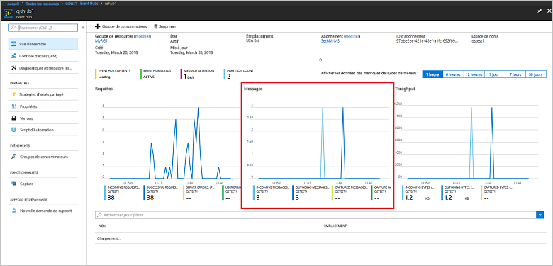

# <a name="quickstart-create-an-event-hub-using-azure-cli"></a>Démarrage rapide : créer un Event Hub à l’aide d’Azure CLI

Azure Event Hubs est une plateforme de flux de données très scalable et un service d’ingestion capable de recevoir et de traiter des millions d’événements par seconde. Ce guide de démarrage rapide montre comment créer des ressources Event Hubs avec Azure CLI, puis comment envoyer et recevoir des flux d’événements depuis un hub d’événements à l’aide de code Java.

Pour suivre ce guide de démarrage rapide, vous devez avoir un abonnement Azure. Si vous n’en avez pas, [créez un compte gratuit][] avant de commencer.

## <a name="prerequisites"></a>Prérequis

[!INCLUDE [cloud-shell-try-it.md](../../includes/cloud-shell-try-it.md)]

Si vous choisissez d’installer et d’utiliser Azure CLI localement, vous devez exécuter Azure CLI version 2.0.4 ou ultérieure pour ce tutoriel. Exécutez `az --version` pour vérifier votre version. Si vous devez effectuer une installation ou une mise à niveau, consultez [Installer Azure CLI]( /cli/azure/install-azure-cli).

## <a name="log-on-to-azure"></a>Se connecter à Azure

Les étapes suivantes ne sont pas obligatoires si vous exécutez des commandes dans Cloud Shell. Si vous utilisez l’interface CLI localement, effectuez les étapes suivantes pour vous connecter à Azure et définir votre abonnement actuel :

Exécutez la commande suivante pour vous connecter à Azure :

```azurecli-interactive
az login
```

Définissez le contexte d’abonnement actuel. Remplacez `MyAzureSub` par le nom de l’abonnement Azure que vous souhaitez utiliser :

```azurecli-interactive
az account set --subscription MyAzureSub
``` 

## <a name="provision-resources"></a>Provisionner les ressources

Utilisez les commandes suivantes pour provisionner les ressources Event Hubs. Veillez à remplacer tous les espaces réservés `myResourceGroup`, `namespaceName`, `eventHubName` et `storageAccountName` par les valeurs appropriées :

```azurecli-interactive
# Create a resource group
az group create --name myResourceGroup --location eastus

# Create an Event Hubs namespace
az eventhubs namespace create --name namespaceName --resource-group myResourceGroup -l eastus2

# Create an event hub
az eventhubs eventhub create --name eventHubName --resource-group myResourceGroup --namespace-name namespaceName

# Create a general purpose standard storage account
az storage account create --name storageAccountName --resource-group myResourceGroup --location eastus2 --sku Standard_RAGRS --encryption blob

# List the storage account access keys
az storage account keys list --resource-group myResourceGroup --account-name storageAccountName

# Get namespace connection string
az eventhubs namespace authorization-rule keys list --resource-group myResourceGroup --namespace-name namespaceName --name RootManageSharedAccessKey
```

Copiez et collez la chaîne de connexion dans un emplacement temporaire, tel que le Bloc-notes, pour l’utiliser ultérieurement.

## <a name="stream-into-event-hubs"></a>Envoyer le flux vers Event Hubs

L’étape suivante consiste à télécharger l’exemple de code qui envoie le flux des événements à un hub d’événements et reçoit ces événements via Event Processor Host. Commencez par envoyer les messages :

Clonez le [dépôt Event Hubs GitHub](https://github.com/Azure/azure-event-hubs) en exécutant la commande suivante :

```bash
git clone https://github.com/Azure/azure-event-hubs.git
```

Accédez au dossier **SimpleSend** : `\azure-event-hubs\samples\Java\Basic\SimpleSend\src\main\java\com\microsoft\azure\eventhubs\samples\SimpleSend`. Ouvrez le fichier SimpleSend.java et remplacez la chaîne `"Your Event Hubs namaspace name"` par l’espace de noms Event Hubs que vous avez obtenu dans la section « Créer un espace de noms Event Hubs » de cet article.

Remplacez `"Your event hub"` par le nom du hub d’événements que vous avez créé dans cet espace de noms, et `"Your policy name"` par le nom de la stratégie d’accès partagé de l’espace de noms. Si vous n’avez pas créé de nouvelle stratégie, le nom par défaut est **RootManageSharedAccessKey**. 

Enfin, remplacez `"Your primary SAS key"` par la valeur de la clé SAP de la stratégie de l’étape précédente.

### <a name="build-the-application"></a>Créer l’application 

Revenez au dossier `\azure-event-hubs\samples\Java\Basic\SimpleSend` et exécutez la commande de build suivante :

```shell
mvn clean package -DskipTests
```

### <a name="receive"></a>Recevoir

Téléchargez maintenant l’exemple Event Processor Host, qui reçoit les messages que vous venez d’envoyer. Accédez au dossier **EventProcessorSample** : `\azure-event-hubs\samples\Java\Basic\EventProcessorSample\src\main\java\com\microsoft\azure\eventhubs\samples\eventprocessorsample`.

Dans le fichier EventProcessorSample.java, remplacez la valeur `----EventHubsNamespaceName-----` par l’espace de noms Event Hubs que vous avez obtenu dans la section « Créer un espace de noms Event Hubs » de cet article. 

Remplacez les autres valeurs de chaîne de ce fichier : remplacez `----EventHubName-----` par le nom du hub d’événements que vous avez créé dans cet espace de noms, et `-----SharedAccessSignatureKeyName-----` par le nom de la stratégie d’accès partagé de l’espace de noms. Si vous n’avez pas créé de nouvelle stratégie, le nom par défaut est **RootManageSharedAccessKey**.

Remplacez `---SharedAccessSignatureKey----` par la valeur de la clé SAP de la stratégie de l’étape précédente, `----AzureStorageConnectionString----` par la chaîne de connexion du compte de stockage que vous avez créé et `----StorageContainerName----` par le nom du conteneur sous le compte de stockage que vous avez créé. 

Enfin, remplacez `----HostNamePrefix----` par le nom du compte de stockage.

### <a name="build-the-receiver"></a>Créer le destinataire 

Pour créer l’application destinataire, accédez au dossier `\azure-event-hubs\samples\Java\Basic\EventProcessorSample` et exécutez la commande suivante :

```shell
mvn clean package -DskipTests
```

### <a name="run-the-apps"></a>Exécuter les applications

Si tout a été créé correctement, vous êtes prêt à envoyer et recevoir des événements. Tout d’abord, exécutez l’application **SimpleSend** et observez les événements en cours d’envoi. Pour exécuter le programme, accédez au dossier `\azure-event-hubs\samples\Java\Basic\SimpleSend` et exécutez la commande suivante :

```shell
java -jar ./target/simplesend-1.0.0-jar-with-dependencies.jar
```

Ensuite, exécutez l’application **EventProcessorSample** et observez les événements en cours de réception. Pour exécuter le programme, accédez au dossier `\azure-event-hubs\samples\Java\Basic\EventProcessorSample` et exécutez la commande suivante :
   
```shell
java -jar ./target/eventprocessorsample-1.0.0-jar-with-dependencies.jar
```

Après avoir exécuté les deux programmes, vous pouvez consulter la page de présentation du portail Azure pour voir le nombre de messages entrants et sortants du hub d’événements :



## <a name="clean-up-resources"></a>Supprimer les ressources

Exécutez la commande suivante pour supprimer le groupe de ressources, l’espace de noms, le compte de stockage et toutes les ressources associées. Remplacez `myResourceGroup` par le nom du groupe de ressources que vous avez créé :

```azurecli
az group delete --resource-group myResourceGroup
```

## <a name="understand-the-sample-code"></a>Comprendre l’exemple de code

Cette section contient plus de détails sur ce que fait l’exemple de code.

### <a name="send"></a>Envoyer

Dans le fichier SimpleSend.java, l’essentiel du travail est effectué dans la méthode main(). Tout d’abord, le code utilise une instance `ConnectionStringBuilder` pour construire la chaîne de connexion en utilisant les valeurs définies par l’utilisateur de l’espace de noms, le nom du hub d’événements, le nom de la clé SAP et la clé SAP elle-même :

```java
final ConnectionStringBuilder connStr = new ConnectionStringBuilder()
        .setNamespaceName("Your Event Hubs namespace name")
        .setEventHubName("Your event hub")
        .setSasKeyName("Your policy name")
        .setSasKey("Your primary SAS key");
```

L’objet Java contenant la charge utile des événements est ensuite converti au format JSON :

```java
final Gson gson = new GsonBuilder().create();

final PayloadEvent payload = new PayloadEvent(1);
byte[] payloadBytes = gson.toJson(payload).getBytes(Charset.defaultCharset());
EventData sendEvent = EventData.create(payloadBytes);  
```

Le client Event Hubs est créé dans cette ligne de code :

```java
final EventHubClient ehClient = EventHubClient.createSync(connStr.toString(), executorService);
```

Le bloc try/finally envoie un tourniquet (round robin) d’événements à une partition non spécifiée :

```java
try {
    for (int i = 0; i < 100; i++) {

        String payload = "Message " + Integer.toString(i);
        //PayloadEvent payload = new PayloadEvent(i);
        byte[] payloadBytes = gson.toJson(payload).getBytes(Charset.defaultCharset());
        EventData sendEvent = EventData.create(payloadBytes);

        // Send - not tied to any partition
        // Event Hubs service will round-robin the events across all EventHubs partitions.
        // This is the recommended & most reliable way to send to EventHubs.
        ehClient.sendSync(sendEvent);
    }

    System.out.println(Instant.now() + ": Send Complete...");
    System.in.read();
} finally {
    ehClient.closeSync();
    executorService.shutdown();
}
```

### <a name="receive"></a>Recevoir 

L’opération de réception se produit dans le fichier EventProcessorSample.java. D’abord, le code déclare des constantes pour contenir le nom de l’espace de noms Event Hubs et d’autres informations d’identification :

```java
String consumerGroupName = "$Default";
String namespaceName = "----NamespaceName----";
String eventHubName = "----EventHubName----";
String sasKeyName = "----SharedAccessSignatureKeyName----";
String sasKey = "----SharedAccessSignatureKey----";
String storageConnectionString = "----AzureStorageConnectionString----";
String storageContainerName = "----StorageContainerName----";
String hostNamePrefix = "----HostNamePrefix----";
```

Comme pour le programme SimpleSend, le code crée ensuite une instance ConnectionStringBuilder pour construire la chaîne de connexion :

```java
ConnectionStringBuilder eventHubConnectionString = new ConnectionStringBuilder()
    .setNamespaceName(namespaceName)
    .setEventHubName(eventHubName)
    .setSasKeyName(sasKeyName)
    .setSasKey(sasKey);
```

*Event Processor Host* est une classe qui simplifie la réception d’événements provenant des hubs d’événements en gérant les points de contrôle persistants et les destinataires parallèles de ces hubs d’événements. À présent, le code crée une instance de `EventProcessorHost` :

```java
EventProcessorHost host = new EventProcessorHost(
    EventProcessorHost.createHostName(hostNamePrefix),
    eventHubName,
    consumerGroupName,
    eventHubConnectionString.toString(),
    storageConnectionString,
    storageContainerName);
```

Après avoir déclaré du code pour la gestion des erreurs, l’application définit la classe `EventProcessor`, une implémentation de l’interface `IEventProcessor`. Cette classe traite les événements reçus :

```java
public static class EventProcessor implements IEventProcessor
{
    private int checkpointBatchingCount = 0;
    ...
```

La méthode `onEvents()` est appelée lorsque les événements sont reçus sur cette partition du hub d’événements :

```java
@Override
public void onEvents(PartitionContext context, Iterable<EventData> events) throws Exception
{
    System.out.println("SAMPLE: Partition " + context.getPartitionId() + " got event batch");
    int eventCount = 0;
    for (EventData data : events)
    {
        try
        {
         System.out.println("SAMPLE (" + context.getPartitionId() + "," + data.getSystemProperties().getOffset() + "," +
                data.getSystemProperties().getSequenceNumber() + "): " + new String(data.getBytes(), "UTF8"));
             eventCount++;
                
         // Checkpointing persists the current position in the event stream for this partition and means that the next
         // time any host opens an event processor on this event hub+consumer group+partition combination, it will start
         // receiving at the event after this one. Checkpointing is usually not a fast operation, so there is a tradeoff
         // between checkpointing frequently (to minimize the number of events that will be reprocessed after a crash, or
         // if the partition lease is stolen) and checkpointing infrequently (to reduce the impact on event processing
         // performance). Checkpointing every five events is an arbitrary choice for this sample.
         this.checkpointBatchingCount++;
         if ((checkpointBatchingCount % 5) == 0)
         {
            System.out.println("SAMPLE: Partition " + context.getPartitionId() + " checkpointing at " +
                    data.getSystemProperties().getOffset() + "," + data.getSystemProperties().getSequenceNumber());
            // Checkpoints are created asynchronously. It is important to wait for the result of checkpointing
            // before exiting onEvents or before creating the next checkpoint, to detect errors and to ensure proper ordering.
            context.checkpoint(data).get();
         }
    }
        catch (Exception e)
        {
            System.out.println("Processing failed for an event: " + e.toString());
        }
    }
    System.out.println("SAMPLE: Partition " + context.getPartitionId() + " batch size was " + eventCount + " for host " + context.getOwner());
}
```

## <a name="next-steps"></a>Étapes suivantes

Dans cet article, vous avez créé un espace de noms Event Hubs et d’autres ressources nécessaires pour envoyer et recevoir des événements depuis votre hub d’événements. Pour en savoir plus, passez au tutoriel suivant :

> [!div class="nextstepaction"]
> [Visualiser les anomalies de données sur les flux de données Event Hubs](event-hubs-tutorial-visualize-anomalies.md)

[créez un compte gratuit]: https://azure.microsoft.com/free/?ref=microsoft.com&utm_source=microsoft.com&utm_medium=docs&utm_campaign=visualstudio
[Install the Azure CLI]: /cli/azure/install-azure-cli
[az group create]: /cli/azure/group#az_group_create
[fully qualified domain name]: https://wikipedia.org/wiki/Fully_qualified_domain_name
