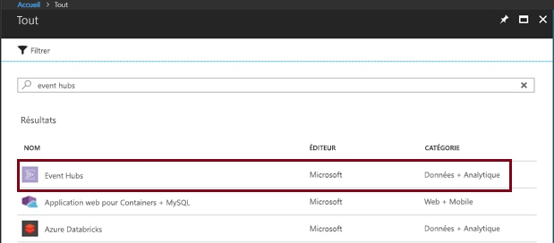
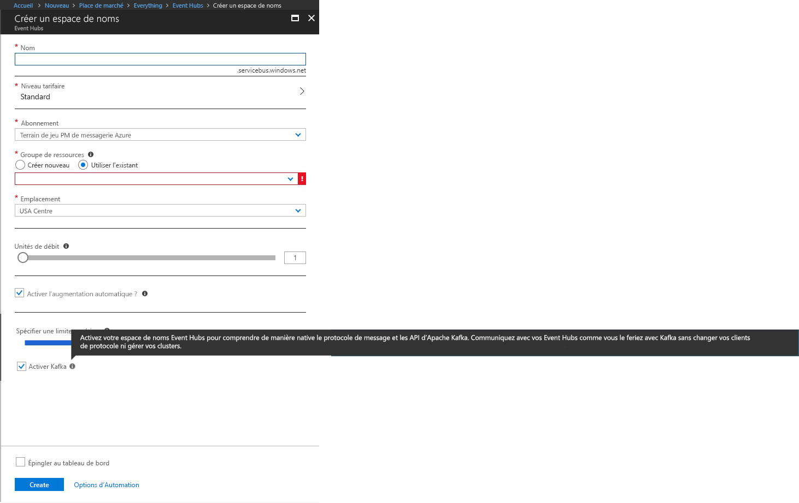
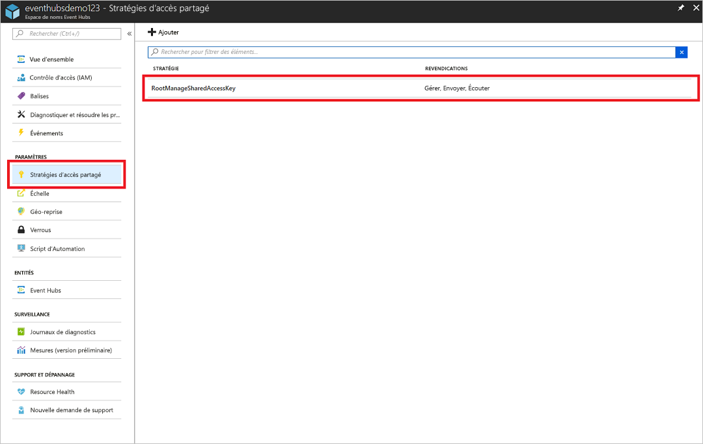
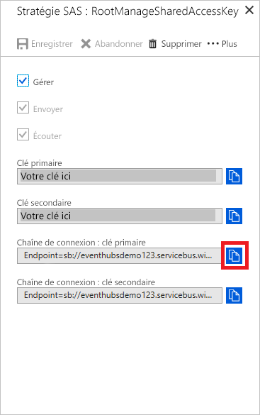

# <a name="data-streaming-with-event-hubs-using-the-kafka-protocol"></a>Streaming de données avec Event Hubs en utilisant le protocole Kafka
Ce guide de démarrage rapide montre comment échanger des données avec Event Hubs prenant en charge Kafka, sans changer vos protocoles clients ni exécuter vos propres clusters. Vous découvrez comment utiliser vos producteurs et vos consommateurs pour communiquer avec Event Hubs prenant en charge Kafka, avec seulement une modification de configuration dans vos applications. Azure Event Hubs prend en charge [Apache Kafka version 1.0.](https://kafka.apache.org/10/documentation.html)

> [!NOTE]
> Cet exemple est disponible sur [GitHub](https://github.com/Azure/azure-event-hubs-for-kafka/tree/master/quickstart/java).

## <a name="prerequisites"></a>Prérequis

Pour suivre ce démarrage rapide, vérifiez que vous avez :

* Lisez l’article [Event Hubs pour Apache Kafka](event-hubs-for-kafka-ecosystem-overview.md).
* Un abonnement Azure. Si vous n’en avez pas, créez un [compte gratuit](https://azure.microsoft.com/free/?ref=microsoft.com&utm_source=microsoft.com&utm_medium=docs&utm_campaign=visualstudio) avant de commencer.
* [Java Development Kit (JDK) 1.7+](https://aka.ms/azure-jdks).
* [Téléchargez](https://maven.apache.org/download.cgi) et [installez](https://maven.apache.org/install.html) une archive binaire Maven.
* [Git](https://www.git-scm.com/)
* [Un espace de noms Event Hubs prenant en charge Kafka](event-hubs-create.md)

## <a name="create-a-kafka-enabled-event-hubs-namespace"></a>Créer un espace de noms Event Hubs prenant en charge Kafka

1. Connectez-vous au [portail Azure](https://portal.azure.com), puis cliquez sur **Créer une ressource** en haut à gauche de l’écran.

2. Recherchez Event Hubs et sélectionnez les options indiquées ici :
    
    
 
3. Spécifiez un nom unique et activez Kafka sur l’espace de noms. Cliquez sur **Créer**. Remarque : Event Hubs pour Kafka est pris en charge uniquement par Event Hubs de niveau standard et dédié. Event Hubs de niveau de base retourne une erreur d’autorisation de rubrique en réponse à toutes les opérations Kafka.
    
    
 
4. Une fois l’espace de noms créé, sous l’onglet **Paramètres**, cliquez sur **Stratégies d’accès partagé** pour obtenir la chaîne de connexion.

    

5. Vous pouvez choisir **RootManageSharedAccessKey** par défaut ou ajouter une nouvelle stratégie. Cliquez sur le nom de la stratégie et copiez la chaîne de connexion. 
    
    
 
6. Ajoutez cette chaîne de connexion à la configuration de votre application Kafka.

Vous pouvez désormais diffuser des événements à partir de vos applications qui utilisent le protocole Kafka dans Event Hubs.

## <a name="send-and-receive-messages-with-kafka-in-event-hubs"></a>Envoyer et recevoir des messages avec Kafka dans Event Hubs

1. Clonez le [dépôt Azure Event Hubs pour Kafka](https://github.com/Azure/azure-event-hubs-for-kafka).

2. Accédez à `azure-event-hubs-for-kafka/quickstart/java/producer`.

3. Mettez à jour les détails de configuration pour le producteur dans `src/main/resources/producer.config` comme suit :

    ```xml
    bootstrap.servers={YOUR.EVENTHUBS.FQDN}:9093
    security.protocol=SASL_SSL
    sasl.mechanism=PLAIN
    sasl.jaas.config=org.apache.kafka.common.security.plain.PlainLoginModule required username="$ConnectionString" password="{YOUR.EVENTHUBS.CONNECTION.STRING}";
    ```
    
4. Exécutez le code du producteur et échangez les données avec Event Hubs prenant en charge Kafka :
   
    ```shell
    mvn clean package
    mvn exec:java -Dexec.mainClass="TestProducer"                                    
    ```
    
5. Accédez à `azure-event-hubs-for-kafka/quickstart/java/consumer`.

6. Mettez à jour les détails de configuration pour le consommateur dans `src/main/resources/consumer.config` comme suit :
   
    ```xml
    bootstrap.servers={YOUR.EVENTHUBS.FQDN}:9093
    security.protocol=SASL_SSL
    sasl.mechanism=PLAIN
    sasl.jaas.config=org.apache.kafka.common.security.plain.PlainLoginModule required username="$ConnectionString" password="{YOUR.EVENTHUBS.CONNECTION.STRING}";
    ```

7. Exécutez le code du consommateur et effectuez le traitement depuis Event Hubs prenant en charge Kafka en utilisant vos clients Kafka :

    ```java
    mvn clean package
    mvn exec:java -Dexec.mainClass="TestConsumer"                                    
    ```

Si votre cluster Kafka Event Hubs a des événements, vous devez maintenant commencer à les recevoir du consommateur.

## <a name="next-steps"></a>Étapes suivantes
Dans cet article, vous avez appris à échanger des données avec Event Hubs prenant en charge Kafka, sans changer vos protocoles clients ni exécuter vos propres clusters. Pour en savoir plus, passez au tutoriel suivant :

* [En savoir plus sur Event Hubs](event-hubs-what-is-event-hubs.md)
* [En savoir plus sur Event Hubs pour Kafka](event-hubs-for-kafka-ecosystem-overview.md)
* [Explorer d’autres exemples sur le site GitHub Event Hubs pour Kafka](https://github.com/Azure/azure-event-hubs-for-kafka)
* Utilisez [MirrorMaker](https://cwiki.apache.org/confluence/pages/viewpage.action?pageId=27846330) pour [diffuser en continu des événements à partir d’un Kafka local vers des Event Hubs prenant en charge Kafka dans le cloud.](event-hubs-kafka-mirror-maker-tutorial.md)
* En savoir plus sur les diffusions dans des Event Hubs compatibles avec Kafka à l’aide des flux [Apache Flink](event-hubs-kafka-flink-tutorial.md) ou [Akka](event-hubs-kafka-akka-streams-tutorial.md)
