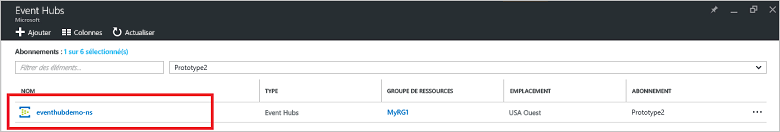
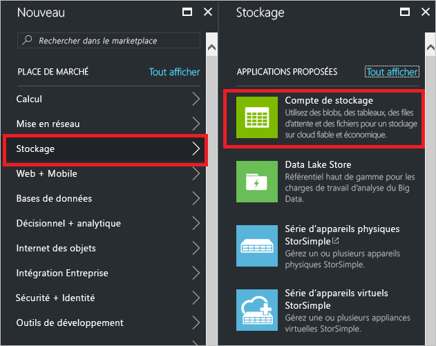
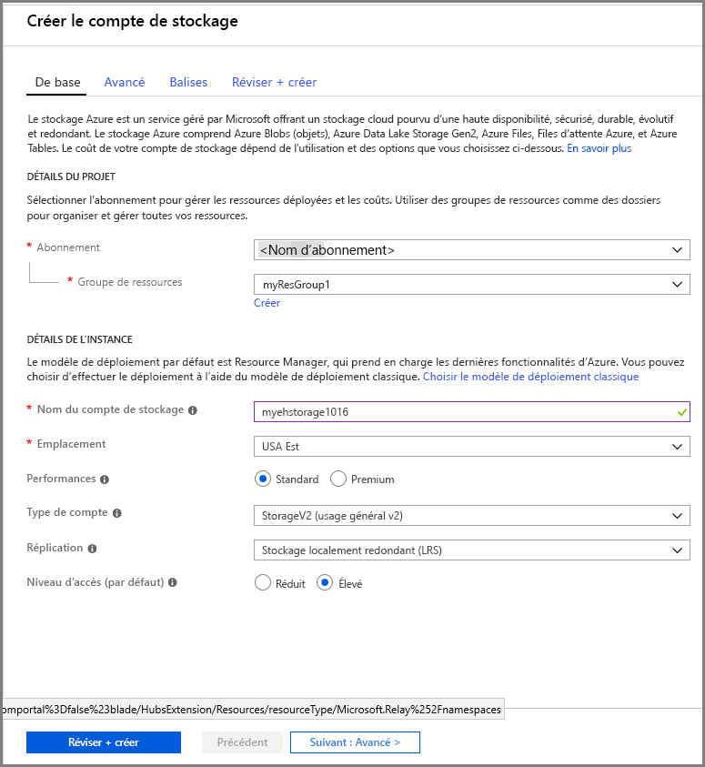
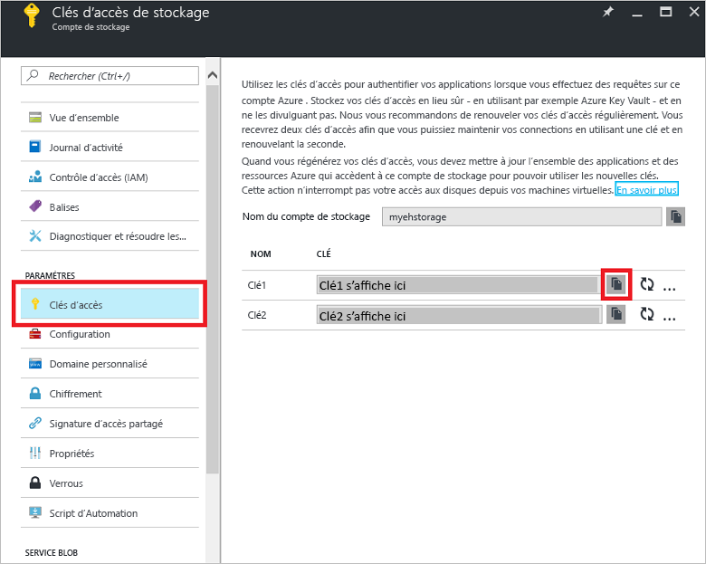

# Démarrage rapide : créer un Event Hub à l’aide du portail Azure

Azure Event Hubs est une plateforme de flux de données très scalable et un service d’ingestion capable de recevoir et de traiter des millions d’événements par seconde. Ce guide de démarrage rapide montre comment créer un hub d’événements avec le [portail Azure](https://portal.azure.com), puis comment envoyer et recevoir depuis et vers un hub d’événements à l’aide du kit SDK .NET Standard.

Pour suivre ce guide de démarrage rapide, vous devez avoir un abonnement Azure. Si vous n’en avez pas, [créez un compte gratuit][] avant de commencer.

## Prérequis

Pour suivre ce guide de démarrage rapide, veillez à avoir :

- [Visual Studio 2017 Update 3 (version 15.3, 26730.01)](http://www.visualstudio.com/vs) ou ultérieur.
- [Kit SDK .NET Standard](https://www.microsoft.com/net/download/windows), version 2.0 ou ultérieure.

## Créer un groupe de ressources

Un groupe de ressources est une collection logique de ressources Azure. Toutes les ressources sont déployées et gérées dans un groupe de ressources. Procédez comme suit pour créer un groupe de ressources :

1. Dans le volet de navigation de gauche, cliquez sur **Groupes de ressources**. Cliquez ensuite sur **Ajouter**.

   ![][1]

2. Tapez un nom unique pour le groupe de ressources. Le système vérifie immédiatement si le nom est disponible dans l’abonnement Azure actuellement sélectionné.

3. Dans **Abonnement**, cliquez sur le nom de l’abonnement Azure dans lequel vous souhaitez créer le groupe de ressources.

4. Sélectionnez un emplacement géographique pour le groupe de ressources.

5. Cliquez sur **Créer**.

   ![][2]

## Créer un espace de noms Event Hubs

Un espace de noms Event Hubs fournit un conteneur d’étendue unique, référencé par son nom de domaine complet, dans lequel vous créez un ou plusieurs hubs d’événements. Pour créer un espace de noms dans votre groupe de ressources à l’aide du portail, procédez comme suit :

1. Connectez-vous au [portail Azure][] et cliquez sur **Créer une ressource** en haut à gauche de l’écran.

2. Cliquez sur **Internet des objets**, puis sur **Event Hubs**.

3. Dans **Créer un espace de noms**, entrez un nom d’espace de noms. Le système vérifie immédiatement si le nom est disponible.

   

4. Lorsque vous avez vérifié la disponibilité de l’espace de noms, sélectionnez le niveau tarifaire (Basique ou Standard). Choisissez également un abonnement Azure, un groupe de ressources et un emplacement où créer la ressource.
 
5. Cliquez sur **Créer** pour créer l’espace de noms. Vous devrez peut-être attendre quelques minutes pour que le système approvisionne entièrement les ressources.

6. Dans la liste des espaces de noms du portail, cliquez sur l’espace de noms que vous venez de créer.

7. Cliquez sur **Stratégies d’accès partagé**, puis sur **RootManageSharedAccessKey**.
    
8. Cliquez sur le bouton Copier pour copier la chaîne de connexion **RootManageSharedAccessKey** dans le Presse-papiers. Enregistrez cette chaîne de connexion dans un emplacement temporaire, tel que le Bloc-notes, pour une utilisation ultérieure.
    
## Créer un hub d’événements

Pour créer un hub d’événements dans l’espace de noms, procédez comme suit :

1. Dans la liste des espaces de noms Event Hubs, cliquez sur le nouvel espace de noms.      
   
     

2. Dans la fenêtre de l’espace de noms, cliquez sur **Event Hubs**.
   
    

1. Cliquez sur **+ Ajouter un hub d’événements** en haut de la fenêtre.
   
    
1. Tapez un nom pour votre hub d’événements, puis cliquez sur **Créer**.
   
    

Félicitations ! Vous avez utilisé le portail pour créer un espace de noms Event Hubs, ainsi qu’un hub d’événements dans cet espace de noms.

## Créer un compte de stockage pour Event Processor Host

Event Processor Host est un agent intelligent qui simplifie la réception d’événements provenant d’Event Hubs en gérant les points de contrôle persistants et les destinataires parallèles. Pour les points de contrôle, Event Processor Host nécessite un compte de stockage. L’exemple suivant montre comment créer un compte de stockage et comment obtenir ses clés pour l’accès :

1. Connectez-vous au [portail Azure][portail Azure], puis cliquez sur **Nouveau** en haut à gauche de l’écran.

2. Cliquez sur **Stockage**, puis sur **Compte de stockage**.
   
    

3. Dans **Créer un compte de stockage**, tapez un nom pour le compte de stockage. Choisissez un abonnement Azure, un groupe de ressources et un emplacement où créer la ressource. Cliquez ensuite sur **Créer**.
   
    

4. Dans la liste des comptes de stockage, cliquez sur le compte de stockage nouvellement créé.

5. Dans la fenêtre du compte de stockage, cliquez sur **Clés d’accès**. Copiez la valeur de **key1** pour l’utiliser ultérieurement.
   
    

## Télécharger et exécuter les exemples

L’étape suivante consiste à exécuter l’exemple de code qui envoie des événements à un hub d’événements et reçoit ces événements via Event Processor Host. 

Commencez par télécharger les exemples [SampleSender](https://github.com/Azure/azure-event-hubs/tree/master/samples/DotNet/Microsoft.Azure.EventHubs/SampleSender) et [SampleEphReceiver](https://github.com/Azure/azure-event-hubs/tree/master/samples/DotNet/Microsoft.Azure.EventHubs/SampleEphReceiver) à partir de GitHub, ou par cloner le [dépôt azure-event-hubs](https://github.com/Azure/azure-event-hubs).

### Expéditeur

1. Ouvrez Visual Studio, puis dans le menu **Fichier**, cliquez sur **Ouvrir** et sur **Projet/Solution**.

2. Recherchez le dossier de l’exemple **SampleSender** que vous avez téléchargé, puis double-cliquez sur le fichier SampleSender.sln pour charger le projet dans Visual Studio.

3. Dans l’Explorateur de solutions, double-cliquez sur Program.cs pour ouvrir le fichier dans l’éditeur de Visual Studio.

4. Remplacez la valeur `EventHubConnectionString` par la chaîne de connexion obtenue quand vous avez créé l’espace de noms.

5. Remplacez `EventHubName` par le nom du hub d’événements que vous avez créé dans cet espace de noms.

6. Dans le menu **Générer**, cliquez sur **Générer la solution** pour être sûr d’avoir aucune erreur.

### Destinataire

1. Ouvrez Visual Studio, puis dans le menu **Fichier**, cliquez sur **Ouvrir** et sur **Projet/Solution**.

2. Recherchez le dossier de l’exemple **SampleEphReceiver** que vous avez déjà téléchargé à l’étape 1, puis double-cliquez sur le fichier SampleEphReceiver.sln pour charger le projet dans Visual Studio.

3. Dans l’Explorateur de solutions, double-cliquez sur Program.cs pour ouvrir le fichier dans l’éditeur de Visual Studio.

4. Remplacez les valeurs de variable suivantes :
    1. `EventHubConnectionString` : Remplacez par la chaîne de connexion obtenue quand vous avez créé l’espace de noms.
    2. `EventHubName` : Nom du hub d’événements que vous avez créé dans cet espace de noms.
    3. `StorageContainerName` : Nom d’un conteneur de stockage. Donnez-lui un nom unique, et le conteneur est créé pour vous lorsque vous exécutez l’application.
    4. `StorageAccountName` : Nom du compte de stockage que vous avez créé.
    5. `StorageAccountKey` : Clé de compte de stockage que vous avez obtenue dans le portail Azure.

5. Dans le menu **Générer**, cliquez sur **Générer la solution** pour être sûr d’avoir aucune erreur.

### Exécuter les applications

Tout d’abord, exécutez l’application **SampleSender** et observez 100 messages en cours d’envoi. Appuyez sur **Entrée** pour mettre fin au programme.

![][3]

Ensuite, exécutez l’application **SampleEphReceiver** et observez les messages en cours de réception dans Event Processor Host.

![][4]
 
## Supprimer les ressources

Vous pouvez utiliser le portail pour supprimer le compte de stockage, l’espace de noms et le hub d’événements. 

1. Dans le portail Azure, cliquez sur **Toutes les ressources** dans le volet de gauche. 
2. Cliquez sur le compte de stockage ou l’espace de noms à supprimer. La suppression de l’espace de noms supprime également les hubs d’événements qu’il contient.
3. Dans la barre de menus en haut de l’écran, cliquez sur **Supprimer**. Confirmez la suppression. 

## Étapes suivantes

Dans cet article, vous avez créé un espace de noms Event Hubs et d’autres ressources nécessaires pour envoyer et recevoir des événements depuis votre hub d’événements. Pour en savoir plus, passez au tutoriel suivant :

> [!div class="nextstepaction"]
> [Visualiser les anomalies de données sur les flux de données Event Hubs](event-hubs-tutorial-visualize-anomalies.md)

[créez un compte gratuit]: https://azure.microsoft.com/free/?ref=microsoft.com&utm_source=microsoft.com&utm_medium=docs&utm_campaign=visualstudio
[Portail Azure]: https://portal.azure.com/
[1]: ./media/event-hubs-quickstart-portal/resource-groups1.png
[2]: ./media/event-hubs-quickstart-portal/resource-groups2.png
[3]: ./media/event-hubs-quickstart-portal/sender1.png
[4]: ./media/event-hubs-quickstart-portal/receiver1.png
