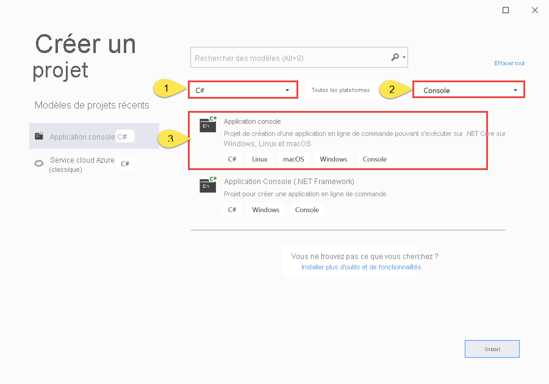
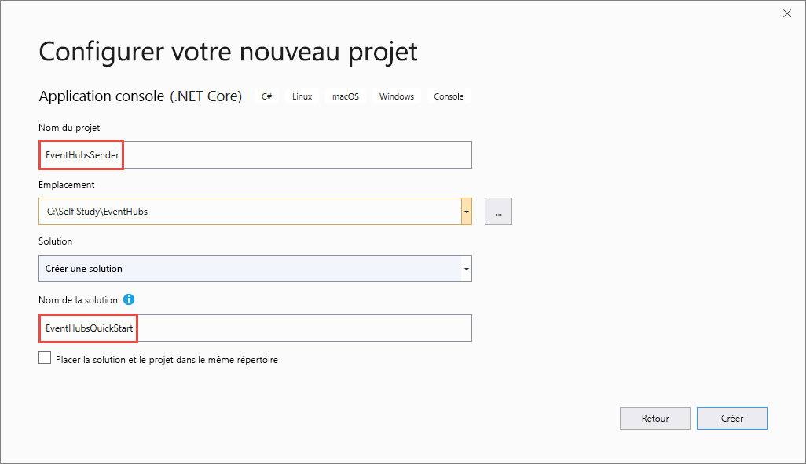

# <a name="send-events-to-and-receive-events-from-azure-event-hubs---net-azuremessagingeventhubs"></a>Réception d’événements en provenance et à destination d’Azure Event Hubs – .NET (Azure.Messaging.EventHubs) 
Ce guide de démarrage rapide montre comment recevoir des événements d’un hub d’événements et lui en envoyer à l’aide de la bibliothèque .NET **Azure.Messaging.EventHubs**. 

> [!IMPORTANT]
> Ce guide de démarrage rapide utilise la nouvelle bibliothèque **Azure.Messaging.EventHubs**. Pour un guide de démarrage rapide qui utilise l’ancienne bibliothèque **Microsoft.Azure.EventHubs**, consultez [Envoyer et recevoir des événements à l’aide de la bibliothèque Microsoft.Azure.EventHubs](event-hubs-dotnet-standard-getstarted-send.md). 


## <a name="prerequisites"></a>Prérequis
Si vous débutez avec Azure Event Hubs, consultez la [vue d’ensemble d’Event Hubs](event-hubs-about.md) avant de suivre ce guide de démarrage rapide. 

Pour effectuer ce démarrage rapide, vous avez besoin de ce qui suit :

- **Abonnement Microsoft Azure**. Pour utiliser les services Azure, y compris Azure Event Hubs, vous avez besoin d’un abonnement.  Si vous n’avez pas de compte Azure, vous pouvez vous inscrire à un [essai gratuit](https://azure.microsoft.com/free/) ou utiliser les avantages de votre abonnement MSDN quand vous [créez un compte](https://azure.microsoft.com).
- **Microsoft Visual Studio 2019**. La bibliothèque cliente Azure Event Hubs utilise les nouvelles fonctionnalités introduites dans C# 8.0.  Vous pouvez toujours utiliser la bibliothèque avec les versions précédentes du langage C#, mais la nouvelle syntaxe ne sera pas disponible. Pour utiliser la syntaxe complète, il est recommandé d’effectuer la compilation avec la version 3.0 ou une version ultérieure du [kit SDK .NET Core](https://dotnet.microsoft.com/download) et la [version du langage](/dotnet/csharp/language-reference/configure-language-version#override-a-default) `latest`. Si vous utilisez Visual Studio, les versions antérieures à Visual Studio 2019 ne sont pas compatibles avec les outils nécessaires à la génération de projets C# 8.0. Visual Studio 2019, y compris l’édition Community gratuite, est téléchargeable [ici](https://visualstudio.microsoft.com/vs/).
- **Créez un espace de noms Event Hubs et un Event Hub**. La première étape consiste à utiliser le [portail Azure](https://portal.azure.com) pour créer un espace de noms de type Event Hubs et obtenir les informations de gestion nécessaires à votre application pour communiquer avec le concentrateur d’événements. Pour créer un espace de noms et un hub d’événements, suivez la procédure décrite dans [cet article](event-hubs-create.md). Ensuite, obtenez la **chaîne de connexion de l’espace de noms Event Hubs** en suivant les instructions à partir de l’article : [Obtenir la chaîne de connexion](event-hubs-get-connection-string.md#get-connection-string-from-the-portal). Vous utiliserez la chaîne de connexion plus loin dans ce guide de démarrage rapide.

## <a name="send-events"></a>Envoyer des événements 
Cette section montre comment créer une application console .NET Core pour envoyer des événements à un hub d’événements. 

### <a name="create-a-console-application"></a>Création d’une application console

1. Démarrez Visual Studio 2019. 
1. Sélectionnez **Créer un projet**. 
1. Dans la boîte de dialogue **Créer un projet**, effectuez les étapes suivantes : Si vous ne voyez pas cette boîte de dialogue, sélectionnez **Fichier** dans le menu, sélectionnez **Nouveau**, puis **Projet**. 
    1. Sélectionnez **C#** en guise de langage de programmation.
    1. Sélectionnez **Console** comme type de l’application. 
    1. Sélectionnez **Application console (.NET Core)** dans la liste des résultats. 
    1. Ensuite, sélectionnez **Suivant**. 

            
1. Entrez **EventHubsSender** comme nom de projet, **EventHubsQuickStart** comme nom de solution, puis sélectionnez **OK** pour créer le projet. 

    

### <a name="add-the-event-hubs-nuget-package"></a>Ajout du package NuGet Event Hubs

1. Cliquez sur **Outils** > **Gestionnaire de package NuGet** > **Console du Gestionnaire de package** à partir du menu. 
1. Exécutez la commande suivante pour installer le package NuGet **Azure.Messaging.EventHubs** :

    ```cmd
    Install-Package Azure.Messaging.EventHubs
    ```


### <a name="write-code-to-send-messages-to-the-event-hub"></a>Écriture de code pour envoyer des messages à un hub d’événements

1. Ajoutez les instructions `using` ci-après en haut du fichier **Program.cs** :

    ```csharp
    using System.Text;
    using System.Threading.Tasks;
    using Azure.Messaging.EventHubs;
    using Azure.Messaging.EventHubs.Producer;
    ```

2. Ajoutez des constantes à la classe `Program` pour la chaîne de connexion Event Hubs et le nom du hub d’événements. Remplacez les espaces réservés entre crochets par les valeurs appropriées que vous avez obtenues lors de la création du hub d’événements. Vérifiez que `{Event Hubs namespace connection string}` est la chaîne de connexion au niveau de l’espace de noms, et pas la chaîne de concentrateur d’événements. 

    ```csharp
    private const string connectionString = "<EVENT HUBS NAMESPACE - CONNECTION STRING>";
    private const string eventHubName = "<EVENT HUB NAME>";
    ```

3. Remplacez la méthode `Main` par la méthode `async Main` suivante. Pour plus d’informations, consultez les commentaires du code. 

    ```csharp
        static async Task Main()
        {
            // Create a producer client that you can use to send events to an event hub
            await using (var producerClient = new EventHubProducerClient(connectionString, eventHubName))
            {
                // Create a batch of events 
                using EventDataBatch eventBatch = await producerClient.CreateBatchAsync();

                // Add events to the batch. An event is a represented by a collection of bytes and metadata. 
                eventBatch.TryAdd(new EventData(Encoding.UTF8.GetBytes("First event")));
                eventBatch.TryAdd(new EventData(Encoding.UTF8.GetBytes("Second event")));
                eventBatch.TryAdd(new EventData(Encoding.UTF8.GetBytes("Third event")));

                // Use the producer client to send the batch of events to the event hub
                await producerClient.SendAsync(eventBatch);
                Console.WriteLine("A batch of 3 events has been published.");
            }
        }
    ```
5. Générez le projet et vérifiez qu’il ne présente pas d’erreurs.
6. Exécutez le programme et attendez le message de confirmation. 
7. Dans le portail Azure, vous pouvez vérifier que le hub d’événements a reçu les messages. Basculez vers l’affichage **Messages** dans la section **Métriques**. Actualisez la page pour mettre à jour le graphique. Cela peut prendre quelques secondes pour indiquer que les messages ont été reçus. 

    [](./media/getstarted-dotnet-standard-send-v2/verify-messages-portal.png#lightbox)

    > [!NOTE]
    > Pour obtenir le code source complet avec des remarques plus détaillées, consultez [ce fichier sur GitHub](https://github.com/Azure/azure-sdk-for-net/blob/master/sdk/eventhub/Azure.Messaging.EventHubs/samples/Sample03_PublishAnEventBatch.cs)

## <a name="receive-events"></a>Recevoir des événements
Cette section explique comment écrire une application console .NET Core qui reçoit des messages d’un hub d’événements à l’aide d’un processeur d’événements. Le processeur d’événements simplifie la réception d’événements provenant des hubs d’événements en gérant les points de contrôle persistants et les réceptions parallèles de ces hubs d’événements. Un processeur d’événements est associé à un hub d’événements et à un groupe de consommateurs spécifiques. Il reçoit les événements de plusieurs partitions dans le hub d’événements, puis les passe à un délégué de gestionnaire à des fins de traitement en utilisant le code que vous fournissez. 


> [!NOTE]
> Si vous exécutez sur Azure Stack Hub, cette plateforme peut prendre en charge une autre version du kit SDK Storage Blob que celles généralement disponibles sur Azure. Par exemple, si vous exécutez [sur Azure Stack Hub version 2002](/azure-stack/user/event-hubs-overview), la version la plus élevée disponible pour le service Stockage est la version 2017-11-09. Dans ce cas, outre les étapes suivantes de cette section, vous devrez également ajouter du code pour cibler la version 2017-11-09 de l’API du service Stockage. Pour obtenir un exemple sur la façon de cibler une version spécifique de l’API de stockage, consultez [cet exemple sur GitHub](https://github.com/Azure/azure-sdk-for-net/tree/master/sdk/eventhub/Azure.Messaging.EventHubs.Processor/samples/Sample10_RunningWithDifferentStorageVersion.cs). Pour plus d’informations sur les versions du service Stockage Azure prises en charge sur Azure Stack Hub, reportez-vous à [Stockage Azure Stack Hub : différences et considérations](/azure-stack/user/azure-stack-acs-differences).

### <a name="create-an-azure-storage-and-a-blob-container"></a>Créer un compte Stockage Azure et un conteneur de blobs
Dans ce guide de démarrage rapide, vous utilisez Stockage Azure comme magasin de points de contrôle. Suivez les étapes ci-dessous pour créer un compte Stockage Azure. 

1. [Création d’un compte de stockage Azure](../storage/common/storage-account-create.md?tabs=azure-portal)
2. Créer un [conteneur d’objets blob](../storage/blobs/storage-quickstart-blobs-portal.md#create-a-container)
3. [Obtenir la chaîne de connexion au compte de stockage](../storage/common/storage-configure-connection-string.md)

    Notez la chaîne de connexion et le nom du conteneur. Vous les utiliserez dans le code de réception. 


### <a name="create-a-project-for-the-receiver"></a>Créer un projet pour le récepteur

1. Dans la fenêtre Explorateur de solutions, cliquez avec le bouton droit sur la solution **EventHubQuickStart**, pointez sur **Ajouter**, puis sélectionnez **Nouveau projet**. 
1. Sélectionnez **Application console (.NET Core)** , puis sélectionnez **Suivant**. 
1. Entrez **EventHubsReceiver** pour **Nom du projet**, puis sélectionnez **Créer**. 

### <a name="add-the-event-hubs-nuget-package"></a>Ajout du package NuGet Event Hubs

1. Cliquez sur **Outils** > **Gestionnaire de package NuGet** > **Console du Gestionnaire de package** à partir du menu. 
1. Exécutez la commande suivante pour installer le package NuGet **Azure.Messaging.EventHubs** :

    ```cmd
    Install-Package Azure.Messaging.EventHubs
    ```
1. Exécutez la commande suivante pour installer le package NuGet **Azure.Messaging.EventHubs.Processor** :

    ```cmd
    Install-Package Azure.Messaging.EventHubs.Processor
    ```    

### <a name="update-the-main-method"></a>Mettre à jour la méthode Main 

1. Ajoutez les instructions `using` suivantes en haut du fichier **Program.cs**.

    ```csharp
    using System.Text;
    using System.Threading.Tasks;
    using Azure.Storage.Blobs;
    using Azure.Messaging.EventHubs;
    using Azure.Messaging.EventHubs.Consumer;
    using Azure.Messaging.EventHubs.Processor;
    ```
1. Ajoutez des constantes à la classe `Program` pour la chaîne de connexion Event Hubs et le nom du hub d’événements. Remplacez les espaces réservés entre crochets par les valeurs appropriées que vous avez obtenues lors de la création du hub d’événements. Remplacez les espaces réservés entre crochets par les valeurs appropriées que vous avez obtenues lors de la création du hub d’événements et du compte de stockage (clés d’accès, chaîne de connexion principale). Vérifiez que `{Event Hubs namespace connection string}` est la chaîne de connexion au niveau de l’espace de noms, et pas la chaîne de concentrateur d’événements.

    ```csharp
        private const string ehubNamespaceConnectionString = "<EVENT HUBS NAMESPACE - CONNECTION STRING>";
        private const string eventHubName = "<EVENT HUB NAME>";
        private const string blobStorageConnectionString = "<AZURE STORAGE CONNECTION STRING>";
        private const string blobContainerName = "<BLOB CONTAINER NAME>";
    ```
3. Remplacez la méthode `Main` par la méthode `async Main` suivante. Pour plus d’informations, consultez les commentaires du code. 

    ```csharp
        static async Task Main()
        {
            // Read from the default consumer group: $Default
            string consumerGroup = EventHubConsumerClient.DefaultConsumerGroupName;

            // Create a blob container client that the event processor will use 
            BlobContainerClient storageClient = new BlobContainerClient(blobStorageConnectionString, blobContainerName);

            // Create an event processor client to process events in the event hub
            EventProcessorClient processor = new EventProcessorClient(storageClient, consumerGroup, ehubNamespaceConnectionString, eventHubName);

            // Register handlers for processing events and handling errors
            processor.ProcessEventAsync += ProcessEventHandler;
            processor.ProcessErrorAsync += ProcessErrorHandler;

            // Start the processing
            await processor.StartProcessingAsync();

            // Wait for 10 seconds for the events to be processed
            await Task.Delay(TimeSpan.FromSeconds(10));

            // Stop the processing
            await processor.StopProcessingAsync();
        }    
    ```
1. À présent, ajoutez à la classe les méthodes de gestionnaire d’erreurs et d’événements suivantes. 

    ```csharp
        static async Task ProcessEventHandler(ProcessEventArgs eventArgs)
        {
            // Write the body of the event to the console window
            Console.WriteLine("\tRecevied event: {0}", Encoding.UTF8.GetString(eventArgs.Data.Body.ToArray()));

            // Update checkpoint in the blob storage so that the app receives only new events the next time it's run
            await eventArgs.UpdateCheckpointAsync(eventArgs.CancellationToken);
        }

        static Task ProcessErrorHandler(ProcessErrorEventArgs eventArgs)
        {
            // Write details about the error to the console window
            Console.WriteLine($"\tPartition '{ eventArgs.PartitionId}': an unhandled exception was encountered. This was not expected to happen.");
            Console.WriteLine(eventArgs.Exception.Message);
            return Task.CompletedTask;
        }    
    ```
1. Générez le projet et vérifiez qu’il ne présente pas d’erreurs.

    > [!NOTE]
    > Pour obtenir le code source complet avec des remarques plus détaillées, consultez [ce fichier sur GitHub](https://github.com/Azure/azure-sdk-for-net/blob/master/sdk/eventhub/Azure.Messaging.EventHubs.Processor/samples/Sample01_HelloWorld.cs).
6. Exécutez l’application réceptrice. 
1. Vous devez voir un message indiquant que l’événement a été reçu. 

    

    Ces événements sont les trois événements que vous avez envoyés au hub d’événements en exécutant le programme émetteur. 


## <a name="next-steps"></a>Étapes suivantes
Consultez les exemples sur GitHub. 

- [Exemples Event Hubs sur GitHub](https://github.com/Azure/azure-sdk-for-net/tree/master/sdk/eventhub/Azure.Messaging.EventHubs/samples)
- [Exemples de processeurs d’événement sur GitHub](https://github.com/Azure/azure-sdk-for-net/tree/master/sdk/eventhub/Azure.Messaging.EventHubs.Processor/samples)
- [Exemple de contrôle d’accès en fonction du rôle (RBAC)](https://github.com/Azure/azure-event-hubs/tree/master/samples/DotNet/Azure.Messaging.EventHubs/ManagedIdentityWebApp)
