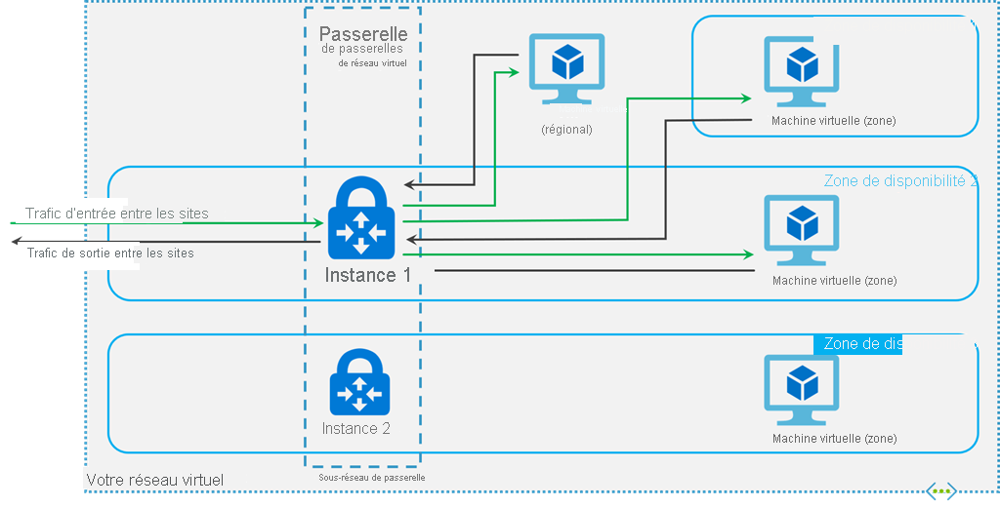

# <a name="about-expressroute-virtual-network-gateways"></a>À propos des passerelles de réseau virtuel ExpressRoute

Pour connecter votre réseau virtuel Azure et votre réseau local via ExpressRoute, vous devez d’abord créer une passerelle réseau virtuelle. Une passerelle réseau virtuelle a deux objectifs : échanger des itinéraires IP entre les réseaux et acheminer le trafic du réseau. Cet article contient des informations sur les SKU de passerelle, les performances estimées par SKU et les types de passerelle. Cet article présente également ExpressRoute [FastPath](#fastpath), une fonctionnalité qui permet au trafic réseau de votre réseau local de contourner la passerelle réseau virtuelle pour améliorer les performances.

## <a name="gateway-types"></a>Types de passerelle

Lorsque vous créez une passerelle de réseau virtuel, vous devez spécifier plusieurs paramètres. L’un des paramètres requis, « Type Passerelle », spécifie si la passerelle est utilisée pour le trafic ExpressRoute, ou le trafic VPN. Les types de passerelles sont les suivants:

* **Vpn** : Pour envoyer le trafic chiffré sur l’Internet public, vous utilisez le type de passerelle « Vpn ». Il s’agit alors d’une passerelle VPN. Les connexions site à site, point à site et réseau virtuel à réseau virtuel utilisent toutes une passerelle VPN.

* **ExpressRoute** : Pour envoyer le trafic réseau sur une connexion privée, vous utilisez le type de passerelle « ExpressRoute ». Ce type de passerelle est également appelé « passerelle ExpressRoute » et est utilisé lors de la configuration d'ExpressRoute.

Chaque réseau virtuel ne peut posséder qu’une seule passerelle de réseau virtuel par type de passerelle. Par exemple, une passerelle de réseau virtuel peut utiliser le type de passerelle VPN et une autre le type de passerelle ExpressRoute.

## <a name="gateway-skus"></a><a name="gwsku"></a>SKU de passerelle
[!INCLUDE [expressroute-gwsku-include](../../includes/expressroute-gwsku-include.md)]

Si vous souhaitez mettre à niveau votre passerelle vers une référence (SKU) de passerelle plus puissante, dans la plupart des cas, vous pouvez utiliser la cmdlet PowerShell « Resize-AzVirtualNetworkGateway ». Cela fonctionne pour les mises à niveau vers les références (SKU) Standard HighPerformance. Toutefois, pour mettre à niveau vers la référence (SKU) UltraPerformance, vous devez recréer la passerelle. La recréation d’une passerelle entraîne un temps d’arrêt.

### <a name="estimated-performances-by-gateway-sku"></a><a name="aggthroughput"></a>Performances estimées par référence (SKU) de passerelle
Le tableau ci-dessous présente les types de passerelle et les performances estimées. Cette table s’applique aux modèles de déploiement classique et Resource Manager.

[!INCLUDE [expressroute-table-aggthroughput](../../includes/expressroute-table-aggtput-include.md)]

> [!IMPORTANT]
> Les performances de l’application dépendent de plusieurs facteurs, tels que la latence de bout en bout et le nombre de flux de trafic que l’application ouvre. Les numéros indiqués dans le tableau représentent la limite supérieure que l’application peut théoriquement atteindre dans un environnement idéal.
>
>

## <a name="gateway-subnet"></a><a name="gwsub"></a>Sous-réseau de passerelle

Avant de créer votre passerelle ExpressRoute, vous devez d’abord créer un sous-réseau de passerelle. Le sous-réseau de passerelle contient les adresses IP utilisées par les machines virtuelles et les services de passerelle de réseau virtuel. Lors de la création de votre passerelle de réseau virtuel, les machines virtuelles de passerelle sont déployées dans le sous-réseau de passerelle et configurées avec les paramètres de passerelle ExpressRoute requis. Ne déployez jamais d’autres éléments (des machines virtuelles supplémentaires, par exemple) dans le sous-réseau de passerelle. Pour fonctionner correctement, le sous-réseau de passerelle doit être nommé ’GatewaySubnet’. En nommant le sous-réseau de passerelle « GatewaySubnet », Azure est informé qu'il s’agit du sous-réseau dans lequel déployer les machines virtuelles et les services de passerelle de réseau virtuel.

>[!NOTE]
>[!INCLUDE [vpn-gateway-gwudr-warning.md](../../includes/vpn-gateway-gwudr-warning.md)]
>

Lorsque vous créez le sous-réseau de passerelle, vous spécifiez le nombre d’adresses IP que contient le sous-réseau. Les adresses IP dans le sous-réseau de passerelle sont allouées aux machines virtuelles et aux services de passerelle. Certaines configurations nécessitent plus d’adresses IP que d’autres. 

Pour planifier la taille de votre sous-réseau de passerelle, consultez la documentation correspondant à la configuration que vous envisagez de créer. Par exemple, la configuration de coexistence ExpressRoute/passerelle VPN nécessite un sous-réseau de passerelle plus important que la plupart des autres configurations. De plus, assurez-vous que votre sous-réseau de passerelle contient suffisamment d’adresses IP pour pouvoir prendre en charge d’éventuelles nouvelles configurations. Même si vous pouvez créer un petit sous-réseau de passerelle (jusqu’à une taille /29), nous vous recommandons d’en créer un de taille /27 ou supérieure (/27, /26, etc.) si l’espace d’adressage disponible est suffisant. Ceci conviendra à la plupart des configurations.

L’exemple PowerShell Resource Manager suivant montre un sous-réseau de passerelle nommé GatewaySubnet. Vous pouvez voir que la notation CIDR spécifie une taille /27, ce qui permet d’avoir un nombre suffisamment élevé d’adresses IP pour la plupart des configurations actuelles.

```azurepowershell-interactive
Add-AzVirtualNetworkSubnetConfig -Name 'GatewaySubnet' -AddressPrefix 10.0.3.0/27
```

[!INCLUDE [vpn-gateway-no-nsg](../../includes/vpn-gateway-no-nsg-include.md)]

### <a name="zone-redundant-gateway-skus"></a><a name="zrgw"></a>Références SKU de passerelles redondantes interzone

Vous pouvez également déployer des passerelles ExpressRoute dans des zones de disponibilité Azure. Cela les sépare physiquement et logiquement dans différentes zones de disponibilité, tout en protégeant votre connectivité de réseau local à Azure des échecs au niveau de la zone.



Les passerelles redondantes interzone utilisent de nouvelles références SKU spécifiques de passerelle pour la passerelle ExpressRoute.

* ErGw1AZ
* ErGw2AZ
* ErGw3AZ

Les nouvelles références SKU de passerelle prennent également en charge les autres options de déploiement pour mieux répondre à vos besoins. Lorsque vous créez une passerelle de réseau virtuel avec les nouvelles références SKU de passerelle, vous avez également la possibilité de déployer la passerelle dans une zone spécifique. Il s’agit alors d’une passerelle zonale. Lorsque vous déployez une passerelle zonale, les deux instances de la passerelle sont déployées dans la même zone de disponibilité.

## <a name="fastpath"></a><a name="fastpath"></a>FastPath

La passerelle de réseau virtuel ExpressRoute est conçue pour échanger des routages réseau et acheminer le trafic du réseau. FastPath est conçu pour améliorer les performances du chemin d’accès aux données entre votre réseau local et votre réseau virtuel. Lorsqu’il est activé, FastPath envoie le trafic réseau directement vers les machines virtuelles du réseau virtuel, en contournant la passerelle.

Pour plus d’informations sur FastPath, notamment ses limitations et conditions, consultez [À propos de FastPath](about-fastpath.md).

## <a name="rest-apis-and-powershell-cmdlets"></a><a name="resources"></a>API REST et applets de commande PowerShell
Pour accéder à des ressources techniques supplémentaires et connaître les exigences spécifiques en matière de syntaxe lors de l’utilisation d’API REST et d’applets de commande PowerShell pour les configurations de passerelles de réseau virtuel, consultez les pages suivantes :

| **Classique** | **Resource Manager** |
| --- | --- |
| [PowerShell](/powershell/module/servicemanagement/azure.service/?view=azuresmps-4.0.0#azure) |[PowerShell](/powershell/module/az.network#networking) |
| [REST API](/previous-versions/azure/reference/jj154113(v=azure.100)) |[REST API](/rest/api/virtual-network/) |

## <a name="next-steps"></a>Étapes suivantes

Pour plus d’informations sur les configurations de connexion disponibles, consultez [Vue d’ensemble d’ExpressRoute](expressroute-introduction.md).

Pour plus d’informations sur la création de passerelles ExpressRoute, consultez [Créer une passerelle de réseau virtuel pour ExpressRoute](expressroute-howto-add-gateway-resource-manager.md).

Pour plus d’informations sur la configuration des passerelles redondantes interzone, consultez [Créer une passerelle de réseau virtuel redondante interzone](../../articles/vpn-gateway/create-zone-redundant-vnet-gateway.md).

Pour plus d’informations sur FastPath, consultez [À propos de FastPath](about-fastpath.md).