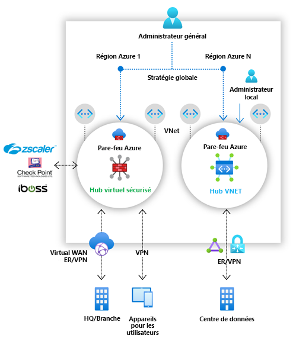

# Qu’est-ce qu’Azure Firewall Manager ?

Azure Firewall Manager est un service de gestion de la sécurité qui propose une stratégie de sécurité centralisée et une gestion des routes pour les périmètres de sécurité basés sur le cloud. 

Firewall Manager assure la gestion de la sécurité pour deux types d’architecture réseau :

- **Hub virtuel sécurisé**

   Un [hub Azure Virtual WAN](../virtual-wan/virtual-wan-about.md#resources) est une ressource gérée par Microsoft qui vous permet de créer facilement des architectures « Hub and Spoke ». Lorsque les stratégies de sécurité et de routage sont associées à un hub, elles sont appelées *[hub virtuel sécurisé](secured-virtual-hub.md)* . 
- **Réseau virtuel hub**

   Il s’agit d’un réseau virtuel Azure standard que vous créez et gérez vous-même. Quand des stratégies de sécurité sont associées à un hub de ce type, on parle de *réseau virtuel hub*. Pour l’instant, seule la stratégie de pare-feu Azure est prise en charge. Vous pouvez appairer des réseaux virtuels spoke qui contiennent vos services et serveurs de charge de travail. Vous pouvez également gérer les pare-feu dans des réseaux virtuels autonomes qui ne sont associés à aucun réseau spoke.

Pour avoir une comparaison détaillée des architectures de *hub virtuel sécurisé* et de *réseau virtuel hub*, consultez [Quelles sont les options d’architecture d’Azure Firewall Manager ?](vhubs-and-vnets.md)

## Fonctionnalités d’Azure Firewall Manager

Azure Firewall Manager offre les fonctionnalités suivantes :

### Configuration et déploiement centralisés du Pare-feu Azure

Vous pouvez déployer et configurer de manière centralisée plusieurs instances du Pare-feu Azure qui s’étendent sur différentes régions et différents abonnements Azure. 

### Stratégies hiérarchiques (mondiales et locales)

Vous pouvez utiliser Azure Firewall Manager pour gérer de manière centralisée les stratégies de Pare-feu Azure sur plusieurs hubs virtuels sécurisés. Vos équipes informatiques centrales peuvent créer des stratégies de pare-feu globales pour appliquer la stratégie de pare-feu à l’échelle de l’organisation et dans différentes équipes. Les stratégies de pare-feu créées localement autorisent un modèle en libre-service DevOps qui offre une meilleure agilité.

### Intégration à une sécurité de tiers en tant que service pour une sécurité avancée

En plus du Pare-feu Azure, vous pouvez intégrer des fournisseurs SECaaS (Security as a service) tiers afin de fournir une protection réseau supplémentaire pour vos connexions Internet de réseau virtuel et de succursale.

Cette fonctionnalité est disponible uniquement avec les déploiements de hubs virtuels sécurisés.

- Filtrage du trafic de réseau virtuel à Internet (V2I, VNet to Internet)

   - Filtrez le trafic réseau virtuel sortant avec votre fournisseur de sécurité tiers préféré.
   - Tirez parti de la protection Internet avancée prenant en charge l’utilisateur pour vos charges de travail cloud s’exécutant sur Azure.

- Filtrage du trafic de succursale à Internet (B2I, Branch to Internet)

   Tirez parti de votre connectivité Azure et de votre distribution mondiale pour ajouter facilement un filtrage tiers dans le cadre des scénarios de type « filiale vers Internet ».

Pour plus d’informations sur les fournisseurs de partenaire de sécurité, consultez [Que sont les fournisseurs de partenaire de sécurité Azure Firewall Manager ?](trusted-security-partners.md)

### Gestion de routes centralisée

Routez facilement le trafic vers votre hub sécurisé pour le filtrage et la journalisation sans qu’il soit nécessaire de configurer manuellement des routes définies par l’utilisateur sur des réseaux virtuels spoke. 

Cette fonctionnalité est disponible uniquement avec les déploiements de hubs virtuels sécurisés.

Vous pouvez utiliser des fournisseurs tiers pour le filtrage du trafic B2I (Branch to Internet), côte à côte avec le Pare-feu Azure pour le filtrage Branch to VNet (B2V), VNet to VNet (V2V) et VNet to Internet (V2I). Vous pouvez également utiliser des fournisseurs tiers pour le filtrage du trafic V2I tant que le Pare-feu Azure n’est pas requis pour le filtrage B2V ou V2V. 

## Disponibilité des régions

Les stratégies de pare-feu Azure sont utilisables dans plusieurs régions. Par exemple, vous pouvez créer une stratégie dans la région USA Ouest et l’utiliser dans la région USA Est. 

## Problèmes connus

Les problèmes connus d’Azure Firewall Manager sont les suivants :

|Problème  |Description  |Limitation des risques  |
|---------|---------|---------|
|La division du trafic n’est pas prise en charge.|Le fractionnement du trafic Office 365 et du trafic PaaS public Azure n’est pas pris en charge actuellement. Par conséquent, la sélection d’un fournisseur tiers pour V2I ou B2I envoie également tout le trafic PaaS public Azure et le trafic Office 365 via le service partenaire.|Enquête sur la division du trafic au niveau du hub.
|Un seul hub virtuel sécurisé par région.|Vous ne pouvez pas avoir plus d’un hub virtuel sécurisé par région.|Créez plusieurs réseaux étendus virtuels dans une région.|
|Les stratégies de base doivent se trouver dans la même région que la stratégie locale.|Créez toutes vos stratégies locales dans la même région que la stratégie de base. Vous pouvez toujours appliquer une stratégie qui a été créée dans une région sur un hub sécurisé à partir d’une autre région.|Enquête|
|La communication entre les hubs ne transite pas par le hub virtuel sécurisé|La communication de hub virtuel sécurisé à hub virtuel sécurisé n’est pas encore prise en charge ; toutefois, la communication de hub à hub fonctionne toujours.|Enquête|
|Tous les hubs virtuels sécurisés partageant le même réseau étendu virtuel doivent se trouver dans le même groupe de ressources.|Ce comportement est aujourd’hui cohérent avec les hubs Virtual WAN.|Créez plusieurs réseaux étendus virtuels pour permettre la création de hubs virtuels sécurisés dans différents groupes de ressources.|

## Étapes suivantes

- Passer en revue [Vue d’ensemble du déploiement d’Azure Firewall Manager](deployment-overview.md)
- En savoir plus sur les [hubs virtuels sécurisés](secured-virtual-hub.md)
