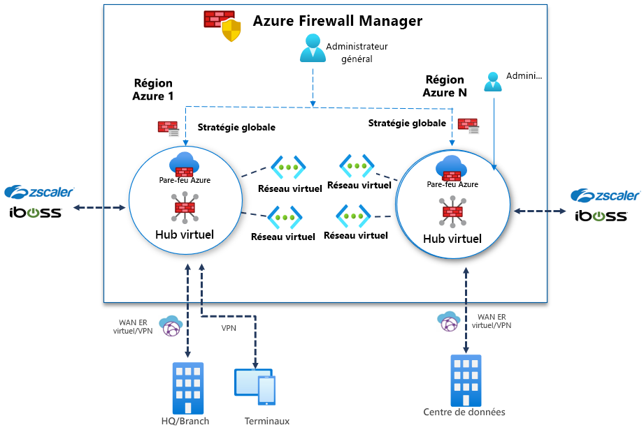

# Présentation de la préversion d’Azure Firewall Manager

[!INCLUDE [Preview](../../includes/firewall-manager-preview-notice.md)]

Azure Firewall Manager en préversion est un service de gestion de la sécurité qui fournit une stratégie de sécurité centralisée et la gestion des itinéraires pour les périmètres de sécurité basés sur le cloud. Il fonctionne avec le [Hub Azure Virtual WAN](../virtual-wan/virtual-wan-about.md#resources), ressource managée par Microsoft qui vous permet de créer facilement des architectures « Hub and Spoke ». Lorsque les stratégies de sécurité et de routage sont associées à un hub, elles sont appelées *[hub virtuel sécurisé](secured-virtual-hub.md)* . 

## Fonctionnalités de la préversion d’Azure Firewall Manager

La préversion d’Azure Firewall Manager offre les fonctionnalités suivantes :

### Configuration et déploiement centralisés du Pare-feu Azure

Vous pouvez déployer et configurer de manière centralisée plusieurs instances du Pare-feu Azure qui s’étendent sur différentes régions et différents abonnements Azure. 

### Stratégies hiérarchiques (mondiales et locales)

Vous pouvez utiliser la préversion d’Azure Firewall Manager pour gérer de manière centralisée les stratégies de Pare-feu Azure sur plusieurs hubs virtuels sécurisés. Vos équipes informatiques centrales peuvent créer des stratégies de pare-feu globales pour appliquer la stratégie de pare-feu à l’échelle de l’organisation et dans différentes équipes. Les stratégies de pare-feu créées localement autorisent un modèle en libre-service DevOps qui offre une meilleure agilité.

### Intégration à une sécurité de tiers en tant que service pour une sécurité avancée

En plus du Pare-feu Azure, vous pouvez intégrer des fournisseurs SECaaS (Security as a service) tiers afin de fournir une protection réseau supplémentaire pour vos connexions Internet de réseau virtuel et de succursale.

- Filtrage du trafic de réseau virtuel à Internet (V2I, VNet to Internet)

   - Filtrez le trafic réseau virtuel sortant avec votre fournisseur de sécurité tiers préféré.
   - Tirez parti de la protection Internet avancée prenant en charge l’utilisateur pour vos charges de travail cloud s’exécutant sur Azure.

- Filtrage du trafic de succursale à Internet (B2I, Branch to Internet)

   Tirez parti de votre connectivité Azure et de votre distribution mondiale pour ajouter facilement un filtrage tiers dans le cadre des scénarios de type « filiale vers Internet ».

Pour plus d’informations sur les fournisseurs de sécurité approuvés, consultez [Présentation des partenaires de sécurité de confiance Azure Firewall Manager (préversion)](trusted-security-partners.md)

### Gestion de routes centralisée

Routez facilement le trafic vers votre hub sécurisé pour le filtrage et la journalisation sans qu’il soit nécessaire de configurer manuellement des routes définies par l’utilisateur sur des réseaux virtuels spoke. Vous pouvez utiliser des fournisseurs tiers pour le filtrage du trafic B2I (Branch to Internet), côte à côte avec le Pare-feu Azure pour le filtrage Branch to VNet (B2V), VNet to VNet (V2V) et VNet to Internet (V2I). Vous pouvez également utiliser des fournisseurs tiers pour le filtrage du trafic V2I tant que le Pare-feu Azure n’est pas requis pour le filtrage B2V ou V2V. 

## Disponibilité des régions

Pour la préversion publique, les régions suivantes sont prises en charge :

- Europe Ouest, Europe Nord, France Centre, France Sud, Royaume-Uni Ouest, Royaume-Uni Sud
- Australie Est, Australie Centre, Australie Centre 2, Australie Sud-Est
- Centre du Canada
- USA Est, USA Ouest, USA Est 2, USA Centre Sud, USA Ouest 2, USA Centre, USA Centre Nord, USA Centre-Ouest

Les stratégies de Pare-feu Azure peuvent être créées uniquement dans ces régions, mais elles peuvent être utilisées dans toutes les régions. Par exemple, vous pouvez créer une stratégie dans la région USA Ouest et l’utiliser dans la région USA Est. 

## Problèmes connus

Les problèmes connus de la préversion d’Azure Firewall Manager sont les suivants :

|Problème  |Description  |Atténuation  |
|---------|---------|---------|
|Réseaux virtuels centraux créés manuellement non pris en charge|Actuellement, Azure Firewall Manager prend en charge les réseaux créés avec des hubs virtuels. L’utilisation de votre propre réseau virtuel de hub créé manuellement n’est pas encore prise en charge.|Pour l’instant, utilisez Azure Firewall Manager avec des réseaux hub-and-spoke créés avec des hubs virtuels. Correction en cours.
|Limitations du filtrage tiers|Le filtrage du trafic V2I avec des fournisseurs tiers n’est pas pris en charge avec le Pare-feu Azure B2V et V2V.|Investigation en cours.|
|Le fractionnement du trafic n’est actuellement pas pris en charge|Le fractionnement du trafic Office 365 et du trafic PaaS public Azure n’est pas pris en charge actuellement. Par conséquent, la sélection d’un fournisseur tiers pour V2I ou B2I envoie également tout le trafic PaaS public Azure et le trafic Office 365 via le service partenaire.|Examen en cours du fractionnement du trafic au niveau du hub.
|Un hub par région|Seul un hub par région est autorisé.|Créez plusieurs réseaux étendus virtuels dans une région.|
|Les stratégies de base doivent se trouver dans la même région que la stratégie locale.|Créez toutes vos stratégies locales dans la même région que la stratégie de base. Vous pouvez toujours appliquer une stratégie qui a été créée dans une région sur un hub sécurisé à partir d’une autre région.|Investigation en cours.|
|La communication entre les hubs ne fonctionne pas pour les hubs virtuels sécurisés|La communication de hub virtuel sécurisé à hub virtuel sécurisé n’est pas encore prise en charge.|Investigation en cours.|
|Tous les hubs virtuels sécurisés partageant le même réseau étendu virtuel doivent se trouver dans le même groupe de ressources.|Ce comportement est aujourd’hui cohérent avec les hubs Virtual WAN.|Créez plusieurs réseaux étendus virtuels pour permettre la création de hubs virtuels sécurisés dans différents groupes de ressources.|

## Étapes suivantes

- Consultez [Vue d’ensemble du déploiement d’Azure Firewall Manager en préversion](deployment-overview.md)
- En savoir plus sur les [hubs virtuels sécurisés](secured-virtual-hub.md)