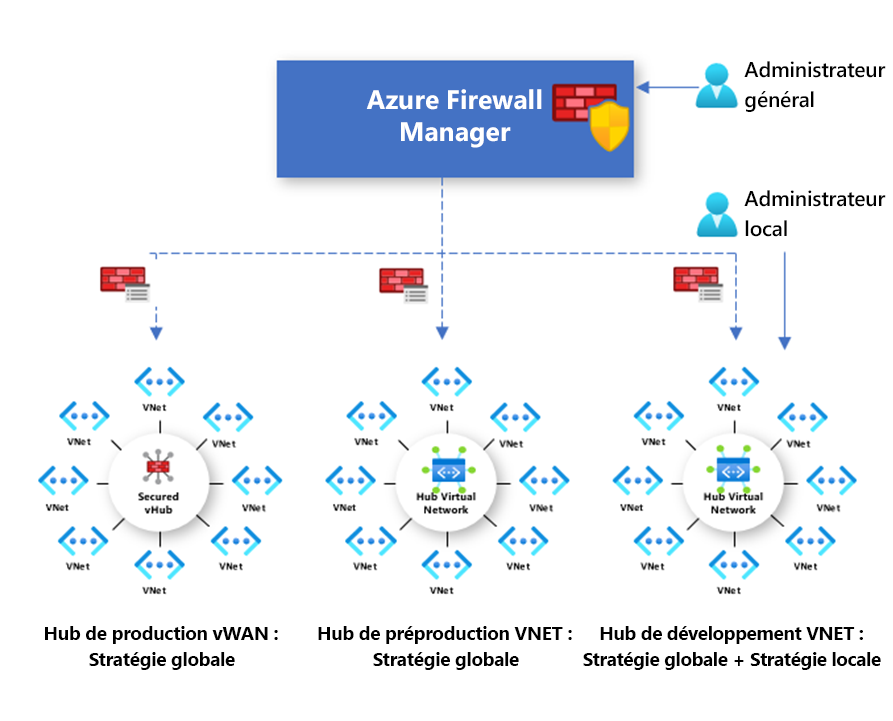

# Vue d’ensemble des stratégies Azure Firewall Manager (préversion)

[!INCLUDE [Preview](../../includes/firewall-manager-preview-notice.md)]

Une stratégie de pare-feu est une ressource Azure qui contient des collections de règles NAT, de réseau et d’application ainsi que des paramètres du renseignement sur les menaces. Cette ressource globale peut s’utiliser sur plusieurs instances du Pare-feu Azure dans des hubs virtuels sécurisés et des réseaux virtuels hubs. Les stratégies sont applicables sur plusieurs régions et abonnements.

## Création et association d’une stratégie

Une stratégie peut être créée et gérée de plusieurs façons, notamment avec le portail Azure, l’API REST, des modèles, Azure PowerShell et l’interface CLI.

Vous pouvez également créer des stratégies en migrant des règles existantes du Pare-feu Azure à l’aide du portail ou d’Azure PowerShell. Pour plus d’informations, consultez [Guide pratique pour migrer des configurations Pare-feu Azure vers une stratégie Pare-feu Azure (préversion)](migrate-to-policy.md). 

Les stratégies peuvent être associées à un ou plusieurs hubs virtuels ou réseaux virtuels. Le pare-feu peut être utilisé dans n’importe quel abonnement associé à votre compte et dans toutes les régions.

## Stratégies hiérarchiques

Les stratégies peuvent être créées à partir de zéro ou être héritées de stratégies existantes. Avec l’héritage, DevOps crée des stratégies de pare-feu locales en plus de la stratégie de base mise en place dans l’organisation.

Les stratégies qui sont créées à partir de stratégies parentes non vides héritent toutes les collections de règles de la stratégie parente. Les collections de règles de réseau héritées d’une stratégie parent sont toujours prioritaires sur les collections de règles de réseau définies dans le cadre d’une nouvelle stratégie. La même logique s’applique également aux collections de règles d’application. Cependant, les collections de règles de réseau sont toujours traitées avant les collections de règles d’application quel que soit l’héritage.

Le mode de renseignement sur les menaces est également hérité de la stratégie parente. Vous pouvez définir ce mode à une autre valeur pour ignorer le comportement hérité, mais vous ne pouvez pas le désactiver. Il est uniquement possible de remplacer cette valeur par une valeur plus stricte. Par exemple, si vous définissez la stratégie parente sur **Alerte uniquement**, vous pouvez configurer cette stratégie locale sur **Alerter et refuser**.

Les collections de règles NAT ne sont pas héritées, car elles sont propres à chaque pare-feu.

Avec l’héritage, les modifications apportées à la stratégie parente sont automatiquement répercutées dans les stratégies de pare-feu enfants associées.

## Règles et stratégies traditionnelles

Le Pare-feu Azure prend en charge les règles et stratégies traditionnelles. Le tableau suivant compare les différentes stratégies et règles :

|         |Stratégie  |Règles  |
|---------|---------|---------|
|Contient     |Règles NAT, de réseau et d’application, et paramètres du renseignement sur les menaces|Règles NAT, de réseau et d’application |
|Protection     |Hubs virtuels et réseaux virtuels|Réseaux virtuels uniquement|
|Utilisation du portail     |Gestion centralisée à l’aide de Firewall Manager|Expérience de pare-feu autonome|
|Prise en charge de plusieurs pare-feu     |Une stratégie de pare-feu est une ressource distincte qui peut être utilisée sur plusieurs pare-feu|Importation et exportation manuelles des règles, ou à l’aide de solutions de gestion tierces |
|Tarifs     |Facturation en fonction de l’association de pare-feu. Consultez la section [Tarifs](#pricing).|Gratuit|
|Méthodes de déploiement prises en charge     |Portail, API REST, modèles, Azure PowerShell et interface CLI|Portail, API REST, modèles, PowerShell et interface CLI |
|État de la version     |Version préliminaire publique|Disponibilité générale|

## Tarifs

Les stratégies sont facturées en fonction des associations de pare-feu. Une stratégie avec zéro ou une seule association de pare-feu est gratuite. Une stratégie avec plusieurs associations de pare-feu est facturée à un tarif fixe. Pour plus d’informations, consultez [Tarification Azure Firewall Manager](https://azure.microsoft.com/pricing/details/firewall-manager/).

## Étapes suivantes

Pour savoir comment déployer un pare-feu Azure, consultez le [didacticiel : Sécuriser votre réseau cloud avec Azure Firewall Manager Preview à l’aide du portail Azure](secure-cloud-network.md).
