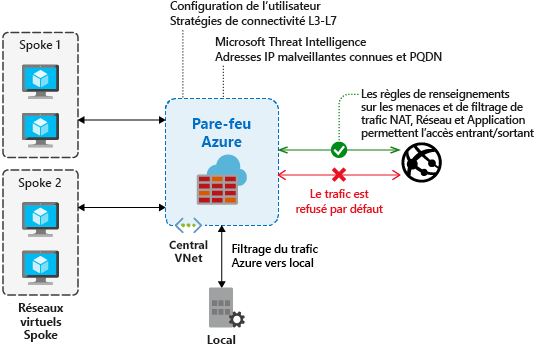

# Fonctionnalités du Pare-feu Azure

Le [Pare-feu Azure](overview.md) est un service de sécurité réseau cloud managé qui protège vos ressources de réseau virtuel Azure.

Le pare-feu Azure inclut les fonctionnalités suivantes :

- Haute disponibilité intégrée
- Zones de disponibilité
- Extensibilité du cloud sans limites
- Règles de filtrage des noms de domaine complets de l’application
- Règles de filtrage du trafic réseau
- Balises FQDN
- Balises de service
- Informations sur les menaces
- Prise en charge du mode SNAT sortant
- Prise en charge du trafic DNAT entrant
- Adresses IP publiques multiples
- Journalisation d’Azure Monitor
- Tunneling forcé
- Catégories web (préversion)
- Certifications

## Haute disponibilité intégrée

Comme la haute disponibilité est intégrée, aucun équilibreur de charge supplémentaire n’est nécessaire, et vous n’avez rien à configurer.

## Zones de disponibilité

Le Pare-feu Azure peut être configuré pendant le déploiement pour couvrir plusieurs zones de disponibilité afin de fournir une disponibilité supérieure. Avec les Zones de disponibilité Azure, votre disponibilité s’élève à 99,99 % du temps total. Pour plus d’informations, consultez [Contrat de niveau de service (SLA)](https://azure.microsoft.com/support/legal/sla/azure-firewall/v1_0/) du Pare-feu Azure. Un contrat de niveau de service de 99,99 % est offert quand deux Zones de disponibilité ou plus sont sélectionnées.

Vous pouvez également associer le Pare-feu Azure à une zone spécifique uniquement pour des raisons de proximité, en utilisant le contrat de niveau de service standard garantissant un taux de disponibilité de 99,95 %.

Il n’existe aucun coût supplémentaire pour un pare-feu déployé dans une Zone de disponibilité. Par contre, il existe des coûts supplémentaires pour les transferts de données entrants et sortants associés aux Zones de disponibilité Azure. Pour plus d’informations, consultez [Détails de la tarification de la bande passante](https://azure.microsoft.com/pricing/details/bandwidth/).

Les Zones de disponibilité de Pare-feu Azure sont disponibles dans les régions prenant en charge les Zones de disponibilité. Pour plus d’informations, consultez [Régions prenant en charge les zones de disponibilité dans Azure](../availability-zones/az-region.md).

> [!NOTE]
> Les Zones de disponibilité ne peuvent être configurées que pendant le déploiement. Vous ne pouvez pas configurer un pare-feu existant pour y inclure des Zones de disponibilité.

Pour plus d’informations sur les zones de disponibilité, consultez [Régions et zones de disponibilité dans Azure](../availability-zones/az-overview.md).

## Extensibilité du cloud sans limites

Le service Pare-feu Azure peut évoluer en fonction de vos besoins pour prendre en charge les flux de trafic réseau variables. Vous n’avez donc pas besoin de budgétiser votre trafic de pointe.

## Règles de filtrage des noms de domaine complets de l’application

Vous pouvez limiter le trafic HTTP/S sortant ou le trafic SQL Azure vers une liste spécifiée de noms de domaine complets (FQDN), y compris des caractères génériques. Cette fonctionnalité ne nécessite pas d’arrêt TLS.

## Règles de filtrage du trafic réseau

Vous pouvez créer de façon centralisée des règles de filtrage réseau *autoriser* ou *refuser* par protocole, port et adresse IP source et de destination. Le service Pare-feu Azure étant entièrement avec état, il peut distinguer les paquets légitimes pour différents types de connexions. Les règles sont appliquées et consignées entre plusieurs abonnements et réseaux virtuels.

## Balises FQDN

Les [balises FQDN](fqdn-tags.md) vous aident à autoriser le trafic réseau du service Azure connu via votre pare-feu. Par exemple, supposons que vous souhaitez autoriser le trafic réseau Windows Update via votre pare-feu. Vous créez une règle d’application et incluez la balise Windows Update. Le trafic réseau provenant de Windows Update peut désormais passer par votre pare-feu.

## Balises de service

Une [balise de service](service-tags.md) représente un groupe de préfixes d’adresses IP qui permet de simplifier la création de règles de sécurité. Vous ne pouvez pas créer votre propre balise de service, ni spécifier les adresses IP incluses dans une balise. Microsoft gère les préfixes d’adresse englobés par la balise de service et met à jour automatiquement la balise de service quand les adresses changent.

## Informations sur les menaces

Le filtrage basé sur [Threat Intelligence](threat-intel.md) peut être activé pour votre pare-feu pour donner l’alerte et rejeter le trafic depuis ou vers des adresses IP et des domaines malveillants connus. Ces adresses IP et domaines proviennent du flux Microsoft Threat Intelligence.

## Prise en charge du mode SNAT sortant

Toutes les adresses IP du trafic réseau virtuel sortant sont traduites en adresse IP publique de Pare-feu Azure (Source Network Address Translation). Vous pouvez identifier et autoriser le trafic entre votre réseau virtuel et des destinations Internet distantes. Le Pare-feu Azure ne traduit pas l’adresse réseau source (SNAT) quand l’adresse IP de destination correspond à une plage d’adresses IP privées selon le document [IANA RFC 1918](https://tools.ietf.org/html/rfc1918). 

Si votre organisation utilise une plage d’adresses IP publiques pour les réseaux privés, Pare-feu Azure traduit l’adresse réseau source du trafic en une des adresses IP privées du pare-feu dans AzureFirewallSubnet. Vous pouvez configurer Pare-feu Azure pour qu’il n’effectue **pas** une telle traduction. Pour plus d’informations, consultez [Plages d’adresses IP privées SNAT du Pare-feu Azure](snat-private-range.md).

## Prise en charge du trafic DNAT entrant

Le trafic Internet entrant vers votre adresse IP publique de pare-feu est traduit (Destination Network Address Translation ou DNAT) et filtré selon les adresses IP privées sur vos réseaux virtuels.

## Adresses IP publiques multiples

Vous pouvez associer [plusieurs adresses IP publiques](deploy-multi-public-ip-powershell.md) (jusqu’à 250) à votre pare-feu.

Cela donne accès aux scénarios suivants :

- **DNAT** -Vous pouvez traduire plusieurs instances de ports standard vers vos serveurs principaux. Par exemple, si vous avez deux adresses IP publiques, vous pouvez traduire le port TCP 3389 (RDP) pour ces deux adresses IP.
- **SNAT** - Des ports supplémentaires sont disponibles pour les connexions SNAT sortantes, réduisant ainsi le risque de pénurie de ports SNAT. À ce stade, Pare-feu Azure sélectionne aléatoirement l’adresse IP publique source à utiliser pour une connexion. Si votre réseau est doté d’un filtrage en aval, vous devez autoriser toutes les adresses IP publiques associées à votre pare-feu. Envisagez d’utiliser un [préfixe d’adresse IP publique](../virtual-network/public-ip-address-prefix.md) pour simplifier cette configuration.

## Journalisation d’Azure Monitor

Tous les événements sont intégrés à Azure Monitor, ce qui vous permet d’archiver les journaux d’activité dans un compte de stockage, de transmettre en continu des événements à votre hub d’événements ou de les envoyer à des journaux d’activité Azure Monitor. Pour obtenir des exemples de journaux Azure Monitor, consultez [Journaux Azure Monitor pour le Pare-feu Azure](./firewall-workbook.md).

Pour plus d’informations, consultez [Didacticiel : superviser les journaux du Pare-feu Azure et les métriques](./firewall-diagnostics.md). 

Le classeur Pare-feu Azure constitue un canevas flexible pour l’analyse de données du Pare-feu Azure. Il permet de créer des rapports visuels enrichis au sein du Portail Azure. Pour plus d’informations, consultez [Monitoring des journaux avec un classeur Pare-feu Azure](firewall-workbook.md).

## Tunneling forcé

Vous pouvez configurer le pare-feu Azure pour router tout le trafic Internet vers un tronçon suivant désigné au lieu d’accéder directement à Internet. Par exemple, vous pouvez disposer d’un pare-feu de périphérie local ou d’une autre appliance virtuelle réseau (NVA) pour traiter le trafic réseau avant qu’il ne soit dirigé vers Internet. Pour plus d’informations, consultez la page [Tunneling forcé du Pare-feu Azure](forced-tunneling.md).

## Catégories web (préversion)

Les catégories web permettent aux administrateurs d’autoriser ou de refuser aux utilisateurs l’accès aux catégories de sites web telles que les sites web de jeux d’argent, les sites web de réseaux sociaux, etc. Les catégories web sont incluses dans le Pare-feu Azure Standard, mais elles sont plus précises dans la préversion du Pare-feu Azure Premium. Contrairement à la fonctionnalité de catégories web de la référence SKU Standard qui correspond à la catégorie basée sur un nom de domaine complet, la référence SKU Premium correspond à la catégorie en fonction de l’URL complète pour le trafic HTTP et HTTPS. Pour plus d’informations sur la préversion du Pare-feu Azure Premium, consultez [Fonctionnalités de la préversion du Pare-feu Azure Premium](premium-features.md).

Par exemple, si le Pare-feu Azure intercepte une requête HTTPS pour `www.google.com/news`, vous devriez avoir la catégorisation suivante : 

- Pare-feu Standard : seule la partie du nom de domaine complet étant examinée, `www.google.com` est classé en tant que *Moteur de recherche*. 

- Pare-feu Premium : l’URL complète étant examinée, `www.google.com/news` est classée en tant qu’*Actualités*.

Les catégories sont organisées en fonction de leur gravité sous **Responsabilité**, **Bande passante élevée**, **Utilisation métier**, **Perte de productivité**, **Navigation générale** et **Sans catégorie**.

### Modification de la catégorisation

Vous pouvez demander une modification de catégorisation si vous  :

 - pensez qu’un nom de domaine complet (FQDN) ou une URL doit être dans une catégorie différente 
 
or 

- avez une catégorie suggérée pour un FQDN ou une URL sans catégorie

Vous êtes invité à envoyer une demande à l’adresse [https://aka.ms/azfw-webcategories-request](https://aka.ms/azfw-webcategories-request) .

### Exceptions de catégorie

Vous pouvez créer des exceptions à vos règles de catégorie web. Créez une collection de règles d’autorisation ou de refus distinct avec une priorité plus élevée au sein du groupe de collections de règles. Par exemple, vous pouvez configurer une collection de règles qui autorise `www.linkedin.com` avec la priorité 100, avec une collection de règles qui refuse **Réseaux sociaux** avec la priorité 200. Cette opération crée l’exception pour la catégorie web **Réseaux sociaux** prédéfinie.

## Certifications

Le service Pare-feu Azure est conforme aux normes PCI (Payment Card Industry), SOC (Service Organization Controls), ISO (Organisation internationale de normalisation) et ICSA Labs. Pour plus d’informations, consultez [Certifications de conformité du pare-feu Azure](compliance-certifications.md).

## Étapes suivantes

- [Fonctionnalités du Pare-feu Azure Premium - Préversion](premium-features.md)