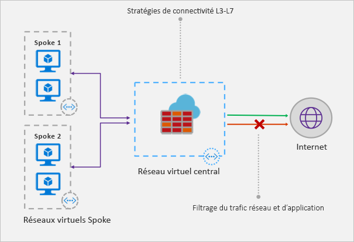

# Qu’est-ce qu’un pare-feu Azure ?

Pare-feu Azure est un service de sécurité réseau informatique géré qui protège vos ressources Réseau virtuel Azure. Il s’agit d’un service de pare-feu entièrement avec état, pourvu d’une haute disponibilité intégrée et de l’extensibilité du cloud sans limites. 

[!INCLUDE [firewall-preview-notice](../../includes/firewall-preview-notice.md)]

Vous pouvez créer, appliquer et consigner des stratégies de connectivité réseau et d’application de façon centralisée entre les abonnements et les réseaux virtuels. Pare-feu Azure utilise une adresse IP publique statique pour vos ressources de réseau virtuel, ce qui permet aux pare-feu situés à l’extérieur d’identifier le trafic provenant de votre réseau virtuel.  Le service est totalement intégré à Azure Monitor pour la journalisation et les analyses.

## Caractéristiques

La préversion publique du service Pare-feu Azure offre les fonctionnalités suivantes :

### Haute disponibilité intégrée
Comme la haute disponibilité est intégrée, aucun équilibreur de charge supplémentaire n’est nécessaire, et vous n’avez rien à configurer.

### Extensibilité du cloud sans limites 
Le service Pare-feu Azure peut évoluer en fonction de vos besoins pour prendre en charge les flux de trafic réseau variables. Vous n’avez donc pas besoin de budgétiser votre trafic de pointe.

### Filtrage des noms de domaine complets 
Vous pouvez limiter le trafic HTTP/S sortant vers une liste spécifiée de noms de domaine complets (FQDN), y compris des caractères génériques. Cette fonctionnalité ne nécessite pas d’arrêt SSL.

### Règles de filtrage du trafic réseau

Vous pouvez créer de façon centralisée des règles de filtrage réseau *autoriser* ou *refuser* par protocole, port et adresse IP source et de destination. Le service Pare-feu Azure étant entièrement avec état, il peut distinguer les paquets légitimes pour différents types de connexions. Les règles sont appliquées et consignées entre plusieurs abonnements et réseaux virtuels.

### Prise en charge du mode SNAT sortant

Toutes les adresses IP du trafic réseau virtuel sortant sont traduites en adresse IP publique de Pare-feu Azure (Source Network Address Translation). Vous pouvez identifier et autoriser le trafic entre votre réseau virtuel et des destinations Internet distantes.

### Journalisation d’Azure Monitor

Tous les événements sont intégrés à Azure Monitor, ce qui vous permet d’archiver les journaux dans un compte de stockage, de transmettre en continu des événements vers votre Event Hub ou de les envoyer vers Log Analytics.

## Problèmes connus

Les problèmes connus de la préversion publique du service Pare-feu Azure sont les suivants :

|Problème  |Description  |Atténuation  |
|---------|---------|---------|
|Interopérabilité avec les groupes NSG     |Si un groupe de sécurité réseau (NSG) est appliqué sur le sous-réseau du pare-feu, il peut bloquer la connectivité Internet sortante, même si le groupe NSG est configuré pour autoriser un accès Internet sortant. Les connexions Internet sortantes sont marquées comme provenant d’un réseau virtuel, et la destination est Internet. Un groupe de sécurité réseau a un accès de type *autoriser* de réseau virtuel à réseau virtuel par défaut, mais pas si la destination est Internet.|Pour atténuer le problème, ajoutez la règle de trafic entrant suivante au groupe NSG qui est appliqué sur le sous-réseau du pare-feu :  Source : réseau virtuel Ports source : n’importe lequel   Destination : n’importe laquelle Ports de Destination : n’importe lequel   Protocole : tous Accès : autoriser|
|Conflit avec la fonctionnalité JIT d’Azure Security Center (ASC)|Si une machine virtuelle est accessible à l’aide de la fonctionnalité juste-à-temps (JIT) et se trouve dans un sous-réseau dont l’itinéraire défini par l’utilisateur pointe vers le service Pare-feu d’Azure en tant que passerelle par défaut, la fonctionnalité JIT d’ASC ne fonctionne pas. Il s’agit du résultat d’un routage asymétrique : un paquet entre via l’adresse IP publique de la machine virtuelle (JIT a ouvert l’accès), mais le chemin d’accès de retour passe via le pare-feu, ce qui supprime le paquet, car aucune session n’est établie sur le pare-feu.|Pour contourner ce problème, placez les machines virtuelles JIT sur un sous-réseau distinct dépourvu d’itinéraire défini par l’utilisateur vers le pare-feu.|
|Le modèle Hub-and-Spoke ne fonctionne pas avec Peering mondial|Le modèle Hub-and-Spoke n’est pas pris en charge. Il s’agit du modèle où le hub et le pare-feu sont déployés dans une région Azure, tandis que les rayons le sont dans une autre région Azure et sont connectés au hub via Global VNet Peering.|Pour plus d’informations, consultez [Créer, modifier ou supprimer une homologation de réseau virtuel](https://docs.microsoft.com/en-us/azure/virtual-network/virtual-network-manage-peering#requirements-and-constraints).|
Les règles de filtrage réseau pour les protocoles autres que TCP/UDP (par exemple ICMP) ne fonctionnent pas pour le trafic lié à Internet.|Les règles de filtrage réseau pour les protocoles autres que TCP/UDP ne fonctionnent pas avec SNAT pour votre adresse IP publique. Les protocoles autres que TCP/UDP sont pris en charge entre les sous-réseaux du rayon et les réseaux virtuels.|Le service Pare-feu Azure utilise Standard Load Balancer, [qui ne prend pas en charge SNAT pour les protocoles IP pour le moment](https://docs.microsoft.com/en-us/azure/load-balancer/load-balancer-standard-overview#limitations). Nous étudions les possibilités de prendre en charge ce scénario dans une prochaine version.

## Étapes suivantes

- [Didacticiel : Déployer et configurer Pare-feu Azure à l’aide du portail Azure](tutorial-firewall-deploy-portal.md)
- [Déployer Pare-feu Azure à l’aide d’un modèle](deploy-template.md)
- [Créer un environnement de test pour Pare-feu Azure](scripts/sample-create-firewall-test.md)

