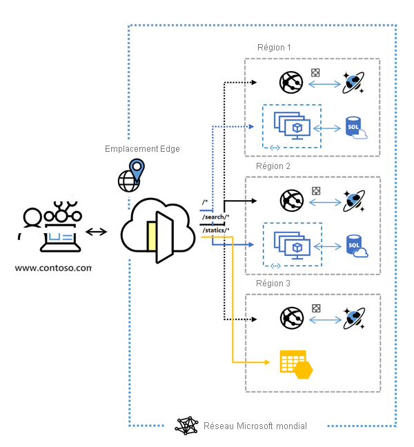

# Qu’est-ce qu’Azure Front Door ?

> [!IMPORTANT]
> Cette documentation a trait à Azure Front Door. Vous recherchez des informations sur Azure Front Door Standard/Premium (préversion) ? Affichez [ici](standard-premium/overview.md).

Azure Front Door est un point d’entrée mondial scalable qui utilise le réseau de périphérie mondial de Microsoft pour créer des applications web rapides, sécurisées et très scalables. Avec Front Door, vous pouvez transformer vos applications grand public et professionnelles en applications modernes fiables, personnalisées et hautes performances avec des contenus bénéficiant d’une audience mondiale par le biais d’Azure.

  

Front Door fonctionne au niveau de la couche 7 (HTTP/HTTPS) en utilisant le protocole anycast avec Split TCP et le réseau mondial de Microsoft pour améliorer la connectivité globale. Selon votre méthode de routage, vous pouvez faire en sorte que Front Door route les demandes de vos clients vers le back-end d’application offrant les plus hautes performances et la meilleure disponibilité. Un backend d’application est un service accessible sur Internet hébergé dans ou hors Azure. Front Door fournit un large éventail de [méthodes de routage du trafic](front-door-routing-methods.md) et d’[options de supervision de l’intégrité du back-end](front-door-health-probes.md) pour répondre aux besoins variés des applications et aux divers scénarios de basculement automatique. À l’instar de [Traffic Manager](../traffic-manager/traffic-manager-overview.md), Front Door est résilient aux défaillances, notamment aux échecs dans une région Azure entière.

>[!NOTE]
> Azure offre une suite de solutions d’équilibrage de charge entièrement managées pour vos scénarios. 
> * Si vous cherchez à effectuer un routage global basé sur DNS et que vous **ne répondez pas** aux exigences concernant la terminaison de protocole TLS (« déchargement SSL ») ou le traitement de la couche Application ou par requête HTTP/HTTPS, passez en revue [Traffic Manager](../traffic-manager/traffic-manager-overview.md). 
> * Si vous souhaitez équilibrer la charge entre vos serveurs dans une région au niveau de la couche Application, consultez [Application Gateway](../application-gateway/overview.md).
> * Pour effectuer l’équilibrage de charge de la couche Réseau, consultez [Load Balancer](../load-balancer/load-balancer-overview.md). 
> 
> Vos scénarios de bout en bout peuvent tirer parti de la combinaison de ces solutions en fonction de vos besoins.
> Pour obtenir une comparaison des options d’équilibrage de charge Azure, consultez [Vue d’ensemble des options d’équilibrage de charge dans Azure](/azure/architecture/guide/technology-choices/load-balancing-overview).

## Pourquoi utiliser Azure Front Door ?

Avec Front Door, vous pouvez créer et utiliser votre application web dynamique et votre contenu statique, et y effectuer un scale-out. Front Door vous permet de définir, gérer et superviser le routage global de votre trafic web en privilégiant l’optimisation des performances et de la fiabilité pour l’utilisateur final par le biais d’un basculement global rapide.

Principales fonctionnalités incluses dans Front Door :

* Accélération des performances des applications à l’aide du **[protocole anycast](front-door-routing-architecture.md#anycast)** basé sur le **[fractionnement TCP](front-door-routing-architecture.md#splittcp)** .

* Supervision intelligente des ressources back-end à l’aide de **[sondes d’intégrité](front-door-health-probes.md)** .

*  Routage des demandes **[basé sur un chemin d’URL](front-door-route-matching.md)** .

* Permet l’hébergement de plusieurs sites web pour une infrastructure d’application efficace. 

* **[Affinité de session](front-door-routing-methods.md#affinity)** basée sur les cookies.

* **[Déchargement SSL](front-door-custom-domain-https.md)** et gestion des certificats.

* Possibilité de définir son propre **[domaine personnalisé](front-door-custom-domain.md)** . 

* Sécurité des applications avec le **[Pare-feu d’applications web (WAF, Web Application Firewall)](../web-application-firewall/overview.md)** intégré.

* Redirection du trafic HTTP vers HTTPS avec la **[redirection d’URL](front-door-url-redirect.md)** .

* Chemin de transfert personnalisé avec la **[réécriture d’URL](front-door-url-rewrite.md)** .

* Prise en charge native de la connectivité IPv6 de bout en bout et du **[protocole HTTP/2](front-door-http2.md)** .

## Tarifs

Pour obtenir des informations sur les prix, consultez [Prix de Front Door](https://azure.microsoft.com/pricing/details/frontdoor/). Consultez [SLA pour Azure Front Door](https://azure.microsoft.com/en-us/support/legal/sla/frontdoor/v1_0/).

## Nouveautés

Abonnez-vous au flux RSS, puis examinez les dernières mises à jour des fonctionnalités Azure Front Door dans la page [Mises à jour Azure](https://azure.microsoft.com/updates/?category=networking&query=Azure%20Front%20Door).

## Étapes suivantes

- Découvrez comment [créer une porte d’entrée](quickstart-create-front-door.md).
- Découvrez [comment fonctionne Front Door](front-door-routing-architecture.md).
