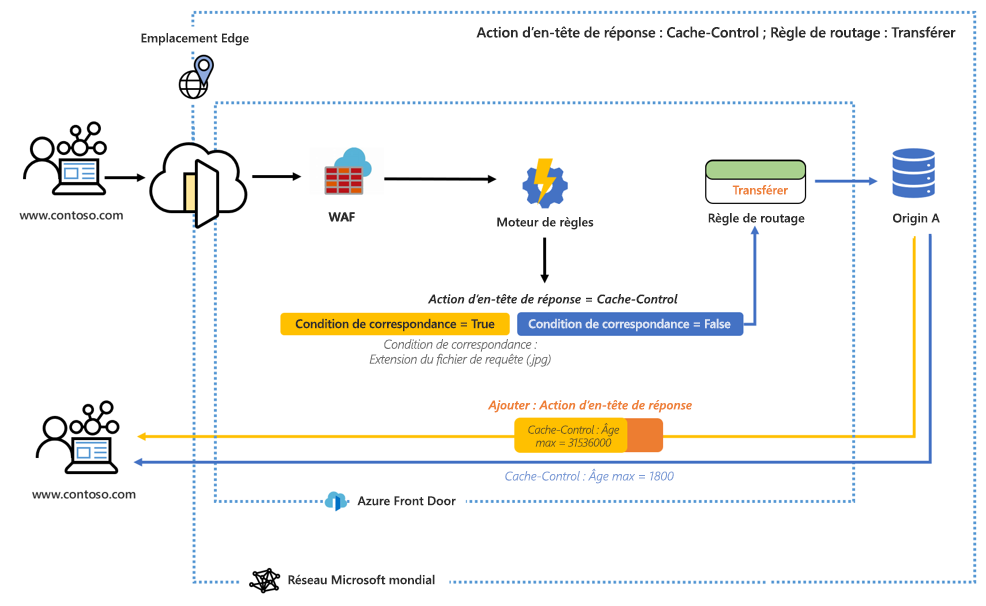
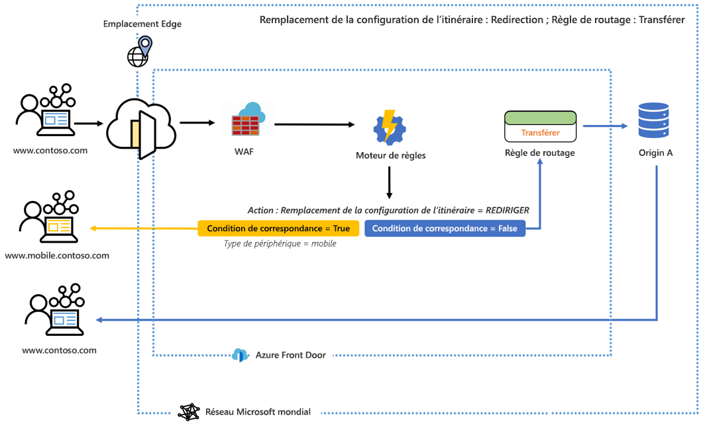

# Qu’est-ce que le moteur de règles pour Azure Front Door ? 

Le moteur de règles vous permet de personnaliser la façon dont les requêtes HTTP sont gérées à la périphérie et fournit davantage de contrôle sur le comportement de votre application web. Le moteur de règles pour Azure Front Door comprend plusieurs fonctionnalités clés, notamment :

- Application du protocole HTTPS pour veiller à ce que tous vos utilisateurs finaux interagissent avec votre contenu par le biais d’une connexion sécurisée.
- Implémentation d’en-têtes de sécurité pour prévenir les vulnérabilités basées sur le navigateur, comme HTTP Strict-Transport-Security (HSTS), X-XSS-Protection, Content-Security-Policy, X-Frame-Options, ainsi que des en-têtes Access-Control-Allow-Origin pour les scénarios de partage des ressources cross-origin (CORS). Les attributs basés sur la sécurité peuvent également être définis avec des cookies.
- Routage des requêtes vers les versions mobiles ou bureau de votre application en fonction des modèles inclus dans le contenu des en-têtes de requête, cookies ou chaînes de requête.
- Utilisation de fonctionnalités de redirection pour retourner les redirections 301, 302, 307 et 308 au client afin de rediriger vers de nouveaux noms d’hôte, chemins ou protocoles.
- Modification dynamique de la configuration de la mise en cache de votre route en fonction des requêtes entrantes.
- Réécriture du chemin de l’URL de la requête et transfert de la requête au back-end approprié dans votre pool back-end configuré.

## Architecture 

Le moteur de règles gère les requêtes à la périphérie. Une fois que vous avez configuré le moteur de règles, quand une requête atteint votre point de terminaison Front Door, WAF est exécuté en premier, suivi de la configuration du moteur de règles associée à votre front-end/domaine. Quand une configuration de moteur de règles est exécutée, cela signifie que la règle de routage parente est déjà une correspondance. L’exécution de toutes les actions de chacune des règles au sein de la configuration du moteur de règles a lieu si toutes les conditions de correspondance au sein de cette règle sont remplies. Si une requête ne correspond à aucune des conditions de la configuration de votre moteur de règles, la règle de routage par défaut est exécutée. 

Par exemple, dans la configuration ci-dessous, un moteur de règles est configuré pour ajouter un en-tête de réponse qui change l’âge maximal du contrôle de cache si la condition de correspondance est remplie. 

Dans un autre exemple, nous voyons que le moteur de règles est configuré pour envoyer un utilisateur vers une version mobile du site si la condition de correspondance, type d’appareil, est vraie. 

Dans ces deux exemples, si aucune des conditions de correspondance n’est remplie, la règle de routage spécifiée est celle qui est exécutée. 

## Terminologie 

Avec le moteur de règles AFD, vous pouvez créer une série de configurations de moteur de règles, chacune composée d’un ensemble de règles. Ce qui suit présente une terminologie utile que vous rencontrerez lors de la configuration de votre moteur de règles. 

- *Configuration de moteur de règles* : Ensemble de règles appliquées à une seule règle de routage. Chaque configuration est limitée à 25 règles. Vous pouvez créer jusqu’à 10 configurations. 
- *Règle du moteur de règles* : Chaque règle peut avoir jusqu’à 10 conditions de correspondance et 5 actions.
- *Condition de correspondance* : Il existe de nombreuses conditions de correspondance qui peuvent être utilisées pour analyser vos requêtes entrantes. Une règle peut contenir jusqu’à 10 conditions de correspondance. Les conditions de correspondance sont évaluées avec un opérateur **AND**. Vous trouverez la liste complète des conditions de correspondance [ici](front-door-rules-engine-match-conditions.md). 
- *Action* : Les actions dictent ce qui arrive à vos requêtes entrantes : actions d’en-tête de requête/réponse, transfert, redirection et réécriture sont toutes disponibles aujourd’hui. Une règle peut contenir jusqu’à 5 actions, mais seulement 1 remplacement de configuration de route.  Vous trouverez la liste complète des actions [ici](front-door-rules-engine-actions.md).

## Étapes suivantes

- Découvrez comment définir votre première [Configuration du moteur de règles](front-door-tutorial-rules-engine.md). 
- Découvrez comment [créer une porte d’entrée](quickstart-create-front-door.md).
- Découvrez [comment fonctionne Front Door](front-door-routing-architecture.md).
