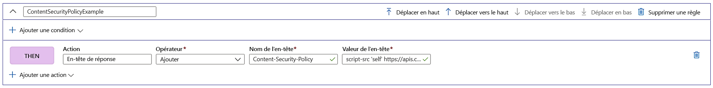

# Ajouter des en-têtes de sécurité avec le moteur de règles

Pour empêcher les vulnérabilités de navigateur, implémentez des en-têtes de sécurité comme HTTP Strict-Transport-Security (HSTS), X-XSS-Protection, Content-Security-Policy ou X-Frame-Options. Les attributs basés sur la sécurité peuvent également être définis avec des cookies.

L’exemple suivant vous montre comment ajouter un en-tête Content-Security-Policy à toutes les demandes entrantes qui correspondent au chemin défini dans la route à laquelle votre configuration du moteur de règles est associée. Ici, nous autorisons uniquement les scripts de notre site de confiance, **https://apiphany.portal.azure-api.net** , à s’exécuter sur notre application.

## Ajouter un en-tête Content-Security-Policy dans le portail Azure

1. Avant de créer cette règle spécifique, découvrez comment [créer une instance Front Door](quickstart-create-front-door.md) ou comment [créer un moteur de règles](front-door-tutorial-rules-engine.md) s’il s’agit de la première fois que vous utilisez la fonctionnalité AFD ou le moteur de règles.

2. Cliquez sur **Ajouter** pour ajouter une nouvelle règle. Spécifiez un nom pour la règle, puis cliquez sur **Ajouter une action** > **En-tête de réponse**.

3. Pour l’opérateur, choisissez **Ajouter** pour ajouter cet en-tête en tant que réponse à toutes les demandes entrantes adressées à cette route.

4. Ajoutez le nom de l’en-tête : **Content-Security-Policy** et définissez les valeurs que cet en-tête doit accepter. Dans ce scénario, nous choisissons *« script-src 'self' https://apiphany.portal.azure-api.net  »* .

5. Une fois que vous avez ajouté toutes les règles souhaitées à votre configuration, n’oubliez pas d’accéder à votre route préférée pour associer la configuration de votre moteur de règles à votre règle de routage. Cette étape est nécessaire pour permettre à la règle de fonctionner. 

> [!NOTE]
> Dans ce scénario, nous n’avons pas ajouté de [conditions de correspondance](front-door-rules-engine-match-conditions.md) à la règle. Cette règle est appliquée à toutes les demandes entrantes qui correspondent au chemin défini dans la règle de routage. Si vous voulez qu’elle s’applique uniquement à un sous-ensemble de ces demandes, veillez à ajouter vos conditions de correspondance spécifiques à cette règle.

## Étapes suivantes

- Découvrez plus en détail le [Moteur de règles AFD](front-door-rules-engine.md). 
- Découvrez comment [créer une porte d’entrée](quickstart-create-front-door.md).
- Découvrez [comment fonctionne Front Door](front-door-routing-architecture.md).
- Découvrez-en plus sur les [conditions de correspondance](front-door-rules-engine-match-conditions.md) du moteur de règles.
- Allez plus loin avec les [Informations de référence CLI](https://docs.microsoft.com/cli/azure/ext/front-door/network/front-door/rules-engine?view=azure-cli-latest) sur le moteur de règles AFD. 
- Allez plus loin avec les [Informations de référence PowerShell](https://docs.microsoft.com/powershell/module/az.frontdoor/?view=azps-3.8.0) sur le moteur de règles AFD. 
