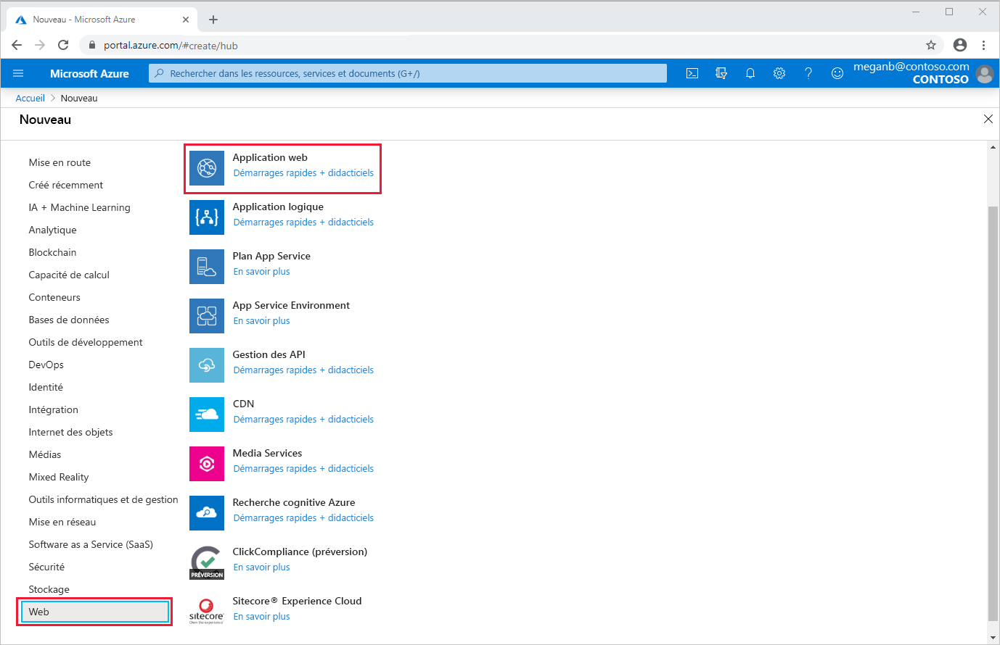
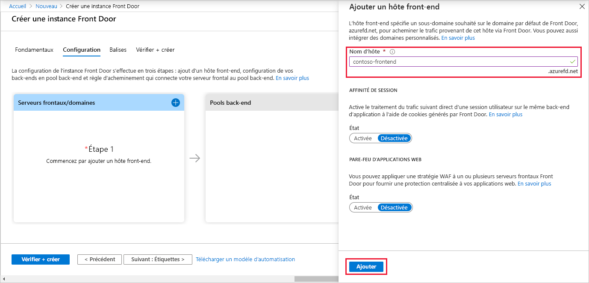
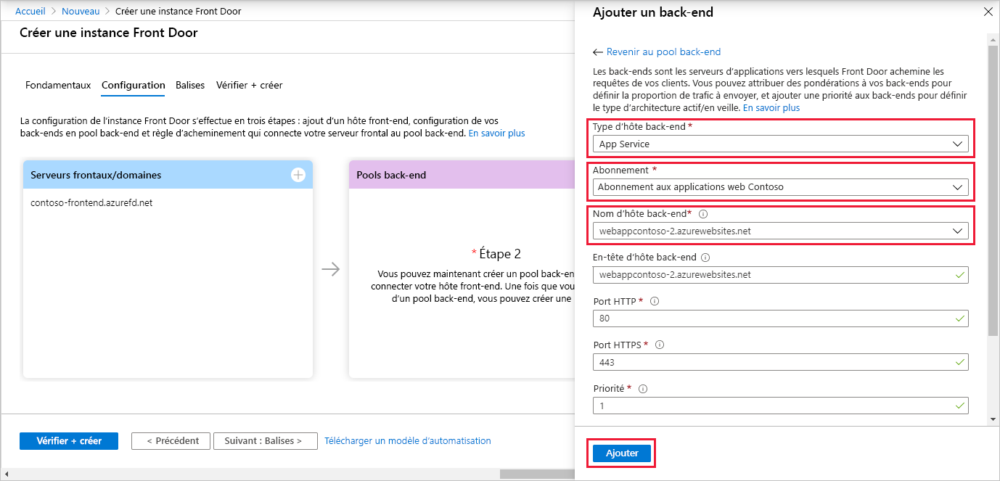
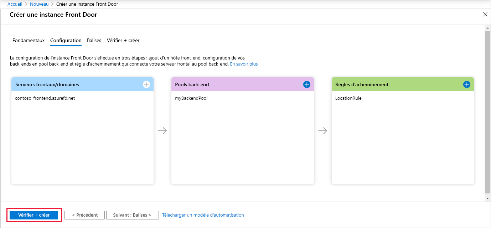
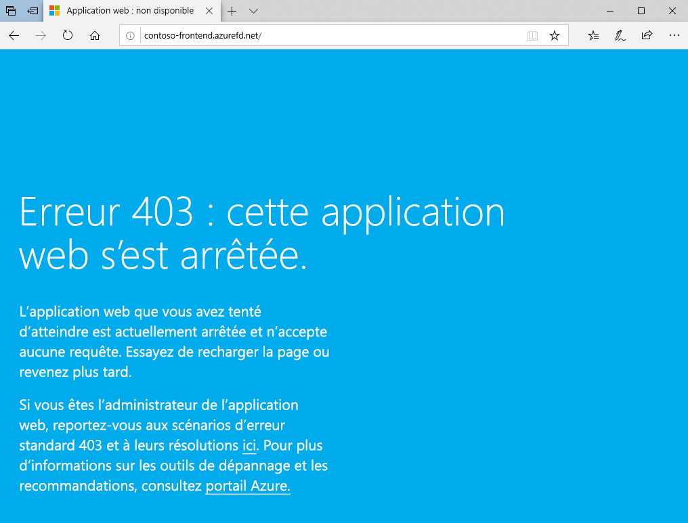

# Démarrage rapide : Créer une porte d’entrée pour une application web globale hautement disponible

Commencez à utiliser Azure Front Door à l’aide du portail Azure pour configurer la haute disponibilité pour une application web.

Dans ce démarrage rapide, Azure Front Door regroupe deux instances d’une application web qui s’exécutent dans différentes régions Azure. Vous créez une configuration Front Door basée sur des back-ends de pondération et de priorité égales. Cette configuration dirige le trafic vers le site le plus proche qui exécute l’application. Azure Front Door supervise en permanence l’application web. Le service assure le basculement automatique vers le site disponible suivant quand le site le plus proche n’est pas disponible.

## Prérequis

- Compte Azure avec un abonnement actif. [Créez un compte gratuitement](https://azure.microsoft.com/free/?WT.mc_id=A261C142F).

## Créer deux instances d’une application web

Ce guide de démarrage rapide demande deux instances d’une application web qui s’exécutent dans différentes régions Azure. Les deux instances de l’application web s’exécutent en mode *Actif/Actif*, donc l’une ou l’autre peut s’occuper du trafic. Cette configuration diffère d’une configuration *Active/Veille* où l’une sert de basculement.

Si vous n’avez pas encore d’application web, utilisez les étapes suivantes pour configurer des exemples d’applications web.

1. Connectez-vous au portail Azure sur https://portal.azure.com.

1. Dans la page d’accueil ou le menu Azure, sélectionnez **Créer une ressource**.

1. Sélectionnez **Web** > **Web App**.

   

1. Dans **Application web**, sélectionnez l’**Abonnement** à utiliser.

1. Pour **Groupe de ressources**, sélectionnez **Créer nouveau**. Entrez *FrontDoorQS_rg1* pour le **Nom** et sélectionnez **OK**.

1. Sous **Détails de l’instance**, entrez un **Nom** unique pour votre application web. Cet exemple utilise *WebAppContoso-1*.

1. Sélectionnez une **pile d’exécution**, dans cet exemple, *.NET Core 2.1 (LTS)* .

1. Sélectionnez une région comme *USA Centre*.

1. Pour **Plan Windows**, sélectionnez **Créer nouveau**. Entrez *myAppServicePlanCentralUS* dans **Nom** et sélectionnez **OK**.

1. Assurez-vous que **Référence et taille** est défini avec **Standard S1 100 ACU au total, 1,75 Go de mémoire**.

1. Sélectionnez **Vérifier + Créer**, vérifiez le **Résumé**, puis sélectionnez **Créer**. Le déploiement peut prendre plusieurs minutes.

   

Une fois le déploiement terminé, créez une seconde application web. Utilisez la même procédure avec les mêmes valeurs, à l’exception des valeurs suivantes :

| Paramètre          | Valeur     |
| ---              | ---  |
| **Groupe de ressources**   | Sélectionnez **Nouveau** et entrez *FrontDoorQS_rg2* |
| **Nom**             | Entrez un nom unique pour votre application web, dans cet exemple, *WebAppContoso-2*  |
| **Région**           | Une autre région, dans cet exemple, *USA Centre Sud* |
| **Plan App Service** > **Plan Windows**         | Sélectionnez **Nouveau** et entrez *myAppServicePlanSouthCentralUS*, puis sélectionnez **OK** |

## Créer une porte d’entrée pour votre application

Configurez Azure Front Door pour diriger le trafic utilisateur selon la plus petite latence entre les serveurs des deux applications web. Pour commencer, ajoutez un hôte front-end pour Azure Front Door.

1. Dans la page d’accueil ou le menu Azure, sélectionnez **Créer une ressource**. Sélectionnez **Mise en réseau** > **Front Door**.

1. Dans **Créer une porte d’entrée**, sélectionnez un **abonnement**.

1. Pour **Groupe de ressources**, sélectionnez **Nouveau**, puis entrez *FrontDoorQS_rg0* et sélectionnez **OK**.  Vous pouvez utiliser un groupe de ressources existant à la place.

1. Si vous avez créé un groupe de ressources, sélectionnez un **Emplacement de groupe de ressources**, puis **Suivant : Configuration**.

1. Dans **Front-ends/domaines**, sélectionnez **+** pour ouvrir **Ajouter l’hôte front-end**.

1. Pour **Nom d’hôte**, entrez un nom d’hôte global unique. Cet exemple utilise *contoso-frontend*. Sélectionnez **Ajouter**.

   

Ensuite, créez un pool de back-ends qui contient vos deux applications web.

1. Toujours dans **Créer une porte d’entrée**, dans **Pools principaux**, sélectionnez **+** pour ouvrir **Ajouter un pool principal**.

1. Pour **Nom**, entrez *myBackendPool*.

1. Sélectionnez **Ajouter un backend**. Pour **Type de l’hôte backend**, sélectionnez *App Service*.

1. Sélectionnez votre abonnement, puis choisissez la première application web que vous avez créée dans **Nom de l’hôte backend**. Dans cet exemple, l’application web était *WebAppContoso-1*. Sélectionnez **Ajouter**.

1. Sélectionnez **Ajouter un pool principal** de nouveau. Pour **Type de l’hôte backend**, sélectionnez *App Service*.

1. Sélectionnez de nouveau votre abonnement, puis choisissez la seconde application web que vous avez créée dans **Nom de l’hôte backend**. Sélectionnez **Ajouter**.

   

Enfin, ajoutez une règle de routage. Une règle de routage mappe votre hôte front-end au pool de back-ends. La règle transfère une demande pour `contoso-frontend.azurefd.net` à **myBackendPool**

1. Toujours dans **Créer une porte d’entrée**, dans **Règles de routage**, sélectionnez **+** pour configurer une règle de routage.

1. Dans **Ajouter une règle**, pour **Nom**, entrez *LocationRule*. Acceptez toutes les valeurs par défaut, puis sélectionnez **Ajouter** pour ajouter la règle de routage.

   >[!WARNING]
   > Vous **devez** vérifier que chaque hôte front-end dans votre porte d’entrée a une règle de routage avec un chemin par défaut (`\*`) associé. En d’autres termes, parmi toutes vos règles de routage, il doit exister au moins une règle de routage pour chacun des hôtes front-end définis dans le chemin par défaut (`\*`). Sinon, le trafic de l’utilisateur final risque de ne pas être routé correctement.

1. Sélectionnez **Vérifier + créer**, puis **Créer**.

   

## Voir Azure Front Door à l’œuvre

Une fois la porte d’entrée créée, le déploiement global de la configuration prend quelques minutes. Une fois l’opération terminée, accédez à l’hôte front-end que vous avez créé. Dans un navigateur, accédez à `contoso-frontend.azurefd.net`. Votre demande est automatiquement routée vers le serveur le plus proche des serveurs spécifiés dans le pool de back-ends.

Si vous avez créé ces applications dans ce guide de démarrage rapide, vous verrez une page d’informations.

Pour tester le basculement global instantané, essayez les étapes suivantes :

1. Ouvrez un navigateur, comme décrit ci-dessus, puis accédez à l’adresse front-end : `contoso-frontend.azurefd.net`.

1. Dans le portail Azure, recherchez et sélectionnez *App Services*. Faites défiler la liste jusqu’à l’une de vos applications web, **WebAppContoso-1** dans cet exemple.

1. Sélectionnez votre application web, puis **Arrêter** et **Oui** pour vérifier.

1. Actualisez votre navigateur. Vous devriez voir la même page d’informations.

   >[!TIP]
   >Il y a un peu de retard pour ces actions. Vous devrez peut-être actualiser une nouvelle fois.

1. Recherchez l’autre application web, puis arrêtez-la également.

1. Actualisez votre navigateur. Cette fois, vous devriez voir un message d’erreur.

   

## Nettoyer les ressources

Une fois que vous avez terminé, vous pouvez supprimer tous les éléments que vous avez créés. La suppression d’un groupe de ressources supprime également son contenu. Si vous n’envisagez pas d’utiliser cette porte d’entrée, vous devez supprimer les ressources pour éviter des frais inutiles.

1. Dans le portail Azure, sélectionnez et recherchez **Groupes de ressources** ou sélectionnez **Groupes de ressources** dans le menu du portail Azure.

1. Filtrez ou faites défiler la liste pour rechercher un groupe de ressources, par exemple **FrontDoorQS_rg0**.

1. Sélectionnez le groupe de ressources, puis **Supprimer le groupe de ressources**.

   >[!WARNING]
   >Cette action est irréversible.

1. Tapez le nom du groupe de ressources pour vérifier, puis sélectionnez **Supprimer**.

Répétez la procédure pour les deux autres groupes.

## Étapes suivantes

Passez à l’article suivant pour apprendre à ajouter un domaine personnalisé à votre porte d’entrée.
> [!div class="nextstepaction"]
> [Ajouter un domaine personnalisé](front-door-custom-domain.md)

Pour en savoir plus sur le routage du trafic, consultez [Méthodes de routage Front Door](front-door-routing-methods.md).
