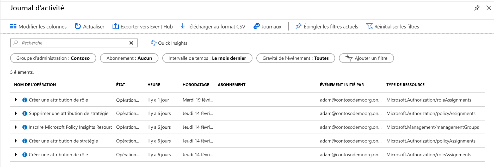

# <a name="manage-your-resources-with-management-groups"></a>Gérer vos ressources avec des groupes d’administration

Si votre organisation dispose de plusieurs abonnements, vous pouvez avoir besoin d’un moyen de gérer efficacement l’accès, les stratégies et la conformité de ces abonnements. Les groupes d’administration Azure fournissent un niveau d’étendue au-delà des abonnements. Vous organisez les abonnements en conteneurs appelés « groupes d’administration » et vous appliquez vos conditions de gouvernance aux groupes d’administration. Tous les abonnements d’un groupe d’administration héritent automatiquement des conditions appliquées à ce groupe d’administration.

Les groupes d’administration vous permettent une gestion de qualité professionnelle à grande échelle, quel que soit le type de vos abonnements.  Pour plus d’informations sur les groupes d’administration, consultez [Organiser vos ressources avec des groupes d’administration Azure](overview.md).

[!INCLUDE [GDPR-related guidance](../../../includes/gdpr-intro-sentence.md)]

[!INCLUDE [az-powershell-update](../../../includes/updated-for-az.md)]

## <a name="change-the-name-of-a-management-group"></a>Modifier le nom d’un groupe d’administration

Vous pouvez modifier le nom du groupe d’administration en utilisant le portail, PowerShell ou Azure CLI.

### <a name="change-the-name-in-the-portal"></a>Modifier le nom dans le portail

1. Connectez-vous au [portail Azure](https://portal.azure.com).

1. Sélectionnez **Tous les services** > **Groupes d’administration**.

1. Sélectionnez le groupe d’administration à renommer.

1. Sélectionnez l’option **Renommer le groupe** en haut de la page.

   

1. Lorsque le menu s’ouvre, entrez le nouveau nom à afficher.

   

1. Sélectionnez **Enregistrer**.

### <a name="change-the-name-in-powershell"></a>Modifier le nom dans PowerShell

Pour mettre à jour de l’utilisation de nom d’affichage **AzManagementGroup de mise à jour**. Par exemple, pour modifier une gestion de groupes du nom complet à partir de « Contoso IT » à « Groupe Contoso », vous exécutez la commande suivante :

```azurepowershell-interactive
Update-AzManagementGroup -GroupName 'ContosoIt' -DisplayName 'Contoso Group'
```

### <a name="change-the-name-in-azure-cli"></a>Modifier le nom dans Azure CLI

Pour Azure CLI, utilisez la commande update.

```azurecli-interactive
az account management-group update --name 'Contoso' --display-name 'Contoso Group'
```

## <a name="delete-a-management-group"></a>Supprimer un groupe d’administration

Pour supprimer un groupe d’administration, les conditions suivantes doivent être remplies :

1. Le groupe d’administration ne contient pas de groupes d’administration enfants ni d’abonnements.

   - Pour déplacer un abonnement en dehors d’un groupe d’administration, consultez [Déplacer un abonnement vers un autre groupe d’administration](#Move-subscriptions-in-the-hierarchy).

   - Pour déplacer un groupe d’administration vers un autre groupe d’administration, consultez [Déplacer des groupes d’administration dans la hiérarchie](#Move-management-groups-in-the-hierarchy).

1. Vous disposez des autorisations en écriture sur le groupe d’administration (« Propriétaire », « Collaborateur » ou « Contributeur de groupe d’administration »). Pour connaître vos autorisations, sélectionnez le groupe d’administration, puis sélectionnez **IAM**. Pour en savoir plus sur les rôles RBAC, consultez [Gérer l’accès et les autorisations avec le contrôle d’accès en fonction du rôle (RBAC)](../../role-based-access-control/overview.md).  

### <a name="delete-in-the-portal"></a>Supprimer dans le portail

1. Connectez-vous au [portail Azure](https://portal.azure.com).

1. Sélectionnez **Tous les services** > **Groupes d’administration**.

1. Sélectionnez le groupe d’administration à supprimer.

1. Sélectionnez **Supprimer**.

    > [!TIP]
    > Si l’icône est désactivée, placez le curseur de la souris au-dessus d’elle pour en connaître la raison.

   

1. Une fenêtre s’ouvre pour que vous confirmiez la suppression du groupe d’administration.

   

1. Sélectionnez **Oui**.

### <a name="delete-in-powershell"></a>Supprimer dans PowerShell

Utilisez le **Remove-AzManagementGroup** commande dans PowerShell pour supprimer des groupes d’administration.

```azurepowershell-interactive
Remove-AzManagementGroup -GroupName 'Contoso'
```

### <a name="delete-in-azure-cli"></a>Supprimer dans Azure CLI

Avec Azure CLI, utilisez la commande az account management-group delete.

```azurecli-interactive
az account management-group delete --name 'Contoso'
```

## <a name="view-management-groups"></a>Afficher des groupes d’administration

Vous pouvez afficher tous les groupes pour lesquels vous avez un rôle RBAC direct ou hérité.  

### <a name="view-in-the-portal"></a>Afficher dans le portail

1. Connectez-vous au [portail Azure](https://portal.azure.com).

1. Sélectionnez **Tous les services** > **Groupes d’administration**.

1. Charge la page de hiérarchie de groupe de gestion. Cette page est où vous pouvez explorer tous les groupes d’administration et les abonnements que vous avez accès. Sélectionner le nom du groupe vous fait descendre d’un niveau dans la hiérarchie. La navigation fonctionne comme dans un explorateur de fichiers.

1. Pour afficher les détails du groupe d’administration, sélectionnez le lien **(détails)** en regard du titre du groupe d’administration. Si ce lien n’est pas disponible, vous n’avez pas les autorisations pour afficher ce groupe d’administration.

   

### <a name="view-in-powershell"></a>Afficher dans PowerShell

Vous utilisez la commande Get-AzManagementGroup pour récupérer tous les groupes.  Consultez [Az.Resources](/powershell/module/az.resources/Get-AzManagementGroup) modules pour obtenir la liste complète de la gestion des commandes Powershell d’obtenir de groupe.  

```azurepowershell-interactive
Get-AzManagementGroup
```

Pour consulter les détails d’un seul groupe d’administration, utilisez le paramètre -GroupName.

```azurepowershell-interactive
Get-AzManagementGroup -GroupName 'Contoso'
```

Pour retourner un groupe d’administration spécifique et tous les niveaux de la hiérarchie sous celui-ci, utilisez **-développez** et **-Recurse** paramètres.  

```azurepowershell-interactive
PS C:\> $response = Get-AzManagementGroup -GroupName TestGroupParent -Expand -Recurse
PS C:\> $response

Id                : /providers/Microsoft.Management/managementGroups/TestGroupParent
Type              : /providers/Microsoft.Management/managementGroups
Name              : TestGroupParent
TenantId          : 00000000-0000-0000-0000-000000000000
DisplayName       : TestGroupParent
UpdatedTime       : 2/1/2018 11:15:46 AM
UpdatedBy         : 00000000-0000-0000-0000-000000000000
ParentId          : /providers/Microsoft.Management/managementGroups/00000000-0000-0000-0000-000000000000
ParentName        : 00000000-0000-0000-0000-000000000000
ParentDisplayName : 00000000-0000-0000-0000-000000000000
Children          : {TestGroup1DisplayName, TestGroup2DisplayName}

PS C:\> $response.Children[0]

Type        : /managementGroup
Id          : /providers/Microsoft.Management/managementGroups/TestGroup1
Name        : TestGroup1
DisplayName : TestGroup1DisplayName
Children    : {TestRecurseChild}

PS C:\> $response.Children[0].Children[0]

Type        : /managementGroup
Id          : /providers/Microsoft.Management/managementGroups/TestRecurseChild
Name        : TestRecurseChild
DisplayName : TestRecurseChild
Children    :
```

### <a name="view-in-azure-cli"></a>Afficher dans Azure CLI

Utilisez la commande list pour récupérer tous les groupes.  

```azurecli-interactive
az account management-group list
```

Pour consulter les détails d’un seul groupe d’administration, utilisez la commande show.

```azurecli-interactive
az account management-group show --name 'Contoso'
```

Pour retourner un groupe d’administration spécifique et tous les niveaux de la hiérarchie sous celui-ci, utilisez **-développez** et **-Recurse** paramètres.

```azurecli-interactive
az account management-group show --name 'Contoso' -e -r
```

## <a name="move-subscriptions-in-the-hierarchy"></a>Déplacer des abonnements dans la hiérarchie

L’une des raisons de créer un groupe d’administration est de regrouper des abonnements. Seuls les groupes d’administration et les abonnements peuvent être enfants d’un autre groupe d’administration. Un abonnement déplacé vers un groupe d’administration hérite de toutes les stratégies et de tous les accès utilisateur du groupe d’administration parent.

Pour déplacer l’abonnement, toutes les autorisations RBAC suivantes doivent être remplies :

- Rôle de « propriétaire » sur l’abonnement enfant.
- Rôle « Propriétaire », « Collaborateur » ou « Contributeur de groupe d’administration » sur le group.* de gestion cible parent
- Rôle « Propriétaire », « Collaborateur » ou « Contributeur de groupe d’administration » sur le group.* gestion parent existant

* : Sauf si la cible ou le groupe d’administration parent existant est le groupe d’administration racine. Étant donné que le groupe d’administration racine est la valeur par défaut de lancement directs pour tous les nouveaux groupes d’administration et les abonnements, les utilisateurs n’aient les autorisations sur ce dernier pour déplacer un élément.

Pour afficher les autorisations dont vous disposez dans le portail Azure, sélectionnez la gestion de groupe, puis sélectionnez **IAM**. Pour en savoir plus sur les rôles RBAC, consultez [Gérer l’accès et les autorisations avec le contrôle d’accès en fonction du rôle (RBAC)](../../role-based-access-control/overview.md).

### <a name="move-subscriptions-in-the-portal"></a>Déplacer des abonnements dans le portail

#### <a name="add-an-existing-subscription-to-a-management-group"></a>Ajouter un abonnement existant à un groupe d’administration

1. Connectez-vous au [portail Azure](https://portal.azure.com).

1. Sélectionnez **Tous les services** > **Groupes d’administration**.

1. Sélectionnez le groupe d’administration que vous envisagez d’utiliser comme parent.

1. En haut de la page, sélectionnez **Ajouter un abonnement**.

1. Sélectionnez l’abonnement dans la liste portant le bon ID.

   

1. Sélectionnez « Enregistrer ».

#### <a name="remove-a-subscription-from-a-management-group"></a>Supprimer un abonnement d’un groupe d’administration

1. Connectez-vous au [portail Azure](https://portal.azure.com).

1. Sélectionnez **Tous les services** > **Groupes d’administration**.

1. Sélectionnez le groupe d’administration qui est le parent actuel.  

1. Dans la liste, sélectionnez les points de suspension situés en fin de la ligne de l’abonnement à déplacer.

   

1. Sélectionnez **Déplacer**.

1. Dans le menu qui s’ouvre, sélectionnez le **groupe d’administration parent**.

   

1. Sélectionnez **Enregistrer**.

### <a name="move-subscriptions-in-powershell"></a>Déplacer des abonnements dans PowerShell

Pour déplacer un abonnement dans PowerShell, vous utilisez la commande New-AzManagementGroupSubscription.  

```azurepowershell-interactive
New-AzManagementGroupSubscription -GroupName 'Contoso' -SubscriptionId '12345678-1234-1234-1234-123456789012'
```

Pour supprimer le lien entre et d’abonnement et le groupe d’administration utilisent la commande Remove-AzManagementGroupSubscription.

```azurepowershell-interactive
Remove-AzManagementGroupSubscription -GroupName 'Contoso' -SubscriptionId '12345678-1234-1234-1234-123456789012'
```

### <a name="move-subscriptions-in-azure-cli"></a>Déplacer des abonnements dans Azure CLI

Pour déplacer un abonnement dans CLI, utilisez la commande add.

```azurecli-interactive
az account management-group subscription add --name 'Contoso' --subscription '12345678-1234-1234-1234-123456789012'
```

Pour supprimer l’abonnement du groupe d’administration, utilisez la commande subscription remove.  

```azurecli-interactive
az account management-group subscription remove --name 'Contoso' --subscription '12345678-1234-1234-1234-123456789012'
```

## <a name="move-management-groups-in-the-hierarchy"></a>Déplacer des groupes d’administration dans la hiérarchie  

Lorsque vous déplacez un groupe d’administration parent, la hiérarchie sous ce groupe en même temps.

### <a name="move-management-groups-in-the-portal"></a>Déplacer des groupes d’administration dans le portail

1. Connectez-vous au [portail Azure](https://portal.azure.com).

1. Sélectionnez **Tous les services** > **Groupes d’administration**.

1. Sélectionnez le groupe d’administration que vous envisagez d’utiliser comme parent.

1. En haut de la page, sélectionnez **Ajouter un groupe d’administration**.

1. Dans le menu qui s’ouvre, indiquez si vous souhaitez créer un groupe d’administration ou en utiliser un existant.

   - Si vous sélectionnez Nouveau, vous créez un groupe d’administration.
   - Si vous sélectionnez un groupe existant, une liste déroulante répertoriant tous les groupes d’administration s’affiche. Vous pouvez les déplacer vers ce groupe d’administration.  

   

1. Sélectionnez **Enregistrer**.

### <a name="move-management-groups-in-powershell"></a>Déplacer des groupes d’administration dans PowerShell

Utilisez la commande de mise à jour-AzManagementGroup dans PowerShell pour déplacer un groupe d’administration sous un autre groupe.

```azurepowershell-interactive
Update-AzManagementGroup -GroupName 'Contoso' -ParentId '/providers/Microsoft.Management/managementGroups/ContosoIT'
```  

### <a name="move-management-groups-in-azure-cli"></a>Déplacer des groupes d’administration dans Azure CLI

Utilisez la commande update pour déplacer un groupe d’administration avec Azure CLI.

```azurecli-interactive
az account management-group update --name 'Contoso' --parent-id '/providers/Microsoft.Management/managementGroups/ContosoIT'
```

## <a name="audit-management-groups-using-activity-logs"></a>Auditer des groupes d’administration avec des journaux d’activité

Les groupes d’administration sont pris en charge dans le [journal d’activité Azure](../../azure-monitor/platform/activity-logs-overview.md). Vous pouvez interroger tous les événements qui se produisent à un groupe d’administration dans le même emplacement central en tant que d’autres ressources Azure.  Par exemple, vous pouvez voir tous les changements d’attributions de rôles ou de stratégie apportés à un groupe d’administration spécifique.



Quand vous cherchez à interroger les groupes d’administration en dehors du portail Azure, l’étendue cible pour les groupes d’administration ressemble à **"/providers/Microsoft.Management/managementGroups/{yourMgID}"**.

## <a name="referencing-management-groups-from-other-resource-providers"></a>Référencement des groupes d’administration à partir d’autres fournisseurs de ressources

Lorsque vous référencez des groupes d’administration à partir d’actions de le d’autre fournisseur ressources, utilisez le chemin suivant en tant que l’étendue. Ce chemin d’accès est utilisé lors de l’utilisation de PowerShell, Azure CLI et API REST.  

>"/providers/Microsoft.Management/managementGroups/{yourMgID}"

Un exemple d’utilisation de ce chemin d’accès est lorsque vous attribuez une nouvelle attribution de rôle à un groupe d’administration dans PowerShell

```powershell-interactive
New-AzRoleAssignment -Scope "/providers/Microsoft.Management/managementGroups/Contoso"
```

Le même chemin d’accès de portée est utilisé lors de la récupération d’une définition de stratégie à un groupe d’administration.

```http
GET https://management.azure.com/providers/Microsoft.Management/managementgroups/MyManagementGroup/providers/Microsoft.Authorization/policyDefinitions/ResourceNaming?api-version=2018-05-01
```

## <a name="next-steps"></a>Étapes suivantes

Pour en savoir plus sur les groupes d’administration, consultez :

- [Créer des groupes d’administration pour organiser les ressources Azure](create.md)
- [Guide pratique pour modifier, supprimer ou gérer vos groupes d’administration](manage.md)
- [Consulter les groupes d’administration dans le module Azure PowerShell Resources](/powershell/module/az.resources#resources)
- [Consulter les groupes d’administration dans l’API REST](/rest/api/resources/managementgroups)
- [Consulter les groupes d’administration dans Azure CLI](/cli/azure/account/management-group)