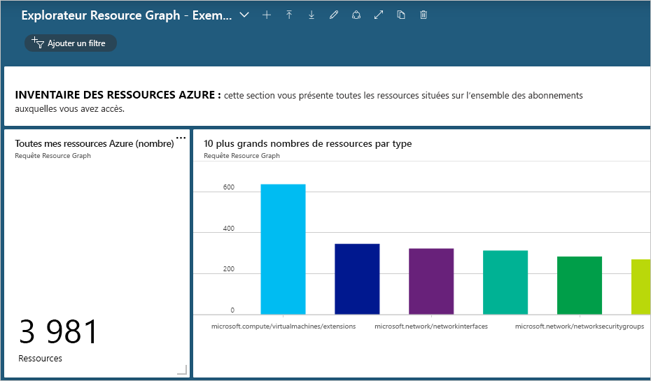
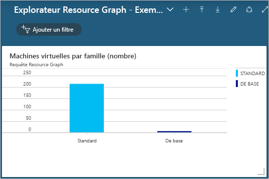

# <a name="quickstart-run-your-first-resource-graph-query-using-azure-resource-graph-explorer"></a>Démarrage rapide : Exécuter votre première requête Resource Graph à l’aide de l’Explorateur Azure Resource Graph

Vous pouvez accéder à la puissance d’Azure Resource Graph directement dans le portail Azure via l’Explorateur Azure Resource Graph. L’Explorateur Resource Graph fournit des informations parmi lesquelles vous pouvez naviguer à propos des propriétés et types de ressource Azure Resource Manager que vous pouvez interroger. L’Explorateur Resource Graph fournit également une interface épurée qui vous permet d’utiliser plusieurs requêtes, d’évaluer les résultats et même de convertir les résultats de certaines requêtes sous forme de graphique que vous pouvez épingler à un tableau de bord Azure.

À la fin de ce guide de démarrage rapide, vous aurez utilisé le portail Azure et l’Explorateur Resource Graph pour exécuter votre première requête Resource Graph, et vous aurez épinglé les résultats à un tableau de bord.

## <a name="prerequisites"></a>Prérequis

Si vous n’avez pas d’abonnement Azure, créez un compte [gratuit](https://azure.microsoft.com/free/) avant de commencer.

## <a name="run-your-first-resource-graph-query"></a>Exécuter votre première requête Resource Graph

Ouvrez le [portail Azure](https://portal.azure.com) pour rechercher et utiliser l’Explorateur Resource Graph en respectant les étapes suivantes afin d’exécuter votre première requête Resource Graph :

1. Sélectionnez **Tous les services** dans le volet gauche. Recherchez et sélectionnez l’**Explorateur Resource Graph**.

1. Dans la partie **Requête 1** de la fenêtre, entrez la requête `Resources | project name, type | limit 5`, puis sélectionnez  **Exécuter la requête**.

   > [!NOTE]
   > Comme cet exemple de requête ne fournit pas de modificateur de tri tel que `order by`, l’exécution répétée de cette requête peut produire un ensemble distinct de ressources par requête.

1. Passez en revue la réponse à la requête sous l’onglet **Résultats**. Sélectionnez l’onglet **Messages** pour afficher les détails relatifs à la requête, notamment le nombre de résultats et sa durée. Les erreurs éventuelles sont affichées sous cet onglet.

1. Mettez à jour la requête pour la trier (`order by`) en fonction de la propriété **name** : `Resources | project name, type | limit 5 | order by name asc`. Sélectionnez ensuite **Exécuter la requête**.

   > [!NOTE]
   > Comme précédemment, l’exécution répétée de cette requête peut produire un ensemble différent de ressources. L’ordre des commandes de requête est important. Dans cet exemple, `order by` vient après `limit`. Cet ordre de commande limite d’abord les résultats de la requête, puis les classe.

1. Mettez à jour la requête pour la trier (`order by`) d’abord en fonction de la propriété **name**, puis limitez `limit` les résultats aux cinq premiers : `Resources | project name, type | order by name asc | limit 5`. Sélectionnez ensuite **Exécuter la requête**.

Si votre environnement ne change pas et si vous exécutez plusieurs fois la requête finale, les résultats retournés sont cohérents et classés en fonction de la propriété **Name**, mais toujours limités aux cinq premiers.

### <a name="schema-browser"></a>Navigateur de schémas

Le navigateur de schémas est situé dans le volet gauche de l’Explorateur Resource Graph. Cette liste de ressources montre tous les _types de ressource_ Azure pris en charge par Azure Resource Graph et présents sur le locataire auquel vous avez accès. Le développement d’un type de ressource ou de sous-propriétés montre les propriétés enfants qui peuvent être utilisées pour créer une requête Resource Graph.

La sélection du type de ressource entraîne le placement de `where type =="<resource type>"` dans la zone de requête. La sélection d’une des propriétés enfants entraîne l’ajout de `where <propertyName> == "INSERT_VALUE_HERE"` dans la zone de requête.
Le navigateur de schémas est un excellent moyen de découvrir les propriétés à utiliser dans les requêtes. Veillez à remplacer _INSERT\_VALUE\_HERE_ par votre propre valeur, et à modifier la requête à l’aide des conditions, des opérateurs et des fonctions nécessaires pour obtenir les résultats souhaités.

## <a name="create-a-chart-from-the-resource-graph-query"></a>Créer un graphique à partir de la requête Resource Graph

Après avoir exécuté la dernière requête ci-dessus, si vous sélectionnez l’onglet **Graphiques**, vous obtenez le message suivant : « Le jeu de résultats n’est pas compatible avec une visualisation de graphique à secteurs ». Les requêtes qui listent des résultats ne peuvent pas être converties en graphique, mais les requêtes qui fournissent des décomptes de ressources le peuvent. À l’aide de l’[exemple de requête Nombre de machines virtuelles par type d’OS](./samples/starter.md#count-virtual-machines-by-os-type), créons une visualisation à partir de la requête Resource Graph.

1. Dans la partie **Requête 1** de la fenêtre, entrez la requête suivante, puis sélectionnez  **Exécuter la requête**.

   ```kusto
   Resources
   | where type =~ 'Microsoft.Compute/virtualMachines'
   | summarize count() by tostring(properties.storageProfile.osDisk.osType)
   ```

1. Sélectionnez l’onglet **Résultats**, puis notez que la réponse à cette requête fournit des décomptes.

1. Sélectionnez l’onglet **Graphiques**. À présent, la requête donne lieu à des visualisations. Via _Sélectionner le type de graphique_, changez le type en _Graphique à barres_ ou _Graphique en anneau_ pour essayer les options de visualisation disponibles.

## <a name="pin-the-query-visualization-to-a-dashboard"></a>Épingler la visualisation de requête à un tableau de bord

Une fois que vous avez obtenu les résultats d’une requête qui peut être visualisée, vous pouvez ensuite épingler cette visualisation des données à l’un de vos tableaux de bord. Après avoir exécuté la requête ci-dessus, effectuez les étapes suivantes :

1. Sélectionnez **Enregistrer**, puis indiquez le nom « Machine virtuelle par type d’OS ». Sélectionnez ensuite **Enregistrer** en bas du volet droit.

1. Sélectionnez **Exécuter la requête** pour la réexécuter, une fois qu’elle a été enregistrée.

1. Sous l’onglet **Graphiques**, sélectionnez une visualisation des données. Sélectionnez ensuite **Épingler au tableau de bord**.

1. Sélectionnez la notification de portail qui s’affiche, ou sélectionnez **Tableau de bord** dans le volet gauche.

La requête est désormais disponible dans votre tableau de bord avec le titre de la vignette correspondant au nom de la requête. Si la requête n’était pas enregistrée au moment où elle a été épinglée, elle porte le nom « Requête 1 » à la place.

La requête et la visualisation des données résultante sont exécutées et mises à jour à chaque chargement du tableau de bord. Ainsi, elles fournissent des insights dynamiques et en temps réel à votre environnement Azure directement dans votre workflow.

> [!NOTE]
> Les requêtes qui aboutissent à une liste peuvent également être épinglées au tableau de bord. La fonctionnalité n’est pas limitée aux visualisations des données des requêtes.

## <a name="import-example-resource-graph-explorer-dashboards"></a>Importer des exemples de tableaux de bord de l’Explorateur Resource Graph

Pour disposer d’exemples de requêtes Resource Graph et savoir comment utiliser l’Explorateur Resource Graph pour améliorer votre workflow dans le portail Azure, essayez ces exemples de tableaux de bord.

- [Explorateur Resource Graph - Exemple de tableau de bord n° 1](https://github.com/Azure-Samples/Governance/blob/master/src/resource-graph/portal-dashboards/sample-1/resourcegraphexplorer-sample-1.json)

  [](./media/arge-sample1-large.png#lightbox)

- [Explorateur Resource Graph - Exemple de tableau de bord n° 2](https://github.com/Azure-Samples/Governance/blob/master/src/resource-graph/portal-dashboards/sample-2/resourcegraphexplorer-sample-2.json)

  [](./media/arge-sample2-large.png#lightbox)

> [!NOTE]
> Les nombres et les graphiques dans les exemples de captures d’écran de tableau de bord ci-dessus varient en fonction de votre environnement Azure.

1. Sélectionnez et téléchargez l’exemple de tableau de bord à évaluer.

1. Dans le portail Azure, dans le volet gauche, sélectionnez **Tableau de bord**.

1. Sélectionnez **Charger**, puis recherchez et sélectionnez l’exemple de fichier de tableau de bord téléchargé. Sélectionnez ensuite **Ouvrir**.

Le tableau de bord importé s’affiche automatiquement. Dans la mesure où il existe désormais dans votre portail Azure, vous pouvez l’explorer et lui apporter des changements selon les besoins, ou vous pouvez créer d’autres tableaux de bord à partir de l’exemple pour les partager avec vos équipes. Pour plus d’informations sur l’utilisation des tableaux de bord, consultez [Créer et partager des tableaux de bord dans le portail Azure](../../azure-portal/azure-portal-dashboards.md).

## <a name="clean-up-resources"></a>Nettoyer les ressources

Si vous souhaitez supprimer les exemples de tableaux de bord Resource Graph de l’environnement de votre portail Azure, vous pouvez le faire en effectuant les étapes suivantes :

1. Sélectionnez **Tableau de bord** dans le volet gauche.

1. Dans le menu déroulant de tableau de bord, sélectionnez l’exemple de tableau de bord Resource Graph à supprimer.

1. Sélectionnez **Supprimer** dans le menu déroulant de tableau de bord en haut du tableau de bord, puis sélectionnez **OK** pour confirmer.

## <a name="next-steps"></a>Étapes suivantes

Dans ce guide de démarrage rapide, vous avez utilisé l’Explorateur Azure Resource Graph pour exécuter votre première requête et vous avez examiné les exemples de tableau de bord produits par Resource Graph. Pour plus d’informations sur le langage Resource Graph, passez à la page des détails du langage de requête.

> [!div class="nextstepaction"]
> [Obtenir plus d’informations sur le langage de requête](./concepts/query-language.md)