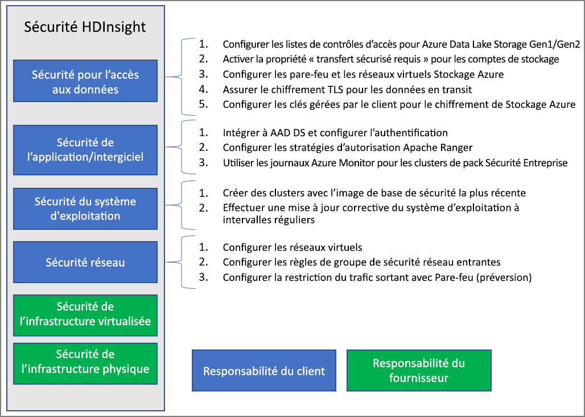

# Vue d’ensemble de la sécurité d’entreprise dans Azure HDInsight

Azure HDInsight propose un certain nombre de méthodes pour répondre aux besoins de votre entreprise en matière de sécurité. La plupart de ces solutions ne sont pas activées par défaut. Cette flexibilité vous permet de choisir les fonctionnalités de sécurité les plus importantes pour vous, et vous aide à éviter de payer pour des fonctionnalités dont vous n’avez pas besoin. Cela signifie également qu’il est de votre responsabilité de vérifier que les solutions appropriées sont activées pour votre installation et votre environnement.

Cet article aborde les solutions de sécurité du point de vue des quatre piliers de sécurité classiques : la sécurité du périmètre, l’authentification, l’autorisation et le chiffrement.

Il présente également le **Pack Sécurité Entreprise (ESP) Azure HDInsight**, qui fournit l’authentification basée sur Active Directory, la prise en charge multi-utilisateur et le contrôle d’accès en fonction du rôle pour les clusters HDInsight.

## Piliers de la sécurité d’entreprise

L’une des manières d’aborder la sécurité de l’entreprise divise les solutions de sécurité en quatre groupes principaux en fonction du type de contrôle. Ces groupes sont également appelés piliers de sécurité. Il s’agit de la sécurité du périmètre, de l’authentification, de l’autorisation et du chiffrement.

### Sécurité du périmètre

La sécurité du périmètre dans HDInsight est obtenue par le biais de [réseaux virtuels](../hdinsight-plan-virtual-network-deployment.md). Un administrateur d’entreprise peut créer un cluster à l’intérieur d’un réseau virtuel, et utiliser des groupes de sécurité réseau pour restreindre l’accès au réseau virtuel. Seules les adresses IP autorisées dans les règles de groupes de sécurité réseau entrantes sont en mesure de communiquer avec le cluster HDInsight. Cette configuration assure la sécurité du périmètre.

Tous les clusters déployés sur un réseau virtuel auront aussi un point de terminaison privé qui se résout en une adresse IP privée sur le réseau virtuel, pour un accès HTTP privé aux passerelles de cluster.

### Authentication

Le [Pack Sécurité Entreprise](apache-domain-joined-architecture.md) d’HDInsight fournit l’authentification basée sur Active Directory, la prise en charge multi-utilisateur et le contrôle d’accès en fonction du rôle. L’intégration d’Active Directory est obtenue à l’aide d’[Azure Active Directory Domain Services](../../active-directory-domain-services/overview.md). Grâce à ces fonctionnalités, vous pouvez créer un cluster HDInsight joint à un domaine Active Directory managé. Vous pouvez ensuite configurer une liste d’employés de l’entreprise qui peuvent s’authentifier et se connecter au cluster.

Avec cette configuration, des employés de l’entreprise peuvent se connecter aux nœuds du cluster à l’aide de leurs informations d’identification de domaine. Ils peuvent également utiliser leurs informations d’identification de domaine pour s’authentifier auprès d’autres points de terminaison approuvés comme les vues Ambari, ODBC, JDBC, PowerShell et les API REST afin d’interagir avec le cluster. 

### Authorization

L’une des bonnes pratiques que la plupart des entreprises appliquent consiste à s’assurer que chaque employé n’a pas accès à l’intégralité des ressources de l’entreprise. Parallèlement, l’administrateur peut définir des stratégies de contrôle d’accès en fonction du rôle pour les ressources du cluster. Cela est uniquement disponible dans les clusters ESP.

L’administrateur Hadoop peut configurer le contrôle d’accès en fonction du rôle (RBAC) pour sécuriser Apache [Hive](apache-domain-joined-run-hive.md), [HBase](apache-domain-joined-run-hbase.md) et [Kafka](apache-domain-joined-run-kafka.md) à l’aide de ces plug-ins dans Apache Ranger. La configuration de stratégies RBAC vous permet d’associer des autorisations à un rôle dans l’organisation. Cette couche d’abstraction permet de s’assurer plus facilement que les utilisateurs disposent uniquement des autorisations nécessaires pour effectuer leur travail. Ranger vous permet également d’auditer l’accès aux données par les employés et toute modification apportée aux stratégies de contrôle d’accès.

Par exemple, l’administrateur peut configurer [Apache Ranger](https://ranger.apache.org/) pour définir des stratégies de contrôle d’accès pour Hive. Cette fonctionnalité garantit le filtrage au niveau des lignes et des colonnes (masquage des données), et filtre les données sensibles contre tout accès par des utilisateurs non autorisés.

### Audit

L’audit de tous les accès aux ressources du cluster, et aux données, est nécessaire pour effectuer le suivi des accès non autorisés ou non intentionnels des ressources. Il est tout aussi important de protéger les ressources du cluster HDInsight des utilisateurs non autorisés, et de sécuriser les données.

L’administrateur peut afficher et signaler tout accès aux données et aux ressources du cluster HDInsight. L’administrateur peut également voir et signaler toutes les modifications des stratégies de contrôle d’accès créées dans les points de terminaison pris en charge par Apache Ranger. 

Pour accéder aux journaux d’audit Apache Ranger et Ambari, ainsi qu’aux journaux d’accès SSH, [activez Azure Monitor](../hdinsight-hadoop-oms-log-analytics-tutorial.md) et affichez les enregistrements d’audit associés.

### Chiffrement

La protection des données est essentielle pour se conformer aux exigences de l’organisation en matière de conformité et de sécurité. Parallèlement à la restriction de l’accès aux données des employés non autorisés, vous devez procéder à leur chiffrement.

Stockage Blob Azure et Azure Data Lake Storage Gen1/Gen2, les deux magasins de données pour les clusters HDInsight, prennent en charge de façon transparente côté serveur le [chiffrement des données](../../storage/common/storage-service-encryption.md) au repos. Les clusters HDInsight sécurisés fonctionnent sans problème avec cette fonctionnalité de chiffrement des données au repos côté serveur.

## Modèle de responsabilité partagée

L’image suivante résume les principales zones de sécurité du système et les solutions de sécurité disponibles dans chacune d’entre elles. Elle met également en évidence les zones de sécurité qui relèvent de votre responsabilité en tant que client et celles qui relèvent de la responsabilité de HDInsight en tant que fournisseur de services.

Le tableau suivant fournit des liens vers des ressources pour chaque type de solution de sécurité.

| Zone de sécurité | Solutions disponibles | Partie responsable |
|---|---|---|
| Sécurité de l’accès aux données | Configurer des [listes de contrôle d’accès (ACL)](../../storage/blobs/data-lake-storage-access-control.md) pour Azure Data Lake Storage Gen1 et Gen2  | Client |
|  | Activer la propriété [« Transfert sécurisé requis »](../../storage/common/storage-require-secure-transfer.md) sur le compte de stockage | Client |
|  | Configurer des [pare-feu Stockage Azure](../../storage/common/storage-network-security.md) et des réseaux virtuels | Client |
|  | Vérifier que le [chiffrement TLS](../../storage/common/storage-security-tls.md) est activé pour les données en transit | Client |
|  | Configurer des [clés gérées par le client](../../storage/common/storage-encryption-keys-portal.md) pour le chiffrement du Stockage Azure | Client |
| Sécurité des applications et des middlewares (intergiciels) | Intégrer à AAD-DS et [configurer l’authentification](apache-domain-joined-configure-using-azure-adds.md) | Client |
|  | Configurer des stratégies d’[autorisation Apache Ranger](apache-domain-joined-run-hive.md) | Client |
|  | Utiliser les [journaux Azure Monitor](../hdinsight-hadoop-oms-log-analytics-tutorial.md) | Client |
| Sécurité du système d’exploitation | Créer des clusters avec l’image de base sécurisée la plus récente | Client |
|  | Garantir la [mise à jour corrective du système d’exploitation](../hdinsight-os-patching.md) à intervalles réguliers | Client |
| Sécurité du réseau | Configurer un [réseau virtuel](../hdinsight-plan-virtual-network-deployment.md) |
|  | Configurer des [règles de groupe de sécurité réseau entrantes](../hdinsight-plan-virtual-network-deployment.md#networktraffic) | Client |
|  | Configurer la [restriction du trafic sortant](../hdinsight-restrict-outbound-traffic.md) avec le pare-feu (préversion) | Client |
| Infrastructure virtualisée | N/A | HDInsight (fournisseur de cloud) |
| Sécurité de l’infrastructure physique | N/A | HDInsight (fournisseur de cloud) |

## Étapes suivantes

* [Planifier des clusters HDInsight avec ESP](apache-domain-joined-architecture.md)
* [Configurer des clusters HDInsight avec ESP](apache-domain-joined-configure.md)
* [Gérer des clusters HDInsight avec ESP](apache-domain-joined-manage.md)
