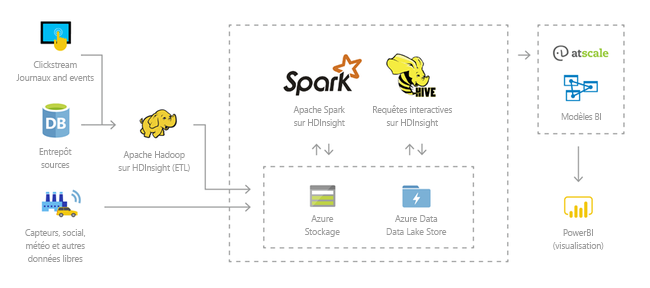
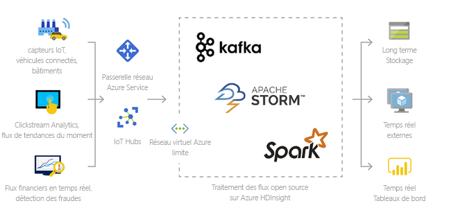
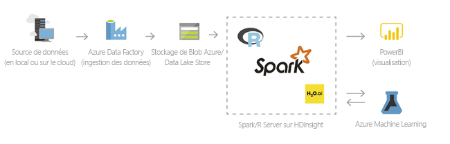
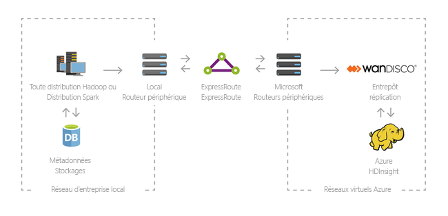

# Présentation de HDInsight et de la pile de technologies Hadoop

Cet article présente Apache Hadoop sur Azure HDInsight. Azure HDInsight est un service d’analyse entièrement géré, complet et open source pour les entreprises. Vous pouvez utiliser les infrastructures open source telles que Hadoop, Spark, Hive, LLAP, Kafka, Storm, R et bien plus encore. 

[!INCLUDE [hdinsight-price-change](../../../includes/hdinsight-enhancements.md)]

## Qu’est-ce que HDInsight et la pile de technologies Hadoop ?

[Apache Hadoop](http://hadoop.apache.org/) était l’infrastructure open source d’origine de traitement et d’analyse distribués des jeux de données volumineuses sur des clusters. La pile de technologies Hadoop inclut des logiciels et utilitaires liés, notamment Apache Hive, HBase, Spark, Kafka et bien d’autres encore.

Azure HDInsight est une distribution par cloud des composants Hadoop à partir de [Hortonworks Data Platform (HDP)](https://hortonworks.com/products/data-center/hdp/). Azure HDInsight rend facile, rapide et économique le traitement de volumes importants de données. Vous pouvez utiliser les infrastructures open source les plus populaires, telles que Hadoop, Spark, Hive, LLAP, Kafka, Storm, R et bien plus encore. Avec ces infrastructures, vous pouvez activer un large éventail de scénarios, tels que l’extraction, la transformation et le chargement (ETL) ; l’entreposage de données ; l’apprentissage automatique ; et IoT.

Pour voir les piles de composants de technologie Hadoop disponibles sur HDInsight, consultez [Composants et versions disponibles avec HDInsight][component-versioning]. Pour plus d’informations sur Hadoop dans HDInsight, consultez la rubrique [Page de fonctionnalités Azure pour HDInsight](https://azure.microsoft.com/services/hdinsight/).

## Que sont les données volumineuses ?

Les données volumineuses sont collectées dans des volumes toujours plus importants, à des vitesses élevées et pour une variété de formats plus grande qu’auparavant. Elles peuvent être historiques (c'est-à-dire stockées) ou en temps réel (c'est-à-dire diffusées à partir de la source). Consultez [Scénarios d’utilisation d’ HDInsight](#scenarios-for-using-hdinsight) pour en savoir plus sur les cas d’usage courants pour les Big Data.

## Pourquoi utiliser Hadoop sur HDInsight ?

Cette section répertorie les fonctionnalités d’Azure HDInsight.

|Fonctionnalité  |Description  |
|---------|---------|
|Cloud natif     |     Azure HDInsight vous permet de créer des clusters optimisés pour [Hadoop](apache-hadoop-linux-tutorial-get-started.md),  [Spark](../spark/apache-spark-jupyter-spark-sql.md),  [Interactive query (LLAP)](../interactive-query/apache-interactive-query-get-started.md),  [Kafka](../kafka/apache-kafka-get-started.md),  [Storm](../storm/apache-storm-tutorial-get-started-linux.md),  [HBase](../hbase/apache-hbase-tutorial-get-started-linux.md), et  [ML Services](../r-server/r-server-get-started.md) sur Azure. HDInsight fournit également un contrat SLA de bout en bout sur toutes vos charges de travail de production.  |
|Économique et évolutif     | HDInsight vous permet de monter ou de descendre en [puissance](../hdinsight-administer-use-portal-linux.md)  les charges de travail. Vous pouvez réduire les coûts en [créant des clusters à la demande](../hdinsight-hadoop-create-linux-clusters-adf.md) et payer uniquement ce que vous utilisez. Vous pouvez également créer des pipelines de données pour faire fonctionner vos travaux. Le stockage et le calcul découplés améliorent les performances et la flexibilité. |
|Sécurité et conformité    | HDInsight vous permet de protéger les ressources de données de votre entreprise à l’aide du [réseau virtuel Azure](../hdinsight-extend-hadoop-virtual-network.md), du [chiffrement](../hdinsight-hadoop-create-linux-clusters-with-secure-transfer-storage.md)et de l’intégration avec [Azure Active Directory](../domain-joined/apache-domain-joined-introduction.md). HDInsight répond également aux [normes de conformité](https://azure.microsoft.com/overview/trusted-cloud) du gouvernement et du secteur les plus populaires.        |
|Surveillance    | Azure HDInsight s’intègre à [Azure Log Analytics](../hdinsight-hadoop-oms-log-analytics-tutorial.md) pour fournir une interface unique permettant de gérer l’ensemble des clusters.        |
|Disponibilité générale | HDInsight est disponible dans plus de 25  [régions](https://azure.microsoft.com/regions/services/) , soit plus que tout autre offre d’analytique Big Data. Azure HDInsight est également disponible dans Azure Government, en Chine, et en Allemagne, ce qui vous permet de répondre aux besoins de votre entreprise dans les principaux domaines souverains. |  
|Productivité     |  Azure HDInsight vous permet d’utiliser des outils de productivité enrichis pour Hadoop et Spark avec les environnements de développement de votre choix. Parmi ces environnements de développement figurent [Visual Studio](apache-hadoop-visual-studio-tools-get-started.md), [VSCode](../hdinsight-for-vscode.md), [Eclipse](../spark/apache-spark-eclipse-tool-plugin.md) et [IntelliJ](../spark/apache-spark-intellij-tool-plugin.md) pour la prise en charge de Scala, Python, R, Java et .NET. Les scientifiques des données peuvent également collaborer à l’aide de blocs-notes populaires, tels que [Jupyter](../spark/apache-spark-jupyter-notebook-kernels.md) et [Zeppelin](../spark/apache-spark-zeppelin-notebook.md).    |
|Extensibilité     |  Vous pouvez étendre les clusters HDInsight avec des composants installés (Hue, Presto, etc.) à l’aide d’[actions de script](../hdinsight-hadoop-customize-cluster-linux.md), par l’[ajout de nœuds de périphérie](../hdinsight-apps-use-edge-node.md), ou l’[intégration à d’autres applications certifiées Big data](../hdinsight-apps-install-applications.md). HDInsight permet une intégration transparente aux solutions Big Data les plus populaires à l’aide d’un déploiement [en un clic](https://azure.microsoft.com/services/hdinsight/partner-ecosystem/).|

## Scénarios d’utilisation de HDInsight

Azure HDInsight peut être utilisé pour divers scénarios lors d’un traitement de données Big data. Il peut s’agir de données historiques (déjà collectées et stockées) ou de données en temps réel (transmises en continu directement à partir de la source). Les scénarios pour le traitement de ces données peuvent être classés dans les catégories suivantes : 

### Traitement par lots (ETL)

Extraction, transformation et chargement (ETL) est un processus au cours duquel les données structurées ou non sont extraites à partir de sources de données hétérogènes. Elles sont ensuite converties dans un format structuré et chargées dans un magasin de données. Les données converties peuvent être utilisées pour la science des données ou l’entreposage de données.

### Entrepôt de données

HDInsight permet d’exécuter des requêtes interactives sur des pétaoctets de données structurées ou non dans n’importe quel format. Vous pouvez également créer des modèles en les connectant à des outils BI. Pour plus d’informations, [consultez ce témoignage client](https://customers.microsoft.com/story/milliman). 

### Internet des objets (IoT)

Vous pouvez utiliser HDInsight pour traiter des données de diffusion en continu reçues en temps réel depuis divers appareils. Pour plus d’informations, [lire ce billet de blog Azure annonçant la version préliminaire publique de Apache Kafka sur HDInsight avec Azure Managed Disks](https://azure.microsoft.com/blog/announcing-public-preview-of-apache-kafka-on-hdinsight-with-azure-managed-disks/).

 

### Science des données

Vous pouvez utiliser HDInsight pour créer des applications qui extraient des informations critiques à partir des données. Vous pouvez également utiliser Azure Machine Learning pour prédire les tendances futures de votre activité. Pour plus d’informations, [consultez ce témoignage client](https://customers.microsoft.com/story/pros).

### Hybride

HDInsight permet d’étendre votre infrastructure Big Data locale existante sur Azure pour exploiter les fonctionnalités d’analyse avancée du cloud.

## Types de cluster dans HDInsight
HDInsight comprend des types de cluster spécifiques et des fonctionnalités de personnalisation de cluster, comme l’ajout de composants, d’utilitaires et de langages. HDInsight offre les types de clusters suivants :

* **[Apache Hadoop](https://wiki.apache.org/hadoop)** : infrastructure qui utilise [HDFS](#hdfs), la gestion de ressources [YARN](#yarn) et un modèle de programmation [MapReduce](#mapreduce) simple pour traiter et analyser les lots de données en parallèle.

* **[Apache Spark](http://spark.apache.org/)** : infrastructure de traitement parallèle open source qui prend en charge le traitement en mémoire pour améliorer les performances des applications d’analyse du Big Data. Consultez [Qu’est-ce qu’Apache Spark dans HDInsight ?](../spark/apache-spark-overview.md)

* **[Apache HBase](http://hbase.apache.org/)** : base de données NoSQL basée sur Hadoop qui fournit un accès aléatoire et une forte cohérence pour de vastes quantités de données non structurées et semi-structurées (potentiellement, des milliards de lignes multipliées par des millions de colonnes). Consultez [Qu’est-ce que HBase sur HDInsight ?](../hbase/apache-hbase-overview.md)

* **[ML Services](https://msdn.microsoft.com/microsoft-r/rserver)** : serveur d’hébergement et de gestion de processus R distribués en parallèle. Ce serveur offre aux experts en science des données, aux statisticiens et aux programmeurs R un accès à la demande à des méthodes d’analyse évolutives et distribuées sur HDInsight. Consultez [Vue d’ensemble de ML Services sur HDInsight](../r-server/r-server-overview.md).

* **[Apache Storm](https://storm.incubator.apache.org/)**  : système de calcul distribué et en temps réel permettant le traitement rapide de vastes flux de données. Storm est fourni en tant que cluster géré dans HDInsight. Consultez la rubrique [Analyse de données de capteur en temps réel au moyen de Storm et de Hadoop](../storm/apache-storm-sensor-data-analysis.md).

* **[Version préliminaire d’Apache Interactive Query (également appelé Live Long and Process)](https://cwiki.apache.org/confluence/display/Hive/LLAP)**  : mise en cache en mémoire autorisant des requêtes Hive interactives et plus rapides. Consultez l’article [Utilisation d’Interactive Query dans HDInsight](../interactive-query/apache-interactive-query-get-started.md).

* **[Apache Kafka](https://kafka.apache.org/)** : plateforme open source utilisée pour créer des applications et des pipelines de données de diffusion en continu. Kafka fournit également une fonctionnalité de file d’attente de messages qui vous permet de publier des flux de données et de vous abonner à ces derniers. Consultez l’article [Présentation d’Apache Kafka sur HDInsight](../kafka/apache-kafka-introduction.md).

## Composants open source dans HDInsight

Azure HDInsight permet de créer des clusters avec des infrastructures open source, telles que Hadoop, Spark, Hive, LLAP, Kafka, Storm, HBase et R. Ces clusters sont fournis par défaut avec d’autres composants open source inclus sur le cluster, tels que [Ambari](https://github.com/apache/ambari/blob/trunk/ambari-server/docs/api/v1/index.md), [Avro](http://avro.apache.org/docs/current/spec.html), [Hive](http://hive.apache.org), [HCatalog](https://cwiki.apache.org/confluence/display/Hive/HCatalog/), [Mahout](https://mahout.apache.org/), [MapReduce](http://wiki.apache.org/hadoop/MapReduce), [YARN](http://hadoop.apache.org/docs/current/hadoop-yarn/hadoop-yarn-site/YARN.html), [Phoenix](http://phoenix.apache.org/), [Pig](http://pig.apache.org/), [Sqoop](http://sqoop.apache.org/), [Tez](http://tez.apache.org/), [Oozie](http://oozie.apache.org/), [ZooKeeper](http://zookeeper.apache.org/).  

## Langages de programmation dans HDInsight
Les clusters HDInsight (dont Spark, HBase, Kafka, Hadoop et d’autres) prennent en charge de nombreux langages de programmation. Certains langages de programmation ne sont pas installés par défaut. Pour les bibliothèques, modules ou packages non installés par défaut, [utilisez une action de script pour installer le composant](../hdinsight-hadoop-script-actions-linux.md).

|Langage de programmation  |Information  |
|---------|---------|
|Prise en charge des langages de programmation par défaut     | Par défaut, HDInsight prend en charge :<ul><li>Java</li><li>Python</li></ul> Vous pouvez installer des langages supplémentaires à l’aide d’[actions de script](../hdinsight-hadoop-script-actions-linux.md).       |
|Langages de machines virtuelles Java (JVM)     | De nombreux langages autres que Java peuvent s’exécuter sur une machine virtuelle Java (JVM). Toutefois, si vous exécutez certains de ces langages, vous devrez peut-être installer des composants supplémentaires sur le cluster. Les langages JVM suivants sont pris en charge sur les clusters HDInsight : <ul><li>Clojure</li><li>Jython (Python pour Java)</li><li>Scala</li></ul>     |
|Langages spécifiques à Hadoop     | Les clusters HDInsight prennent en charge les langages suivants, spécifiques à la pile de technologies Hadoop : <ul><li>Pig Latin pour les travaux Pig</li><li>HiveQL pour les travaux Hive et SparkSQL</li></ul>        |
 

## Le décisionnel sur HDInsight
Les outils décisionnels courants permettent de récupérer des données intégrées à HDInsight, de les analyser et de générer des rapports à leur sujet via le complément Power Query ou le Pilote ODBC Microsoft Hive :

* [Apache Spark BI utilisant des outils de visualisation de données avec Azure HDInsight](../spark/apache-spark-use-bi-tools.md)

* [Visualiser des données Hive à l’aide de Microsoft Power BI dans Azure HDInsight](apache-hadoop-connect-hive-power-bi.md) 

* [Visualiser des données Interactive Query Hive à l’aide de Power BI dans Azure HDInsight](../interactive-query/apache-hadoop-connect-hive-power-bi-directquery.md)

* [Connecter Excel à Hadoop avec Power Query](apache-hadoop-connect-excel-power-query.md) (requiert Windows) 

* [Connecter Excel à Hadoop avec le Pilote ODBC Microsoft Hive](apache-hadoop-connect-excel-hive-odbc-driver.md) (requiert Windows) 

* [Utiliser SQL Server Analysis Services avec HDInsight](https://msdn.microsoft.com/library/dn749857.aspx)

* [Utiliser SQL Server Reporting Services avec HDInsight](https://msdn.microsoft.com/library/dn749856.aspx)

## Étapes suivantes

Dans cet article, vous avez découvert Azure HDInsight et les types de clusters Hadoop et autres qu’il fournit sur Azure. Passez à l’article suivant pour apprendre à créer un cluster Apache Hadoop dans HDInsight.

> [!div class="nextstepaction"]
> [Créer un cluster Hadoop dans HDInsight](apache-hadoop-linux-create-cluster-get-started-portal.md)

[component-versioning]: ../hdinsight-component-versioning.md
[zookeeper]: http://zookeeper.apache.org/
