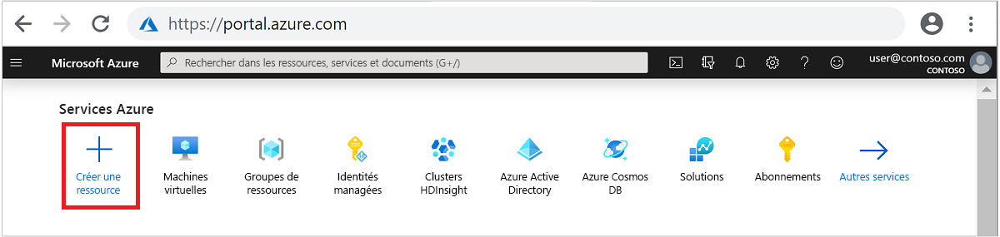
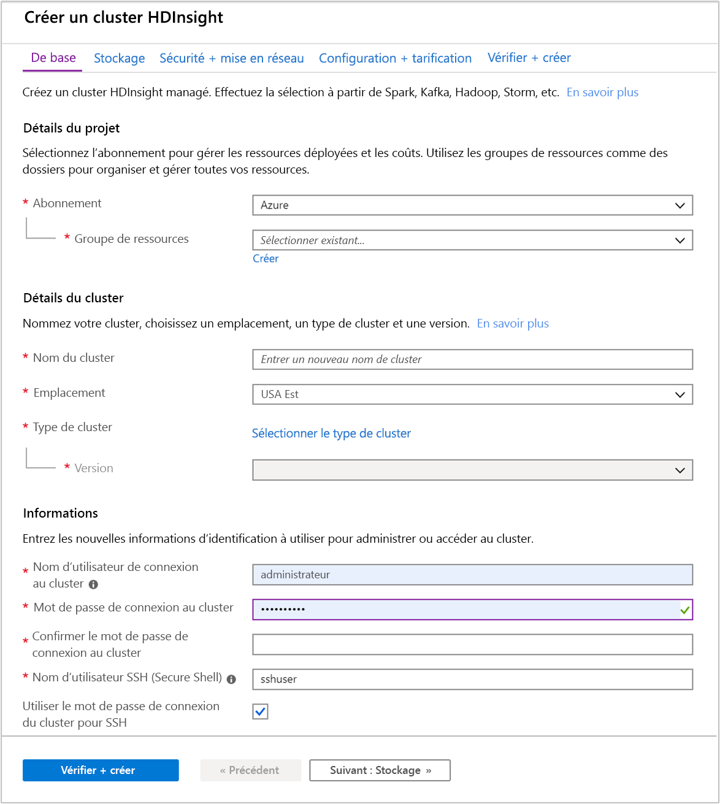
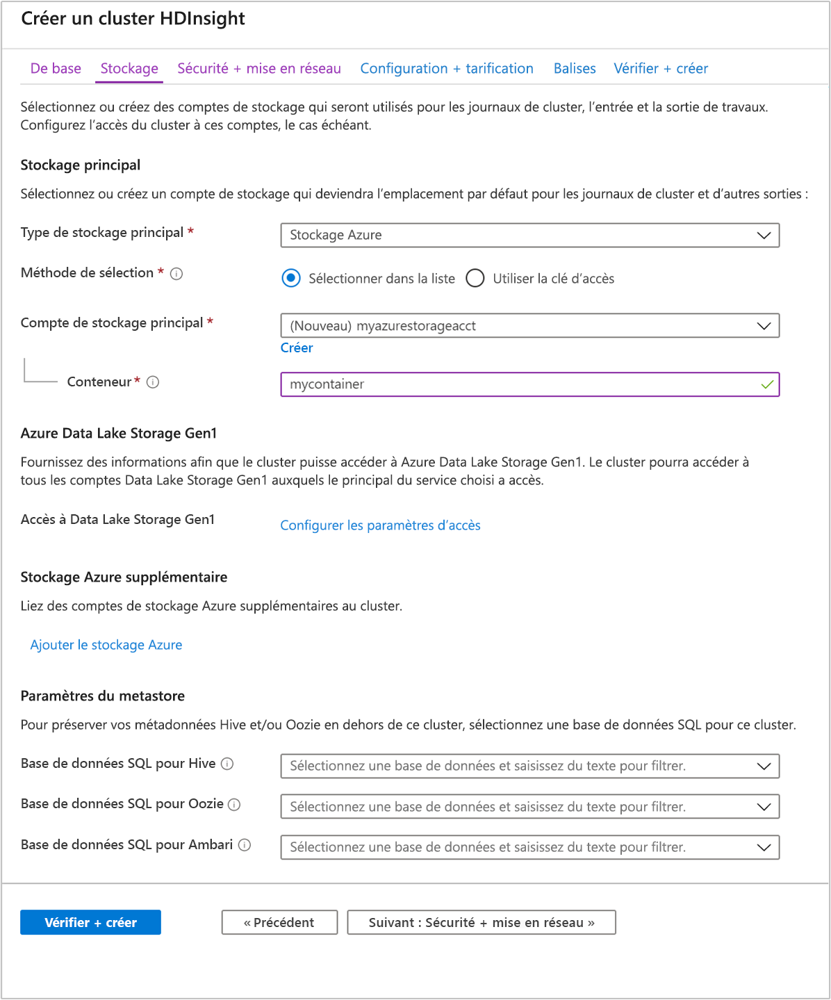
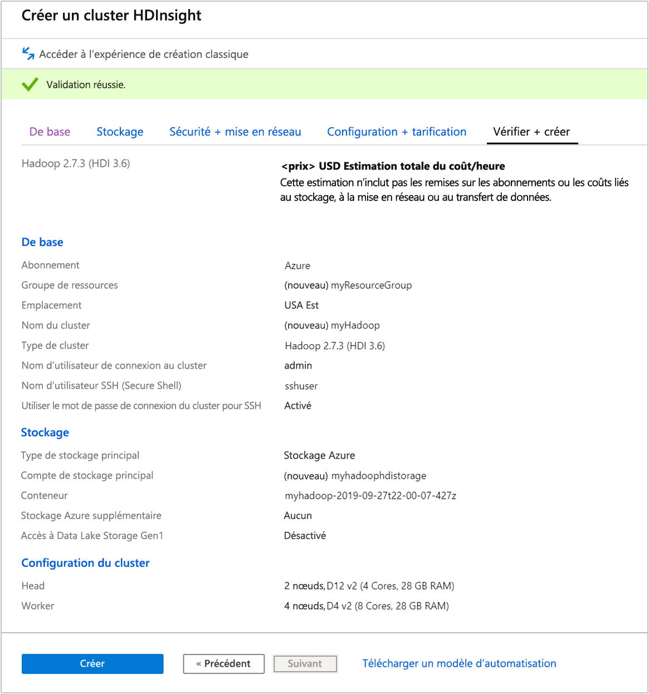
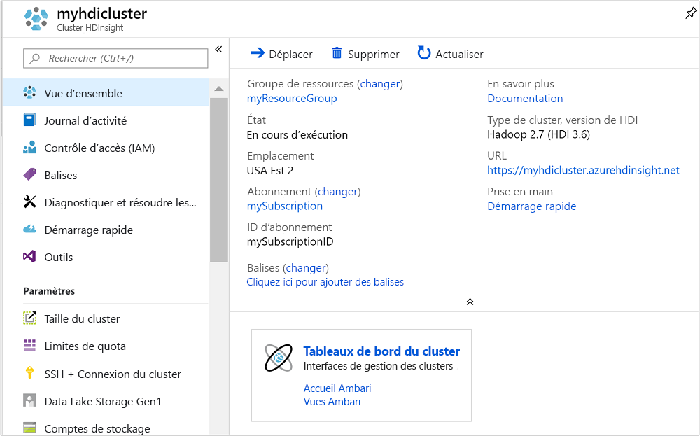
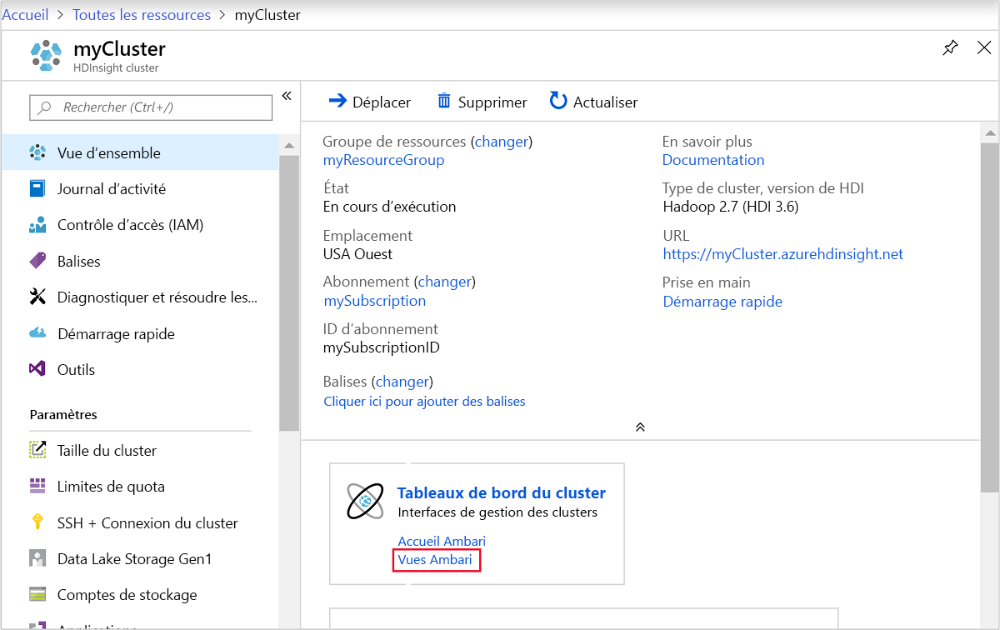
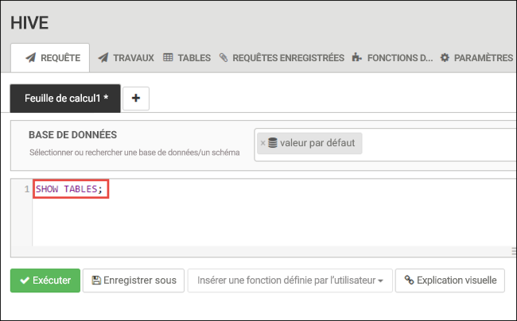
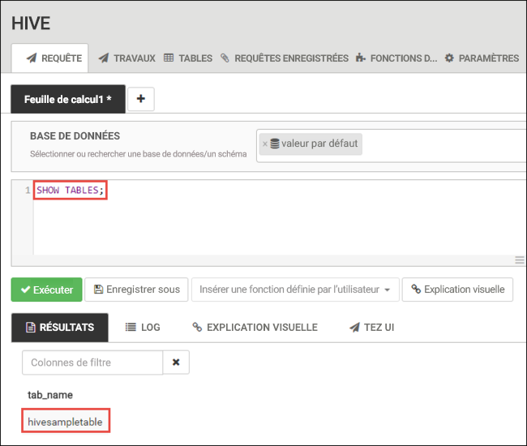
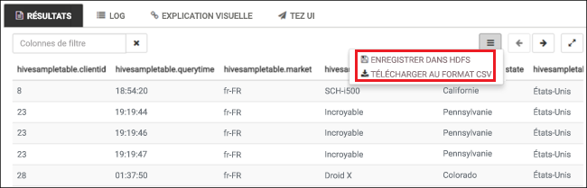
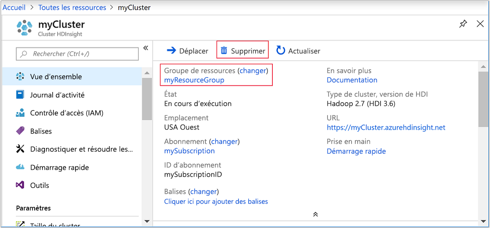

# <a name="quickstart-create-apache-hadoop-cluster-in-azure-hdinsight-using-azure-portal"></a>Démarrage rapide : créer un cluster Apache Hadoop dans Azure HDInsight à l’aide du portail Azure

Dans cet article, vous apprenez à créer des clusters Apache Hadoop dans HDInsight à l’aide du portail Azure, puis à exécuter des travaux Apache Hive dans HDInsight. La plupart des tâches Hadoop sont des tâches de traitements par lots. Vous créez un cluster, exécutez certaines tâches, puis supprimez le cluster. Dans cet article, vous allez effectuer les trois tâches. Pour obtenir des explications détaillées sur les configurations disponibles, consultez [Configurer des clusters dans HDInsight](../hdinsight-hadoop-provision-linux-clusters.md). Pour plus d’informations sur l’utilisation du portail pour créer des clusters, consultez [Créer des clusters dans le portail](../hdinsight-hadoop-create-linux-clusters-portal.md).

Dans ce guide de démarrage rapide, vous utilisez le portail Azure pour créer un cluster HDInsight Hadoop. Vous pouvez aussi créer un cluster à l’aide du [modèle Azure Resource Manager](apache-hadoop-linux-tutorial-get-started.md).

HDInsight est actuellement fourni avec [sept types de cluster](../hdinsight-overview.md#cluster-types-in-hdinsight). Chaque type de cluster prend en charge un ensemble de composants bien spécifiques. Tous les types de cluster prennent en charge Hive. Pour obtenir la liste des composants pris en charge dans HDInsight, consultez [Quels sont les composants et versions Apache Hadoop disponibles avec HDInsight ?](../hdinsight-component-versioning.md)  

Si vous ne disposez pas d’abonnement Azure, créez un [compte gratuit](https://azure.microsoft.com/free/) avant de commencer.

## <a name="create-an-apache-hadoop-cluster"></a>Créer un cluster Apache Hadoop

Cette section vous permet de créer un cluster Hadoop dans HDInsight à l’aide du portail Azure.

1. Connectez-vous au [portail Azure](https://portal.azure.com).

1. Dans le menu du haut, sélectionnez **+ Créer une ressource**.

    

1. Sélectionnez **Analyse** > **Azure HDInsight** pour accéder à la page **Créer un cluster HDInsight**.

1. Sous l’onglet **De base**, fournissez les informations suivantes :

    |Propriété  |Description  |
    |---------|---------|
    |Abonnement    |  Dans la liste déroulante, sélectionnez l’abonnement Azure utilisé pour le cluster. |
    |Resource group     | Dans la liste déroulante, sélectionnez votre groupe de ressources existant ou **Créer**.|
    |Nom du cluster   | Entrez un nom globalement unique. Le nom peut comporter jusqu’à 59 caractères, dont des lettres, des chiffres et des traits d’union. Le premier caractère et le dernier caractère du nom ne peuvent pas être des traits d’union. |
    |Région    | Dans la liste déroulante, sélectionnez une région dans laquelle le cluster est créé.  Choisissez un emplacement proche de vous pour obtenir des performances optimales. |
    |Type de cluster| Choisissez **Sélectionner un type de cluster**. Sélectionnez ensuite **Hadoop** comme type de cluster.|
    |Version|Dans la liste déroulante, sélectionnez une **version**. Utilisez la version par défaut si vous ne savez pas laquelle choisir.|
    |Nom d’utilisateur et mot de passe du cluster    | Le nom de connexion par défaut est **admin**. Le mot de passe doit comporter au moins 10 caractères et inclure au moins un chiffre, une lettre majuscule, une lettre minuscule et un caractère non alphanumérique (à l’exception de ’ " ` \). Veillez à **ne pas indiquer** des mots de passe courants comme « Pass@word1 ».|
    |Nom d’utilisateur SSH (Secure Shell) | Le nom d’utilisateur par défaut est **sshuser**.  Vous pouvez fournir un autre nom pour le nom d’utilisateur SSH. |
    |Utiliser le mot de passe de connexion au cluster pour SSH| Cochez cette case pour utiliser le même mot de passe utilisateur SSH que celui fourni pour l’utilisateur de connexion au cluster.|

    

    Sélectionnez le bouton **Suivant : Stockage >>** pour passer aux paramètres de stockage.

1. À partir de l’onglet **Stockage**, indiquez les valeurs suivantes :

    |Propriété  |Description  |
    |---------|---------|
    |Type de stockage principal|Utilisez la valeur par défaut : **Stockage Azure**.|
    |Méthode de sélection|Utilisez la valeur par défaut : **Sélectionner dans la liste**.|
    |Compte de stockage principal|Utilisez la liste déroulante pour sélectionner un compte de stockage existant, ou sélectionnez **Créer nouveau**. Si vous créez un compte, son nom doit contenir entre 3 et 24 caractères alphanumériques minuscules.|
    |Conteneur|Utilisez la valeur renseignée automatiquement.|

    

    Chaque cluster a une dépendance de [compte de stockage Azure](../hdinsight-hadoop-use-blob-storage.md), [Azure Data Lake Gen1](../hdinsight-hadoop-use-data-lake-storage-gen1.md) ou [`Azure Data Lake Storage Gen2`](../hdinsight-hadoop-use-data-lake-storage-gen2.md). Elle est désignée comme compte de stockage par défaut. Le cluster HDInsight et son compte de stockage par défaut doivent figurer dans la même région Azure. La suppression de clusters n’a pas pour effet de supprimer le compte de stockage.

    Sélectionnez l’onglet **Vérifier + créer**.

1. Sous l’onglet **Vérifier + créer**, vérifiez les valeurs que vous avez sélectionnées dans les étapes précédentes.

    

1. Sélectionnez **Create** (Créer). La création d’un cluster prend environ 20 minutes.

    Une fois que le cluster est créé, la page de vue d’ensemble du cluster s’affiche dans le portail Azure.

    

## <a name="run-apache-hive-queries"></a>Exécuter des requêtes Apache Hive

[Apache Hive](hdinsight-use-hive.md) est le composant le plus populaire utilisé dans HDInsight. Il existe de nombreuses façons d’exécuter des tâches Hive dans HDInsight. Dans ce démarrage rapide, vous allez utiliser l’affichage Ambari Hive à partir du portail. Pour d’autres méthodes d’envoi de tâches Hive, consultez la page [Utilisation de Hive et HiveQL avec Hadoop dans HDInsight pour l’analyse d’un exemple de fichier Apache log4j](hdinsight-use-hive.md).

> [!NOTE]
> La vue Apache Hive n’est pas disponible dans HDInsight 4.0.

1. Pour ouvrir Ambari, sélectionnez **Tableau de bord du cluster** à partir de la capture d’écran précédente.  Vous pouvez également accéder à `https://ClusterName.azurehdinsight.net`, où `ClusterName` est le cluster que vous avez créé dans la section précédente.

    

2. Entrez le nom d’utilisateur Hadoop et le mot de passe que vous avez spécifiés lors de la création du cluster. Le nom d’utilisateur par défaut est **admin**.

3. Ouvrez l’**affichage Hive** comme illustré dans la capture d’écran suivante :

    

4. Dans l’onglet **REQUÊTE**, collez les instructions HiveQL suivantes dans la feuille de calcul :

    ```sql
    SHOW TABLES;
    ```

    

5. Sélectionnez **Exécuter**. Un onglet **RÉSULTATS** apparaît sous l’onglet **REQUÊTE** et affiche des informations sur le travail. 

    Une fois la requête terminée, l’onglet **REQUÊTE** affiche les résultats de l’opération. Vous devriez voir une table appelée **hivesampletable**. Cet exemple de table Hive est fourni avec les clusters HDInsight.

    

6. Répétez les étapes 4 et 5 pour exécuter la requête suivante :

    ```sql
    SELECT * FROM hivesampletable;
    ```

7. Vous pouvez également enregistrer les résultats de la requête. Sélectionnez le bouton de menu à droite et spécifiez si vous souhaitez télécharger les résultats sous la forme d’un fichier CSV ou les stocker dans le compte de stockage associé au cluster.

    

Quand vous avez terminé une tâche Hive, vous pouvez [exporter les résultats dans une base de données Azure SQL ou SQL Server](apache-hadoop-use-sqoop-mac-linux.md). Vous pouvez également [visualiser les résultats à l’aide d’Excel](apache-hadoop-connect-excel-power-query.md). Pour plus d’informations sur l’utilisation de Hive dans HDInsight, consultez [Utilisation d’Apache Hive et HiveQL avec Apache Hadoop dans HDInsight pour l’analyse d’un exemple de fichier Apache log4j](hdinsight-use-hive.md).

## <a name="clean-up-resources"></a>Nettoyer les ressources

Après avoir suivi ce guide de démarrage rapide, vous souhaiterez peut-être supprimer le cluster. Avec HDInsight, vos données sont stockées dans le stockage Azure. Vous pouvez ainsi supprimer un cluster en toute sécurité s’il n’est pas en cours d’utilisation. Vous devez également payer pour un cluster HDInsight, même quand vous ne l’utilisez pas. Étant donné que les frais pour le cluster sont bien plus élevés que les frais de stockage, mieux vaut supprimer les clusters quand ils ne sont pas utilisés.

> [!NOTE]  
> Si vous passez *immédiatement* à l’article suivant pour apprendre à exécuter des opérations ETL à l’aide de Hadoop sur HDInsight, vous pouvez garder le cluster en cours d’exécution. En effet, vous devrez à nouveau créer un cluster Hadoop dans le tutoriel. Toutefois, si vous ne passez pas immédiatement à l’article suivant, vous devez supprimer le cluster maintenant.

### <a name="to-delete-the-cluster-andor-the-default-storage-account"></a>Pour supprimer le cluster et/ou le compte de stockage par défaut

1. Revenez à l’onglet du navigateur dans lequel se trouve le portail Azure. Vous devez être sur la page de vue d’ensemble du cluster. Sélectionnez **Supprimer** si vous souhaitez seulement supprimer le cluster, mais conserver le compte de stockage par défaut.

    

2. Si vous souhaitez supprimer le cluster ainsi que le compte de stockage par défaut, sélectionnez le nom du groupe de ressources (encadré dans la capture d’écran précédente) pour ouvrir la page du groupe de ressources.

3. Sélectionnez **Supprimer le groupe de ressources** pour supprimer le groupe de ressources, qui contient le cluster et le compte de stockage par défaut. Notez que la suppression du groupe de ressources aura pour effet de supprimer le compte de stockage. Si vous souhaitez conserver le compte de stockage, choisissez de supprimer uniquement le cluster.

## <a name="next-steps"></a>Étapes suivantes

Dans ce guide de démarrage rapide, vous avez appris à créer un cluster HDInsight Linux à l’aide d’un modèle Resource Manager et à effectuer des requêtes Hive de base. Dans l’article suivant, vous apprendrez à effectuer une opération d’extraction, de transformation et de chargement (ETL) à l’aide de Hadoop sur HDInsight.

> [!div class="nextstepaction"]
> [Extraire, transformer et charger des données à l’aide d’Interactive Query sur HDInsight](../interactive-query/interactive-query-tutorial-analyze-flight-data.md)
