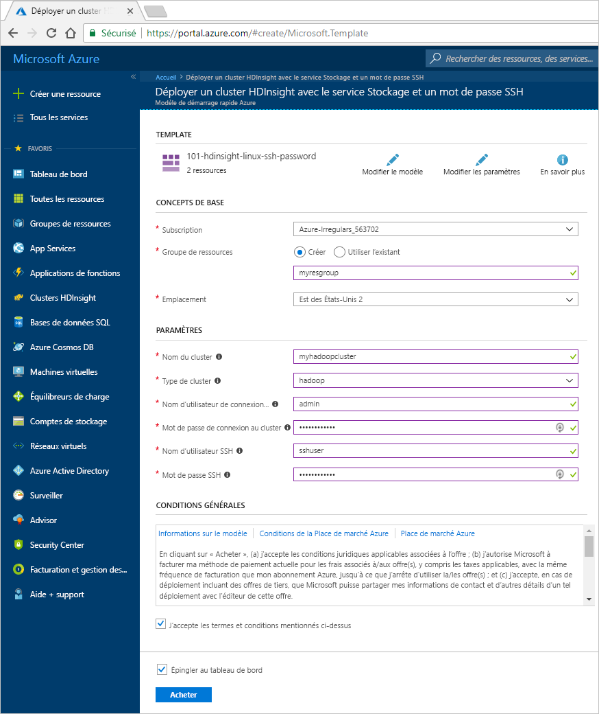
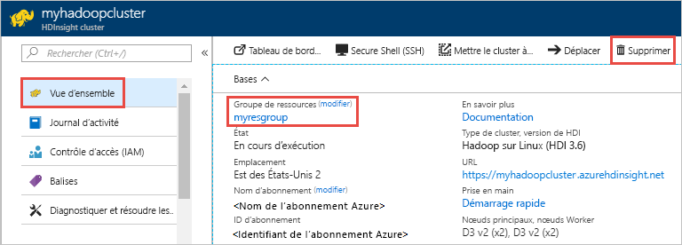

# Démarrage rapide : Créer un cluster Apache Hadoop dans Azure HDInsight avec un modèle Resource Manager

Dans ce guide de démarrage rapide, vous utilisez un modèle Azure Resource Manager pour créer un cluster [Apache Hadoop](./apache-hadoop-introduction.md) dans Azure HDInsight. Hadoop était le framework open source d’origine pour le traitement et l’analyse distribués des jeux de données volumineux sur des clusters. L’écosystème Hadoop comprend des logiciels et des utilitaires associés, notamment Apache Hive, Apache HBase, Spark, Kafka et bien d’autres encore.

[!INCLUDE [About Azure Resource Manager](../../../includes/resource-manager-quickstart-introduction.md)]
  
HDInsight est actuellement fournie avec [sept types de cluster](../hdinsight-overview.md#cluster-types-in-hdinsight). Chaque type de cluster prend en charge un ensemble de composants bien spécifiques. Tous les types de cluster prennent en charge Hive. Pour obtenir la liste des composants pris en charge dans HDInsight, consultez [Nouveautés des versions de cluster Hadoop fournies par HDInsight](../hdinsight-component-versioning.md)  

Si vous n’avez pas d’abonnement Azure, créez un [compte gratuit](https://azure.microsoft.com/free/?WT.mc_id=A261C142F) avant de commencer.

## Créer un cluster Apache Hadoop

### Vérifier le modèle

Le modèle utilisé dans ce guide de démarrage rapide est tiré des [modèles de démarrage rapide Azure](https://github.com/Azure/azure-quickstart-templates/tree/master/101-hdinsight-linux-ssh-password).

:::code language="json" source="~/quickstart-templates/101-hdinsight-linux-ssh-password/azuredeploy.json" range="1-148":::

Deux ressources Azure sont définies dans le modèle :

* [Microsoft.Storage/storageAccounts](https://docs.microsoft.com/azure/templates/microsoft.storage/storageaccounts) : crée un compte de stockage Azure.
* [Microsoft.HDInsight/cluster](https://docs.microsoft.com/azure/templates/microsoft.hdinsight/clusters) : crée un cluster HDInsight.

### Déployer le modèle

1. Sélectionnez le bouton **Déployer sur Azure** ci-dessous pour vous connecter à Azure et ouvrir le modèle Resource Manager.

    

1. Entrez ou sélectionnez les valeurs suivantes :

    |Propriété  |Description  |
    |---------|---------|
    |Abonnement|Dans la liste déroulante, sélectionnez l’abonnement Azure utilisé pour le cluster.|
    |Resource group|Dans la liste déroulante, sélectionnez votre groupe de ressources existant ou **Créer**.|
    |Emplacement|La valeur est renseignée automatiquement à l’aide de l’emplacement utilisé pour le groupe de ressources.|
    |Nom du cluster|Entrez un nom globalement unique. Pour ce modèle, utilisez uniquement des lettres minuscules et des chiffres.|
    |Type du cluster | Sélectionnez **hadoop**. |
    |Nom d’utilisateur de connexion au cluster|Indiquez le nom d’utilisateur, la valeur par défaut est **Administrateur**.|
    |Mot de passe de connexion au cluster|Fournissez un mot de passe. Le mot de passe doit comporter au moins 10 caractères et inclure au moins un chiffre, une lettre majuscule, une lettre minuscule et un caractère non alphanumérique (à l’exception des caractères ' " `). |
    |Nom d’utilisateur SSH|Indiquez le nom d’utilisateur. La valeur par défaut est **sshuser**|
    |Mot de passe SSH|Indiquez le mot de passe.|

    Certaines propriétés ont été codées en dur dans le modèle.  Vous pouvez configurer ces valeurs à partir du modèle. Pour consulter une présentation de ces propriétés, consultez [Créer des clusters Apache Hadoop dans HDInsight](../hdinsight-hadoop-provision-linux-clusters.md).

    > [!NOTE]  
    > Les valeurs saisies doivent être uniques et suivre les instructions d’affectation de noms. Le modèle n’effectue pas de contrôles de validation. Si les valeurs saisies sont déjà utilisées ou ne suivent pas les instructions, vous obtiendrez une erreur après avoir envoyé le modèle.  

    

1. Passez en revue les **CONDITIONS GÉNÉRALES**. Sélectionnez ensuite **J’accepte les conditions générales mentionnées ci-dessus**, puis **Acheter**. Vous recevez une notification indiquant que votre déploiement est en cours. La création d’un cluster prend environ 20 minutes.

## Vérifier les ressources déployées

Une fois le cluster créé, vous recevez une notification **Déploiement réussi** avec un lien **Accéder à la ressource**. La page Groupe de ressources liste votre nouveau cluster HDInsight ainsi que le stockage par défaut associé au cluster. Chaque cluster a une dépendance de [compte de stockage Azure](../hdinsight-hadoop-use-blob-storage.md) ou une dépendance de [compte Azure Data Lake Storage](../hdinsight-hadoop-use-data-lake-store.md). Elle est désignée comme compte de stockage par défaut. Le cluster HDInsight et son compte de stockage par défaut doivent figurer dans la même région Azure. La suppression de clusters n’a pas pour effet de supprimer le compte de stockage.

> [!NOTE]  
> Pour obtenir d’autres méthodes de création de cluster et comprendre les propriétés utilisées dans ce guide de démarrage rapide, consultez [Créer des clusters HDInsight](../hdinsight-hadoop-provision-linux-clusters.md).

## Nettoyer les ressources

Après avoir suivi ce guide de démarrage rapide, vous souhaiterez peut-être supprimer le cluster. Avec HDInsight, vos données sont stockées dans le stockage Azure. Vous pouvez ainsi supprimer un cluster en toute sécurité s’il n’est pas en cours d’utilisation. Vous devez également payer pour un cluster HDInsight, même quand vous ne l’utilisez pas. Étant donné que les frais pour le cluster sont bien plus élevés que les frais de stockage, mieux vaut supprimer les clusters quand ils ne sont pas utilisés.

> [!NOTE]  
> Si vous passez *immédiatement* au tutoriel suivant pour apprendre à exécuter des opérations ETL à l’aide de Hadoop sur HDInsight, vous pouvez garder le cluster en cours d’exécution. En effet, vous devrez à nouveau créer un cluster Hadoop dans le tutoriel. Toutefois, si vous ne passez pas immédiatement au tutoriel suivant, vous devez supprimer le cluster maintenant.

Dans le portail Azure, accédez à votre cluster, puis sélectionnez **Supprimer**.

Vous pouvez également sélectionner le nom du groupe de ressources pour ouvrir la page du groupe de ressources, puis sélectionner **Supprimer le groupe de ressources**. En supprimant le groupe de ressources, vous supprimez le cluster HDInsight et le compte de stockage par défaut.

## Étapes suivantes

Lors de ce démarrage rapide, vous avez appris à créer un cluster Apache Hadoop dans HDInsight à l’aide d’un modèle Resource Manager. Dans l’article suivant, vous apprendrez à effectuer une opération d’extraction, de transformation et de chargement (ETL) à l’aide de Hadoop sur HDInsight.

> [!div class="nextstepaction"]
> [Extraire, transformer et charger des données à l’aide d’Interactive Query sur HDInsight](../interactive-query/interactive-query-tutorial-analyze-flight-data.md)
