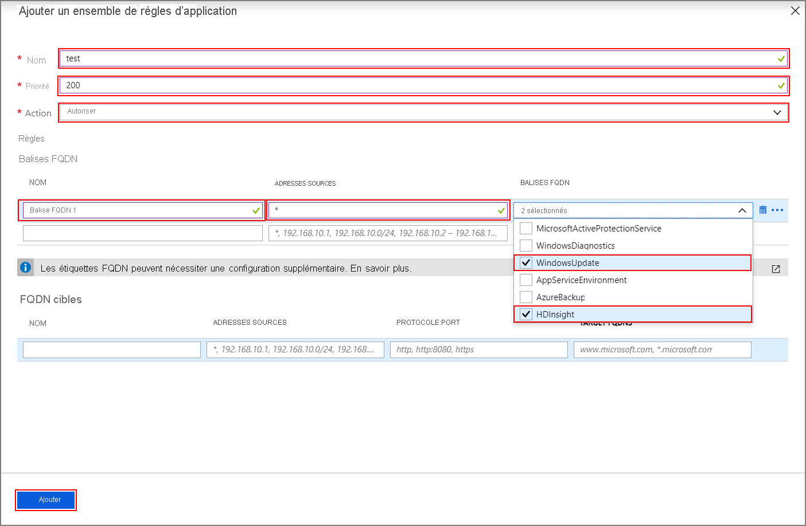
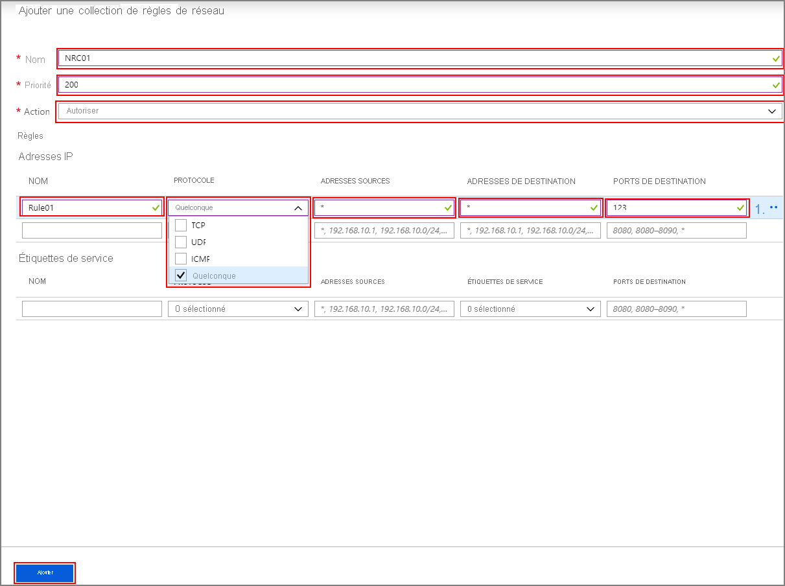

# <a name="configure-outbound-network-traffic-for-azure-hdinsight-clusters-using-firewall"></a>Configurer le trafic réseau sortant pour les clusters Azure HDInsight à l’aide du pare-feu

Cet article décrit les étapes de sécurisation du trafic sortant de votre cluster HDInsight à l’aide du pare-feu Azure. Les étapes ci-dessous supposent que vous configurez le Pare-feu Azure d’un cluster existant. Si vous déployez un nouveau cluster derrière un pare-feu, créez d’abord votre cluster HDInsight et votre sous-réseau. Suivez ensuite les étapes décrites dans ce guide.

## <a name="background"></a>Arrière-plan

Les clusters HDInsight sont normalement déployés dans un réseau virtuel. Le cluster a des dépendances vis-à-vis de services en dehors de ce réseau virtuel.

Plusieurs dépendances requièrent un trafic entrant. Le trafic de gestion entrant ne peut pas être envoyé via un dispositif de pare-feu. Les adresses sources de ce trafic sont connues et publiées [ici](hdinsight-management-ip-addresses.md). Vous pouvez également créer des règles de groupe de sécurité réseau (NSG) avec ces informations pour sécuriser le trafic entrant dans les clusters.

Les dépendances de trafic sortant HDInsight sont presque entièrement définies avec des FQDN, qui n’ont pas d’adresses IP statiques sous-jacentes. L’absence d’adresses statiques signifie que les groupes de sécurité réseau (NSG) ne peuvent pas verrouiller le trafic sortant d’un cluster. Les adresses changent suffisamment souvent pour qu’il ne soit pas possible de définir des règles basées sur la résolution de noms actuelle et de les utiliser.

Sécurisez les adresses sortantes à l’aide d’un pare-feu qui peut contrôler le trafic sortant en fonction des noms de domaine. Le Pare-feu Azure restreint le trafic sortant en fonction du FQDN de la destination ou des [balises FQDN](../firewall/fqdn-tags.md).

## <a name="configuring-azure-firewall-with-hdinsight"></a>Configuration du pare-feu Azure avec HDInsight

Voici le résumé des étapes pour verrouiller les sorties de votre cluster HDInsight existant avec le pare-feu Azure :

1. Créez un sous-réseau.
1. Créez un pare-feu.
1. Ajoutez des règles d’application au pare-feu.
1. Ajoutez des règles de réseau au pare-feu.
1. Créez une table de routage.

### <a name="create-new-subnet"></a>Créer un sous-réseau

Créez un sous-réseau nommé **AzureFirewallSubnet** dans le réseau virtuel où se trouve votre cluster.

### <a name="create-a-new-firewall-for-your-cluster"></a>Créer un pare-feu pour votre cluster

Créez un pare-feu nommé **Test-FW01** à l’aide des étapes décrites dans **Déployer le pare-feu**, dans [Tutoriel : Déployer et configurer un pare-feu Azure à l’aide du portail Azure](../firewall/tutorial-firewall-deploy-portal.md#deploy-the-firewall)

### <a name="configure-the-firewall-with-application-rules"></a>Configurer le pare-feu avec des règles d’application

Créez un regroupement de règles d’application permettant au cluster d’envoyer et de recevoir les communications importantes.

1. Sélectionnez le nouveau pare-feu **Test-FW01** dans le Portail Azure.

1. Accédez à **Paramètres** > **Règles** > **Collection de règles d’application** > **Ajouter une collection de règles d’application**.

    

1. Dans l’écran **Ajouter une collection de règles d’application**, fournissez les informations suivantes :

    **Section supérieure**

    | Propriété|  Valeur|
    |---|---|
    |Nom| FwAppRule|
    |Priority|200|
    |Action|Allow|

    **Section des étiquettes FQDN**

    | Nom | Adresse source | Balise FQDN | Notes |
    | --- | --- | --- | --- |
    | Rule_1 | * | WindowsUpdate et HDInsight | Requis pour les services HDI |

    **Section des noms de domaine complets cibles**

    | Nom | Adresses sources | Protocole:Port | Noms de domaine complets cibles | Notes |
    | --- | --- | --- | --- | --- |
    | Rule_2 | * | https:443 | login.windows.net | Autorise les activités de connexion Windows |
    | Rule_3 | * | https:443 | login.microsoftonline.com | Autorise les activités de connexion Windows |
    | Rule_4 | * | https:443,http:80 | storage_account_name.blob.core.windows.net | Remplacez `storage_account_name` par votre nom de compte de stockage réel. Si votre cluster s’appuie sur WASB, ajoutez une règle pour WASB. Pour utiliser UNIQUEMENT les connexions https, veillez à ce que l’option [« Transfert sécurisé requis »](../storage/common/storage-require-secure-transfer.md) soit activée sur le compte de stockage. |

   

1. Sélectionnez **Ajouter**.

### <a name="configure-the-firewall-with-network-rules"></a>Configurer le pare-feu avec des règles de réseau

Créez les règles de réseau pour configurer correctement votre cluster HDInsight.

1. Après l’étape précédente, accédez à **Collection de règles de réseau** >  **+ Ajouter une collection de règles de réseau**.

1. Dans l’écran **Ajouter une collection de règles de réseau**, fournissez les informations suivantes :

    **Section supérieure**

    | Propriété|  Valeur|
    |---|---|
    |Nom| FwNetRule|
    |Priority|200|
    |Action|Allow|

    **Section des adresses IP**

    | Nom | Protocol | Adresses sources | Adresses de destination | Ports de destination | Notes |
    | --- | --- | --- | --- | --- | --- |
    | Rule_1 | UDP | * | * | 123 | Service de temps |
    | Rule_2 | Quelconque | * | DC_IP_Address_1, DC_IP_Address_2 | * | Si vous utilisez le Pack Sécurité Entreprise (ESP), ajoutez une règle de réseau dans la section Adresses IP permettant la communication avec AAD-DS pour les clusters ESP. Vous pouvez trouver les adresses IP des contrôleurs de domaine dans la section AAD-DS du portail. |
    | Rule_3 | TCP | * | Adresse IP de votre compte Data Lake Storage | * | Si vous utilisez Azure Data Lake Storage, vous pouvez ajouter une règle de réseau dans la section Adresses IP pour résoudre un problème d’indication du nom du serveur avec ADLS Gen1 et Gen2. Cette option achemine le trafic vers le pare-feu. Cela peut entraîner des coûts plus élevés pour les chargements de données volumineux, mais le trafic est journalisé et peut être audité dans les journaux de pare-feu. Déterminez l’adresse IP de votre compte Data Lake Storage. Vous pouvez utiliser une commande PowerShell comme `[System.Net.DNS]::GetHostAddresses("STORAGEACCOUNTNAME.blob.core.windows.net")` pour convertir le nom de domaine complet en adresse IP.|
    | Rule_4 | TCP | * | * | 12 000 | (Facultatif) Si vous utilisez Log Analytics, créez une règle de réseau dans la section Adresses IP pour permettre la communication avec votre espace de travail Log Analytics. |

    **Section des étiquettes de service**

    | Nom | Protocol | Adresses sources | Étiquettes de service | Ports de destination | Notes |
    | --- | --- | --- | --- | --- | --- |
    | Rule_7 | TCP | * | SQL | 1433 | Configurez une règle de réseau dans la section Balises de service pour SQL qui vous permettra de journaliser et d’auditer le trafic SQL. Si vous avez configuré des points de terminaison de service pour SQL Server sur le sous-réseau HDInsight, le pare-feu sera contourné. |
    | Rule_8 | TCP | * | Azure Monitor | * | (facultatif) Les clients qui envisagent d’utiliser la fonctionnalité de mise à l’échelle automatique doivent ajouter cette règle. |
    
   

1. Sélectionnez **Ajouter**.

### <a name="create-and-configure-a-route-table"></a>Créer et configurer une table de routage

Créez une table de routage avec les entrées suivantes :

* Toutes les adresses IP de [Services de gestion et d’intégrité : Toutes les régions](../hdinsight/hdinsight-management-ip-addresses.md#health-and-management-services-all-regions) avec un type de tronçon suivant **Internet**.

* Deux adresses IP pour la région où le cluster est créé à partir de [Services de gestion et d’intégrité : Régions spécifiques](../hdinsight/hdinsight-management-ip-addresses.md#health-and-management-services-specific-regions) avec un type de tronçon suivant **Internet**.

* Une route d’appliance virtuelle pour l’adresse IP 0.0.0.0/0 avec comme tronçon suivant l’adresse IP privée de votre pare-feu Azure.

Par exemple, pour configurer la table de routage d’un cluster créé dans la région des États-Unis « USA Est », procédez comme suit :

1. Sélectionnez votre pare-feu Azure **Test-FW01**. Copiez l’**adresse IP privée** figurant dans la page **Vue d’ensemble**. Pour cet exemple, nous utiliserons un **exemple d’adresse 10.0.2.4**.

1. Accédez ensuite à **Tous les services** > **Mise en réseau** > **Tables de routage** et **Créer une table de routage**.

1. À partir de votre nouvelle route, accédez à **Paramètres** > **Routes** >  **+ Ajouter**. Ajoutez les routes suivantes :

| Nom de l’itinéraire | Préfixe de l’adresse | Type de tronçon suivant | adresse de tronçon suivant |
|---|---|---|---|
| 168.61.49.99 | 168.61.49.99/32 | Internet | N/D |
| 23.99.5.239 | 23.99.5.239/32 | Internet | N/D |
| 168.61.48.131 | 168.61.48.131/32 | Internet | N/D |
| 138.91.141.162 | 138.91.141.162/32 | Internet | N/D |
| 13.82.225.233 | 13.82.225.233/32 | Internet | N/D |
| 40.71.175.99 | 40.71.175.99/32 | Internet | N/D |
| 0.0.0.0 | 0.0.0.0/0 | Appliance virtuelle | 10.0.2.4 |

Terminez la configuration de la table de routage :

1. Affectez la table de routage que vous avez créée à votre sous-réseau HDInsight en sélectionnant **Sous-réseaux** sous **Paramètres**.

1. Sélectionnez **+ Associer**.

1. Dans l’écran **Associer un sous-réseau**, sélectionnez le réseau virtuel dans lequel votre cluster a été créé et le **sous-réseau** que vous avez utilisé pour votre cluster HDInsight.

1. Sélectionnez **OK**.

## <a name="edge-node-or-custom-application-traffic"></a>Nœud de périphérie ou trafic d’application personnalisée

Les étapes ci-dessus permettent à votre cluster de fonctionner sans problème. Vous devez encore configurer les dépendances pour prendre en charge vos applications personnalisées s’exécutant sur les nœuds de périphérie, le cas échéant.

Les dépendances des applications doivent être identifiées et ajoutées au pare-feu Azure ou à la table de routage.

Les itinéraires doivent être créés pour le trafic des applications afin d’éviter des problèmes de routage asymétrique.

Si vos applications ont d’autres dépendances, celles-ci doivent être ajoutées à votre pare-feu Azure. Créez des règles d’application pour autoriser le trafic HTTP/HTTPS et des règles de réseau pour tout le reste.

## <a name="logging-and-scale"></a>Journalisation et mise à l’échelle

Le pare-feu Azure peut envoyer des journaux à plusieurs systèmes de stockage différents. Pour obtenir des instructions sur la configuration de la journalisation de votre pare-feu, suivez les étapes décrites dans l’article [Didacticiel : superviser les journaux du Pare-feu Azure et les métriques](../firewall/tutorial-diagnostics.md).

Une fois que vous avez terminé la configuration de la journalisation, si vous utilisez Log Analytics, vous pouvez afficher le trafic bloqué à l’aide d’une requête, par exemple :

```Kusto
AzureDiagnostics | where msg_s contains "Deny" | where TimeGenerated >= ago(1h)
```

L’intégration de Pare-feu Azure aux journaux d’activité d’Azure Monitor est utile lors de la première utilisation d’une application, en particulier lorsque vous ne connaissez pas toutes les dépendances de l’application. Pour en savoir plus sur les journaux d’activité Azure Monitor, consultez [Analyser les données de journal d’activité dans Azure Monitor](../azure-monitor/log-query/log-query-overview.md)

Pour en savoir plus sur les limites de mise à l’échelle du Pare-feu Azure et demander une augmentation, consultez [ce document](../azure-resource-manager/management/azure-subscription-service-limits.md#azure-firewall-limits) ou reportez-vous au [FAQ](../firewall/firewall-faq.md).

## <a name="access-to-the-cluster"></a>Accès au cluster

Après avoir correctement configuré le pare-feu, vous pouvez utiliser le point de terminaison interne (`https://CLUSTERNAME-int.azurehdinsight.net`) pour accéder à l’API Ambari à partir du réseau virtuel.

Pour utiliser le point de terminaison public (`https://CLUSTERNAME.azurehdinsight.net`) ou ssh (`CLUSTERNAME-ssh.azurehdinsight.net`), assurez-vous d’avoir les routes appropriées dans la table de routage et les règles de groupe de sécurité réseau pour éviter le problème de routage asymétrique expliqué [ici](../firewall/integrate-lb.md). Plus précisément, dans ce cas, vous devez autoriser l’adresse IP du client dans les règles NSG entrantes et l’ajouter à la table de routage définie par l’utilisateur avec le tronçon suivant défini comme `internet`. Si le routage n’est pas configuré correctement, une erreur d’expiration du délai s’affiche.

## <a name="next-steps"></a>Étapes suivantes

* [Architecture de réseau virtuel Azure HDInsight](hdinsight-virtual-network-architecture.md)
* [Configurer une appliance virtuelle réseau](./network-virtual-appliance.md)
