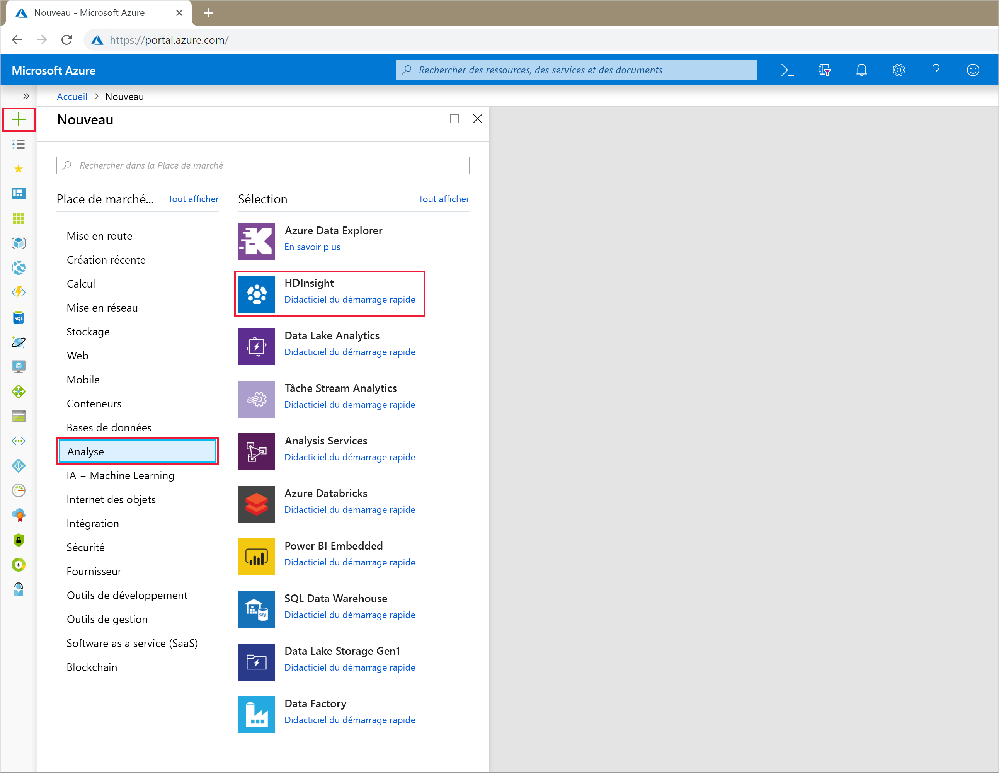
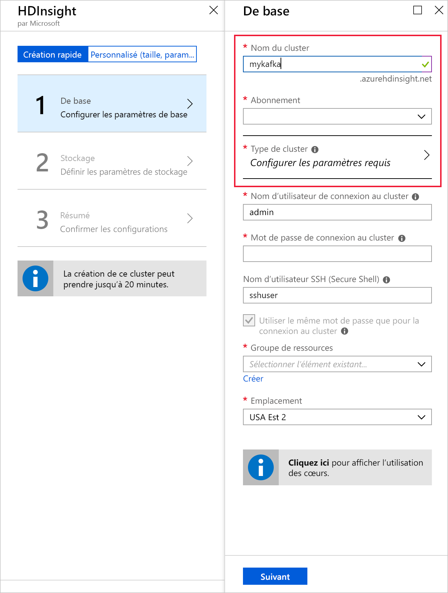
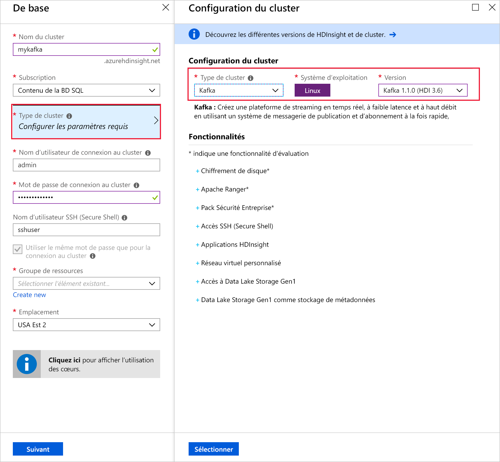
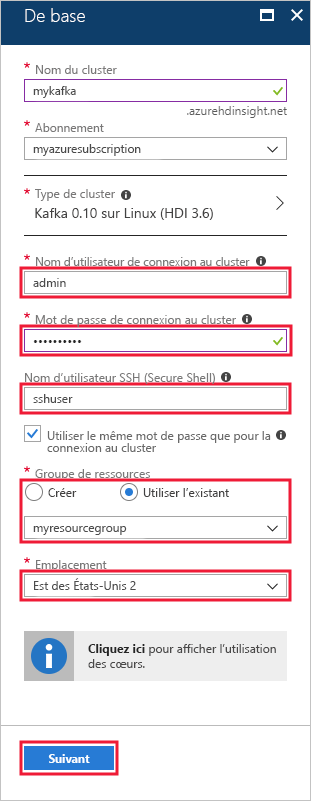
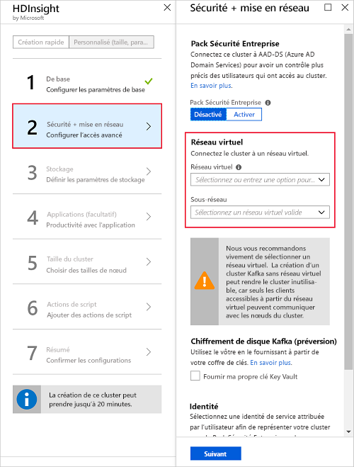
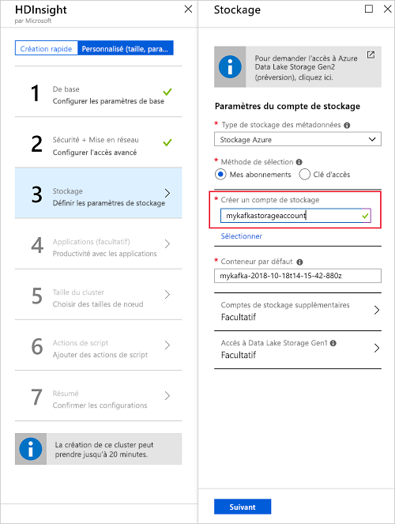
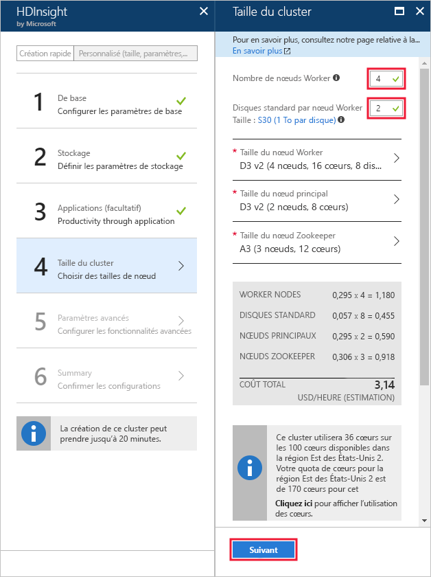
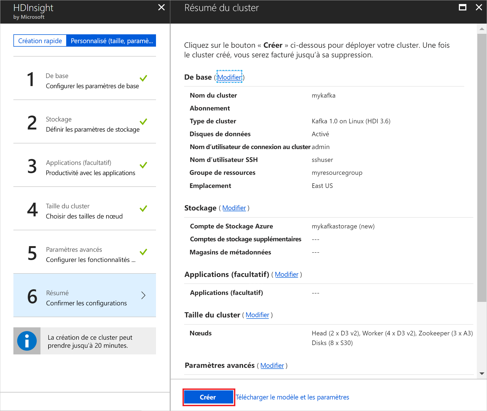

# <a name="quickstart-create-an-apache-kafka-on-hdinsight-cluster"></a>Démarrage rapide : Créer un cluster Apache Kafka sur HDInsight

Apache Kafka est une plateforme de streaming open source distribuée. Elle est souvent utilisée comme broker de messages, car elle propose des fonctionnalités similaires à une file d’attente de messages de publication/abonnement. 

Dans ce guide de démarrage rapide, vous allez apprendre à créer un cluster [Apache Kafka](https://kafka.apache.org) à l’aide du Portail Azure. Il vous expliquera également comment utiliser les utilitaires inclus pour envoyer et recevoir des messages avec Apache Kafka.

[!INCLUDE [delete-cluster-warning](../../../includes/hdinsight-delete-cluster-warning.md)]

> [!IMPORTANT]  
> L’API Apache Kafka n’est accessible qu’aux ressources se trouvant dans le même réseau virtuel. Dans ce guide de démarrage rapide, vous accéderez directement au cluster suivant le protocole SSH. Pour connecter d’autres services, réseaux ou machines virtuelles à Apache Kafka, vous devez tout d’abord créer un réseau virtuel, puis créer les ressources au sein du réseau.
>
> Pour plus d’informations, consultez le document [Se connecter à Apache Kafka à l’aide d’un réseau virtuel](apache-kafka-connect-vpn-gateway.md).

## <a name="prerequisites"></a>Prérequis

* Un abonnement Azure. Si vous n’avez pas d’abonnement Azure, créez un [compte gratuit](https://azure.microsoft.com/free/?WT.mc_id=A261C142F) avant de commencer.

* Un client SSH. Les étapes décrites dans ce document utilisent le protocole SSH pour se connecter au cluster.

    La commande `ssh` est fournie par défaut sur les systèmes Linux, Unix et macOS. Dans Windows 10, utilisez l’une des méthodes suivantes pour installer la commande `ssh` :

    * Utilisez [Azure Cloud Shell](https://docs.microsoft.com/azure/cloud-shell/quickstart). Il fournit la commande `ssh` et peut être configuré pour utiliser Bash ou PowerShell comme environnement shell.

    * [Installez le sous-système Windows pour Linux](https://docs.microsoft.com/windows/wsl/install-win10). Les distributions Linux disponibles sur Microsoft Store fournissent la commande `ssh`.

    > [!IMPORTANT]  
    > Les étapes décrites dans ce document supposent que vous utilisez l’un des clients SSH mentionnés ci-dessus. Si vous utilisez un autre client SSH et que vous rencontrez des problèmes, consultez la documentation de votre client SSH.
    >
    > Pour plus d’informations, consultez le document [Utiliser SSH avec HDInsight](../hdinsight-hadoop-linux-use-ssh-unix.md).

## <a name="create-an-apache-kafka-cluster"></a>Créer un cluster Apache Kafka

Pour créer un cluster Apache Kafka sur HDInsight, procédez comme suit :

1. Connectez-vous au [portail Azure](https://portal.azure.com).

1. Dans le menu de gauche, sélectionnez **+ Créer une ressource**.

1. Sous **Place de marché Azure**, sélectionnez **Analyse**.

1. Sous **En vedette**, sélectionnez **HDInsight**.
   
    

2. Dans **Informations de base**, entrez ou sélectionnez les informations suivantes :

    | Paramètre | Valeur |
    | --- | --- |
    | Nom du cluster | Nom unique du cluster HDInsight. |
    | Abonnement | Sélectionnez votre abonnement. |
    
   Sélectionnez __Type de cluster__ pour afficher la **Configuration du cluster**.
   
   

3. Dans __Configuration du cluster__, sélectionnez les valeurs suivantes :

    | Paramètre | Valeur |
    | --- | --- |
    | Type du cluster | Kafka |
    | Version | Kafka 1.1.0 (HDI 3.6) |

    Utilisez le bouton **Sélectionner** pour enregistrer les paramètres de type de cluster et revenir à __Informations de base__.

    

4. Dans __Informations de base__, entrez ou sélectionnez les informations suivantes :

    | Paramètre | Valeur |
    | --- | --- |
    | Nom d’utilisateur de connexion au cluster | Nom de connexion permettant d’accéder aux services web ou aux API REST hébergés sur le cluster. Laissez la valeur par défaut (admin). |
    | Mot de passe de connexion au cluster | Mot de passe de connexion permettant d’accéder aux services web ou aux API REST hébergés sur le cluster. |
    | Nom d’utilisateur SSH (Secure Shell) | Information de connexion permettant d’accéder au cluster suivant le protocole SSH. Par défaut, le mot de passe est le même que le mot de passe de connexion de cluster. |
    | Groupe de ressources | Groupe de ressources dans lequel le cluster sera créé. |
    | Emplacement | Région Azure dans laquelle le cluster sera créé. |

    > [!TIP]  
    > Chaque région Azure (emplacement) fournit des _domaines d’erreur_. Un domaine d’erreur est un regroupement logique de matériel sous-jacent dans un datacenter Azure. Chaque domaine d’erreur partage une source d’alimentation et un commutateur réseau communs. Les machines virtuelles et les disques managés mettant en œuvre les nœuds au sein d’un cluster HDInsight sont répartis dans ces domaines d’erreur. Cette architecture limite l’impact potentiel des défaillances de matériel physique.
    >
    > Pour garantir la haute disponibilité des données, sélectionnez une région (emplacement) comportant __trois domaines d’erreur__. Pour plus d’informations sur le nombre de domaines d’erreur dans une région, consultez le document [Disponibilité des machines virtuelles Linux](../../virtual-machines/windows/manage-availability.md#use-managed-disks-for-vms-in-an-availability-set).

   

    Utilisez le bouton __Suivant__ pour terminer la configuration de base.

5. Pour ce démarrage rapide, laissez la valeur par défaut des paramètres de sécurité. Pour en savoir plus sur le pack Sécurité Entreprise, visitez [Configurer un cluster HDInsight avec le pack Sécurité Entreprise en utilisant Azure Active Directory Domain Services](../domain-joined/apache-domain-joined-configure-using-azure-adds.md). Pour découvrir comment utiliser votre propre clé pour le chiffrement de disque Apache Kafka, visitez [Apporter votre propre clé pour Apache Kafka sur Azure HDInsight](apache-kafka-byok.md)

   Si vous souhaitez connecter votre cluster à un réseau virtuel, sélectionnez un réseau virtuel à partir de la liste déroulante du **Réseau virtuel**.

   

6. À partir du panneau **Stockage**, sélectionnez ou créez un compte de stockage. Concernant les étapes de ce document, laissez les autres champs sur leurs valeurs par défaut. Utilisez le bouton __Suivant__ pour enregistrer la configuration de stockage. Pour plus d’informations sur l’utilisation de Data Lake Storage Gen2, consultez [Démarrage rapide : Configurer des clusters dans HDInsight](../../storage/data-lake-storage/quickstart-create-connect-hdi-cluster.md).

   

7. Dans __Applications (facultatif)__, sélectionnez __Suivant__ pour laisser les paramètres par défaut.

8. Dans __Taille du cluster__, sélectionnez __Suivant__ pour laisser les paramètres par défaut.

    > [!IMPORTANT]  
    > Pour garantir la disponibilité d’Apache Kafka sur HDInsight, choisissez un __nombre de nœuds de travail__ supérieur ou égal à 3. La valeur par défaut est 4.
    
    > [!TIP]  
    > L’entrée relative aux **disques par nœud de travail** configure l’extensibilité d’Apache Kafka sur HDInsight. Apache Kafka sur HDInsight utilise le disque local des machines virtuelles du cluster pour stocker les données. En raison de son utilisation intensive des E/S, Apache Kafka utilise [Azure Managed Disks](../../virtual-machines/windows/managed-disks-overview.md) pour obtenir un débit élevé et davantage de stockage à chaque nœud. Le type de disque managé peut être soit __Standard__ (HDD), soit __Premium__ (SSD). Le type de disque dépend de la taille de la machine virtuelle utilisée par les nœuds de travail (brokers Apache Kafka). Les disques Premium sont utilisés automatiquement avec les machines virtuelles des séries DS et GS. Tous les autres types de machines virtuelles utilisent des disques Standard.

   

9. Dans __Paramètres avancés__, sélectionnez __Suivant__ pour laisser les paramètres par défaut.

10. Dans le panneau **Résumé**, passez en revue la configuration du cluster. Utilisez les liens __Modifier__ pour modifier les éventuels paramètres incorrects. Pour finir, cliquez sur le bouton __Créer__ pour créer le cluster.
   
    
   
    > [!NOTE]
    > La création du cluster peut prendre jusqu’à 20 minutes.

## <a name="connect-to-the-cluster"></a>Connexion au cluster

1. Pour vous connecter au nœud principal primaire du cluster Apache Kafka, utilisez la commande suivante. Remplacez `sshuser` par le nom d’utilisateur SSH. Remplacez `mykafka` par le nom de votre cluster Apache Kafka.

    ```bash
    ssh sshuser@mykafka-ssh.azurehdinsight.net
    ```

2. Lors de votre première connexion au cluster, il est possible que votre client SSH affiche un message d’avertissement, indiquant que l’authenticité de l’hôte n’a pas pu être établie. À l’invite, tapez __yes__, puis appuyez sur __Entrée__ pour ajouter l’hôte à la liste de serveurs approuvés de votre client SSH.

3. Lorsque vous y êtes invité, entrez le mot de passe de l’utilisateur SSH.

Une fois la connexion établie, des informations de ce type s’affichent :

```text
Authorized uses only. All activity may be monitored and reported.
Welcome to Ubuntu 16.04.4 LTS (GNU/Linux 4.13.0-1011-azure x86_64)

 * Documentation:  https://help.ubuntu.com
 * Management:     https://landscape.canonical.com
 * Support:        https://ubuntu.com/advantage

  Get cloud support with Ubuntu Advantage Cloud Guest:
    https://www.ubuntu.com/business/services/cloud

83 packages can be updated.
37 updates are security updates.


Welcome to Apache Kafka on HDInsight.

Last login: Thu Mar 29 13:25:27 2018 from 108.252.109.241
ssuhuser@hn0-mykafk:~$
```

## <a id="getkafkainfo"></a>Obtenir des informations sur les hôtes Apache Zookeeper et Broker

Si vous utilisez Kafka, vous devez connaître les hôtes *Apache ZooKeeper* et *Broker*. Ces hôtes sont utilisés avec l’API Apache Kafka et la plupart des utilitaires fournis avec Kafka.

Dans cette section, vous allez obtenir les informations sur l’hôte grâce à l’API REST Apache Ambari sur le cluster.

1. À partir de la connexion SSH au cluster, utilisez la commande suivante pour installer l’utilitaire `jq`. Il permet d’analyser des documents JSON, ce qui est utile pour récupérer les informations sur l’hôte :
   
    ```bash
    sudo apt -y install jq
    ```

2. Pour définir une variable d’environnement associée au nom du cluster, utilisez la commande suivante :

    ```bash
    read -p "Enter the Kafka on HDInsight cluster name: " CLUSTERNAME
    ```

    À l’invite, entrez le nom du cluster Apache Kafka.

3. Pour définir une variable d’environnement avec les informations d’hôte Zookeeper, utilisez la commande suivante :
    
    ```bash
    export KAFKAZKHOSTS=`curl -sS -u admin -G http://headnodehost:8080/api/v1/clusters/$CLUSTERNAME/services/ZOOKEEPER/components/ZOOKEEPER_SERVER | jq -r '["\(.host_components[].HostRoles.host_name):2181"] | join(",")' | cut -d',' -f1,2`
    ```

    > [!TIP]
    > Cette commande interroge directement le service Ambari sur le nœud principal du cluster. Vous pouvez également accéder à ambari à l’aide de l’adresse publique de `https://$CLUSTERNAME.azurehdinsight.net:80/`. Certaines configurations réseau peuvent empêcher l’accès à l’adresse publique. Par exemple, vous pouvez utiliser les groupes de sécurité réseau (NSG) pour restreindre l’accès à HDInsight dans un réseau virtuel.

    Lorsque vous y êtes invité, entrez le mot de passe du compte de connexion au cluster (pas du compte SSH).

    > [!NOTE]
    > Cette commande récupère tous les hôtes ZooKeeper et retourne uniquement les deux premières entrées, ce qui assure une redondance au cas où l’un des hôtes serait inaccessible.

4. Pour vérifier que la variable d’environnement est correctement définie, utilisez la commande suivante :

    ```bash
     echo '$KAFKAZKHOSTS='$KAFKAZKHOSTS
    ```

    Cette commande retourne des informations semblables au texte suivant :

    `zk0-kafka.eahjefxxp1netdbyklgqj5y1ud.ex.internal.cloudapp.net:2181,zk2-kafka.eahjefxxp1netdbyklgqj5y1ud.ex.internal.cloudapp.net:2181`

5. Pour définir une variable d’environnement avec les informations de l’hôte broker Apache Kafka, utilisez la commande suivante :

    ```bash
    export KAFKABROKERS=`curl -sS -u admin -G http://headnodehost:8080/api/v1/clusters/$CLUSTERNAME/services/KAFKA/components/KAFKA_BROKER | jq -r '["\(.host_components[].HostRoles.host_name):9092"] | join(",")' | cut -d',' -f1,2`
    ```

    Lorsque vous y êtes invité, entrez le mot de passe du compte de connexion au cluster (pas du compte SSH).

6. Pour vérifier que la variable d’environnement est correctement définie, utilisez la commande suivante :

    ```bash   
    echo '$KAFKABROKERS='$KAFKABROKERS
    ```

    Cette commande retourne des informations semblables au texte suivant :
   
    `wn1-kafka.eahjefxxp1netdbyklgqj5y1ud.cx.internal.cloudapp.net:9092,wn0-kafka.eahjefxxp1netdbyklgqj5y1ud.cx.internal.cloudapp.net:9092`

## <a name="manage-apache-kafka-topics"></a>Gérer les rubriques Apache Kafka

Kafka stocke les flux de données dans des *rubriques*. Vous pouvez utiliser l’utilitaire `kafka-topics.sh` pour gérer les rubriques.

* **Pour créer une rubrique**, utilisez la commande suivante dans la connexion SSH :

    ```bash
    /usr/hdp/current/kafka-broker/bin/kafka-topics.sh --create --replication-factor 3 --partitions 8 --topic test --zookeeper $KAFKAZKHOSTS
    ```

    Cette commande se connecte à Zookeeper par le biais des informations d’hôte stockées dans `$KAFKAZKHOSTS`. Elle crée ensuite une rubrique Apache Kafka nommée **test**. 

    * Les données stockées dans cette rubrique sont partitionnées sur huit partitions.

    * Chaque partition est répliquée sur trois nœuds de travail du cluster.

        > [!IMPORTANT]
        > Si vous avez créé le cluster dans une région Azure comportant trois domaines d’erreur, utilisez un facteur de réplication de trois. Sinon, utilisez un facteur de réplication de quatre.
        
        Dans les régions comportant trois domaines d’erreur, un facteur de réplication de trois permet de répartir les réplicas entre les domaines d’erreur. Dans celles qui comptent deux domaines d’erreur, un facteur de réplication de quatre répartit uniformément les réplicas entre les domaines.
        
        Pour plus d’informations sur le nombre de domaines d’erreur dans une région, consultez le document [Disponibilité des machines virtuelles Linux](../../virtual-machines/windows/manage-availability.md#use-managed-disks-for-vms-in-an-availability-set).

        > [!IMPORTANT] 
        > Apache Kafka n’est pas informé des domaines d’erreur Azure. Lors de la création de réplicas de partitions pour les rubriques, il ne peut pas distribuer les réplicas correctement pour la haute disponibilité.

        Pour garantir une haute disponibilité, utilisez l’[outil de rééquilibrage de partitions d’Apache Kafka](https://github.com/hdinsight/hdinsight-kafka-tools). Cet outil doit être exécuté à partir d’une connexion SSH au nœud principal du cluster Apache Kafka.

        Pour garantir la haute disponibilité de vos données Apache Kafka, rééquilibrez les réplicas de partition de votre rubrique lorsque :

        * Vous créez une rubrique ou une partition

        * Vous mettez à l’échelle un cluster

* **Pour lister les rubriques**, utilisez la commande suivante :

    ```bash
    /usr/hdp/current/kafka-broker/bin/kafka-topics.sh --list --zookeeper $KAFKAZKHOSTS
    ```

    Cette commande liste les rubriques disponibles sur le cluster Apache Kafka.

* **Pour supprimer une rubrique**, utilisez la commande suivante :

    ```bash
    /usr/hdp/current/kafka-broker/bin/kafka-topics.sh --delete --topic topicname --zookeeper $KAFKAZKHOSTS
    ```

    Cette commande supprime la rubrique nommée `topicname`.

    > [!WARNING]
    > Si vous supprimez la rubrique `test` créée précédemment, vous devrez la recréer. Elle sera utilisée ultérieurement dans ce document.

Pour plus d’informations sur les commandes disponibles avec l’utilitaire `kafka-topics.sh`, utilisez la commande suivante :

```bash
/usr/hdp/current/kafka-broker/bin/kafka-topics.sh
```

## <a name="produce-and-consume-records"></a>Produire et consommer des enregistrements

Kafka stocke les *enregistrements* dans des rubriques. Les enregistrements sont produits par des *producteurs* et utilisés par des *consommateurs*. Les producteurs et les consommateurs communiquent avec le service *broker Kafka*. Chacun des nœuds de travail de votre cluster HDInsight est un hôte broker Apache Kafka.

Pour stocker les enregistrements dans la rubrique test créée précédemment, puis les lire à l’aide d’un consommateur, procédez comme suit :

1. Pour écrire des enregistrements dans la rubrique, utilisez l’utilitaire `kafka-console-producer.sh` à partir de la connexion SSH :
   
    ```bash
    /usr/hdp/current/kafka-broker/bin/kafka-console-producer.sh --broker-list $KAFKABROKERS --topic test
    ```
   
    Une fois cette commande exécutée, vous accédez à une ligne vide.

2. Saisissez un message texte sur la ligne vide et appuyez sur Entrée. Entrez quelques messages de cette manière, puis utilisez **Ctrl + C** pour revenir à l’invite de commandes normale. Chaque ligne est envoyée en tant qu’enregistrement distinct vers la rubrique Apache Kafka.

3. Pour lire des enregistrements de la rubrique, utilisez l’utilitaire `kafka-console-consumer.sh` à partir de la connexion SSH :
   
    ```bash
    /usr/hdp/current/kafka-broker/bin/kafka-console-consumer.sh --bootstrap-server $KAFKABROKERS --topic test --from-beginning
    ```
   
    Cette commande permet de récupérer les enregistrements à partir de la rubrique et de les afficher. L’utilisation de `--from-beginning` indique au consommateur de démarrer à partir du début du flux, de manière à récupérer tous les enregistrements.

    > [!NOTE]
    > Si vous utilisez une version antérieure de Kafka, remplacez `--bootstrap-server $KAFKABROKERS` par `--zookeeper $KAFKAZKHOSTS`.

4. Utilisez la combinaison __Ctrl + C__ pour arrêter le consommateur.

Vous pouvez également créer les producteurs et consommateurs par programme. Pour voir un exemple d’utilisation de cette API, consultez le document [API de producteur et de consommateur Apache Kafka avec HDInsight](apache-kafka-producer-consumer-api.md).

## <a name="clean-up-resources"></a>Supprimer des ressources

Pour supprimer les ressources créées par ce guide de démarrage rapide, vous pouvez supprimer le groupe de ressources. La suppression du groupe de ressources efface également le cluster HDInsight associé et d’autres ressources liées au groupe de ressources.

Pour supprimer le groupe de ressources à l’aide du portail Azure :

1. Sur le portail Azure, développez le menu de gauche pour ouvrir le menu des services, et sélectionnez __Groupes de ressources__ pour afficher la liste de vos groupes de ressources.
2. Recherchez le groupe de ressources à supprimer, puis faites un clic droit sur le bouton __Plus__ (...) se trouvant à droite de la liste.
3. Sélectionnez __Supprimer le groupe de ressources__ et confirmez.

> [!WARNING]
> La facturation du cluster HDInsight démarre à la création du cluster et s’arrête à sa suppression. La facturation est effectuée au prorata des minutes écoulées. Par conséquent, vous devez toujours supprimer votre cluster lorsqu’il n’est plus utilisé.
> 
> La suppression d’un cluster Apache Kafka sur HDInsight supprime toutes les données stockées dans Kafka.

## <a name="next-steps"></a>Étapes suivantes

> [!div class="nextstepaction"]
> [Utiliser Apache Spark avec Apache Kafka](../hdinsight-apache-kafka-spark-structured-streaming.md)

