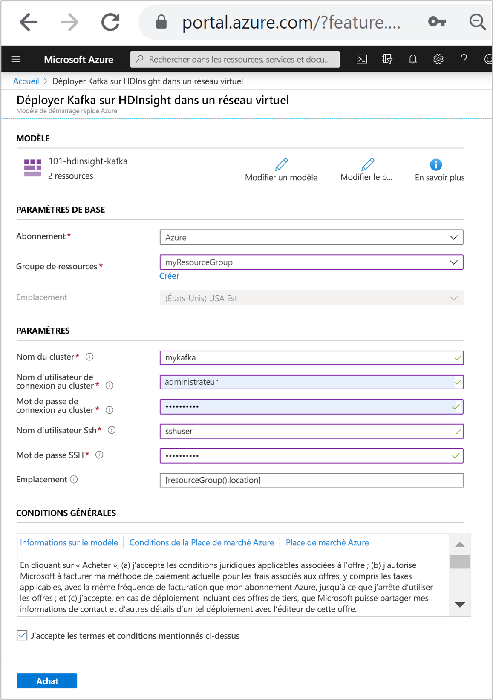
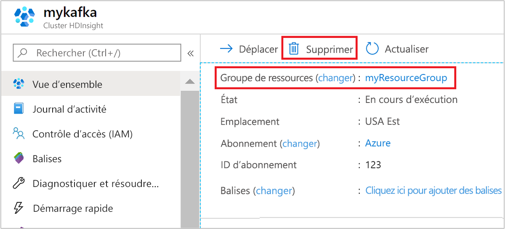

# <a name="quickstart-create-apache-kafka-cluster-in-azure-hdinsight-using-arm-template"></a>Démarrage rapide : Créer un cluster Apache Kafka dans Azure HDInsight à l’aide d’un modèle Resource Manager

Dans ce guide de démarrage rapide, vous utilisez un modèle Resource Manager (Azure Resource Manager) pour créer un cluster [Apache Kafka](./apache-kafka-introduction.md) dans Azure HDInsight. Kafka est une plateforme de streaming open source distribuée. Elle est souvent utilisée comme broker de messages, car elle propose des fonctionnalités similaires à une file d’attente de messages de publication/abonnement.

[!INCLUDE [About Azure Resource Manager](../../../includes/resource-manager-quickstart-introduction.md)]

L’API Kafka n’est accessible qu’aux ressources se trouvant dans le même réseau virtuel. Dans ce guide de démarrage rapide, vous accéderez directement au cluster suivant le protocole SSH. Pour connecter d’autres services, réseaux ou machines virtuelles à Kafka, vous devez tout d’abord créer un réseau virtuel, puis créer les ressources au sein du réseau. Pour plus d’informations, consultez le document [Se connecter à Apache Kafka à l’aide d’un réseau virtuel](apache-kafka-connect-vpn-gateway.md).

Si votre environnement remplit les prérequis et que vous êtes déjà familiarisé avec l’utilisation des modèles ARM, sélectionnez le bouton **Déployer sur Azure**. Le modèle s’ouvre dans le portail Azure.

[](https://portal.azure.com/#create/Microsoft.Template/uri/https%3A%2F%2Fraw.githubusercontent.com%2FAzure%2Fazure-quickstart-templates%2Fmaster%2F101-hdinsight-kafka%2Fazuredeploy.json)

## <a name="prerequisites"></a>Prérequis

Si vous n’avez pas d’abonnement Azure, créez un [compte gratuit](https://azure.microsoft.com/free/?WT.mc_id=A261C142F) avant de commencer.

## <a name="review-the-template"></a>Vérifier le modèle

Le modèle utilisé dans ce démarrage rapide est tiré des [modèles de démarrage rapide Azure](https://azure.microsoft.com/resources/templates/101-hdinsight-kafka/).

:::code language="json" source="~/quickstart-templates/101-hdinsight-kafka/azuredeploy.json" range="1-203" highlight="103-135":::

Deux ressources Azure sont définies dans le modèle :

* [Microsoft.Storage/storageAccounts](/azure/templates/microsoft.storage/storageaccounts) : crée un compte de stockage Azure.
* [Microsoft.HDInsight/cluster](/azure/templates/microsoft.hdinsight/clusters) : crée un cluster HDInsight.

## <a name="deploy-the-template"></a>Déployer le modèle

1. Sélectionnez le bouton **Déployer sur Azure** ci-dessous pour vous connecter à Azure et ouvrir le modèle Resource Manager.

   [](https://portal.azure.com/#create/Microsoft.Template/uri/https%3A%2F%2Fraw.githubusercontent.com%2FAzure%2Fazure-quickstart-templates%2Fmaster%2F101-hdinsight-kafka%2Fazuredeploy.json)

1. Entrez ou sélectionnez les valeurs suivantes :

    |Propriété |Description |
    |---|---|
    |Abonnement|Dans la liste déroulante, sélectionnez l’abonnement Azure utilisé pour le cluster.|
    |Resource group|Dans la liste déroulante, sélectionnez votre groupe de ressources existant ou **Créer**.|
    |Emplacement|La valeur est renseignée automatiquement à l’aide de l’emplacement utilisé pour le groupe de ressources.|
    |Nom du cluster|Entrez un nom globalement unique. Pour ce modèle, utilisez uniquement des lettres minuscules et des chiffres.|
    |Nom d’utilisateur de connexion au cluster|Indiquez le nom d’utilisateur, la valeur par défaut est **Administrateur**.|
    |Mot de passe de connexion au cluster|Fournissez un mot de passe. Le mot de passe doit comporter au moins 10 caractères et inclure au moins un chiffre, une lettre majuscule, une lettre minuscule et un caractère non alphanumérique (à l’exception des caractères ' " `). |
    |Nom d’utilisateur SSH|Indiquez le nom d’utilisateur. La valeur par défaut est **sshuser**|
    |Mot de passe SSH|Indiquez le mot de passe.|

    

1. Passez en revue les **CONDITIONS GÉNÉRALES**. Sélectionnez ensuite **J’accepte les conditions générales mentionnées ci-dessus**, puis **Acheter**. Vous recevez une notification indiquant que votre déploiement est en cours. La création d’un cluster prend environ 20 minutes.

## <a name="review-deployed-resources"></a>Vérifier les ressources déployées

Une fois le cluster créé, vous recevez une notification **Déploiement réussi** avec un lien **Accéder à la ressource**. La page Groupe de ressources liste votre nouveau cluster HDInsight ainsi que le stockage par défaut associé au cluster. Chaque cluster a une dépendance de [compte de stockage Azure](../hdinsight-hadoop-use-blob-storage.md) ou une dépendance de [compte Azure Data Lake Storage](../hdinsight-hadoop-use-data-lake-store.md). Elle est désignée comme compte de stockage par défaut. Le cluster HDInsight et son compte de stockage par défaut doivent figurer dans la même région Azure. La suppression de clusters n’a pas pour effet de supprimer le compte de stockage.

## <a name="get-the-apache-zookeeper-and-broker-host-information"></a>Obtenir des informations sur les hôtes Apache Zookeeper et Broker

Si vous utilisez Kafka, vous devez connaître les hôtes *Apache ZooKeeper* et *Broker*. Ces hôtes sont utilisés avec l’API Kafka et la plupart des utilitaires fournis avec Kafka.

Dans cette section, vous allez récupérer les informations sur l’hôte grâce à l’API REST Ambari sur le cluster.

1. Utilisez la [commande ssh](../hdinsight-hadoop-linux-use-ssh-unix.md) pour vous connecter à votre cluster. Modifiez la commande ci-dessous en remplaçant CLUSTERNAME par le nom de votre cluster, puis entrez la commande :

    ```cmd
    ssh sshuser@CLUSTERNAME-ssh.azurehdinsight.net
    ```

1. À partir de la connexion SSH, utilisez la commande suivante pour installer l’utilitaire `jq`. Il permet d’analyser des documents JSON, ce qui est utile pour récupérer les informations sur l’hôte :

    ```bash
    sudo apt -y install jq
    ```

1. Pour définir une variable d’environnement associée au nom du cluster, utilisez la commande suivante :

    ```bash
    read -p "Enter the Kafka on HDInsight cluster name: " CLUSTERNAME
    ```

    À l’invite, entrez le nom du cluster Kafka.

1. Pour définir une variable d’environnement avec les informations d’hôte Zookeeper, utilisez la commande ci-dessous. La commande récupère tous les hôtes ZooKeeper et retourne uniquement les deux premières entrées. ce qui assure une redondance au cas où l’un des hôtes serait inaccessible.

    ```bash
    export KAFKAZKHOSTS=`curl -sS -u admin -G https://$CLUSTERNAME.azurehdinsight.net/api/v1/clusters/$CLUSTERNAME/services/ZOOKEEPER/components/ZOOKEEPER_SERVER | jq -r '["\(.host_components[].HostRoles.host_name):2181"] | join(",")' | cut -d',' -f1,2`
    ```

    Lorsque vous y êtes invité, entrez le mot de passe du compte de connexion au cluster (pas du compte SSH).

1. Pour vérifier que la variable d’environnement est correctement définie, utilisez la commande suivante :

    ```bash
     echo '$KAFKAZKHOSTS='$KAFKAZKHOSTS
    ```

    Cette commande retourne des informations semblables au texte suivant :

    `zk0-kafka.eahjefxxp1netdbyklgqj5y1ud.ex.internal.cloudapp.net:2181,zk2-kafka.eahjefxxp1netdbyklgqj5y1ud.ex.internal.cloudapp.net:2181`

1. Pour définir une variable d’environnement avec les informations de l’hôte broker Kafka, utilisez la commande suivante :

    ```bash
    export KAFKABROKERS=`curl -sS -u admin -G https://$CLUSTERNAME.azurehdinsight.net/api/v1/clusters/$CLUSTERNAME/services/KAFKA/components/KAFKA_BROKER | jq -r '["\(.host_components[].HostRoles.host_name):9092"] | join(",")' | cut -d',' -f1,2`
    ```

    Lorsque vous y êtes invité, entrez le mot de passe du compte de connexion au cluster (pas du compte SSH).

1. Pour vérifier que la variable d’environnement est correctement définie, utilisez la commande suivante :

    ```bash
    echo '$KAFKABROKERS='$KAFKABROKERS
    ```

    Cette commande retourne des informations semblables au texte suivant :

    `wn1-kafka.eahjefxxp1netdbyklgqj5y1ud.cx.internal.cloudapp.net:9092,wn0-kafka.eahjefxxp1netdbyklgqj5y1ud.cx.internal.cloudapp.net:9092`

## <a name="manage-apache-kafka-topics"></a>Gérer les rubriques Apache Kafka

Kafka stocke les flux de données dans des *rubriques*. Vous pouvez utiliser l’utilitaire `kafka-topics.sh` pour gérer les rubriques.

* **Pour créer une rubrique**, utilisez la commande suivante dans la connexion SSH :

    ```bash
    /usr/hdp/current/kafka-broker/bin/kafka-topics.sh --create --replication-factor 3 --partitions 8 --topic test --zookeeper $KAFKAZKHOSTS
    ```

    Cette commande se connecte à Zookeeper par le biais des informations d’hôte stockées dans `$KAFKAZKHOSTS`. Elle crée ensuite une rubrique Kafka nommée **test**.

    * Les données stockées dans cette rubrique sont partitionnées sur huit partitions.

    * Chaque partition est répliquée sur trois nœuds de travail du cluster.

        Si vous avez créé le cluster dans une région Azure comportant trois domaines d’erreur, utilisez un facteur de réplication de trois. Sinon, utilisez un facteur de réplication de quatre.
        
        Dans les régions comportant trois domaines d’erreur, un facteur de réplication de trois permet de répartir les réplicas entre les domaines d’erreur. Dans celles qui comptent deux domaines d’erreur, un facteur de réplication de quatre répartit uniformément les réplicas entre les domaines.
        
        Pour plus d’informations sur le nombre de domaines d’erreur dans une région, consultez le document [Disponibilité des machines virtuelles Linux](../../virtual-machines/windows/manage-availability.md#use-managed-disks-for-vms-in-an-availability-set).

        Kafka n’a pas connaissance des domaines d’erreur Azure. Lors de la création de réplicas de partitions pour les rubriques, il ne peut pas distribuer les réplicas correctement pour la haute disponibilité.

        Pour garantir une haute disponibilité, utilisez l’[outil de rééquilibrage de partitions d’Apache Kafka](https://github.com/hdinsight/hdinsight-kafka-tools). Cet outil doit être exécuté à partir d’une connexion SSH au nœud principal du cluster Kafka.

        Pour garantir la haute disponibilité de vos données Kafka, rééquilibrez les réplicas de partition de votre rubrique lorsque :

        * Vous créez une rubrique ou une partition

        * Vous mettez à l’échelle un cluster

* **Pour lister les rubriques**, utilisez la commande suivante :

    ```bash
    /usr/hdp/current/kafka-broker/bin/kafka-topics.sh --list --zookeeper $KAFKAZKHOSTS
    ```

    Cette commande liste les rubriques disponibles sur le cluster Kafka.

* **Pour supprimer une rubrique**, utilisez la commande suivante :

    ```bash
    /usr/hdp/current/kafka-broker/bin/kafka-topics.sh --delete --topic topicname --zookeeper $KAFKAZKHOSTS
    ```

    Cette commande supprime la rubrique nommée `topicname`.

    > [!WARNING]  
    > Si vous supprimez la rubrique `test` créée précédemment, vous devrez la recréer. Elle sera utilisée ultérieurement dans ce document.

Pour plus d’informations sur les commandes disponibles avec l’utilitaire `kafka-topics.sh`, utilisez la commande suivante :

```bash
/usr/hdp/current/kafka-broker/bin/kafka-topics.sh
```

## <a name="produce-and-consume-records"></a>Produire et consommer des enregistrements

Kafka stocke les *enregistrements* dans des rubriques. Les enregistrements sont produits par des *producteurs* et utilisés par des *consommateurs*. Les producteurs et les consommateurs communiquent avec le service *broker Kafka*. Chacun des nœuds de travail de votre cluster HDInsight est un hôte broker Kafka.

Pour stocker les enregistrements dans la rubrique test créée précédemment, puis les lire à l’aide d’un consommateur, procédez comme suit :

1. Pour écrire des enregistrements dans la rubrique, utilisez l’utilitaire `kafka-console-producer.sh` à partir de la connexion SSH :

    ```bash
    /usr/hdp/current/kafka-broker/bin/kafka-console-producer.sh --broker-list $KAFKABROKERS --topic test
    ```

    Une fois cette commande exécutée, vous accédez à une ligne vide.

1. Saisissez un message texte sur la ligne vide et appuyez sur Entrée. Entrez quelques messages de cette manière, puis utilisez **Ctrl + C** pour revenir à l’invite de commandes normale. Chaque ligne est envoyée en tant qu’enregistrement distinct vers la rubrique Kafka.

1. Pour lire des enregistrements de la rubrique, utilisez l’utilitaire `kafka-console-consumer.sh` à partir de la connexion SSH :

    ```bash
    /usr/hdp/current/kafka-broker/bin/kafka-console-consumer.sh --bootstrap-server $KAFKABROKERS --topic test --from-beginning
    ```

    Cette commande permet de récupérer les enregistrements à partir de la rubrique et de les afficher. L’utilisation de `--from-beginning` indique au consommateur de démarrer à partir du début du flux, de manière à récupérer tous les enregistrements.

    Si vous utilisez une ancienne version de Kafka, remplacez `--bootstrap-server $KAFKABROKERS` par `--zookeeper $KAFKAZKHOSTS`.

1. Utilisez la combinaison __Ctrl + C__ pour arrêter le consommateur.

Vous pouvez également créer les producteurs et consommateurs par programme. Pour voir un exemple d’utilisation de cette API, consultez le document [API de producteur et de consommateur Apache Kafka avec HDInsight](apache-kafka-producer-consumer-api.md).

## <a name="clean-up-resources"></a>Nettoyer les ressources

Après avoir suivi ce guide de démarrage rapide, vous souhaiterez peut-être supprimer le cluster. Avec HDInsight, vos données sont stockées dans le stockage Azure. Vous pouvez ainsi supprimer un cluster en toute sécurité s’il n’est pas en cours d’utilisation. Vous devez également payer pour un cluster HDInsight, même quand vous ne l’utilisez pas. Étant donné que les frais pour le cluster sont bien plus élevés que les frais de stockage, mieux vaut supprimer les clusters quand ils ne sont pas utilisés.

Dans le portail Azure, accédez à votre cluster, puis sélectionnez **Supprimer**.



Vous pouvez également sélectionner le nom du groupe de ressources pour ouvrir la page du groupe de ressources, puis sélectionner **Supprimer le groupe de ressources**. En supprimant le groupe de ressources, vous supprimez le cluster HDInsight et le compte de stockage par défaut.

## <a name="next-steps"></a>Étapes suivantes

Lors de ce démarrage rapide, vous avez appris à créer un cluster Apache Kafka dans HDInsight à l’aide d’un modèle Resource Manager. Dans l’article suivant, vous allez apprendre à créer une application qui utilise l’API Apache Kafka Streams, et découvrir comment l’exécuter avec Kafka sur HDInsight.

> [!div class="nextstepaction"]
> [Utiliser l’API Apache Kafka Streams dans Azure HDInsight](./apache-kafka-streams-api.md)
