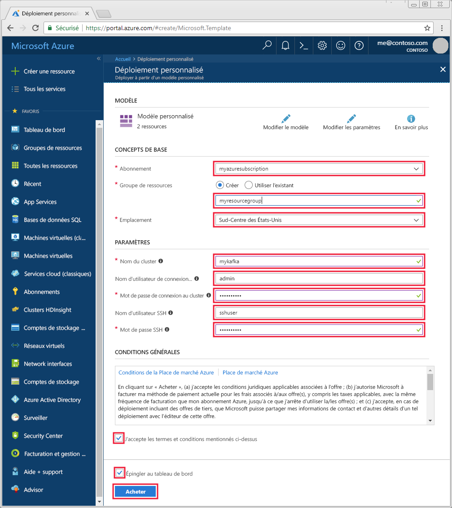

# <a name="quickstart-create-apache-kafka-cluster-in-azure-hdinsight-using-resource-manager-template"></a>Démarrage rapide : Créer un cluster Apache Kafka dans Azure HDInsight avec un modèle Resource Manager

[Apache Kafka](https://kafka.apache.org/) est une plateforme de streaming open source distribuée. Elle est souvent utilisée comme broker de messages, car elle propose des fonctionnalités similaires à une file d’attente de messages de publication/abonnement. 

Dans ce guide de démarrage rapide, vous allez apprendre à créer un cluster [Apache Kafka](https://kafka.apache.org) à l’aide d’un modèle Azure Resource Manager. Il vous expliquera également comment utiliser les utilitaires inclus pour envoyer et recevoir des messages avec Kafka. Vous pouvez aussi voir des modèles similaires dans les [modèles de démarrage rapide Azure](https://azure.microsoft.com/resources/templates/?resourceType=Microsoft.Hdinsight&pageNumber=1&sort=Popular). La référence de modèle est disponible [ici](https://docs.microsoft.com/azure/templates/microsoft.hdinsight/allversions).

[!INCLUDE [delete-cluster-warning](../../../includes/hdinsight-delete-cluster-warning.md)]

L’API Kafka n’est accessible qu’aux ressources se trouvant dans le même réseau virtuel. Dans ce guide de démarrage rapide, vous accéderez directement au cluster suivant le protocole SSH. Pour connecter d’autres services, réseaux ou machines virtuelles à Kafka, vous devez tout d’abord créer un réseau virtuel, puis créer les ressources au sein du réseau. Pour plus d’informations, consultez le document [Se connecter à Apache Kafka à l’aide d’un réseau virtuel](apache-kafka-connect-vpn-gateway.md).

Si vous n’avez pas d’abonnement Azure, créez un [compte gratuit](https://azure.microsoft.com/free/?WT.mc_id=A261C142F) avant de commencer.

## <a name="prerequisites"></a>Prérequis

Un client SSH. Pour plus d’informations, consultez [Se connecter à HDInsight (Apache Hadoop) à l’aide de SSH](../hdinsight-hadoop-linux-use-ssh-unix.md).

## <a name="create-an-apache-kafka-cluster"></a>Créer un cluster Apache Kafka

1. Cliquez sur l’image suivante pour ouvrir le modèle dans le portail Azure.

    <a href="https://portal.azure.com/#create/Microsoft.Template/uri/https%3A%2F%2Fraw.githubusercontent.com%2FAzure-Samples%2Fhdinsight-kafka-java-get-started%2Fmaster%2Fazuredeploy.json" target="_blank"></a>

2. Utilisez les valeurs suivantes pour créer le cluster Kafka :

    | Propriété | Valeur |
    | --- | --- |
    | Abonnement | Votre abonnement Azure. |
    | Groupe de ressources | Groupe de ressources dans lequel le cluster est créé. |
    | Location | Région Azure dans laquelle le cluster est créé. |
    | Nom du cluster | Le nom du cluster Kafka. |
    | Nom d’utilisateur de connexion au cluster | Nom du compte utilisé pour se connecter aux services HTTPS hébergés sur le cluster. |
    | Mot de passe de connexion au cluster | Mot de passe du nom d’utilisateur de connexion. |
    | Nom d’utilisateur SSH | Nom d’utilisateur SSH. Ce compte peut accéder au cluster à l’aide de SSH. |
    | Mot de passe SSH | Le mot de passe de l’utilisateur SSH. |

    

3. Sélectionnez **J’accepte les termes et conditions mentionnés ci-dessus** et **Épingler au tableau de bord**, puis cliquez sur **Acheter**. La création du cluster peut prendre jusqu’à 20 minutes.

## <a name="connect-to-the-cluster"></a>Connexion au cluster

1. Pour vous connecter au nœud principal primaire du cluster Kafka, utilisez la commande suivante. Remplacez `sshuser` par le nom d’utilisateur SSH. Remplacez `mykafka` par le nom de votre cluster Kafka.

    ```bash
    ssh sshuser@mykafka-ssh.azurehdinsight.net
    ```

2. Lors de votre première connexion au cluster, il est possible que votre client SSH affiche un message d’avertissement, indiquant que l’authenticité de l’hôte n’a pas pu être établie. À l’invite, tapez __yes__, puis appuyez sur __Entrée__ pour ajouter l’hôte à la liste de serveurs approuvés de votre client SSH.

3. Lorsque vous y êtes invité, entrez le mot de passe de l’utilisateur SSH.

    Une fois la connexion établie, des informations de ce type s’affichent :
    
    ```text
    Authorized uses only. All activity may be monitored and reported.
    Welcome to Ubuntu 16.04.4 LTS (GNU/Linux 4.13.0-1011-azure x86_64)
    
     * Documentation:  https://help.ubuntu.com
     * Management:     https://landscape.canonical.com
     * Support:        https://ubuntu.com/advantage
    
      Get cloud support with Ubuntu Advantage Cloud Guest:
        https://www.ubuntu.com/business/services/cloud
    
    83 packages can be updated.
    37 updates are security updates.
    
    
    Welcome to Kafka on HDInsight.
    
    Last login: Thu Mar 29 13:25:27 2018 from 108.252.109.241
    ssuhuser@hn0-mykafk:~$
    ```

## <a id="getkafkainfo"></a>Obtenir des informations sur les hôtes Apache Zookeeper et Broker

Si vous utilisez Kafka, vous devez connaître les hôtes *Apache ZooKeeper* et *Broker*. Ces hôtes sont utilisés avec l’API Kafka et la plupart des utilitaires fournis avec Kafka.

Dans cette section, vous allez récupérer les informations sur l’hôte grâce à l’API REST Ambari sur le cluster.

1. À partir de la connexion SSH au cluster, utilisez la commande suivante pour installer l’utilitaire `jq`. Il permet d’analyser des documents JSON, ce qui est utile pour récupérer les informations sur l’hôte :
   
    ```bash
    sudo apt -y install jq
    ```

2. Pour définir une variable d’environnement associée au nom du cluster, utilisez la commande suivante :

    ```bash
    read -p "Enter the Kafka on HDInsight cluster name: " CLUSTERNAME
    ```

    À l’invite, entrez le nom du cluster Kafka.

3. Pour définir une variable d’environnement avec les informations d’hôte Zookeeper, utilisez la commande ci-dessous. La commande récupère tous les hôtes ZooKeeper et retourne uniquement les deux premières entrées. ce qui assure une redondance au cas où l’un des hôtes serait inaccessible.

    ```bash
    export KAFKAZKHOSTS=`curl -sS -u admin -G https://$CLUSTERNAME.azurehdinsight.net/api/v1/clusters/$CLUSTERNAME/services/ZOOKEEPER/components/ZOOKEEPER_SERVER | jq -r '["\(.host_components[].HostRoles.host_name):2181"] | join(",")' | cut -d',' -f1,2`
    ```

    Lorsque vous y êtes invité, entrez le mot de passe du compte de connexion au cluster (pas du compte SSH).

4. Pour vérifier que la variable d’environnement est correctement définie, utilisez la commande suivante :

    ```bash
     echo '$KAFKAZKHOSTS='$KAFKAZKHOSTS
    ```

    Cette commande retourne des informations semblables au texte suivant :

    `zk0-kafka.eahjefxxp1netdbyklgqj5y1ud.ex.internal.cloudapp.net:2181,zk2-kafka.eahjefxxp1netdbyklgqj5y1ud.ex.internal.cloudapp.net:2181`

5. Pour définir une variable d’environnement avec les informations de l’hôte broker Kafka, utilisez la commande suivante :

    ```bash
    export KAFKABROKERS=`curl -sS -u admin -G https://$CLUSTERNAME.azurehdinsight.net/api/v1/clusters/$CLUSTERNAME/services/KAFKA/components/KAFKA_BROKER | jq -r '["\(.host_components[].HostRoles.host_name):9092"] | join(",")' | cut -d',' -f1,2`
    ```

    Lorsque vous y êtes invité, entrez le mot de passe du compte de connexion au cluster (pas du compte SSH).

6. Pour vérifier que la variable d’environnement est correctement définie, utilisez la commande suivante :

    ```bash   
    echo '$KAFKABROKERS='$KAFKABROKERS
    ```

    Cette commande retourne des informations semblables au texte suivant :
   
    `wn1-kafka.eahjefxxp1netdbyklgqj5y1ud.cx.internal.cloudapp.net:9092,wn0-kafka.eahjefxxp1netdbyklgqj5y1ud.cx.internal.cloudapp.net:9092`

## <a name="manage-apache-kafka-topics"></a>Gérer les rubriques Apache Kafka

Kafka stocke les flux de données dans des *rubriques*. Vous pouvez utiliser l’utilitaire `kafka-topics.sh` pour gérer les rubriques.

* **Pour créer une rubrique**, utilisez la commande suivante dans la connexion SSH :

    ```bash
    /usr/hdp/current/kafka-broker/bin/kafka-topics.sh --create --replication-factor 3 --partitions 8 --topic test --zookeeper $KAFKAZKHOSTS
    ```

    Cette commande se connecte à Zookeeper par le biais des informations d’hôte stockées dans `$KAFKAZKHOSTS`. Elle crée ensuite une rubrique Kafka nommée **test**. 

    * Les données stockées dans cette rubrique sont partitionnées sur huit partitions.

    * Chaque partition est répliquée sur trois nœuds de travail du cluster.

        Si vous avez créé le cluster dans une région Azure comportant trois domaines d’erreur, utilisez un facteur de réplication de trois. Sinon, utilisez un facteur de réplication de quatre.
        
        Dans les régions comportant trois domaines d’erreur, un facteur de réplication de trois permet de répartir les réplicas entre les domaines d’erreur. Dans celles qui comptent deux domaines d’erreur, un facteur de réplication de quatre répartit uniformément les réplicas entre les domaines.
        
        Pour plus d’informations sur le nombre de domaines d’erreur dans une région, consultez le document [Disponibilité des machines virtuelles Linux](../../virtual-machines/windows/manage-availability.md#use-managed-disks-for-vms-in-an-availability-set).

        Kafka n’est pas informé des domaines d’erreur Azure. Lors de la création de réplicas de partitions pour les rubriques, il ne peut pas distribuer les réplicas correctement pour la haute disponibilité.

        Pour garantir une haute disponibilité, utilisez l’[outil de rééquilibrage de partitions d’Apache Kafka](https://github.com/hdinsight/hdinsight-kafka-tools). Cet outil doit être exécuté à partir d’une connexion SSH au nœud principal du cluster Kafka.

        Pour garantir la haute disponibilité de vos données Kafka, rééquilibrez les réplicas de partition de votre rubrique lorsque :

        * Vous créez une rubrique ou une partition

        * Vous mettez à l’échelle un cluster

* **Pour lister les rubriques**, utilisez la commande suivante :

    ```bash
    /usr/hdp/current/kafka-broker/bin/kafka-topics.sh --list --zookeeper $KAFKAZKHOSTS
    ```

    Cette commande liste les rubriques disponibles sur le cluster Kafka.

* **Pour supprimer une rubrique**, utilisez la commande suivante :

    ```bash
    /usr/hdp/current/kafka-broker/bin/kafka-topics.sh --delete --topic topicname --zookeeper $KAFKAZKHOSTS
    ```

    Cette commande supprime la rubrique nommée `topicname`.

    > [!WARNING]  
    > Si vous supprimez la rubrique `test` créée précédemment, vous devrez la recréer. Elle sera utilisée ultérieurement dans ce document.

Pour plus d’informations sur les commandes disponibles avec l’utilitaire `kafka-topics.sh`, utilisez la commande suivante :

```bash
/usr/hdp/current/kafka-broker/bin/kafka-topics.sh
```

## <a name="produce-and-consume-records"></a>Produire et consommer des enregistrements

Kafka stocke les *enregistrements* dans des rubriques. Les enregistrements sont produits par des *producteurs* et utilisés par des *consommateurs*. Les producteurs et les consommateurs communiquent avec le service *broker Kafka*. Chacun des nœuds de travail de votre cluster HDInsight est un hôte broker Kafka.

Pour stocker les enregistrements dans la rubrique test créée précédemment, puis les lire à l’aide d’un consommateur, procédez comme suit :

1. Pour écrire des enregistrements dans la rubrique, utilisez l’utilitaire `kafka-console-producer.sh` à partir de la connexion SSH :
   
    ```bash
    /usr/hdp/current/kafka-broker/bin/kafka-console-producer.sh --broker-list $KAFKABROKERS --topic test
    ```
   
    Une fois cette commande exécutée, vous accédez à une ligne vide.

2. Saisissez un message texte sur la ligne vide et appuyez sur Entrée. Entrez quelques messages de cette manière, puis utilisez **Ctrl + C** pour revenir à l’invite de commandes normale. Chaque ligne est envoyée en tant qu’enregistrement distinct vers la rubrique Kafka.

3. Pour lire des enregistrements de la rubrique, utilisez l’utilitaire `kafka-console-consumer.sh` à partir de la connexion SSH :
   
    ```bash
    /usr/hdp/current/kafka-broker/bin/kafka-console-consumer.sh --bootstrap-server $KAFKABROKERS --topic test --from-beginning
    ```
   
    Cette commande permet de récupérer les enregistrements à partir de la rubrique et de les afficher. L’utilisation de `--from-beginning` indique au consommateur de démarrer à partir du début du flux, de manière à récupérer tous les enregistrements.

    Si vous utilisez une version antérieure de Kafka, remplacez `--bootstrap-server $KAFKABROKERS` par `--zookeeper $KAFKAZKHOSTS`.

4. Utilisez la combinaison __Ctrl + C__ pour arrêter le consommateur.

Vous pouvez également créer les producteurs et consommateurs par programme. Pour voir un exemple d’utilisation de cette API, consultez le document [API de producteur et de consommateur Apache Kafka avec HDInsight](apache-kafka-producer-consumer-api.md).

## <a name="clean-up-resources"></a>Supprimer des ressources

Si vous souhaitez supprimer les ressources créées par ce démarrage rapide, vous pouvez supprimer le groupe de ressources. La suppression du groupe de ressources efface également le cluster HDInsight associé et d’autres ressources liées au groupe de ressources.

Pour supprimer le groupe de ressources à l’aide du portail Azure :

1. Sur le portail Azure, développez le menu de gauche pour ouvrir le menu des services, et sélectionnez __Groupes de ressources__ pour afficher la liste de vos groupes de ressources.
2. Recherchez le groupe de ressources à supprimer, puis faites un clic droit sur le bouton __Plus__ (...) se trouvant à droite de la liste.
3. Sélectionnez __Supprimer le groupe de ressources__ et confirmez.

> [!WARNING]  
> La facturation du cluster HDInsight démarre à la création du cluster et s’arrête à sa suppression. La facturation est effectuée au prorata des minutes écoulées. Par conséquent, vous devez toujours supprimer votre cluster lorsqu’il n’est plus utilisé.
> 
> La suppression d’un cluster Kafka sur HDInsight supprime toutes les données stockées dans Kafka.

## <a name="next-steps"></a>Étapes suivantes

> [!div class="nextstepaction"]
> [Utiliser Apache Spark avec Apache Kafka](../hdinsight-apache-kafka-spark-structured-streaming.md)