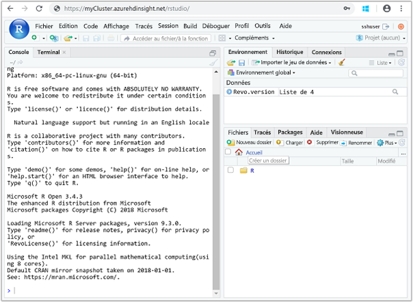

# <a name="quickstart-execute-an-r-script-on-an-ml-services-cluster-in-azure-hdinsight-using-rstudio-server"></a>Démarrage rapide : Exécuter un script R sur un cluster ML Services dans HDInsight Azure à l’aide de RStudio Server

ML Services sur Azure HDInsight permet aux scripts R d’utiliser Apache Spark et Apache Hadoop MapReduce afin d’exécuter des calculs distribués. ML Services contrôle le mode d’exécution des appels en définissant le contexte de calcul. Le nœud de périmètre d’un cluster fournit un lieu d’accueil pratique pour la connexion au cluster et l’exécution de vos scripts R. Un nœud périphérique permet d’exécuter des fonctions distribuées parallélisées de RevoScaleR sur les différents cœurs du serveur associé. Vous pouvez également les exécuter sur les différents nœuds du cluster à l’aide des contextes de calcul Hadoop Map Reduce ou Apache Spark de RevoScaleR.

Dans ce guide de démarrage rapide, vous allez apprendre à exécuter un script R avec la RStudio Server illustrant l’utilisation de Spark pour effectuer des calculs R distribués. Vous allez définir un contexte de calcul pour effectuer des calculs localement sur un nœud de périphérie et de façon distribuée entre les nœuds du cluster HDInsight.

## <a name="prerequisite"></a>Configuration requise

Un cluster ML Services sur HDInsight. Consultez [Création clusters Apache Hadoop à l’aide du Portail Azure](../hdinsight-hadoop-create-linux-clusters-portal.md) et sélectionnez **ML Services** pour le **Type de cluster**.

## <a name="connect-to-rstudio-server"></a>Se connecter à RStudio Server

RStudio Server s’exécute sur le nœud de périphérie du cluster. Accédez à l’URL suivante où `CLUSTERNAME` est le nom du cluster ML Services que vous avez créé :

```
https://CLUSTERNAME.azurehdinsight.net/rstudio/
```

La première fois que vous vous connectez, vous devez vous authentifier deux fois. Pour la première authentification, fournissez le nom d’utilisateur et le mot de passe de l’administrateur du cluster, par défaut `admin`. Pour la deuxième authentification, fournissez le nom d’utilisateur et le mot de passe SSH, par défaut `sshuser`. Les connexions suivantes ne nécessitent que les informations d’identification SSH.

Une fois que vous êtes connecté, votre écran doit ressembler à la capture d’écran suivante :



## <a name="use-a-compute-context"></a>Utiliser un contexte de calcul

1. Dans RStudio Server, utilisez le code qui suit pour charger les exemples de données dans le stockage par défaut pour HDInsight :

    ```RStudio
    # Set the HDFS (WASB) location of example data
     bigDataDirRoot <- "/example/data"
    
     # create a local folder for storing data temporarily
     source <- "/tmp/AirOnTimeCSV2012"
     dir.create(source)
    
     # Download data to the tmp folder
     remoteDir <- "https://packages.revolutionanalytics.com/datasets/AirOnTimeCSV2012"
     download.file(file.path(remoteDir, "airOT201201.csv"), file.path(source, "airOT201201.csv"))
     download.file(file.path(remoteDir, "airOT201202.csv"), file.path(source, "airOT201202.csv"))
     download.file(file.path(remoteDir, "airOT201203.csv"), file.path(source, "airOT201203.csv"))
     download.file(file.path(remoteDir, "airOT201204.csv"), file.path(source, "airOT201204.csv"))
     download.file(file.path(remoteDir, "airOT201205.csv"), file.path(source, "airOT201205.csv"))
     download.file(file.path(remoteDir, "airOT201206.csv"), file.path(source, "airOT201206.csv"))
     download.file(file.path(remoteDir, "airOT201207.csv"), file.path(source, "airOT201207.csv"))
     download.file(file.path(remoteDir, "airOT201208.csv"), file.path(source, "airOT201208.csv"))
     download.file(file.path(remoteDir, "airOT201209.csv"), file.path(source, "airOT201209.csv"))
     download.file(file.path(remoteDir, "airOT201210.csv"), file.path(source, "airOT201210.csv"))
     download.file(file.path(remoteDir, "airOT201211.csv"), file.path(source, "airOT201211.csv"))
     download.file(file.path(remoteDir, "airOT201212.csv"), file.path(source, "airOT201212.csv"))
    
     # Set directory in bigDataDirRoot to load the data into
     inputDir <- file.path(bigDataDirRoot,"AirOnTimeCSV2012")
    
     # Make the directory
     rxHadoopMakeDir(inputDir)
    
     # Copy the data from source to input
     rxHadoopCopyFromLocal(source, bigDataDirRoot)
    ```

    Cette étape peut prendre environ 8 minutes.

1. Créez des informations sur les données et définissez deux sources de données. Entrez le code suivant dans RStudio :

    ```RStudio
    # Define the HDFS (WASB) file system
     hdfsFS <- RxHdfsFileSystem()
    
     # Create info list for the airline data
     airlineColInfo <- list(
          DAY_OF_WEEK = list(type = "factor"),
          ORIGIN = list(type = "factor"),
          DEST = list(type = "factor"),
          DEP_TIME = list(type = "integer"),
          ARR_DEL15 = list(type = "logical"))
    
     # get all the column names
     varNames <- names(airlineColInfo)
    
     # Define the text data source in hdfs
     airOnTimeData <- RxTextData(inputDir, colInfo = airlineColInfo, varsToKeep = varNames, fileSystem = hdfsFS)
    
     # Define the text data source in local system
     airOnTimeDataLocal <- RxTextData(source, colInfo = airlineColInfo, varsToKeep = varNames)
    
     # formula to use
     formula = "ARR_DEL15 ~ ORIGIN + DAY_OF_WEEK + DEP_TIME + DEST"
    ```

1. Exécutez une régression logistique sur les données à l’aide du contexte de calcul **local**. Entrez le code suivant dans RStudio :

    ```RStudio
    # Set a local compute context
     rxSetComputeContext("local")
    
     # Run a logistic regression
     system.time(
        modelLocal <- rxLogit(formula, data = airOnTimeDataLocal)
     )
    
     # Display a summary
     summary(modelLocal)
    ```

    Les calculs devraient se terminer en environ 7 minutes. Vous devez obtenir une sortie qui se termine par des lignes similaires à l’extrait de code suivant :

    ```output
    Data: airOnTimeDataLocal (RxTextData Data Source)
     File name: /tmp/AirOnTimeCSV2012
     Dependent variable(s): ARR_DEL15
     Total independent variables: 634 (Including number dropped: 3)
     Number of valid observations: 6005381
     Number of missing observations: 91381
     -2*LogLikelihood: 5143814.1504 (Residual deviance on 6004750 degrees of freedom)
    
     Coefficients:
                      Estimate Std. Error z value Pr(>|z|)
      (Intercept)   -3.370e+00  1.051e+00  -3.208  0.00134 **
      ORIGIN=JFK     4.549e-01  7.915e-01   0.575  0.56548
      ORIGIN=LAX     5.265e-01  7.915e-01   0.665  0.50590
      ......
      DEST=SHD       5.975e-01  9.371e-01   0.638  0.52377
      DEST=TTN       4.563e-01  9.520e-01   0.479  0.63172
      DEST=LAR      -1.270e+00  7.575e-01  -1.676  0.09364 .
      DEST=BPT         Dropped    Dropped Dropped  Dropped
    
      ---
    
      Signif. codes:  0 ‘***’ 0.001 ‘**’ 0.01 ‘*’ 0.05 ‘.’ 0.1 ‘ ’ 1
    
      Condition number of final variance-covariance matrix: 11904202
      Number of iterations: 7
    ```

1. Exécutez la même régression logistique à l’aide du contexte **Spark**. Le contexte Spark répartit le traitement sur tous les nœuds de travail dans le cluster HDInsight. Entrez le code suivant dans RStudio :

    ```RStudio
    # Define the Spark compute context
     mySparkCluster <- RxSpark()
    
     # Set the compute context
     rxSetComputeContext(mySparkCluster)
    
     # Run a logistic regression
     system.time(  
        modelSpark <- rxLogit(formula, data = airOnTimeData)
     )
    
     # Display a summary
     summary(modelSpark)
    ```

    Les calculs devraient se terminer en environ 5 minutes.

## <a name="clean-up-resources"></a>Nettoyer les ressources

Après avoir suivi ce guide de démarrage rapide, vous souhaiterez peut-être supprimer le cluster. Avec HDInsight, vos données sont stockées Azure Storage, pour que vous puissiez supprimer un cluster en toute sécurité s’il n’est pas en cours d’utilisation. Vous devez également payer pour un cluster HDInsight, même lorsque vous ne l’utilisez pas. Étant donné que les frais pour le cluster sont bien plus élevés que les frais de stockage, économique, mieux vaut supprimer les clusters lorsqu’ils ne sont pas utilisés.

Pour supprimer un cluster, consultez [Supprimer un cluster HDInsight à l’aide de votre navigateur, de PowerShell ou d’Azure CLI](../hdinsight-delete-cluster.md).

## <a name="next-steps"></a>Étapes suivantes

Dans ce guide de démarrage rapide, vous avez appris à exécuter un script R avec la RStudio Server illustrant l’utilisation de Spark pour effectuer des calculs R distribués.  Allez au prochain article pour découvrir les options disponibles pour spécifier si l’exécution est mise en parallèle, et comment, sur les différents cœurs du nœud périphérique ou du cluster HDInsight.

> [!div class="nextstepaction"]
>[Options de contexte de calcul pour ML Services sur HDInsight](./r-server-compute-contexts.md)

> [!NOTE]
> Cette page décrit les fonctionnalités du logiciel RStudio. Microsoft Azure HDInsight n’est pas affilié à RStudio, Inc.
