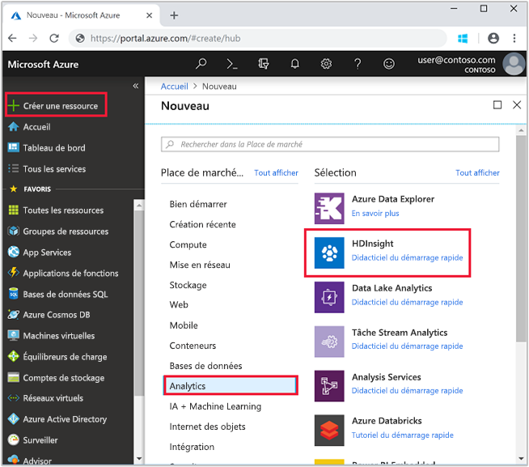
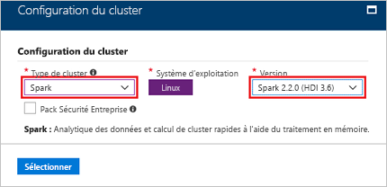
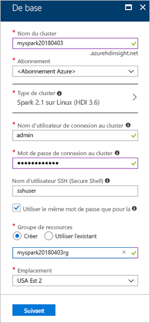
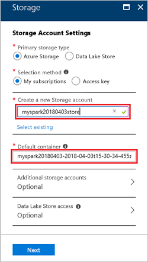

# <a name="quickstart-create-a-spark-cluster-in-hdinsight-using-the-azure-portal"></a>Démarrage rapide : créer un cluster Spark dans HDInsight à l’aide du portail Azure
Découvrez comment créer un cluster Apache Spark dans Azure HDInsight et comment exécuter des requêtes Spark SQL sur des tables Apache Hive. Apache Spark permet une analytique des données et un calcul de cluster rapides à l’aide du traitement en mémoire. Pour en savoir plus sur le service Spark sur HDInsight, consultez [Vue d’ensemble : Apache Spark sur Azure HDInsight](apache-spark-overview.md).

Dans ce guide de démarrage rapide, vous utilisez le portail Azure pour créer un cluster HDInsight Spark. Le cluster utilise des objets Azure Storage Blob en tant que stockage du cluster.

> [!IMPORTANT]
> La facturation des clusters HDInsight est calculée au prorata des minutes écoulées, que vous les utilisiez ou non. Veillez à supprimer votre cluster une fois que vous avez fini de l’utiliser. Pour plus d’informations, consultez la section [Nettoyer les ressources](#clean-up-resources) de cet article.

Si vous ne disposez pas d’abonnement Azure, créez un [compte gratuit](https://azure.microsoft.com/free/) avant de commencer.

## <a name="create-an-hdinsight-spark-cluster"></a>Créer un cluster HDInsight Spark

1. Dans le portail Azure, sélectionnez **Créer une ressource** > **Données + Analytique** > **HDInsight**. 

    
2. Sous **Informations de base**, fournissez les valeurs suivantes :
     
    |Propriété  |Description  |
    |---------|---------|
    |**Nom du cluster**     | Attribuez un nom à votre cluster HDInsight Spark. Le nom de cluster utilisé pour ce démarrage rapide est **myspark20180403**.|
    |**Abonnement**     | Dans la liste déroulante, sélectionnez un abonnement Azure utilisé pour ce cluster. L’abonnement utilisé pour ce démarrage rapide est **&lt;Abonnement Azure**. |
    |**Type du cluster**| Développez l’élément et sélectionnez **Spark** comme type de cluster, puis spécifiez la version du cluster Spark. <br/>  |
    |**Nom d’utilisateur de connexion au cluster**| Entrez le nom d’utilisateur de connexion au cluster.  Le nom par défaut est *admin*. Vous utiliserez ce compte pour vous connecter au notebook Jupyter plus loin dans ce démarrage rapide. |
    |**Mot de passe de connexion au cluster**| Entrez le mot de passe de connexion au cluster. |
    |**Nom d’utilisateur SSH (Secure Shell)**| Entrez le nom d’utilisateur SSH. Le nom d’utilisateur SSH utilisé pour ce démarrage rapide est **sshuser**. Par défaut, ce compte a le même mot de passe que le compte *Nom d’utilisateur de connexion au cluster*. |
    |**Groupe de ressources**     | Indiquez si vous souhaitez créer un groupe de ressources Azure ou utiliser un groupe existant. Un groupe de ressources est un conteneur réunissant les ressources associées d’une solution Azure. Le nom du groupe de ressources utilisé pour ce démarrage rapide est **myspark20180403rg**. |
    |**Lieu**     | Sélectionnez un emplacement pour le groupe de ressources. Le modèle utilise cet emplacement pour créer le cluster, ainsi que pour stocker le cluster par défaut. L’emplacement utilisé pour ce démarrage rapide est **États-Unis de l’Est 2**. |

    

    Sélectionnez **Suivant** pour accéder à la page **Stockage**.
3. Sous **Stockage**, fournissez les valeurs suivantes :

    - **Sélectionner un compte de stockage** : sélectionnez **Nouveau**, puis donnez un nom au nouveau compte de stockage. Le nom du compte de stockage utilisé pour ce démarrage rapide est **myspark20180403store**.

    

    > [!NOTE] 
    > Dans la capture d’écran, l’option **Sélectionner un élément existant** est illustré. Le lien bascule entre **Nouveau** et **Sélectionner un élément existant**.

    Le **Conteneur par défaut** a un nom par défaut.  Vous pouvez modifier le nom si vous le souhaitez.

    Sélectionnez **Suivant** pour accéder à la page **Résumé**. 


3. Sur la page **Résumé**, sélectionnez **Créer**. La création du cluster prend environ 20 minutes. Le cluster doit être créé pour que vous puissiez passer à la prochaine session.

Si vous rencontrez un problème avec la création de clusters HDInsight, c’est que vous n’avez peut-être pas les autorisations requises pour le faire. Pour plus d’informations, consultez [Exigences de contrôle d’accès](../hdinsight-administer-use-portal-linux.md#create-clusters).

## <a name="create-a-jupyter-notebook"></a>Créer un bloc-notes Jupyter

Jupyter Notebook est un environnement de notebook interactif qui prend en charge plusieurs langages de programmation. Le notebook vous permet d’interagir avec vos données, de combiner du code avec le texte markdown et d’effectuer des visualisations simples. 

1. Ouvrez le [portail Azure](https://portal.azure.com).
2. Sélectionnez **Clusters HDInsight**, puis le cluster que vous avez créé.

    

3. À partir du portail, sélectionnez **Tableaux de bord de cluster**, puis **Jupyter Notebook**. Si vous y êtes invité, entrez les informations d’identification pour le cluster.

   

4. Sélectionnez **Nouveau** > **PySpark** pour créer un notebook. 

   

   Un nouveau bloc-notes est créé et ouvert sous le nom Untitled(Untitled.pynb).


## <a name="run-spark-sql-statements"></a>Exécuter des instructions Spark SQL

SQL (Structured Query Language) est le langage le plus courant et le plus largement utilisé pour interroger et définir des données. Spark SQL fonctionne en tant qu’extension d’Apache Spark pour le traitement des données structurées, à l’aide de la syntaxe SQL classique.

1. Vérifiez que le noyau est prêt. Le noyau est prêt lorsque vous voyez un cercle vide à côté du nom du noyau dans le bloc-notes. Un cercle plein indique que le noyau est occupé.

    

    Lorsque vous démarrez le bloc-notes pour la première fois, le noyau effectue certaines tâches en arrière-plan. Attendez que le noyau soit prêt. 
2. Collez l’exemple de code suivant dans une cellule vide, puis appuyez sur **MAJ + ENTRÉE** pour exécuter le code. La commande répertorie les tables Hive sur le cluster :

    ```PySpark
    %%sql
    SHOW TABLES
    ```
    Lorsque vous utilisez un bloc-notes Jupyter avec votre cluster HDInsight Spark, vous obtenez une présélection `sqlContext` que vous pouvez utiliser pour exécuter des requêtes Hive à l’aide de Spark SQL. `%%sql` demande au bloc-notes Jupyter d’utiliser la présélection `sqlContext` pour exécuter la requête Hive. La requête extrait les 10 premières lignes d’une table Hive (**hivesampletable**) qui est disponible par défaut sur tous les clusters HDInsight. Il faut environ 30 secondes pour obtenir les résultats. Le résultat se présente ainsi : 

    

    À chaque exécution d’une requête dans Jupyter, le titre de la fenêtre du navigateur web affiche l’état **(Occupé)** ainsi que le titre du bloc-notes. Un cercle plein s’affiche également en regard du texte **PySpark** dans le coin supérieur droit.
    
2. Exécutez une autre requête pour afficher les données dans `hivesampletable`.

    ```PySpark
    %%sql
    SELECT * FROM hivesampletable LIMIT 10
    ```
    
    L’écran doit s’actualiser pour afficher la sortie de requête.

    

2. Dans le menu **Fichier** du notebook, sélectionnez **Fermer et arrêter**. L’arrêt du bloc-notes libère les ressources de cluster.

## <a name="clean-up-resources"></a>Supprimer des ressources
HDInsight enregistre vos données dans Stockage Azure ou Azure Data Lake Store, ce qui vous permet de supprimer un cluster de manière sécurisée s’il n’est pas en cours d’utilisation. Vous devez également payer pour un cluster HDInsight, même lorsque vous ne l’utilisez pas. Étant donné que les frais pour le cluster sont bien plus élevés que les frais de stockage, économique, mieux vaut supprimer les clusters lorsqu’ils ne sont pas utilisés. Si vous prévoyez de travailler immédiatement sur le tutoriel répertorié sous [Étapes suivantes](#next-steps), vous souhaiterez peut-être conserver le cluster.

Revenez au portail Azure, puis sélectionnez **Supprimer**.


Vous pouvez également sélectionner le nom du groupe de ressources pour ouvrir la page du groupe de ressources, puis sélectionner **Supprimer le groupe de ressources**. En supprimant le groupe de ressources, vous supprimez le cluster HDInsight Spark et le compte de stockage par défaut.

## <a name="next-steps"></a>Étapes suivantes 

Dans ce démarrage rapide, vous avez appris à créer un cluster HDInsight Spark et à exécuter une requête Spark SQL de base. Passez au tutoriel suivant pour apprendre à utiliser un cluster HDInsight Spark pour exécuter des requêtes interactives sur des données test.

> [!div class="nextstepaction"]
>[Exécuter des requêtes interactives sur Spark](./apache-spark-load-data-run-query.md)
