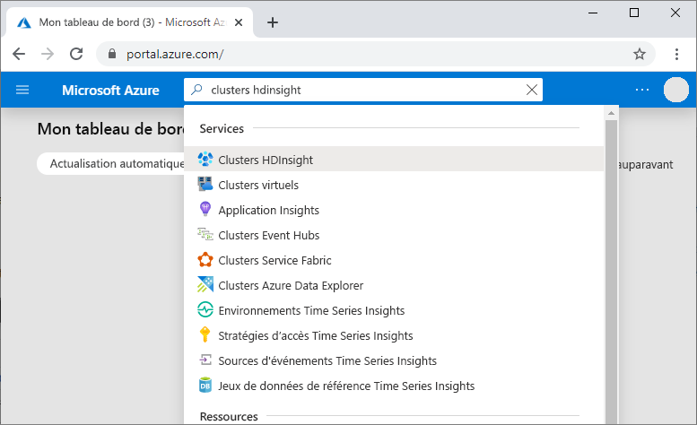
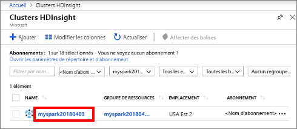
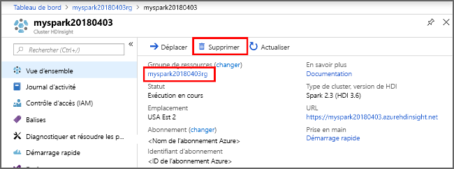

# <a name="quickstart-create-apache-spark-cluster-in-azure-hdinsight-using-powershell"></a>Démarrage rapide : créer un cluster Apache Spark dans Azure HDInsight à l’aide de PowerShell

Dans ce guide de démarrage rapide, vous allez utiliser Azure PowerShell pour créer un cluster Apache Spark dans Azure HDInsight. Vous allez ensuite créer un notebook Jupyter et l’utiliser pour exécuter des requêtes Spark SQL sur des tables Apache Hive. Azure HDInsight est un service d’analytique open source managé et complet pour les entreprises. Le framework Apache Spark pour Azure HDInsight permet une analytique données et des calculs sur cluster rapides à l’aide du traitement en mémoire. Le notebook Jupyter vous permet d’interagir avec vos données, de combiner du code avec le texte Markdown et d’effectuer des visualisations simples.

[Vue d’ensemble : Apache Spark sur Azure HDInsight](apache-spark-overview.md) | [Apache Spark](https://spark.apache.org/) | [Apache Hive](https://hive.apache.org/) | [Jupyter Notebook](https://jupyter.org/)

Si vous utilisez plusieurs clusters ensemble, vous devrez créer un réseau virtuel et, si vous utilisez un cluster Spark, vous devrez également utiliser Hive Warehouse Connector. Pour plus d’informations, consultez [Planifier un réseau virtuel pour Azure HDInsight](../hdinsight-plan-virtual-network-deployment.md) et [Intégrer Apache Spark et Apache Hive à Hive Warehouse Connector](../interactive-query/apache-hive-warehouse-connector.md).

## <a name="prerequisite"></a>Configuration requise

- Compte Azure avec un abonnement actif. [Créez un compte gratuitement](https://azure.microsoft.com/free/?ref=microsoft.com&utm_source=microsoft.com&utm_medium=docs&utm_campaign=visualstudio).
- Module [PowerShell Az](https://docs.microsoft.com/powershell/azure/install-az-ps).

## <a name="create-an-apache-spark-cluster-in-hdinsight"></a>Créer un cluster Apache Spark dans HDInsight

> [!IMPORTANT]  
> La facturation des clusters HDInsight est calculée au prorata des minutes écoulées, que vous les utilisiez ou non. Veillez à supprimer votre cluster une fois que vous avez fini de l’utiliser. Pour plus d’informations, consultez la section [Nettoyer les ressources](#clean-up-resources) de cet article.

La création d’un cluster HDInsight inclut la création des objets et ressources Azure qui suivent :

- Un groupe de ressources Azure. Un groupe de ressources Azure est un conteneur pour les ressources Azure.
- Un compte de stockage Azure ou Azure Data Lake Storage.  Chaque cluster HDInsight requiert un stockage de données dépendant. Dans ce guide de démarrage rapide, vous créez un cluster qui utilise des objets Blob Azure Storage comme stockage de cluster. Pour plus d’informations sur l’utilisation de Data Lake Storage Gen2, consultez [Démarrage rapide : Configurer des clusters dans HDInsight](../../storage/data-lake-storage/quickstart-create-connect-hdi-cluster.md).
- Un cluster avec différents types de cluster sur HDInsight.  Dans ce guide de démarrage rapide, vous allez créer un cluster Spark 2.3.

Vous utilisez un script PowerShell pour créer les ressources. 

[!INCLUDE [updated-for-az](../../../includes/updated-for-az.md)]

Quand vous exécutez le script PowerShell, vous êtes invité à entrer les valeurs suivantes :

|Paramètre|Valeur|
|------|------|
|Nom du groupe de ressources Azure | Choisissez un nom unique pour le groupe de ressources.|
|Emplacement| Spécifiez la région Azure, par exemple « USA Centre ». |
|Nom du compte de stockage par défaut | Attribuez un nom unique au compte de stockage. |
|Nom du cluster | Attribuez un nom unique au cluster HDInsight.|
|Informations d'identification de connexion au cluster | Vous utilisez ce compte pour vous connecter au tableau de bord du cluster lors du démarrage rapide.|
|Informations d’identification de l’utilisateur SSH | Les clients SSH peuvent être utilisés pour créer une session de ligne de commande à distance avec les clusters dans HDInsight.|

1. Sélectionnez **Essayer** dans le coin supérieur droit du bloc de code suivant afin d’ouvrir [Azure Cloud Shell](../../cloud-shell/overview.md), puis suivez les instructions pour vous connecter à Azure.

2. Copiez et collez le script PowerShell suivant dans Cloud Shell.

    ```azurepowershell-interactive
    ### Create a Spark 2.3 cluster in Azure HDInsight

    # Default cluster size (# of worker nodes), version, and type
    $clusterSizeInNodes = "1"
    $clusterVersion = "3.6"
    $clusterType = "Spark"

    # Create the resource group
    $resourceGroupName = Read-Host -Prompt "Enter the resource group name"
    $location = Read-Host -Prompt "Enter the Azure region to create resources in, such as 'Central US'"
    $defaultStorageAccountName = Read-Host -Prompt "Enter the default storage account name"

    New-AzResourceGroup -Name $resourceGroupName -Location $location

    # Create an Azure storage account and container
    # Note: Storage account kind BlobStorage can only be used as secondary storage for HDInsight clusters.
    New-AzStorageAccount `
        -ResourceGroupName $resourceGroupName `
        -Name $defaultStorageAccountName `
        -Location $location `
        -SkuName Standard_LRS `
        -Kind StorageV2 `
        -EnableHttpsTrafficOnly 1

    $defaultStorageAccountKey = (Get-AzStorageAccountKey `
                                    -ResourceGroupName $resourceGroupName `
                                    -Name $defaultStorageAccountName)[0].Value

    $defaultStorageContext = New-AzStorageContext `
                                    -StorageAccountName $defaultStorageAccountName `
                                    -StorageAccountKey $defaultStorageAccountKey

    # Create a Spark 2.3 cluster
    $clusterName = Read-Host -Prompt "Enter the name of the HDInsight cluster"

    # Cluster login is used to secure HTTPS services hosted on the cluster
    $httpCredential = Get-Credential -Message "Enter Cluster login credentials" -UserName "admin"

    # SSH user is used to remotely connect to the cluster using SSH clients
    $sshCredentials = Get-Credential -Message "Enter SSH user credentials" -UserName "sshuser"

    # Set the storage container name to the cluster name
    $defaultBlobContainerName = $clusterName

    # Create a blob container. This holds the default data store for the cluster.
    New-AzStorageContainer `
        -Name $clusterName `
        -Context $defaultStorageContext

    $sparkConfig = New-Object "System.Collections.Generic.Dictionary``2[System.String,System.String]"
    $sparkConfig.Add("spark", "2.3")

    # Create the cluster in HDInsight
    New-AzHDInsightCluster `
        -ResourceGroupName $resourceGroupName `
        -ClusterName $clusterName `
        -Location $location `
        -ClusterSizeInNodes $clusterSizeInNodes `
        -ClusterType $clusterType `
        -OSType "Linux" `
        -Version $clusterVersion `
        -ComponentVersion $sparkConfig `
        -HttpCredential $httpCredential `
        -DefaultStorageAccountName "$defaultStorageAccountName.blob.core.windows.net" `
        -DefaultStorageAccountKey $defaultStorageAccountKey `
        -DefaultStorageContainer $clusterName `
        -SshCredential $sshCredentials

    Get-AzHDInsightCluster `
        -ResourceGroupName $resourceGroupName `
        -ClusterName $clusterName
    ```

   La création du cluster prend environ 20 minutes. Il faut que le cluster soit créé pour pouvoir passer à la prochaine session.

Si vous rencontrez un problème avec la création de clusters HDInsight, c’est que vous n’avez peut-être pas les autorisations requises pour le faire. Pour plus d’informations, consultez [Exigences de contrôle d’accès](../hdinsight-hadoop-customize-cluster-linux.md#access-control).

## <a name="create-a-jupyter-notebook"></a>Créer un bloc-notes Jupyter

[Jupyter Notebook](https://jupyter.org/) est un environnement de bloc-notes interactif qui prend en charge divers langages de programmation. Le Notebook vous permet d’interagir avec vos données, de combiner du code avec le texte Markdown et d’effectuer des visualisations simples.

1. Dans le [portail Azure](https://portal.azure.com), recherchez et sélectionnez **Clusters HDInsight**.
   
   
   
1. Sélectionnez le cluster que vous avez créé dans la liste.
   
   
   
1. Dans la page **Vue d’ensemble** du cluster, sélectionnez **Tableaux de bord de cluster**, puis **Jupyter Notebook**. À l’invite (le cas échéant), entrez les informations d’identification du cluster.

   

1. Sélectionnez **Nouveau** > **PySpark** pour créer un Notebook.

   

   Un nouveau bloc-notes est créé et ouvert sous le nom Untitled(Untitled.pynb).

## <a name="run-apache-spark-sql-statements"></a>Exécuter des instructions Apache Spark SQL

SQL (Structured Query Language) est le langage le plus courant et le plus largement utilisé pour interroger et définir des données. Spark SQL fonctionne en tant qu’extension d’Apache Spark pour le traitement des données structurées, à l’aide de la syntaxe SQL classique.

1. Vérifiez que le noyau est prêt. Le noyau est prêt lorsque vous voyez un cercle vide à côté du nom du noyau dans le bloc-notes. Un cercle plein indique que le noyau est occupé.

    

    Lorsque vous démarrez le bloc-notes pour la première fois, le noyau effectue certaines tâches en arrière-plan. Attendez que le noyau soit prêt. 
1. Collez l’exemple de code suivant dans une cellule vide, puis appuyez sur **MAJ + ENTRÉE** pour exécuter le code. La commande répertorie les tables Hive sur le cluster :

    ```PySpark
    %%sql
    SHOW TABLES
    ```

    Quand vous utilisez un notebook Jupyter avec votre cluster Spark dans HDInsight, vous obtenez un `sqlContext` prédéfini que vous pouvez utiliser pour exécuter des requêtes Hive à l’aide de Spark SQL. `%%sql` demande à Jupyter Notebook d’utiliser la présélection `sqlContext` pour exécuter la requête Hive. La requête extrait les 10 premières lignes d’une table Hive (**hivesampletable**) qui est disponible par défaut sur tous les clusters HDInsight. Il faut environ 30 secondes pour obtenir les résultats. Le résultat se présente ainsi :

    

    À chaque exécution d’une requête dans Jupyter, le titre de la fenêtre du navigateur web affiche l’état **(Occupé)** ainsi que le titre du bloc-notes. Un cercle plein s’affiche également en regard du texte **PySpark** dans le coin supérieur droit.

1. Exécutez une autre requête pour afficher les données dans `hivesampletable`.

    ```PySpark
    %%sql
    SELECT * FROM hivesampletable LIMIT 10
    ```

    L’écran doit s’actualiser pour afficher la sortie de requête.

    

1. Dans le menu **Fichier** du Notebook, sélectionnez **Fermer et interrompre**. L’arrêt du bloc-notes libère les ressources de cluster.

## <a name="clean-up-resources"></a>Nettoyer les ressources

HDInsight enregistre vos données dans le Stockage Azure ou Azure Data Lake Storage, ce qui vous permet de supprimer un cluster sans risque s’il n’est pas en cours d’utilisation. Vous devez également payer pour un cluster HDInsight, même lorsque vous ne l’utilisez pas. Étant donné que les frais pour le cluster sont bien plus élevés que les frais de stockage, économique, mieux vaut supprimer les clusters lorsqu’ils ne sont pas utilisés. Si vous prévoyez d’utiliser tout de suite le tutoriel mentionné sous [Étapes suivantes](#next-steps), il peut être intéressant de conserver le cluster.

Revenez au Portail Azure, puis sélectionnez **Supprimer**.



Vous pouvez également sélectionner le nom du groupe de ressources pour ouvrir la page du groupe de ressources, puis sélectionner **Supprimer le groupe de ressources**. En supprimant le groupe de ressources, vous supprimez le cluster HDInsight et le compte de stockage par défaut.

### <a name="piecemeal-clean-up-with-powershell-az-module"></a>Nettoyer fragmentaire avec le module Az PowerShell

```powershell
# Removes the specified HDInsight cluster from the current subscription.
Remove-AzHDInsightCluster `
    -ResourceGroupName $resourceGroupName `
    -ClusterName $clusterName

# Removes the specified storage container.
Remove-AzStorageContainer `
    -Name $clusterName `
    -Context $defaultStorageContext

# Removes a Storage account from Azure.
Remove-AzStorageAccount `
    -ResourceGroupName $resourceGroupName `
    -Name $defaultStorageAccountName

# Removes a resource group.
Remove-AzResourceGroup `
    -Name $resourceGroupName
```

## <a name="next-steps"></a>Étapes suivantes

Dans ce guide de démarrage rapide, vous avez appris à créer un cluster Apache Spark dans HDInsight et à exécuter une requête Spark SQL de base. Passez au tutoriel suivant pour apprendre à utiliser un cluster HDInsight pour exécuter des requêtes interactives sur des exemples de données.

> [!div class="nextstepaction"]
> [Exécuter des requêtes interactives sur Apache Spark](./apache-spark-load-data-run-query.md)
