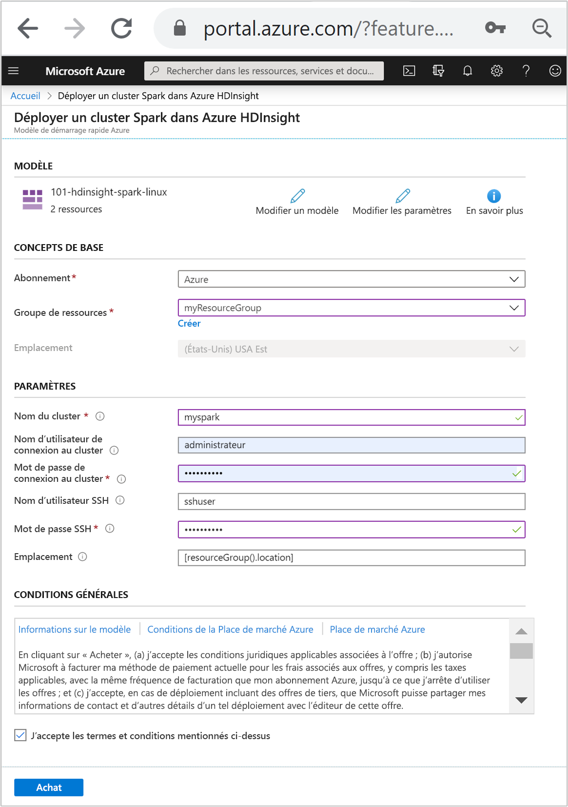
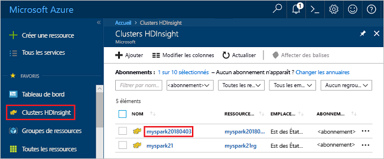
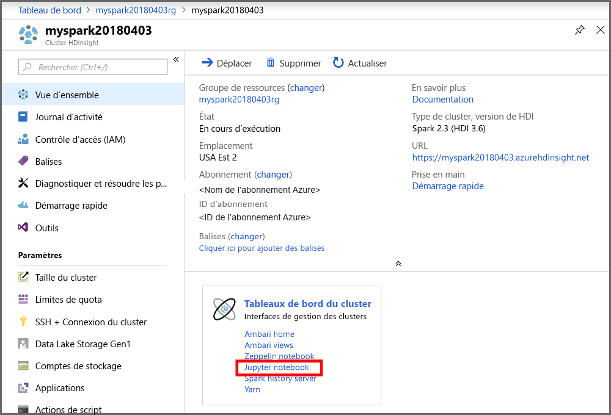
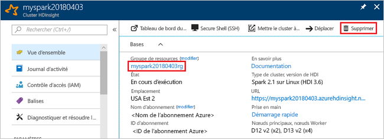

# <a name="quickstart-create-apache-spark-cluster-in-azure-hdinsight-using-arm-template"></a>Démarrage rapide : Créer un cluster Apache Spark dans Azure HDInsight à l’aide d’un modèle Resource Manager

Dans ce guide de démarrage rapide, vous utilisez un modèle Resource Manager (Azure Resource Manager) pour créer un cluster [Apache Spark](./apache-spark-overview.md) dans Azure HDInsight. Vous créez ensuite un fichier Jupyter Notebook, que vous utilisez pour exécuter des requêtes Spark SQL sur des tables Apache Hive. Azure HDInsight est un service d’analytique open source managé et complet pour les entreprises. Le framework Apache Spark pour HDInsight permet une analytique données et des calculs sur cluster rapides à l’aide du traitement en mémoire. Jupyter Notebook vous permet d’interagir avec vos données, de combiner du code avec du texte Markdown et d’effectuer des visualisations simples.

Si vous utilisez plusieurs clusters ensemble, vous devrez créer un réseau virtuel et, si vous utilisez un cluster Spark, vous devrez également utiliser Hive Warehouse Connector. Pour plus d’informations, consultez [Planifier un réseau virtuel pour Azure HDInsight](../hdinsight-plan-virtual-network-deployment.md) et [Intégrer Apache Spark et Apache Hive à Hive Warehouse Connector](../interactive-query/apache-hive-warehouse-connector.md).

[!INCLUDE [About Azure Resource Manager](../../../includes/resource-manager-quickstart-introduction.md)]

Si votre environnement remplit les prérequis et que vous êtes déjà familiarisé avec l’utilisation des modèles ARM, sélectionnez le bouton **Déployer sur Azure**. Le modèle s’ouvre dans le portail Azure.

[](https://portal.azure.com/#create/Microsoft.Template/uri/https%3A%2F%2Fraw.githubusercontent.com%2FAzure%2Fazure-quickstart-templates%2Fmaster%2F101-hdinsight-spark-linux%2Fazuredeploy.json)

## <a name="prerequisites"></a>Prérequis

Si vous n’avez pas d’abonnement Azure, créez un [compte gratuit](https://azure.microsoft.com/free/?WT.mc_id=A261C142F) avant de commencer.

## <a name="review-the-template"></a>Vérifier le modèle

Le modèle utilisé dans ce démarrage rapide est tiré des [modèles de démarrage rapide Azure](https://azure.microsoft.com/resources/templates/101-hdinsight-spark-linux).

:::code language="json" source="~/quickstart-templates/101-hdinsight-spark-linux/azuredeploy.json":::

Deux ressources Azure sont définies dans le modèle :

* [Microsoft.Storage/storageAccounts](/azure/templates/microsoft.storage/storageaccounts) : crée un compte de stockage Azure.
* [Microsoft.HDInsight/cluster](/azure/templates/microsoft.hdinsight/clusters) : crée un cluster HDInsight.

## <a name="deploy-the-template"></a>Déployer le modèle

1. Sélectionnez le bouton **Déployer sur Azure** ci-dessous pour vous connecter à Azure et ouvrir le modèle Resource Manager.

    [](https://portal.azure.com/#create/Microsoft.Template/uri/https%3A%2F%2Fraw.githubusercontent.com%2FAzure%2Fazure-quickstart-templates%2Fmaster%2F101-hdinsight-spark-linux%2Fazuredeploy.json)

1. Entrez ou sélectionnez les valeurs suivantes :

    |Propriété |Description |
    |---|---|
    |Abonnement|Dans la liste déroulante, sélectionnez l’abonnement Azure utilisé pour le cluster.|
    |Resource group|Dans la liste déroulante, sélectionnez votre groupe de ressources existant ou **Créer**.|
    |Emplacement|La valeur est renseignée automatiquement à l’aide de l’emplacement utilisé pour le groupe de ressources.|
    |Nom du cluster|Entrez un nom globalement unique. Pour ce modèle, utilisez uniquement des lettres minuscules et des chiffres.|
    |Nom d’utilisateur de connexion au cluster|Indiquez le nom d’utilisateur, la valeur par défaut est **Administrateur**.|
    |Mot de passe de connexion au cluster|Fournissez un mot de passe. Le mot de passe doit comporter au moins 10 caractères et inclure au moins un chiffre, une lettre majuscule, une lettre minuscule et un caractère non alphanumérique (à l’exception des caractères ' " `). |
    |Nom d’utilisateur SSH|Indiquez le nom d’utilisateur. La valeur par défaut est **sshuser**|
    |Mot de passe SSH|Indiquez le mot de passe.|

    

1. Passez en revue les **CONDITIONS GÉNÉRALES**. Sélectionnez ensuite **J’accepte les conditions générales mentionnées ci-dessus**, puis **Acheter**. Vous recevez une notification indiquant que votre déploiement est en cours. La création d’un cluster prend environ 20 minutes.

Si vous rencontrez un problème avec la création de clusters HDInsight, c’est que vous n’avez peut-être pas les autorisations requises pour le faire. Pour plus d’informations, consultez [Exigences de contrôle d’accès](../hdinsight-hadoop-customize-cluster-linux.md#access-control).

## <a name="review-deployed-resources"></a>Vérifier les ressources déployées

Une fois le cluster créé, vous recevez une notification **Déploiement réussi** avec un lien **Accéder à la ressource**. La page Groupe de ressources liste votre nouveau cluster HDInsight ainsi que le stockage par défaut associé au cluster. Chaque cluster a une dépendance de [Stockage Azure](../hdinsight-hadoop-use-blob-storage.md), [Azure Data Lake Storage Gen1](../hdinsight-hadoop-use-data-lake-storage-gen1.md) ou [`Azure Data Lake Storage Gen2`](../hdinsight-hadoop-use-data-lake-storage-gen2.md). Elle est désignée comme compte de stockage par défaut. Le cluster HDInsight et son compte de stockage par défaut doivent figurer dans la même région Azure. La suppression de clusters n’a pas pour effet de supprimer la dépendance du compte de stockage. Elle est désignée comme compte de stockage par défaut. Le cluster HDInsight et son compte de stockage par défaut doivent figurer dans la même région Azure. La suppression de clusters n’a pas pour effet de supprimer le compte de stockage.

## <a name="create-a-jupyter-notebook-file"></a>Créer un fichier Jupyter Notebook.

[Jupyter Notebook](https://jupyter.org/) est un environnement de bloc-notes interactif qui prend en charge divers langages de programmation. Avec un fichier Jupyter Notebook, vous pouvez interagir avec vos données, combiner du code avec du texte Markdown et effectuer des visualisations simples.

1. Ouvrez le [portail Azure](https://portal.azure.com).

2. Sélectionnez **Clusters HDInsight**, puis le cluster que vous avez créé.

    

3. À partir du portail, dans la section **Tableaux de bord du cluster**, sélectionnez **Jupyter Notebook**. À l’invite (le cas échéant), entrez les informations d’identification du cluster.

   

4. Sélectionnez **Nouveau** > **PySpark** pour créer un Notebook.

   

   Un nouveau bloc-notes est créé et ouvert sous le nom Untitled(Untitled.pynb).

## <a name="run-apache-spark-sql-statements"></a>Exécuter des instructions Apache Spark SQL

SQL (Structured Query Language) est le langage le plus courant et le plus largement utilisé pour interroger et transformer des données. Spark SQL fonctionne en tant qu’extension d’Apache Spark pour le traitement des données structurées, à l’aide de la syntaxe SQL classique.

1. Vérifiez que le noyau est prêt. Le noyau est prêt lorsque vous voyez un cercle vide à côté du nom du noyau dans le bloc-notes. Un cercle plein indique que le noyau est occupé.

    

    Lorsque vous démarrez le bloc-notes pour la première fois, le noyau effectue certaines tâches en arrière-plan. Attendez que le noyau soit prêt.

1. Collez l’exemple de code suivant dans une cellule vide, puis appuyez sur **MAJ + ENTRÉE** pour exécuter le code. La commande répertorie les tables Hive sur le cluster :

    ```sql
    %%sql
    SHOW TABLES
    ```

    Quand vous utilisez un fichier Jupyter Notebook avec votre cluster HDInsight, vous obtenez une session `spark` préconfigurée que vous pouvez utiliser pour exécuter des requêtes Hive à l’aide de Spark SQL. `%%sql` demande à Jupyter Notebook d’utiliser la session `spark` préconfigurée pour exécuter la requête Hive. La requête extrait les 10 premières lignes d’une table Hive (**hivesampletable**) qui est disponible par défaut sur tous les clusters HDInsight. La première fois que vous envoyez la requête, Jupyter crée une application Spark pour le notebook. Cette opération dure environ 30 secondes. Dès lors que l’application Spark est prête, la requête est exécutée en environ une seconde et produit les résultats. Le résultat se présente ainsi :

    

    À chaque exécution d’une requête dans Jupyter, le titre de la fenêtre du navigateur web affiche l’état **(Occupé)** ainsi que le titre du bloc-notes. Un cercle plein s’affiche également en regard du texte **PySpark** dans le coin supérieur droit.

1. Exécutez une autre requête pour afficher les données dans `hivesampletable`.

    ```sql
    %%sql
    SELECT * FROM hivesampletable LIMIT 10
    ```

    L’écran doit s’actualiser pour afficher la sortie de requête.

    

1. Dans le menu **Fichier** du Notebook, sélectionnez **Fermer et interrompre**. L’arrêt du notebook libère les ressources de cluster, y compris l’application Spark.

## <a name="clean-up-resources"></a>Nettoyer les ressources

Après avoir suivi ce guide de démarrage rapide, vous souhaiterez peut-être supprimer le cluster. Avec HDInsight, vos données sont stockées dans le stockage Azure. Vous pouvez ainsi supprimer un cluster en toute sécurité s’il n’est pas en cours d’utilisation. Vous devez également payer pour un cluster HDInsight, même quand vous ne l’utilisez pas. Étant donné que les frais pour le cluster sont bien plus élevés que les frais de stockage, mieux vaut supprimer les clusters quand ils ne sont pas utilisés.

Dans le portail Azure, accédez à votre cluster, puis sélectionnez **Supprimer**.



Vous pouvez également sélectionner le nom du groupe de ressources pour ouvrir la page du groupe de ressources, puis sélectionner **Supprimer le groupe de ressources**. En supprimant le groupe de ressources, vous supprimez le cluster HDInsight et le compte de stockage par défaut.

## <a name="next-steps"></a>Étapes suivantes

Dans ce guide de démarrage rapide, vous avez appris à créer un cluster Apache Spark dans HDInsight et à exécuter une requête Spark SQL de base. Passez au tutoriel suivant pour apprendre à utiliser un cluster HDInsight pour exécuter des requêtes interactives sur des exemples de données.

> [!div class="nextstepaction"]
> [Exécuter des requêtes interactives sur Apache Spark](./apache-spark-load-data-run-query.md)
