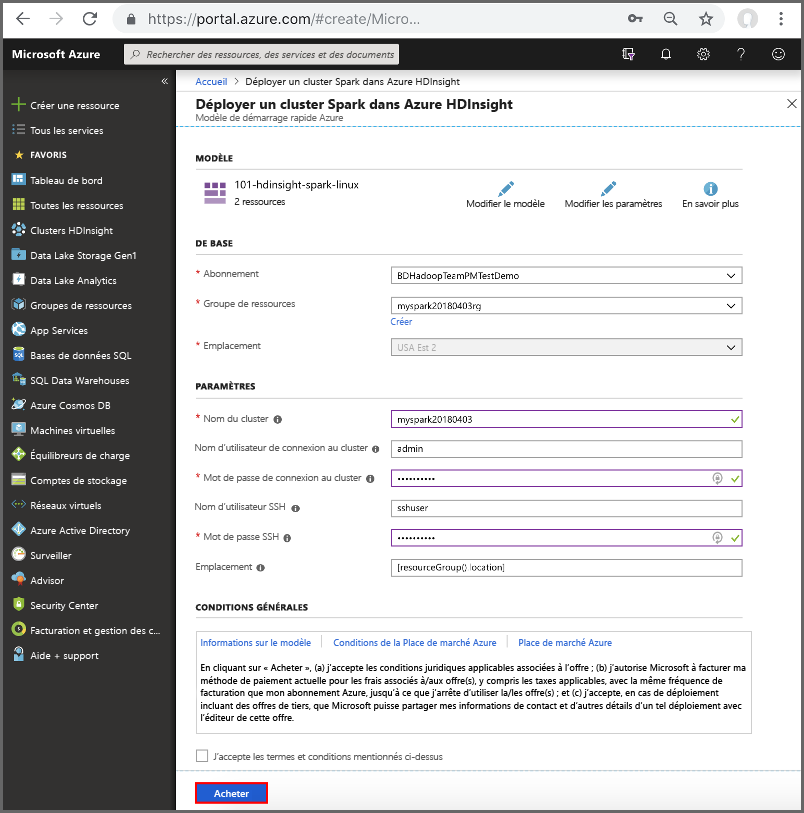

# <a name="quickstart-create-apache-spark-cluster-in-azure-hdinsight-using-resource-manager-template"></a>Démarrage rapide : Créer un cluster Apache Spark dans Azure HDInsight avec un modèle Resource Manager

Dans ce guide de démarrage rapide, vous allez utiliser un modèle Azure Resource Manager pour créer un cluster Apache Spark dans Azure HDInsight. Vous allez ensuite créer un notebook Jupyter et l’utiliser pour exécuter des requêtes Spark SQL sur des tables Apache Hive. Azure HDInsight est un service d’analytique open source managé et complet pour les entreprises. Le framework Apache Spark pour HDInsight permet une analytique données et des calculs sur cluster rapides à l’aide du traitement en mémoire. Le notebook Jupyter vous permet d’interagir avec vos données, de combiner du code avec le texte Markdown et d’effectuer des visualisations simples.

[Vue d’ensemble : Apache Spark sur Azure HDInsight](apache-spark-overview.md) | [Apache Spark](https://spark.apache.org/) | [Apache Hive](https://hive.apache.org/) | [Jupyter Notebook](https://jupyter.org/) | [Modèles de démarrage rapide Azure](https://azure.microsoft.com/resources/templates/?resourceType=Microsoft.Hdinsight&pageNumber=1&sort=Popular)

## <a name="prerequisites"></a>Conditions préalables requises

- Compte Azure avec un abonnement actif. [Créez un compte gratuitement](https://azure.microsoft.com/free/?ref=microsoft.com&utm_source=microsoft.com&utm_medium=docs&utm_campaign=visualstudio).

## <a name="create-an-apache-spark-cluster"></a>Créer un cluster Apache Spark

Créez un cluster Apache Spark dans HDInsight à l’aide d’un modèle Azure Resource Manager. Le modèle se trouve dans [GitHub](https://azure.microsoft.com/resources/templates/101-hdinsight-spark-linux/). Pour connaître la syntaxe JSON et les propriétés du cluster, consultez [Microsoft.HDInsight/clusters](/azure/templates/microsoft.hdinsight/clusters).

Le cluster utilise des objets blob Stockage Azure comme stockage du cluster. Pour plus d’informations sur l’utilisation de Data Lake Storage Gen2, consultez [Démarrage rapide : Configurer des clusters dans HDInsight](../../storage/data-lake-storage/quickstart-create-connect-hdi-cluster.md).

> [!IMPORTANT]  
> La facturation des clusters HDInsight est calculée au prorata des minutes écoulées, que vous les utilisiez ou non. Veillez à supprimer votre cluster une fois que vous avez fini de l’utiliser. Pour plus d’informations, consultez la section [Nettoyer les ressources](#clean-up-resources) de cet article.

1. Sélectionnez le lien suivant pour ouvrir le modèle sur le Portail Azure, dans un nouvel onglet de navigateur :

    <a href="https://portal.azure.com/#create/Microsoft.Template/uri/https%3A%2F%2Fraw.githubusercontent.com%2FAzure%2Fazure-quickstart-templates%2Fmaster%2F101-hdinsight-spark-linux%2Fazuredeploy.json" target="_blank">Déployer dans Azure</a>

2. Saisissez les valeurs suivantes :

    | Propriété | Valeur |
    |---|---|
    |**Abonnement**|Sélectionnez l’abonnement Azure utilisé pour créer ce cluster. Dans ce guide de démarrage rapide, il s’agit de **&lt;Nom de l’abonnement Azure>** . |
    | **Groupe de ressources**|Créez un groupe de ressources ou sélectionnez-en un. Le groupe de ressources est utilisé pour gérer des ressources Azure pour vos projets. Le nouveau nom du groupe de ressources utilisé dans ce guide de démarrage rapide est **myspark20180403rg**.|
    | **Lieu**|Sélectionnez l’emplacement du groupe de ressources. Le modèle utilise cet emplacement pour créer le cluster, ainsi que pour stocker le cluster par défaut. L’emplacement utilisé dans ce guide de démarrage rapide est **USA Est 2**.|
    | **Nom du cluster**|Entrez un nom pour le cluster que vous souhaitez créer. Le nouveau nom du cluster utilisé dans ce guide de démarrage rapide est **myspark20180403**.|
    | **Nom de connexion et mot de passe du cluster**|Le nom de connexion par défaut est admin. Choisissez un mot de passe pour la connexion du cluster. Le nom de connexion utilisé dans ce guide de démarrage rapide est **admin**.|
    | **Nom d’utilisateur et mot de passe SSH**|Choisissez un mot de passe pour l’utilisateur SSH. Le nom d’utilisateur SSH utilisé dans ce guide de démarrage rapide est **sshuser**.|

    

3. Sélectionnez **J’accepte les conditions générales mentionnées ci-dessus** et **Épingler au tableau de bord**, puis **Acheter**. Vous pouvez voir une nouvelle vignette intitulée **Déploiement de Template Deployment**. La création du cluster prend environ 20 minutes. Il faut que le cluster soit créé pour pouvoir passer à la prochaine session.

Si vous rencontrez un problème avec la création de clusters HDInsight, c’est que vous n’avez peut-être pas les autorisations requises pour le faire. Pour plus d’informations, consultez [Exigences de contrôle d’accès](../hdinsight-hadoop-create-linux-clusters-portal.md).

## <a name="install-intellijeclipse-for-spark-applications"></a>Installer IntelliJ/Eclipse pour les applications Spark

Utilisez le plug-in Azure Toolkit for IntelliJ/Eclipse pour développer des applications Spark écrites en [Scala](https://www.scala-lang.org/) et envoyez-les à un cluster Azure HDInsight, directement à partir de l’environnement de développement intégré (IDE) IntelliJ/Eclipse. Pour plus d’informations, consultez [Use IntelliJ to author/submit Spark application](./apache-spark-intellij-tool-plugin.md) (Utiliser IntelliJ pour créer/envoyer l’application Spark) et [Use Eclipse to author/submit Spark application](./apache-spark-eclipse-tool-plugin.md) (Utiliser Eclipse pour créer/envoyer l’application Spark).

## <a name="install-vscode-for-pysparkhive-applications"></a>Installer VSCode pour les applications PySpark/Hive

Découvrez comment utiliser Azure HDInsight Tools pour Visual Studio Code (VSCode) pour créer et envoyer des travaux Hive de traitement par lots, des requêtes Hive interactives, des tâches de traitement par lot PySpark et des scripts interactifs PySpark. Vous pouvez installer Azure HDInsight Tools sur les plateformes prises en charge par VSCode. Il s’agit des instances Windows, Linux et macOS. Pour plus d’informations, consultez [Utiliser VSCode pour créer/envoyer l’application PySpark](../hdinsight-for-vscode.md).

## <a name="create-a-jupyter-notebook"></a>Créer un bloc-notes Jupyter

[Jupyter Notebook](https://jupyter.org/) est un environnement de bloc-notes interactif qui prend en charge divers langages de programmation. Le notebook vous permet d’interagir avec vos données, de combiner du code avec le texte Markdown et d’effectuer des visualisations simples.

1. Ouvrez le [portail Azure](https://portal.azure.com).

2. Sélectionnez **Clusters HDInsight**, puis le cluster que vous avez créé.

    

3. À partir du portail, dans la section **Tableaux de bord du cluster**, sélectionnez **Jupyter Notebook**. À l’invite (le cas échéant), entrez les informations d’identification du cluster.

   

4. Sélectionnez **Nouveau** > **PySpark** pour créer un Notebook.

   

   Un nouveau bloc-notes est créé et ouvert sous le nom Untitled(Untitled.pynb).

## <a name="run-apache-spark-sql-statements"></a>Exécuter des instructions Apache Spark SQL

SQL (Structured Query Language) est le langage le plus courant et le plus largement utilisé pour interroger et transformer des données. Spark SQL fonctionne en tant qu’extension d’Apache Spark pour le traitement des données structurées, à l’aide de la syntaxe SQL classique.

1. Vérifiez que le noyau est prêt. Le noyau est prêt lorsque vous voyez un cercle vide à côté du nom du noyau dans le bloc-notes. Un cercle plein indique que le noyau est occupé.

    

    Lorsque vous démarrez le bloc-notes pour la première fois, le noyau effectue certaines tâches en arrière-plan. Attendez que le noyau soit prêt.
1. Collez l’exemple de code suivant dans une cellule vide, puis appuyez sur **MAJ + ENTRÉE** pour exécuter le code. La commande répertorie les tables Hive sur le cluster :

    ```sql
    %%sql
    SHOW TABLES
    ```

    Quand vous utilisez un notebook Jupyter avec votre cluster HDInsight Spark, vous obtenez une session `spark` préconfigurée que vous pouvez utiliser pour exécuter des requêtes Hive à l’aide de Spark SQL. `%%sql` demande à Jupyter Notebook d’utiliser la session `spark` préconfigurée pour exécuter la requête Hive. La requête extrait les 10 premières lignes d’une table Hive (**hivesampletable**) qui est disponible par défaut sur tous les clusters HDInsight. La première fois que vous envoyez la requête, Jupyter crée une application Spark pour le notebook. Cette opération dure environ 30 secondes. Dès lors que l’application Spark est prête, la requête est exécutée en environ une seconde et produit les résultats. Le résultat se présente ainsi :

    

    À chaque exécution d’une requête dans Jupyter, le titre de la fenêtre du navigateur web affiche l’état **(Occupé)** ainsi que le titre du bloc-notes. Un cercle plein s’affiche également en regard du texte **PySpark** dans le coin supérieur droit.

1. Exécutez une autre requête pour afficher les données dans `hivesampletable`.

    ```sql
    %%sql
    SELECT * FROM hivesampletable LIMIT 10
    ```

    L’écran doit s’actualiser pour afficher la sortie de requête.

    

1. Dans le menu **Fichier** du Notebook, sélectionnez **Fermer et interrompre**. L’arrêt du notebook libère les ressources de cluster, y compris l’application Spark.

## <a name="clean-up-resources"></a>Nettoyer les ressources

HDInsight enregistre vos données et notebooks Jupyter dans Stockage Azure ou Azure Data Lake Store. Vous pouvez ainsi supprimer un cluster de manière sécurisée s’il n’est pas en cours d’utilisation. Vous devez également payer pour un cluster HDInsight, même lorsque vous ne l’utilisez pas. Étant donné que les frais pour le cluster sont bien plus élevés que les frais de stockage, économique, mieux vaut supprimer les clusters lorsqu’ils ne sont pas utilisés. Si vous prévoyez d’utiliser tout de suite le tutoriel mentionné sous [Étapes suivantes](#next-steps), il peut être intéressant de conserver le cluster.

Revenez au Portail Azure, puis sélectionnez **Supprimer**.


Vous pouvez également sélectionner le nom du groupe de ressources pour ouvrir la page du groupe de ressources, puis sélectionner **Supprimer le groupe de ressources**. En supprimant le groupe de ressources, vous supprimez le cluster HDInsight et le compte de stockage par défaut.

## <a name="next-steps"></a>Étapes suivantes

Dans ce guide de démarrage rapide, vous avez appris à créer un cluster Apache Spark dans HDInsight et à exécuter une requête Spark SQL de base. Passez au tutoriel suivant pour apprendre à utiliser un cluster HDInsight pour exécuter des requêtes interactives sur des exemples de données.

> [!div class="nextstepaction"]
>[Exécuter des requêtes interactives sur Apache Spark](./apache-spark-load-data-run-query.md)
