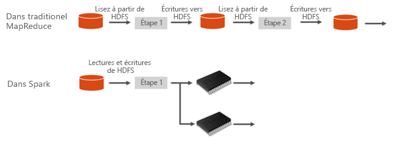
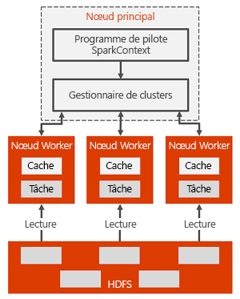

# Présentation d’Apache Spark dans Azure HDInsight

*Apache Spark* est une infrastructure de traitement parallèle qui prend en charge le traitement en mémoire pour améliorer les performances des applications d’analyse du Big Data. Apache Spark dans Azure HDInsight est l’implémentation Microsoft d’Apache Spark dans le cloud. HDInsight facilite la création et la configuration de clusters Spark dans Azure. Les clusters Spark dans HDInsight sont compatibles avec le Stockage Azure et Azure Data Lake Store. Vous pouvez donc utiliser des clusters HDInsight Spark pour traiter vos données stockées dans Azure. Pour plus d’informations sur les composants et le contrôle de version, voir [Composants et versions Hadoop dans Azure HDInsight](../hdinsight-component-versioning.md).

## Qu'est-ce que Spark ?

Spark fournit des primitives pour le calcul de cluster en mémoire. Un travail Spark peut charger et mettre en cache des données en mémoire et les interroger à plusieurs reprises. Le calcul en mémoire est beaucoup plus rapide que les applications sur disque, notamment Hadoop, qui partage des données via HDFS. Spark s’intègre également dans le langage de programmation Scala pour vous permettre de manipuler des ensembles de données distribuées tels que des collections locales. Il n’est pas nécessaire de tout structurer comme des opérations de réduction et de mappage.

Les clusters Spark dans HDInsight constituent un service Spark entièrement géré. Voici les avantages des clusters Spark dans HDInsight.

| Fonctionnalité | Description |
| --- | --- |
| Facilité de création |La création d’un cluster Spark dans HDInsight prend en quelques minutes avec le Portail Azure, Azure PowerShell ou le Kit de développement logiciel (SDK) .NET HDInsight. Consultez [Prise en main des clusters Spark dans HDInsight](apache-spark-jupyter-spark-sql.md) |
| Simplicité d'utilisation |Un cluster Spark sur HDInsight inclut des blocs-notes Jupyter et Zeppelin. Vous pouvez utiliser les blocs-notes pour le traitement interactif et la visualisation des données.|
| API REST |Les clusters Spark sur HDInsight comprennent [Livy](https://github.com/cloudera/hue/tree/master/apps/spark/java#welcome-to-livy-the-rest-spark-server), un serveur de travaux Spark basé sur une API REST, qui permet de soumettre et de surveiller à distance des travaux. |
| Prise en charge d’Azure Data Lake Store | Les clusters Spark dans HDInsight peuvent utiliser Azure Data Lake Store comme stockage principal ou comme stockage supplémentaire. Pour plus d’informations sur Data Lake Store, consultez [Vue d’ensemble d’Azure Data Lake Store](../../data-lake-store/data-lake-store-overview.md). |
| Intégration aux services Azure |Un cluster Spark dans HDInsight s’accompagne d’un connecteur à Azure Event Hubs. Vous pouvez créer des applications de diffusion en continu avec Event Hubs, en plus de [Kafka](http://kafka.apache.org/), qui est déjà disponible dans Spark. |
| Prise en charge de ML Server | La prise en charge de ML Server dans HDInsight est fournie en tant que type de cluster **ML Services**. Il est possible de configurer un cluster ML Services de façon à effectuer des calculs R distribués à la vitesse d’un cluster Spark. Pour plus d’informations, consultez [Bien démarrer avec ML Server dans HDInsight](../r-server/r-server-get-started.md). |
| Intégration à des environnements de développement intégrés tiers | HDInsight offre différents plug-ins d’IDE permettant de créer et d’envoyer des applications sur un cluster HDInsight Spark. Pour plus d’informations, consultez [Utiliser Azure Toolkit for IntelliJ IDEA](apache-spark-intellij-tool-plugin.md), [Utiliser HDInsight pour VSCode](../hdinsight-for-vscode.md) et [Utiliser Azure Toolkit for Eclipse](apache-spark-eclipse-tool-plugin.md).|
| Requêtes simultanées |Les clusters Spark sur HDInsight prennent en charge les requêtes simultanées. Ainsi, plusieurs requêtes d’un même utilisateur ou de différents utilisateurs et applications peuvent partager les mêmes ressources de cluster. |
| Mise en cache sur des disques SSD |Vous pouvez choisir de mettre en cache des données en mémoire ou dans les disques SSD attachés aux nœuds de cluster. Si la mise en cache en mémoire est la stratégie qui offre les meilleures performances de requête, elle peut se révéler coûteuse. La mise en cache sur des disques SSD représente une très bonne option pour améliorer les performances des requêtes sans avoir à créer un cluster de la taille requise pour que l’ensemble du jeu de données puisse être mis en mémoire. |
| Intégration aux outils décisionnels |Les clusters Spark dans HDInsight fournissent des connecteurs pour certains outils décisionnels, notamment [Power BI](http://www.powerbi.com/) pour l’analytique des données. |
| Bibliothèques Anaconda préchargées |Les clusters Spark dans HDInsight sont fournis avec des bibliothèques Anaconda préinstallées. [Anaconda](http://docs.continuum.io/anaconda/) fournit près de 200 bibliothèques pour l’apprentissage automatique, l’analyse des données, la visualisation, etc. |
| Extensibilité | HDInsight permet de modifier le nombre de nœuds de cluster. En outre, les clusters Spark peuvent être supprimés sans perte de données puisque toutes les données sont stockées dans Azure Storage ou Data Lake Store. |
| Contrat SLA |Les clusters Spark dans HDInsight s’accompagnent d’un support assuré 24 heures sur 24, 7 jours sur 7 et d’un contrat de niveau de service à 99,9 % de durée de fonctionnement. |

Les clusters Spark sur HDInsight incluent les composants suivants qui sont disponibles dans les clusters par défaut.

* [Spark Core](https://spark.apache.org/docs/1.5.1/). Comprend Spark Core, Spark SQL, les API de diffusion en continu Spark, GraphX et MLlib.
* [Anaconda](http://docs.continuum.io/anaconda/)
* [Livy](https://github.com/cloudera/hue/tree/master/apps/spark/java#welcome-to-livy-the-rest-spark-server)
* [Bloc-notes Jupyter](https://jupyter.org)
* [Bloc-notes Zeppelin](http://zeppelin-project.org/)

Les clusters Spark dans HDInsight fournissent également un [pilote ODBC](http://go.microsoft.com/fwlink/?LinkId=616229) pour la connectivité aux clusters Spark dans HDInsight à partir d’outils décisionnels comme Microsoft Power BI.

## Architecture d’un cluster Spark

Il est facile de comprendre les composants de Spark dès lors que l’on examine le fonctionnement de Spark sur des clusters HDInsight.

Les applications Spark s’exécutent sous la forme d’ensembles de processus indépendants sur un cluster, coordonnées par l’objet SparkContext du programme principal (appelé programme pilote).

SparkContext peut se connecter à plusieurs types de gestionnaires de cluster, qui allouent des ressources aux différentes applications. Parmi ces gestionnaires de cluster, on peut citer Apache Mesos, Apache YARN et le Gestionnaire de cluster Spark. Dans HDInsight, Spark s’exécute à l’aide du gestionnaire de cluster YARN. Une fois connecté, Spark acquiert des exécuteurs sur les nœuds de travail du cluster ; il s’agit de processus qui exécutent des calculs et stockent les données de l’application. Ensuite, il envoie le code de l’application (défini par les fichiers JAR ou Python transmis à SparkContext) aux exécuteurs. Enfin, SparkContext envoie les tâches aux exécuteurs, qui les exécuteront.

SparkContext exécute la fonction principale de l’utilisateur et les différentes opérations parallèles sur les nœuds de travail. Ensuite, il collecte les résultats des opérations. Les nœuds Worker lisent et écrivent des données depuis/sur le système de fichiers distribués Hadoop (HDFS). Les nœuds Worker mettent également en cache les données transformées en mémoire comme les jeux de données résilients distribués (RDD).

SparkContext se connecte au maître Spark ; il est chargé de convertir une application en un graphe orienté (DAG) de tâches individuelles exécutées au sein d’un processus d’exécution sur les nœuds de travail. Chaque application obtient ses propres processus d’exécution qui restent pour la durée de toute l’application et exécutent des tâches sur plusieurs threads.

## Cas d’utilisation de Spark dans HDInsight

Les clusters Spark sur HDInsight autorisent les principaux scénarios suivants :

- Analyse des données interactive et Power BI

    Apache Spark sur HDInsight stocke les données dans Azure Storage ou Azure Data Lake Store. Des experts et des décideurs clés peuvent analyser les données, générer les rapports correspondants et utiliser Microsoft Power BI pour créer des rapports interactifs à partir des données analysées. Les analystes peuvent démarrer à partir des données non structurées/semi-structurées dans le stockage du cluster, définir un schéma pour les données à l’aide des blocs-notes, puis générer des modèles de données à l’aide de Microsoft Power BI. Les clusters Spark dans HDInsight prennent également en charge plusieurs outils décisionnels tiers comme Tableau, qui facilitent la tâche aux analystes de données, experts et grands décideurs.

    [Tutoriel : Visualiser les données Spark avec Power BI](apache-spark-use-bi-tools.md)
- Spark Machine Learning

    Apache Spark est fourni avec [MLlib](http://spark.apache.org/mllib/), bibliothèque d’apprentissage automatique basée sur Spark que vous pouvez utiliser à partir d’un cluster Spark sur HDInsight. Les clusters Spark dans HDInsight incluent également Anaconda, une distribution de Python comportant différents packages pour le Machine Learning. Ajoutez à cela la prise en charge intégrée des Notebooks Jupyter et Zeppelin, et vous disposez d’un environnement de création d’applications de Machine Learning.

    [Tutoriel : Prédire les températures d’un bâtiment en utilisant des données HVAC](apache-spark-ipython-notebook-machine-learning.md) [Tutoriel : Prédire les résultats d’une inspection alimentaire](apache-spark-machine-learning-mllib-ipython.md)    
- Analyse des données de diffusion en continu et en temps réel Spark

    Les clusters Spark sur HDInsight offrent une prise en charge améliorée de la création de solutions d’analyse en temps réel. Si Spark possède déjà des connecteurs pour la réception des données provenant de nombreuses sources telles que les sockets Kafka, Flume, Twitter, ZeroMQ ou TCP, Spark dans HDInsight ajoute la prise en charge de première classe de la réception des données provenant d’Azure Event Hubs. La fonctionnalité Event Hubs est le service de file d’attente le plus largement utilisé sur Azure. Grâce à leur prise en charge immédiate d’Event Hubs, les clusters Spark dans HDInsight constituent une plateforme idéale pour créer un pipeline d’analyse en temps réel.
    
## Par où commencer ?

Vous pouvez lire les articles suivants pour en savoir plus sur Spark dans HDInsight :

- [Guide de démarrage rapide : Créer un cluster Spark dans HDInsight et exécuter une requête interactive avec Jupyter](./apache-spark-jupyter-spark-sql.md)
- [Tutoriel : Exécuter un travail Spark avec Jupyter](./apache-spark-load-data-run-query.md)
- [Tutoriel : Analyser des données avec des outils décisionnels](./apache-spark-use-bi-tools.md)
- [Tutoriel : Machine Learning avec Spark](./apache-spark-ipython-notebook-machine-learning.md)
- [Tutoriel : Créer une application Scala Maven avec IntelliJ](./apache-spark-create-standalone-application.md)

## Étapes suivantes

Cette présentation offre une vue d’ensemble d’Apache Spark dans Azure HDInsight. Passez à l’article suivant pour apprendre à créer un cluster HDInsight Spark et à exécuter certaines requêtes Spark SQL :

- [Créer un cluster Spark dans HDInsight](./apache-spark-jupyter-spark-sql.md)

