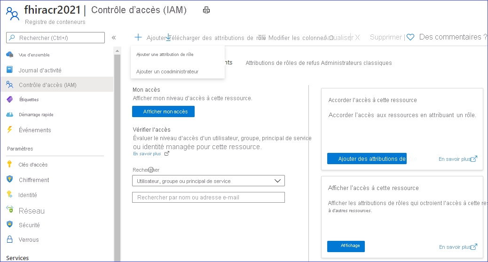
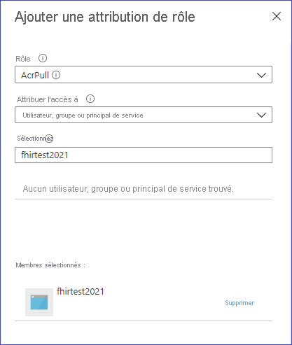

# <a name="how-to-convert-data-to-fhir-preview"></a>Comment convertir des données en FHIR (préversion)

> [!IMPORTANT]
> Cette fonctionnalité en préversion publique est fournie sans contrat de niveau de service et n’est pas recommandée pour les charges de travail de production. Certaines fonctionnalités peuvent être limitées ou non prises en charge. Pour plus d’informations, consultez [Conditions d’Utilisation Supplémentaires relatives aux Évaluations Microsoft Azure](https://azure.microsoft.com/support/legal/preview-supplemental-terms/).

Le point de terminaison personnalisé $convert-data dans l’API Azure pour FHIR est destiné à la conversion de données de différents formats vers FHIR. Il utilise le moteur de modèle Liquid et les modèles du projet [FHIR Converter](https://github.com/microsoft/FHIR-Converter) comme modèles par défaut. Vous pouvez personnaliser ces modèles de conversion en fonction de vos besoins. Actuellement, il prend en charge la conversion de HL7v2 vers FHIR.

## <a name="use-the-convert-data-endpoint"></a>Utiliser le point de terminaison $convert-data

`https://<<FHIR service base URL>>/$convert-data`

$convert-data prend une ressource [Parameter](http://hl7.org/fhir/parameters.html) dans le corps de la requête, comme décrit ci-dessous :

**Ressource de paramètre :**

| Nom du paramètre      | Description | Valeurs acceptées |
| ----------- | ----------- | ----------- |
| inputData      | Données à convertir. | Valeur valide du type de données de chaîne JSON|
| inputDataType   | Type de données de l’entrée. | ```HL7v2``` |
| templateCollectionReference | Référence à une collection de modèles. Il peut s’agir d’une référence au **modèles par défaut** ou d’une image de modèle personnalisée inscrite auprès de l’API Azure pour FHIR. Pour en savoir plus sur la personnalisation des modèles, leur hébergement sur ACR et l’inscription à l’API Azure pour FHIR, consultez les sections ci-dessous.  | ```microsofthealth/fhirconverter:default```, \<RegistryServer\>/\<imageName\>@\<imageDigest\> |
| rootTemplate | Modèle racine à utiliser lors de la transformation des données. | ```ADT_A01```, ```OML_O21```, ```ORU_R01```, ```VXU_V04``` |  

> [!WARNING]
> Les modèles par défaut vous aident à démarrer rapidement. Toutefois, ils sont susceptibles d’être mis à jour lors de la mise à niveau de l’API Azure pour FHIR. Pour que le comportement de conversion des données soit cohérent entre les différentes versions de l’API Azure pour FHIR, vous devez héberger votre propre copie des modèles sur un Azure Container Registry, les inscrire auprès de l’API Azure pour FHIR et les utiliser dans vos appels d’API, comme décrit plus loin.

**Exemple de requête :**

```json
{
    "resourceType": "Parameters",
    "parameter": [
        {
            "name": "inputData",
            "valueString": "MSH|^~\\&|SIMHOSP|SFAC|RAPP|RFAC|20200508131015||ADT^A01|517|T|2.3|||AL||44|ASCII\nEVN|A01|20200508131015|||C005^Whittingham^Sylvia^^^Dr^^^DRNBR^PRSNL^^^ORGDR|\nPID|1|3735064194^^^SIMULATOR MRN^MRN|3735064194^^^SIMULATOR MRN^MRN~2021051528^^^NHSNBR^NHSNMBR||Kinmonth^Joanna^Chelsea^^Ms^^CURRENT||19870624000000|F|||89 Transaction House^Handmaiden Street^Wembley^^FV75 4GJ^GBR^HOME||020 3614 5541^HOME|||||||||C^White - Other^^^||||||||\nPD1|||FAMILY PRACTICE^^12345|\nPV1|1|I|OtherWard^MainRoom^Bed 183^Simulated Hospital^^BED^Main Building^4|28b|||C005^Whittingham^Sylvia^^^Dr^^^DRNBR^PRSNL^^^ORGDR|||CAR|||||||||16094728916771313876^^^^visitid||||||||||||||||||||||ARRIVED|||20200508131015||"
        },
        {
            "name": "inputDataType",
            "valueString": "Hl7v2"
        },
        {
            "name": "templateCollectionReference",
            "valueString": "microsofthealth/fhirconverter:default"
        },
        {
            "name": "rootTemplate",
            "valueString": "ADT_A01"
        }
    ]
}
```

**Exemple de réponse :**

```json
{
  "resourceType": "Bundle",
  "type": "transaction",
  "entry": [
    {
      "fullUrl": "urn:uuid:9d697ec3-48c3-3e17-db6a-29a1765e22c6",
      "resource": {
        "resourceType": "Patient",
        "id": "9d697ec3-48c3-3e17-db6a-29a1765e22c6",
        ...
        ...
      "request": {
        "method": "PUT",
        "url": "Location/50becdb5-ff56-56c6-40a1-6d554dca80f0"
      }
    }
  ]
}
```

## <a name="customize-templates"></a>Personnaliser des modèles

Vous pouvez utiliser l’[extension FHIR Converter](https://marketplace.visualstudio.com/items?itemName=ms-azuretools.vscode-health-fhir-converter) pour Visual Studio Code afin de personnaliser les modèles en fonction de vos besoins. L’extension fournit une expérience d’édition interactive et facilite le téléchargement de modèles et d’exemples de données publiés par Microsoft. Pour plus d’informations, consultez la documentation dans l’extension.

## <a name="host-and-use-templates"></a>Héberger et utiliser des modèles

Nous vous recommandons vivement d’héberger votre propre copie des modèles sur ACR. Quatre étapes sont nécessaires pour héberger votre propre copie des modèles et les utiliser dans l’opération $convert-data :

1. Envoyer (push) les modèles à votre instance Azure Container Registry
1. Activer Managed Identity sur votre instance d’API Azure pour FHIR
1. Fournir l’accès à l’ACR à l’identité managée API Azure pour FHIR
1. Inscrire les serveurs ACR dans l’API Azure pour FHIR

### <a name="push-templates-to-azure-container-registry"></a>Envoyer (push) les modèles vers Azure Container Registry

Après avoir créé une instance d’ACR, vous pouvez utiliser la commande _FHIR Converter: Push Templates_ dans l’[extension FHIR Converter](https://marketplace.visualstudio.com/items?itemName=ms-azuretools.vscode-health-fhir-converter) pour envoyer les modèles personnalisés vers ACR. Vous pouvez également utiliser l’[outil Template Management CLI](https://github.com/microsoft/FHIR-Converter/blob/main/docs/TemplateManagementCLI.md) à cet effet.

### <a name="enable-managed-identity-on-azure-api-for-fhir"></a>Activer Managed Identity sur l’API Azure pour FHIR

Accédez à votre instance du service API Azure pour FHIR dans le portail Azure, puis sélectionnez le panneau **Identité**.
Basculez l’état sur **Activé** afin d’activer Managed Identity dans API Azure pour FHIR.


### <a name="provide-access-of-the-acr-to-azure-api-for-fhir"></a>Fournir l’accès à l’ACR à l’API Azure pour FHIR

Accédez au panneau Access Control (IAM) de votre instance ACR et sélectionnez _Ajouter des attributions de rôles_.



Accordez le rôle AcrPull à votre instance du service API Azure pour FHIR.



### <a name="register-the-acr-servers-in-azure-api-for-fhir"></a>Inscrire les serveurs ACR dans API Azure pour FHIR

Vous pouvez inscrire jusqu’à 20 serveurs ACR dans l’API Azure pour FHIR.

Installez l’interface CLI healthcareapis à partir d’Azure PowerShell si nécessaire :

```powershell
az extension add -n healthcareapis
```

Inscrivez les serveurs ACR auprès d’API Azure pour FHIR en suivant les exemples ci-dessous :

#### <a name="register-a-single-acr-server"></a>Inscrire un serveur ACR unique

```powershell
az healthcareapis acr add --login-servers "fhiracr2021.azurecr.io" --resource-group fhir-test --resource-name fhirtest2021
```

#### <a name="register-multiple-acr-servers"></a>Inscrire plusieurs serveurs ACR

```powershell
az healthcareapis acr add --login-servers "fhiracr2021.azurecr.io fhiracr2020.azurecr.io" --resource-group fhir-test --resource-name fhirtest2021
```

### <a name="verify"></a>Vérification

Appelez l’API $convert-data en spécifiant votre référence de modèle dans le paramètre templateCollectionReference.

`<RegistryServer>/<imageName>@<imageDigest>`

## <a name="known-issues-and-workarounds"></a>Problèmes connus et solutions de contournement

- Certains fichiers de modèles par défaut contiennent une marque d’ordre d’octet UTF-8. En conséquence, les valeurs d’ID générées contiennent un caractère de marque d’ordre d’octet. Cela peut créer un problème avec le serveur FHIR. La solution de contournement consiste à extraire les modèles Microsoft à l’aide de l’extension VS Code et à les envoyer à votre propre ACR après avoir supprimé les caractères de marque d’ordre d’octet d’_ID/_Procedure.liquid_, _ID/_Provenance.liquid_ et _ID/_Immunization.liquid_.

